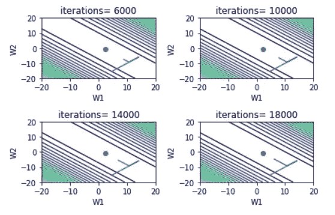

# 特征选择为什么和如何解释

> 原文：<https://towardsdatascience.com/feature-selection-why-how-explained-part-1-c2f638d24cdb?source=collection_archive---------5----------------------->

## 了解特征冗余和检测措施的影响

机器学习不仅仅是花哨的模型和复杂的优化算法。如果获胜者采用了更先进的模型或设计了一些出色的功能，包括我在内的许多 Kagglers 都乐于承认失败，但只有少数人在这种情况下忍心接受失败——被一个训练有更少功能的简单模型击败。是的，并不是所有的从业者都认可极简主义在模特训练中的作用。在这第一篇文章中，我将解释冗余特征如何损害模型和一些直观的检测方法。

# 越多越好，真的吗？

我理解在你的模型中尽可能多的打包功能是多么棒的感觉。我记得我多么喜欢看着我的训练 CSV 文件的大小，想象这个模型会有多好。然而，情况并非总是如此。原因如下:

## 1.多余的功能减缓了训练过程

这是显而易见的，特征的数量与训练时间正相关。功能越多，计算速度越慢。然而，还有一个隐藏的因素会显著降低训练速度。

在训练集中具有相关的特征使得损失图变得病态(稍后定义)。例如，在一个 2-D 线性回归问题中，如果两个特征都是标准化的，损失的等高线图应该接近圆形[(参见我的另一篇关于数据标准化的文章)。](https://medium.com/@zhangzix/understand-data-normalization-in-machine-learning-8ff3062101f0)

```
# two features 
X1 = np.random.randn(1000,1)
X1 = (X1 -np.mean(X1))/np.std(X1)
X2 = np.random.randn(1000,1)
X2 = (X2 - np.mean(X2))/np.std(X2)
Y = 2.3*X1-0.8*X2 + 0.3*np.random.rand(1000,1)
```


gradient descent is smooth when features are independent, learning rate = 2e-3

当要素相互关联时，景观会变成椭球形，梯度下降往往会采用之字形路径。

```
# two features 
X1 = np.random.randn(1000,1)
X1 = (X1 -np.mean(X1))/np.std(X1)
X2 = X1 + 0.5* np.random.randn(1000,1)
X2 = (X2 - np.mean(X2))/np.std(X2)
Y = 2.3*X1-0.8*X2 + 0.3*np.random.rand(1000,1)
```


learning rate = 2e-3

这可能会有问题，因为梯度下降算法可能会振荡，并且需要太长时间才能收敛(*您可以通过降低学习速率来减少振荡，但这也会延长训练时间*)。请看两个特征高度相关的极端情况:

```
X1 = np.random.randn(1000,1)
X1 = (X1 -np.mean(X1))/np.std(X1)
X2 = X1 + 0.02*np.random.randn(1000,1)
X2 = (X2 - np.mean(X2))/np.std(X2)
Y = 2.3*X1 - 0.8*X2 + 0.3*np.random.rand(1000,1)
```



Loss, learning rate = 2e-3(learning rate greater than this may diverge)

正如你所看到的，梯度下降在条件恶劣的损失景观中挣扎，需要更多的迭代(甚至 18，000 次迭代也不够！)实现合理亏损。基于高度相关特征的模型需要更多的迭代，因此需要更长的训练时间。

## 2.降低的估计能力

我们现在知道，基于高度相关特征的模型需要更多的迭代来训练。因此，如果您在其他项目中使用合理的迭代次数，如 6000 或 10000(在大多数情况下非常足够)，算法可能会过早终止，这会损害模型的性能(请参见上面的损失表)。

还有另一个原因:在下面的多元线性回归模型中


X is the training data matrix, Y is the output vector

理论上的最佳估计值是:


如果 X 有冗余(共线性或多重共线性)，则 X 的秩未满。因此，我们不能得到最好的估计，因为 X^T*X 的逆不存在。([延伸阅读](https://www.stat.cmu.edu/~larry/=stat401/lecture-17.pdf))

## 3.你的模型很难解释

机器学习并不总是做预测，在某些应用中，支持基于模型的决策更重要。当涉及到模型分析时，简单的统计方法，如假设检验，就变得又好又方便。例如，人们使用标准误差及其相关的 p 值来判断某个特征是否与结果相关。

当数据集中存在共线性时，这些要素的 t 分值通常较小，因为相关要素的权重具有较大的方差。换句话说，基于不同分区的模型可能具有非常不同的特征参数。例如:

```
X1 = np.random.randn(1000,1)
X1 = (X1 -np.mean(X1))/np.std(X1)
X2 = X1 
Y = 0*X1 + 6*X2 + 0.3*np.random.rand(1000,1)
#essentially 0*X1(X2) + 6*X1(X2) + 0.3*np.random.rand(1000,1)
```


anywhere on the blue line has the minimum loss


distribution of the estimated coefficient of X1 (w1)

由于蓝线上的任何位置都能成功地使 MSE 最小化，因此只要 w1+w2=6，w1 和 w2 就可能相差很大。如果我们用 X1 不相关的零假设进行显著性检验，很可能我们无法拒绝零假设，因为标准误差很大。例如:

```
import statsmodels.api as sma
X1 = np.random.randn(1000,1)
X1 = (X1 -np.mean(X1))/np.std(X1)
X2 = X1 + 0.01*np.random.randn(1000,1)
X2 = (X2 - np.mean(X2))/np.std(X2)
X = np.concatenate((X1,X2), axis=1)
Y = 0.5*X1 + X2 + 0.3*np.random.rand(1000,1)**# we know both X1 and X2 contribute to the outcome**
mod = sma.OLS(Y,X)
res= mod.fit()
print(res.summary()
```


X1 和 X2 的系数都具有较小的 t 值(因此具有较大的 P 值)。因此，我们错误地得出结论，X1 和 X2 都不相关([解释 P 值](https://www.dummies.com/education/math/statistics/what-a-p-value-tells-you-about-statistical-data/))。特征冗余会导致较大的系数标准误差，并掩盖特征在回归中的真实作用。

现在我们了解了特征冗余是如何损害建模和数据分析的，识别并移除特征冗余(也称为特征选择)对我们最有利。

# 如何识别特征冗余？

## 检测相关特征:条件编号

检测数据中多重共线性的一种流行方法称为特征系统分析，它使用条件数的概念。条件数的定义是:


condition number

给定一个矩阵(输入数据 X)，求 X Corr(X)的相关矩阵:


correlation matrix of X

如果 X 的相关矩阵有很大的条件数，说明共线性严重。


[“Revisiting the Collinear Data Problem: An Assesment of Estimator ‘Ill-Conditioning’ in Linear Regression”](https://pareonline.net/getvn.asp?v=13&n=5)

下面是一个简短的示例，可以帮助您理解条件编号是如何工作的:


correlation between X1 and X2 determines the condition number


## 检测不相关的特征

检测无关特征的核心是发现输出是否受到给定特征的影响。基于输出的类型(连续或分类)和特性**1，有几种数学方法可以使用。分类特征分类反应—卡方检验**


Categorical feature categorical response

卡方检验的本质是假设输入和输出之间没有关系，并检查该假设的有效性。如果该特征确实影响响应，我们期望看到低 P 值。因此，通过选择具有低 p 值的特征来完成特征选择。[点击此处查看更多卡方检验信息](https://www.khanacademy.org/math/statistics-probability/inference-categorical-data-chi-square-tests/chi-square-goodness-of-fit-tests/v/pearson-s-chi-square-test-goodness-of-fit)。

我创建了一些简单的人工数据集，让你更好地理解卡方为什么有用

```
import pandas as pd
import scipy.stats as sstX = np.random.randint(5,size=1000)
Y = np.ones(X.shape)
index = X<=2 
Y[index] =0 # when X <=2, Y = 0\. Therefore X influences Y
crosstab = pd.crosstab(X,Y) 
chi2, p,_,_ = sst.chi2_contingency(crosstab)
**###P value =  3.569412779777166e-215-> reject the null hypothesis   ->feature is relevant**X = np.random.randint(5,size=1000)
Y = np.random.randint(2, size = 1000) # no relatinoship
crosstab = pd.crosstab(X,Y)
chi2, p,_,_ = sst.chi2_contingency(crosstab)
**###P value =  0.5244308199595783-> large P value, relationship is statistically insignificant**
```

**2*。类别特征连续反应—方差分析***


Categorical feature continuous response

方差分析(ANOVA)比较不同组的平均值(每个分类特征数据的响应平均值),并检验组间差异是否具有统计学意义。如果一个特征是相关的，我们期望看到不同组的均值之间的显著差异。[点击此处查看更多关于方差分析的信息](https://www.youtube.com/watch?v=-yQb_ZJnFXw)

示例:

```
X = np.random.randint(3,size=1000)
Y = np.random.rand(1000) # no relationship 
one = Y[X==1]
two = Y[X==2]
zero = Y[X==0]
sst.f_oneway(one,two,zero)
**###statistic=0.07592457518151591, pvalue=0.9268914727618249-> large P value-> relationship is insignificant** X = np.random.randint(3,size=1000)
Y = np.random.rand(1000) + 0.1*X # X is part of Y
one = Y[X==1]
two = Y[X==2]
zero = Y[X==0]
sst.f_oneway(one,two,zero)
**### F_onewayResult(statistic=38.076396290550555, pvalue=1.1607768540773696e-16)-> reject the null hypothesis-> feature is relevant**
```

***3。连续特征连续反应—相关或卡方/方差分析***


continuous features and continuous response

最常见的相关系数称为[皮尔逊系数](https://en.wikipedia.org/wiki/Pearson_correlation_coefficient)，用于测试特征和响应之间的线性关系。当关系为非线性时，Pearson 相关返回低值。一个更好的选择叫做 [Spearman 相关性](https://statistics.laerd.com/statistical-guides/spearmans-rank-order-correlation-statistical-guide.php)，它测试单调关系是否存在。以下是一些例子:


Pearson’s Correlation Vs. Spearman’s Correlation

如您所见，Spearman 的相关性对于我们的应用程序有更好的性能，因为我们想要检测不相关的特征(Pearson 的给出更多的错误警报)。然而，当关系是非单调的(第四行)时，这两个指标的表现都很差。

另一种方法是将两个变量离散化，并使用卡方检验，正如您所看到的，它成功地确定了非单调关系:

```
X = 10*np.random.rand(1000)
Y = np.sin(X)
X_ca = pd.qcut(X,10, labels=False) # discretize into 10 classes
Y_ca = pd.qcut(Y,10, labels=False)crosstab = pd.crosstab(X_ca,Y_ca)
chi2, p,_,_ = sst.chi2_contingency(crosstab)
print ('P value = ', p)
**### P value =  0.0-> a strong relationship**
```

***4。连续特征分类反应—卡方检验***


continuous feature categorical response

对于这个问题，我们可以简单地通过将数据分成不同的“组”来离散化特征，就像我们在第 3 部分中所做的那样。离散化后，我们可以再次应用卡方检验。

# 摘要

好的特征可以显著提高模型的准确性和稳定性。因此，添加尽可能多的功能，以便找到好功能的可能性更高，这似乎是合理的。然而，使用大量特征在训练速度、准确性和可解释性方面可能是有害的，这就是为什么特征选择受到许多数据从业者的青睐。在下一篇文章中，你会看到一些系统化的算法，这些算法会自动选择相关特征并消除共线特征。