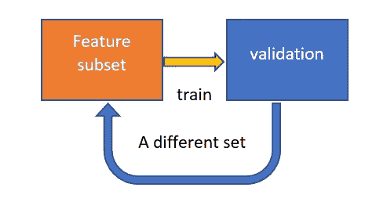
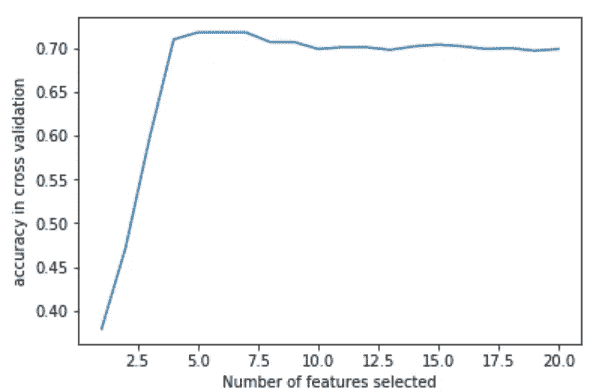
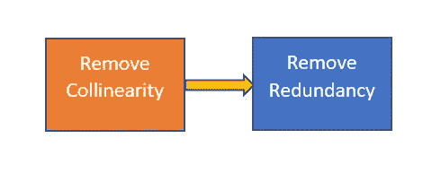
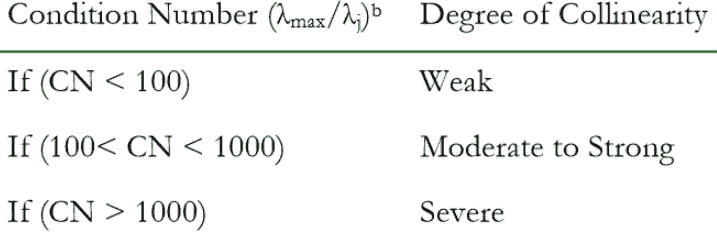
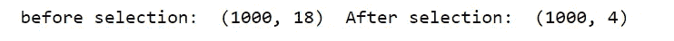
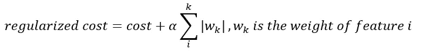
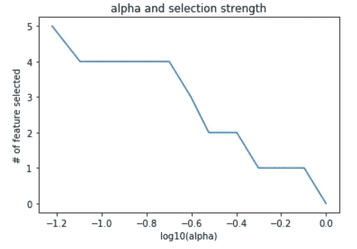

# 特征选择为什么和如何解释

> 原文：<https://towardsdatascience.com/feature-selection-why-how-explained-part-2-352d9130c2e1?source=collection_archive---------16----------------------->

## Python 中特征选择算法的实现

在的上一篇文章中，我解释了在模型构建中包含不相关或相关特征的问题。在本文中，我将向您展示选择算法的几个简洁的实现，它们可以很容易地集成到您的项目管道中。

在深入详细的实现之前，让我们先来看一下我创建的数据集。数据集有 20 个要素，其中 5 个对输出有贡献，2 个是相关的。

# 1.包装特征选择

检测能力:★★★☆速度:★☆☆☆

包装算法很简单。通过训练和验证模型来检查特征的有效性。这意味着包装器在处理大型数据集时非常慢。

wrappers are iterative/recursive in nature

尽管添加/删除特性的具体标准可能不同，但核心思想是相同的。因此，我将重点介绍一种叫做反向选择的特殊方法。

## — 1.1.包装算法:向后选择

提供具有特征系数(例如回归)或重要性因子(例如树)的模型，算法从所有特征开始，贪婪地消除最不重要的特征。一旦删除了所有特征，该算法就返回给出最佳性能的子集。

## — 1.2.Python 中的向后选择:

Scikit-Learn 提供了一个很好的实现，称为 [RFECV](https://scikit-learn.org/stable/modules/generated/sklearn.feature_selection.RFECV.html) (递归特征消除和交叉验证选择)，一种基于验证分数的算法来消除不相关的特征。

[RFE 需要几个参数，你必须提供这两个](https://scikit-learn.org/stable/modules/generated/sklearn.feature_selection.RFE.html):

> **估计器** : *对象*
> 
> 使用`*fit*`方法的监督学习估计器，通过`*coef_*`或`*feature_importances_*`提供关于特征重要性的信息
> 
> **评分:*字符串，可调用或无，可选，(默认=无)***

Scikit-Learn 中有许多估值器满足标准。在这个例子中，使用了一个简单的 SVM 分类器。评分函数是评估模型性能(如准确性)的度量。

RFECV 选择了 7 个特征，包括所有相关特征和冗余特征。这表明 RFECV 不擅长移除多重共线性(因为共线性要素的系数往往变化很大)。因此，最好先识别多重共线性(例如使用条件号识别[)。](https://medium.com/@zhangzix/feature-selection-why-how-explained-part-1-c2f638d24cdb)

# 2.过滤特征选择

检测能力:★★☆☆☆速度:★★★

在使用数百万个数据点的真实应用程序中，包装器变得不切实际。过滤算法通过统计测试(例如相关系数)而不是训练实际模型来估计特征的有效性，从而解决问题。

虽然有很多先进的过滤方法，如 mRMR，但我更喜欢这种简单的两步方法。

## — 2.1.移除相关要素:条件编号

正如第一篇文章中介绍的，共线性或多重共线性是有害的。下面是我自己开发的一个算法，可以消除两者。

[“Revisiting the Collinear Data Problem: An Assesment of Estimator ‘Ill-Conditioning’ in Linear Regression”](https://pareonline.net/getvn.asp?v=13&n=5)

## — 2.2.移除不相关的特征:单变量选择

单变量选择对特征和输出执行统计测试，并且仅保留具有高分的特征。常见的测试包括卡方检验、方差分析或互信息。

同样，Scikit-Learn 提供了一个很好的函数，称为 GenericUnivariateSelect。[该功能需要 3 个参数](https://scikit-learn.org/stable/modules/generated/sklearn.feature_selection.GenericUnivariateSelect.html#sklearn.feature_selection.GenericUnivariateSelect)

> **score_func** : *可调用*
> 
> 函数采用两个数组 X 和 y，并返回一对数组(分数、pvalues)。对于“百分位数”或“kbest”模式，它可以返回单个数组分数。
> 
> **模式** : *{ '百分位'，' k_best '，' fpr '，' fdr '，' fwe'}*
> 
> **param** : *float 或 int 取决于特征选择模式*

选择您想要的统计方法(如卡方检验、F 值)作为评分函数。我将使用卡方，因为 y 是绝对的。

该算法会丢弃 P 值大于 0.5 的要素。使用不太小的阈值是一个很好的实践，这样我们就不会丢失有用的特性(我们在这里丢失了一个有用的特性)。

# **3。嵌入式特征选择**

检测能力:★★★☆☆速度:★★★☆☆

嵌入式特征选择在训练期间智能地丢弃不必要的特征。常见的算法包括 Lasso 回归、决策树和自动编码神经网络。我将在这里解释套索回归。

## — 3.1.嵌入式算法:Lasso 回归

Lasso adds a penalty term to the loss function

套索回归因使用大的要素权重/过多的要素而对模型不利。因此，模型倾向于使用尽可能少的参数，从而产生稀疏的结果(例如，一些特征的权重为 0)。

## — 3.2.Python 中的套索回归

像往常一样，你可以在 Scikit-Learn 中找到 lasso 回归。在初始化模型时，您必须提供的唯一参数是 Alpha，它决定了惩罚的强度。更大的 alpha 导致更稀疏的结果，alpha=0 实质上意味着没有套索惩罚。

an example of how alpha affects feature selection

如您所见，选择强度由 Alpha 决定。问题是我们不知道应该用什么α。这个问题可以通过选择在交叉验证中表现最好的值来解决。

该模型最终使用 5 个参数，这意味着所有冗余和相关的特征都被排除在模型之外。

# 摘要

每种类型的选择算法都有其优点和缺点，并且没有使用什么方法的经验法则。在项目环境中考虑权衡是很重要的。

1.  包装器提供了最高的选择质量，因为它实际上在不同的特征子集上训练模型。高质量的代价是培训时间。
2.  过滤器的选择基于统计数据，速度非常快。但是，它可能无法检测到最佳的特征子集。
3.  中间嵌入选择，以公允的价格提供合理的选择力。