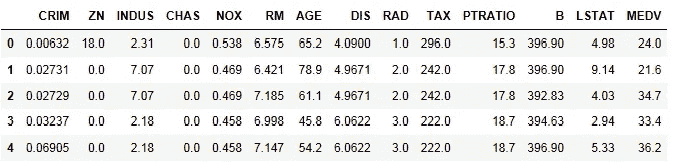
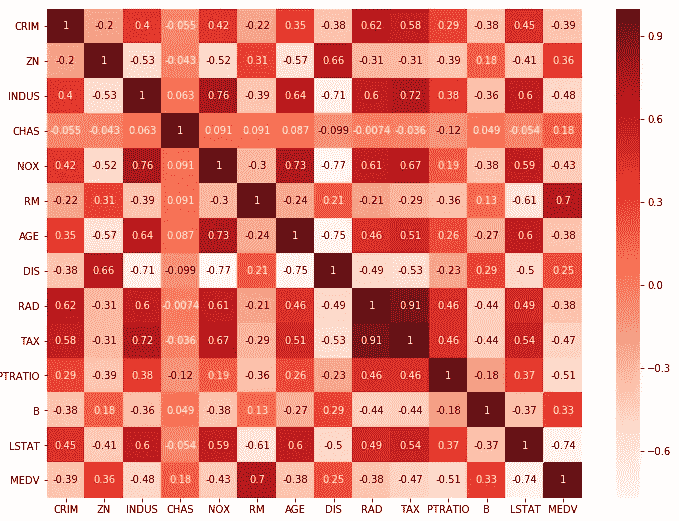
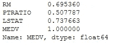
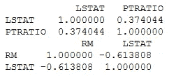
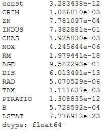
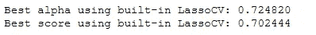
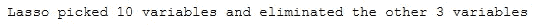
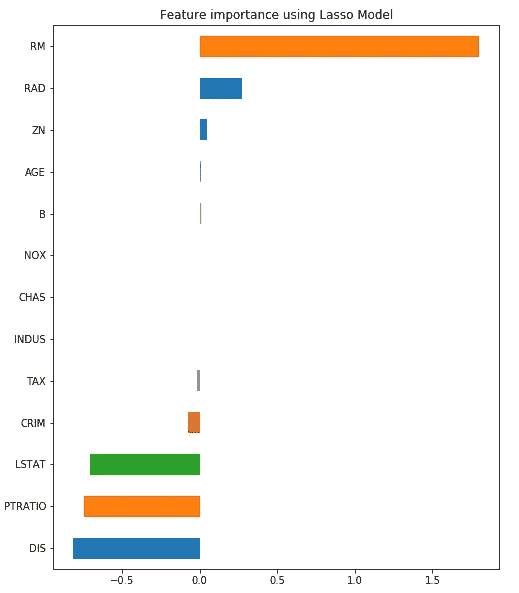

# 使用 sklearn 和 Pandas 进行功能选择

> 原文：<https://towardsdatascience.com/feature-selection-with-pandas-e3690ad8504b?source=collection_archive---------0----------------------->

## 要素选择方法及其在 Python 中的实现简介


在执行任何机器学习任务时，特征选择都是首要且重要的步骤之一。在数据集的情况下，一个特征仅仅意味着一列。当我们获取任何数据集时，不一定每个列(要素)都会对输出变量产生影响。如果我们在模型中添加这些不相关的特性，只会让模型变得更糟(垃圾进垃圾出)。这就产生了进行特征选择的需要。

当在熊猫中实现特征选择时，数字特征和分类特征要区别对待。这里我们将首先讨论关于数字特征的选择。因此，在实现以下方法之前，我们需要确保数据帧只包含数字特征。此外，下面的方法是讨论回归问题，这意味着输入和输出变量都是连续的性质。

特征选择可以通过多种方式完成，但大致有 3 类:1。过滤方法
2。包装方法
3。嵌入式方法

## 关于数据集:

我们将使用内置的波士顿数据集，它可以通过 sklearn 加载。我们将使用上面列出的方法为预测“MEDV”列的回归问题选择特征。在下面的代码片段中，我们将导入所有需要的库并加载数据集。

```
#importing libraries
from sklearn.datasets import load_boston
import pandas as pd
import numpy as np
import matplotlib
import matplotlib.pyplot as plt
import seaborn as sns
import statsmodels.api as sm
%matplotlib inline
from sklearn.model_selection import train_test_split
from sklearn.linear_model import LinearRegression
from sklearn.feature_selection import RFE
from sklearn.linear_model import RidgeCV, LassoCV, Ridge, Lasso#Loading the dataset
x = load_boston()
df = pd.DataFrame(x.data, columns = x.feature_names)
df["MEDV"] = x.target
X = df.drop("MEDV",1)   #Feature Matrix
y = df["MEDV"]          #Target Variable
df.head()
```



# 1.过滤方法:

顾名思义，在这种方法中，您只需要过滤并提取相关特性的子集。模型是在选择特征之后构建的。这里的过滤是使用相关矩阵完成的，最常用的是使用[皮尔逊相关](https://en.wikipedia.org/wiki/Pearson_correlation_coefficient)。

在这里，我们将首先绘制皮尔逊相关性热图，并查看自变量与输出变量 MEDV 的相关性。我们将只选择与输出变量的相关性高于 0.5(取绝对值)的特征。

相关系数的值在-1 到 1 之间
—越接近 0 的值意味着相关性越弱(恰好 0 意味着不相关)
—越接近 1 的值意味着正相关性越强
—越接近-1 的值意味着负相关性越强

```
#Using Pearson Correlation
plt.figure(figsize=(12,10))
cor = df.corr()
sns.heatmap(cor, annot=True, cmap=plt.cm.Reds)
plt.show()
```



```
#Correlation with output variable
cor_target = abs(cor["MEDV"])#Selecting highly correlated features
relevant_features = cor_target[cor_target>0.5]
relevant_features
```



如我们所见，只有特征 RM、PTRATIO 和 LSTAT 与输出变量 MEDV 高度相关。因此，我们将放弃除此之外的所有其他功能。然而，这并不是过程的结束。线性回归的假设之一是自变量需要彼此不相关。如果这些变量是相互关联的，那么我们只需要保留其中一个，去掉其余的。因此，让我们检查所选特征彼此之间的相关性。这可以通过从上面的相关矩阵或下面的代码片段中直观地检查来完成。

```
print(df[["LSTAT","PTRATIO"]].corr())
print(df[["RM","LSTAT"]].corr())
```



从上面的代码中可以看出，变量 RM 和 LSTAT 是高度相关的(-0.613808)。因此，我们将只保留一个变量，丢弃另一个。我们将保留 LSTAT，因为它与 MEDV 的相关性高于 RM。

删除 RM 后，我们只剩下两个特性，LSTAT 和 PTRATIO。这些是皮尔逊相关给出的最终特征。

# 2.包装方法:

包装器方法需要一个机器学习算法，并使用其性能作为评估标准。这意味着，您将特征输入到选定的机器学习算法中，并根据模型性能添加/移除特征。这是一个迭代且计算量大的过程，但比滤波方法更精确。

有不同的包装方法，如向后消除、向前选择、双向消除和 RFE。我们将在这里讨论逆向淘汰和 RFE。

## 一、逆向淘汰

顾名思义，我们首先将所有可能的特征输入到模型中。我们检查模型的性能，然后迭代地逐一移除性能最差的特征，直到模型的整体性能在可接受的范围内。

这里用来评估特性性能的性能指标是 [pvalue](https://www.statsdirect.com/help/basics/p_values.htm) 。如果 pvalue 大于 0.05，那么我们移除该特征，否则我们保留它。

我们将首先在这里运行一次迭代，只是为了得到一个概念的想法，然后我们将在一个循环中运行相同的代码，这将给出最终的特性集。这里我们使用的是代表“普通最小二乘法”的 OLS 模型。该模型用于执行线性回归。

```
#Adding constant column of ones, mandatory for sm.OLS model
X_1 = sm.add_constant(X)#Fitting sm.OLS model
model = sm.OLS(y,X_1).fit()
model.pvalues
```



正如我们所看到的，变量“年龄”的 p 值最高，为 0.9582293，大于 0.05。因此，我们将删除此功能，并再次构建模型。这是一个迭代过程，可以在 loop 的帮助下立即执行。这种方法在下面实施，它将给出最终的一组变量，即 CRIM、ZN、CHAS、NOX、RM、DIS、RAD、TAX、PTRATIO、B 和 LSTAT

```
#Backward Elimination
cols = list(X.columns)
pmax = 1
while (len(cols)>0):
    p= []
    X_1 = X[cols]
    X_1 = sm.add_constant(X_1)
    model = sm.OLS(y,X_1).fit()
    p = pd.Series(model.pvalues.values[1:],index = cols)      
    pmax = max(p)
    feature_with_p_max = p.idxmax()
    if(pmax>0.05):
        cols.remove(feature_with_p_max)
    else:
        breakselected_features_BE = cols
print(selected_features_BE)**Output:***['CRIM', 'ZN', 'CHAS', 'NOX', 'RM', 'DIS', 'RAD', 'TAX', 'PTRATIO', 'B', 'LSTAT']*
```

## 二。RFE(递归特征消除)

[递归特征消除](https://scikit-learn.org/stable/modules/generated/sklearn.feature_selection.RFE.html) (RFE)方法的工作原理是递归移除属性，并在那些保留的属性上建立模型。它使用准确性度量来根据特征的重要性对其进行排序。RFE 方法将使用的模型和所需特征的数量作为输入。然后给出所有变量的排名，1 是最重要的。它也给出了支持，真的是相关特征，假的是不相关特征。

```
model = LinearRegression()#Initializing RFE model
rfe = RFE(model, 7)#Transforming data using RFE
X_rfe = rfe.fit_transform(X,y) #Fitting the data to model
model.fit(X_rfe,y)
print(rfe.support_)
print(rfe.ranking_)**Output:***[False False False  True  True  True False  True  True False  True False
  True]
[2 4 3 1 1 1 7 1 1 5 1 6 1]*
```

这里我们采用了 7 个特征的线性回归模型，RFE 给出了如上的特征排名，但是数字“7”的选择是随机的。现在，我们需要找到最佳数量的特征，其精度是最高的。我们通过使用从 1 个特征开始到 13 个特征的循环来实现。然后我们取精确度最高的那个。

```
#no of features
nof_list=np.arange(1,13)            
high_score=0
#Variable to store the optimum features
nof=0           
score_list =[]
for n in range(len(nof_list)):
    X_train, X_test, y_train, y_test = train_test_split(X,y, test_size = 0.3, random_state = 0)
    model = LinearRegression()
    rfe = RFE(model,nof_list[n])
    X_train_rfe = rfe.fit_transform(X_train,y_train)
    X_test_rfe = rfe.transform(X_test)
    model.fit(X_train_rfe,y_train)
    score = model.score(X_test_rfe,y_test)
    score_list.append(score)
    if(score>high_score):
        high_score = score
        nof = nof_list[n]print("Optimum number of features: %d" %nof)
print("Score with %d features: %f" % (nof, high_score))**Output:***Optimum number of features: 10
Score with 10 features: 0.663581*
```

从上面的代码可以看出，特性的最佳数量是 10。我们现在向 RFE 输入 10 个特征，并得到由 RFE 方法给出的最终特征集，如下所示:

```
cols = list(X.columns)
model = LinearRegression()#Initializing RFE model
rfe = RFE(model, 10) #Transforming data using RFE
X_rfe = rfe.fit_transform(X,y) #Fitting the data to model
model.fit(X_rfe,y)              
temp = pd.Series(rfe.support_,index = cols)
selected_features_rfe = temp[temp==True].index
print(selected_features_rfe)**Output:***Index(['CRIM', 'ZN', 'INDUS', 'CHAS', 'NOX', 'RM', 'DIS', 'RAD', 'PTRATIO',
       'LSTAT'],
      dtype='object')*
```

# 3.嵌入式方法

嵌入式方法在某种意义上是迭代的，它负责模型训练过程的每次迭代，并仔细提取那些对特定迭代的训练贡献最大的特征。正则化方法是最常用的嵌入式方法，其在给定系数阈值的情况下惩罚特征。

这里我们将使用套索正则化进行特征选择。如果特征是不相关的，套索惩罚它的系数，使其为 0。因此，系数= 0 的特征被移除，其余的被采用。

```
reg = LassoCV()
reg.fit(X, y)
print("Best alpha using built-in LassoCV: %f" % reg.alpha_)
print("Best score using built-in LassoCV: %f" %reg.score(X,y))
coef = pd.Series(reg.coef_, index = X.columns)
```



```
print("Lasso picked " + str(sum(coef != 0)) + " variables and eliminated the other " +  str(sum(coef == 0)) + " variables")
```



```
imp_coef = coef.sort_values()
import matplotlib
matplotlib.rcParams['figure.figsize'] = (8.0, 10.0)
imp_coef.plot(kind = "barh")
plt.title("Feature importance using Lasso Model")
```



在这里，套索模型已经采取了除氮氧化物，查斯和印度河的所有功能。

# 结论:

我们看到了如何使用多种方法为数字数据选择特征，并比较了它们的结果。现在出现了在什么情况下选择哪种方法的困惑。以下几点将帮助你做出这个决定。

1.  过滤方法不太准确。在做 EDA 的时候很棒，也可以用来检查数据中的多重共线性。
2.  包装器和嵌入式方法给出了更精确的结果，但是由于它们的计算量很大，所以这些方法适用于特性较少的情况(~20)。

在下一篇博客中，我们将会看到更多的用于选择数字和分类特征的特征选择方法。