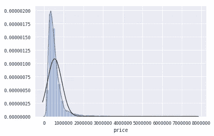

# Python 中多元线性回归的特征变换

> 原文：<https://towardsdatascience.com/feature-transformation-for-multiple-linear-regression-in-python-8648ddf070b8?source=collection_archive---------6----------------------->

## 用于建模的数据处理和转换

数据处理和转换是一个迭代过程，在某种程度上，它永远不可能是“完美的”。因为随着我们对数据集的了解越来越多，例如目标变量和特征之间的内在关系，或者业务环境，我们会想到处理它们的新方法。最近，我开始利用多元线性回归研究媒体组合模型和一些预测模型。在这篇文章中，我将介绍建模的思维过程和处理变量的不同方法。

我就用[金县房价数据集](https://www.kaggle.com/gabriellima/house-sales-in-king-county-usa/data)(为了更好玩的修改版)来举例。

**我们先导入库，看看数据！**

```
import pandas as pd
import numpy as np
import matplotlib.pyplot as plt
import seaborn as sns
import scipy.stats as stats% matplotlib inlinedf = pd.read_csv(“kc_house_data.csv”)
df.head()
```


Image by Author

识别缺失值和明显不正确的数据类型。

```
df.info()<class 'pandas.core.frame.DataFrame'>
RangeIndex: 21597 entries, 0 to 21596
Data columns (total 21 columns):
id               21597 non-null int64
date             21597 non-null object
price            21597 non-null float64
bedrooms         21597 non-null int64
bathrooms        21597 non-null float64
sqft_living      21597 non-null int64
sqft_lot         21597 non-null int64
floors           21597 non-null float64
waterfront       19221 non-null float64
view             21534 non-null float64
condition        21597 non-null int64
grade            21597 non-null int64
sqft_above       21597 non-null int64
sqft_basement    21597 non-null object
yr_built         21597 non-null int64
yr_renovated     17755 non-null float64
zipcode          21597 non-null int64
lat              21597 non-null float64
long             21597 non-null float64
sqft_living15    21597 non-null int64
sqft_lot15       21597 non-null int64
dtypes: float64(8), int64(11), object(2)
memory usage: 3.5+ MB
```

在大多数统计模型中，变量可以分为 4 种数据类型:

*   **连续**:在一个选定的范围内可以有无限个可能值。“float”通常用于 python 中的连续数据。例如生活区的长度
*   **标称:**标称变量使用数字表示来解释对象的类型或属性。它们是具有两个或更多可能值的分类值，没有固有的顺序或排列次序。例如，汽车的原产国，美国可以是 1，日本 2，德国 3
*   **序数:**序数变量实际上是呈现数值。它们通常在有限的范围内有两个或更多的可能值，并且这些值具有有序的类别。比如房子的档次。当你用 target 绘制序数值时，你经常会看到清晰的垂直线。在数据集中，序号数据可能被读取为整数或浮点数，因此数据可视化总是有助于检测它们
*   **二进制:**只有 2 个可能的值，通常是 0 和 1。虚拟变量是二进制的

下图清楚地显示了这种关系。


Common data types in statistics (Image by Author)

# 连续变量的变换

*   **Log:** 当您有偏斜的数据时，Log 转换有助于减少偏斜。

以房价为例。

```
df_log[‘price’] = np.log(df[‘price’])
sns.distplot(df_set['price'], fit=norm)
fig = plt.figure()
```



before log transformation (Image by Author)


after log transformation (Image by Author)

*   **幂:**如果我们从本质上知道自变量与目标变量存在指数或递减关系，我们可以使用幂变换。例如，当我们试图建立电视广告支出与销售额的模型时，我们知道在某个时候，电视广告对销售额的影响会降低。这就是所谓的“收益递减”。所以我们通常使用 0.3 到 0.7 的幂来转换电视支出，以便我们可以获得更好的模型拟合。
*   **标准化:**减去平均值，除以标准差。标准化并没有使数据更正常，它只是改变了平均值和标准误差。


```
scaled_price = (logprice -np.mean(logprice))/np.sqrt(np.var(logprice))
```

*   **均值归一化:**分布的值介于-1 和 1 之间，均值为 0。


*   **最小-最大缩放:**带来 0 到 1 之间的值


# 离散变量的变换

*   **标签编码:**当实际值是文本，并且您想要为变量创建数值时。例如:

```
origin = [“USA”, “EU”, “EU”, “ASIA”,”USA”, “EU”, “EU”, “ASIA”, “ASIA”, “USA”]
origin_series = pd.Series(origin)
cat_origin = origin_series.astype('category')
cat_origin.cat.codes0    2
1    1
2    1
3    0
4    2
5    1
6    1
7    0
8    0
9    2
dtype: int8#Or use scikit-learn's LabelEncoder:from sklearn.preprocessing import LabelEncoder
lb_make = LabelEncoder()origin_encoded = lb_make.fit_transform(cat_origin)origin_encodedarray([2, 1, 1, 0, 2, 1, 1, 0, 0, 2])
```

*   宁滨:宁滨在处理序数值时非常得心应手。在模型中，我们可以通过基于值分布创建箱，然后创建虚拟变量，将变量转换为分类变量，而不是将顺序值作为整数读取。

在金县房价例子中，等级是一个与房价正相关的顺序变量。


Image by Author

```
df[‘grade’].describe()count    21596.000000
mean         7.657946
std          1.173218
min          3.000000
25%          7.000000
50%          7.000000
75%          8.000000
max         13.000000
Name: grade, dtype: float64
```

我们可以基于百分点值创建 4 个箱。

```
bins = [3,7,8,10,13]
bins_grade = pd.cut(df[‘grade’],bins)bins_grade.value_counts().plot(kind='bar')
```


bins_grade (Image by Author)

```
bins_grade0          (3, 7]
1          (3, 7]
2          (3, 7]
3          (3, 7]
4          (7, 8]
5        (10, 13]
6          (3, 7]
7          (3, 7]
8          (3, 7]
9          (3, 7]
10         (7, 8]
11         (3, 7]
12         (3, 7]
13         (3, 7]
14         (3, 7]
15        (8, 10]
```

然后我们为它们创建虚拟变量，因为一些建模技术需要数值。

```
bins_grade = bins_grade.cat.as_unordered()
grade_dummy = pd.get_dummies(bins_grade, prefix=’grade’)
```

*   **创建虚拟变量**

另一种创建虚拟变量的方法是使用 sklearn.preprocessing 包中的 **LabelBinarizer**

```
from sklearn.preprocessing import LabelBinarizerlb = LabelBinarizer()
grade_dummies = lb.fit_transform(grade)
# you need to convert this back to a dataframe
grade_dum_df = pd.DataFrame(grade_dummies,columns=lb.classes_)
```

使用哑元的好处是，无论你使用什么算法，你的数值都不会被误解为连续的。接下来，重要的是要知道对于线性回归(以及 scikit-learn 中的大多数其他算法)，在回归模型中添加分类变量时需要**一键编码**！

同样，特征转换涉及多次迭代。有许多方法可以为模型获取正确的数据。保持好奇和耐心就好！