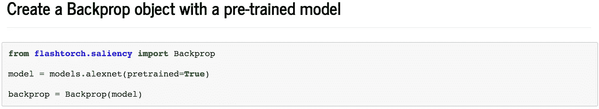

# 用闪光灯揭开神经网络“看到”了什么

> 原文：<https://towardsdatascience.com/feature-visualisation-in-pytorch-saliency-maps-a3f99d08f78a?source=collection_archive---------17----------------------->

## **py torch 中用于神经网络的开源特征可视化工具包**


Visualisation of what AlexNet “sees” in these images of birds, using FlashTorch. [Source](https://github.com/MisaOgura/flashtorch)

# 设置场景

几周前，作为伦敦科技周的一部分，我在由 AnitaB.org[组织的伦敦**hopper x1**T7]上做了一次演讲。滑梯可在](https://anitab.org/)[这里](https://misaogura.github.io/flashtorch/presentations/Hopperx1London/#/)获得。

我在演讲后收到了如此积极的反馈，所以我决定写一个稍微长一点的演讲版本，以便以前向世界介绍【T0:)

该软件包可以通过`pip`进行安装。查看源代码的 [**GitHub repo**](https://github.com/MisaOgura/flashtorch) 。你也可以在 Google Colab 的笔记本上使用它，而不需要安装任何东西！

但是首先，我将简要回顾一下特征可视化的历史，给你一个关于*什么&为什么*的更好的背景。

# 特征可视化介绍

[**特征可视化**](https://distill.pub/2017/feature-visualization/) 是一个活跃的研究领域，旨在通过探索我们可以“通过他们的眼睛”看东西的方式来理解神经网络*如何感知*图像。它的出现和发展是为了响应让神经网络更容易被人类理解的日益增长的愿望。

最早的工作包括分析神经网络在输入图像中关注什么。例如， [**特定于图像的类别显著性图**](https://arxiv.org/abs/1312.6034) 通过经由反向传播计算类别输出相对于输入图像*的梯度，使输入图像内对相应输出贡献最大*的*区域可视化(稍后将在帖子中详细介绍显著性图)。*


Earliest work on image-specific class saliency maps. [Source](https://arxiv.org/abs/1312.6034)

特征可视化的另一个技巧是[](https://blog.keras.io/how-convolutional-neural-networks-see-the-world.html)**。这允许我们迭代地更新输入图像(最初由一些随机噪声产生)以生成最大限度地激活目标神经元的*图像。它提供了一些关于**个体神经元**如何对输入做出反应的直觉。这是所谓的[深度梦](https://ai.googleblog.com/2015/06/inceptionism-going-deeper-into-neural.html)背后的技术，由谷歌推广。***

****

**Deep Dream: what does the network sees in the sky? [Source](https://ai.googleblog.com/2015/06/inceptionism-going-deeper-into-neural.html)**

**这是一个巨大的进步，但有缺点，因为它没有提供足够的洞察力来了解整个网络是如何运行的，因为神经元不是孤立运行的。这导致了可视化神经元之间相互作用的努力。Olah 等人通过两个神经元之间的相加或插值，演示了[激活空间](https://stackoverflow.com/a/47269896)的 [*算术性质*](https://distill.pub/2017/feature-visualization/#interaction) 。**

****

**Neuron arithmetic. [Source](https://distill.pub/2017/feature-visualization/#interaction)**

**然后奥拉在阿尔。通过分析给定特定输入时每个中子在隐藏层中发射的数量，进一步定义了更有意义的可视化单位。 [**将一组被强烈激活在一起的神经元可视化**](https://distill.pub/2018/building-blocks/#CubeNatural) 揭示出似乎有一组神经元负责捕捉诸如耷拉的耳朵、毛茸茸的腿和草等概念。**

****

**A group of neurons detecting floppy ears. [Source](https://distill.pub/2018/building-blocks/#CubeNatural)**

**该领域内的最新发展之一是 [**激活图谱**](https://distill.pub/2019/activation-atlas/) (卡特等人，2019)。在这项研究中，作者解决了可视化过滤器激活的一个主要弱点，因为它仅给出了网络如何响应*单输入*的有限视图。为了更好地了解网络如何感知无数的对象，以及这些对象在网络的世界中如何相互关联，他们设计了一种方法，通过显示神经元的常见组合来创建“通过网络之眼看到的全球地图”。**

****

**Different ways to visualise the network. [Source](https://distill.pub/2019/activation-atlas/)**

# **手电筒背后的动机**

**当我发现特征可视化的世界时，我立即被它在使神经网络更易解释和说明方面的潜力所吸引。然后我很快意识到，没有工具可以轻松地将这些技术应用于我在 PyTorch 中构建的神经网络。**

**所以我决定建一个— `[FlashTorch](https://github.com/MisaOgura/flashtorch)`，现在*可以通过* `*pip*`安装！我实现的第一个特征可视化技术是**显著图**。**

**我们将在下面更详细地看看什么是显著图，以及如何使用`FlashTorch`在你的神经网络中实现它们。**

# **显著图**

****显著性**，在人类视觉感知中，是一种主观品质*使视野中的某些事物突出*并抓住我们的注意力。**计算机视觉中的显著图**可以给出图像中*最显著区域*的指示。**

****

**Examples of saliency maps. [Source](https://www.mathworks.com/matlabcentral/fileexchange/43558-roi-selection-for-saliency-maps)**

**从卷积神经网络(CNN)创建显著图的方法最早于 2013 年在论文 [**深入卷积网络内部:可视化图像分类模型和显著图**](https://arxiv.org/abs/1312.6034) 中提出。作者报告称，通过**计算目标类别**相对于输入图像的梯度，我们可以可视化输入图像内的*区域，这些区域对该类别的预测值有影响*。**

# **使用闪光灯的显著性图**

**事不宜迟，让我们使用`FlashTorch`并自己可视化显著图！**

****

**`FlashTorch`还附带了一些`utils`功能，让数据处理变得更加简单。我们将用这张`great grey owl`的图片作为例子。**

**然后，我们将对图像应用一些变换，使它的*形状、类型和值*适合作为 CNN 的输入。**

****

**我将使用已经用`ImageNet`分类数据集预训练过*的`AlexNet`进行可视化。事实上，`FlashTorch`支持*所有自带`torchvision`的型号*，所以我鼓励你也尝试其他型号！***

****

**`Backprop`类是创建显著图的*核心*。**

**在实例化时，它接受一个模型`Backprop(model)`并且*将自定义挂钩*注册到网络中感兴趣的层，这样我们就可以**从计算图**中抓取中间梯度以便可视化。由于`PyTorch`的设计方式，这些中间梯度*不会立即*提供给我们。`FlashTorch`帮你整理一下:)**

**现在，在计算梯度之前，我们需要的最后一件事是**目标类索引**。**

****

**概括地说，我们对目标类相对于输入图像的*梯度感兴趣。然而，该模型是用`ImageNet`数据集预先训练的，因此其预测被提供为*1000 个类别的概率分布*。我们希望从这 1000 个值中找出目标类的值(在我们的例子中是`great grey owl`)，以避免不必要的计算，并且只关注输入图像和目标类*之间的*关系。***

**为此，我还实现了一个名为`ImageNetIndex`的类。如果你*不想下载整个数据集*，只想根据类名找出*类索引，这是一个方便的工具。如果你给它一个类名，它会找到对应的类索引`target_class = imagenet['great grey owl']`。如果您*确实*想要下载数据集，请使用最新版本`torchvision==0.3.0`中提供的`[ImageNet](https://pytorch.org/docs/stable/torchvision/datasets.html#imagenet)` [类](https://pytorch.org/docs/stable/torchvision/datasets.html#imagenet)。***

**现在，我们有了输入图像和目标类索引(`24`)，所以我们**准备好计算渐变**！**

**这两行是关键:**

```
gradients = backprop.calculate_gradients(input_, target_class)

max_gradients = backprop.calculate_gradients(input_, target_class, take_max=**True**)
```

**默认情况下，将为每个颜色通道计算渐变*，因此它的形状将与输入图像相同——在我们的例子中为`(3, 224, 224)`。有时，如果我们采用颜色通道*的最大梯度*，会更容易看到梯度。我们可以通过将`take_max=True`传递给方法调用来实现。渐变的形状将是`(1, 224, 224)`。***

**最后，让我们想象一下我们得到了什么！**

****

**From far left: input image, gradients across colour channels, max gradients, an overlay of input image and max gradients**

**我们可以理解，动物所在区域的*像素*对预测值的影响最大。**

**但这是一种噪音…信号是传播的，它没有告诉我们多少关于神经网络对猫头鹰的感知。**

**有办法改善这一点吗？**

# **引导返回救援**

**答案是肯定的！**

**在论文 [**力求简单:全卷积网**](https://arxiv.org/abs/1412.6806) 中，作者介绍了一种降低梯度计算中噪声的巧妙方法。**

****

**Guided backpropagation. [Source](https://arxiv.org/abs/1412.6806)**

**本质上，在**导向反向传播**中，对目标类的预测值没有*影响或负面影响*的神经元被*屏蔽掉*并被忽略。通过这样做，我们可以阻止梯度流通过这样的神经元，从而减少噪音。**

**您可以通过将`guided=True`传递给`calculate_gradients`的方法调用，在`FlashTorch`中使用引导式反向传播，如下所示:**

****

**让我们想象引导梯度。**

****

**差别是惊人的！**

**现在我们可以*清楚的*看到网络在关注一只猫头鹰的**凹陷的眼睛**圆头。这些都是“说服”网络将对象归类为`great grey owl`的特征。**

**但是它并不总是聚焦在眼睛或头部…**

********

**正如你所看到的，这个网络已经学会关注那些与我们认为这些鸟最有区别的特征相一致的特征。**

# **特征可视化的应用**

**有了特征可视化，我们不仅可以更好地理解神经网络对物体的了解，而且我们*可以更好地*进行:**

*   **诊断网络出了什么问题以及*为什么***
*   **发现并纠正算法中的*偏差***
*   **从只看准确性向前迈一步**
*   **理解网络行为的原因**
*   **阐明神经网络如何学习的机制**

# **今天就使用闪光灯吧！**

**如果你有在 PyTorch 中使用 CNN 的项目，`FlashTorch`可以帮助你*使你的项目更具可解释性和可解释性*。**

**如果用了请告诉我你的想法！我将非常感谢您的建设性意见、反馈和建议🙏**

**谢谢，祝编码愉快！**