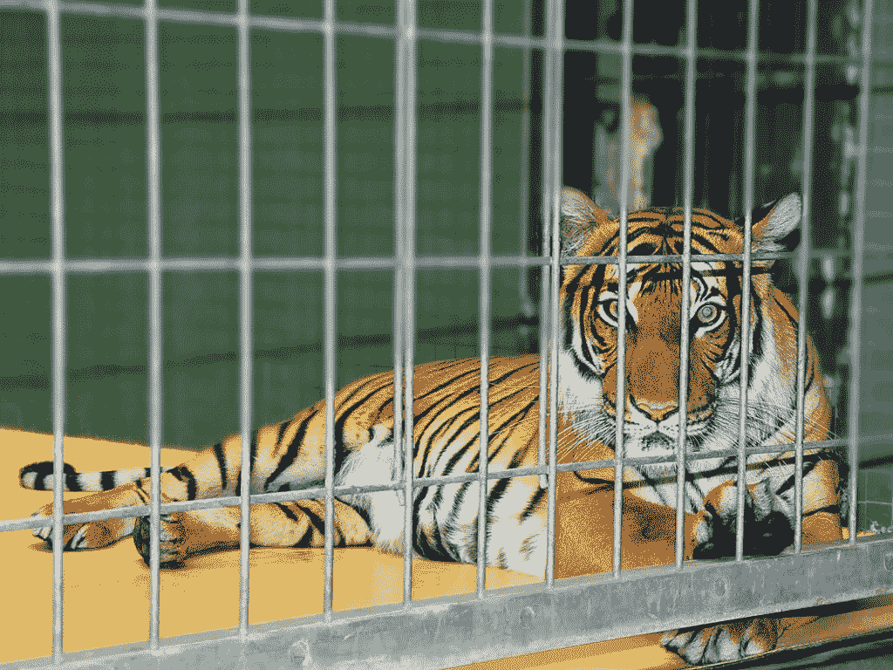
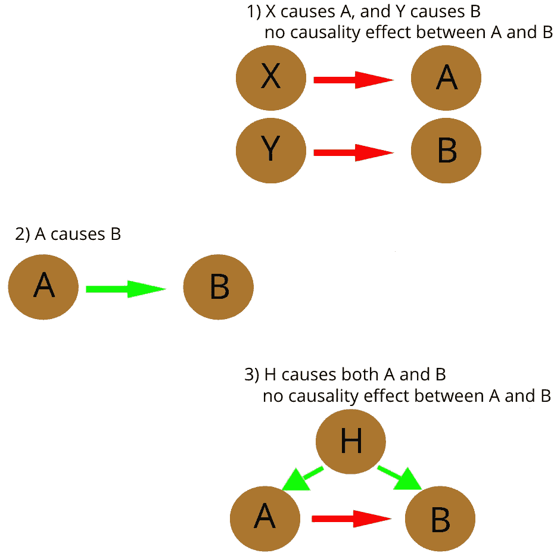

# 特征相关性:数据泄露、混淆的特征和其他可能使你的深度学习模型失败的事情

> 原文：<https://towardsdatascience.com/features-correlations-data-leakage-confounded-features-and-other-things-that-can-make-your-deep-771bcaf84f9f?source=collection_archive---------31----------------------->

在现象学科学中，尤其是在深度学习中，最容易被忽视的概念之一是输入特征之间的相关性。

什么是相关性？查看这幅漫画:

从 boss 正在展示的情节来看，剃光头的员工越多，公司销售额增长越多。如果你是老板，你会考虑对你的员工采取同样的行动吗？大概不会。

事实上，你认识到两组事件之间没有*的因果关系，它们的行为相似只是偶然。更清楚的是:剃光头不会导致销售。*

*所以，我们发现了至少两种可能的相关性:没有因果关系和有因果关系。我们还一致认为，只有第二个是有趣的，而另一个是无用的，当不误导。但是让我们更深入一点。*

# *深度学习中的相关性*

*让我介绍一个深度学习领域的例子，特别是在计算机视觉领域，特征之间的非因果相关性实际上使模型失败。*

## *一张图有哪些「特色」？*

*一般来说，要素是模型用来构建预测的任何东西。但是，在这种情况下，指定什么是特性可能更好:*

*考虑一张脸的照片。功能可以是:*

1.  *大量的绿色像素*
2.  *充满绿色像素的圆圈*
3.  *一组白色像素，包含由绿色像素填充的圆圈*
4.  *…以上所有内容构成了一只眼睛*
5.  *…所有之前的和更多的来构成脸部。*

*都是特色。为了保持关注，特征“虹膜”与特征“眼睛”相关联。*

## *给老虎分类*

*现在，假设您训练一个模型来识别老虎，并假设训练集由成千上万张类似于下图的图片组成。*

**

*Tiger examples in the Training set.*

*当然，训练集包括描述什么不是老虎的其他图片；也许是其他动物，汽车，直升机等。*

*假设您在这样的数据集上训练的模型在测试集上表现得非常好。你对自己的模型很满意，于是你去了一个动物园，想用一张老虎的照片来试试:*

**

*The picture you took in the zoo.*

*您希望模型举起绿色旗帜，将图片识别为包含一只老虎。但是这个模型实际上完全失败了，说它不是。哪里出了问题？*

## *有罪者:相关的、非因果的特征*

*也许您已经发现了这个问题:训练集中的图片显示的是森林中的老虎，而动物园中的图片显示的是笼子中的老虎。用技术术语来说，你拍的照片属于与训练集不同的发行版。*

*正在发生的是:模型认为老虎是你所知道的被“森林”包围的动物，因为在我们的训练集中它总是这样。因为在动物园的照片中没有森林，所以模型不认为照片中有老虎。*

*现在我们可以更好地区分相关性，引入第三个类别，即由[混杂](https://en.wikipedia.org/wiki/Confounding)因素引起的相关性。它的效果实际上可以混淆模型，让它相信在动物和森林之间存在实际上并不存在的因果关系。*

*在我们的例子中，混杂因素，又名*隐藏特征* (H)导致特征“老虎”和“森林”出现在同一张图片中。h 是一系列事件，如:生物学，发现老虎的机会，还有摄影师的心情，媒体的兴趣，以及任何能让老虎出现在森林中的事物。*

*所以当这一组事件 H 发生时，就生成了一张森林中有老虎的图片。但是 H 是不可概括的:并不是每一次老虎出现的时候，森林也会出现，就像动物园里的照片或者雪地里的老虎。*

*换句话说，我们的模型 do 相信老虎*是隐藏的特征 H* ，而不仅仅是我们所知道的老虎这种动物。*

## *示意图*

*我们刚刚介绍了在构建数据模型时应该辨别的三种类型的相关性。让我们在一个模式中看到它们*

**

1.  *第一种情况最容易识别，就像文章开头的漫画。这种情况在机器学习领域的一种表现形式被称为[数据泄露](https://machinelearningmastery.com/data-leakage-machine-learning/)。
    作为例子，考虑老虎分类器，并且假设每张包含老虎的图片都被标注了一些标记，比如图片左上角的绿色十字。由于像梯度下降这样的最小化方法是懒惰的，所以模型识别标记比识别老虎更容易。因此，模型将只检查标记的存在来识别老虎图片。显而易见的推论是，这样的模型实际上是没有用的，因为在生产中，你不会找到你在训练集中得到的分数。*
2.  *第二种情况是我们唯一可以放心接受的。老虎身上的条纹就是一个例子:因为没有没有条纹的老虎，所以当且仅当老虎身上有条纹时，模型对老虎进行分类是安全的。*
3.  *第三种情况更加微妙，很难向模型教授。但往往可以简单忍受。
    —微妙，因为它在培训阶段很容易被忽略，只有在生产中才能发现，就像 tiger 的例子。
    —由于统计数据而难以教授:假设您刚刚发现了我们在上一段中描述的模型中的问题，为了解决它，您将您拍摄的照片添加到训练集中。在这样的基础上，模型仍然很难忽略“森林”这一特征，而当面对笼子里的老虎时，训练过程更有可能接受更大的误差。从技术上来说，你添加的图片并没有改变超空间权重的最小值，因为它只是一个超过 1001 的样本。这意味着当你在除了森林以外的任何环境中面对老虎时，你的模型很可能会在生产中失败。
    但是也许你的模型被期望用于森林，所以你可以接受你的模型包括这个混杂因素。*

# *结论和进一步阅读*

*对特征相关性的控制可能是至关重要的，尤其是当您根据不适合您的应用的数据来训练模型时。*

*原则上，非因果关联问题可以通过选择一个符合[I . I . d .](https://en.wikipedia.org/wiki/Independent_and_identically_distributed_random_variables)的数据集来训练模型来解决，但正如您所理解的，这对于大多数用例来说是不可能的。*

*有一些非常聪明的人专门研究这些被低估的问题。作为参考，查看[崔鹏教授](http://pengcui.thumedialab.com/)的作品。*

*数据科学家实际上(应该)做的是建立一个相当好的训练数据集，也使用数据扩充，以便获得足够的数据方差，并最终缓解这些问题。而且，非常重要的是，在部署到生产环境中之后，要监控模型做出的预测。*