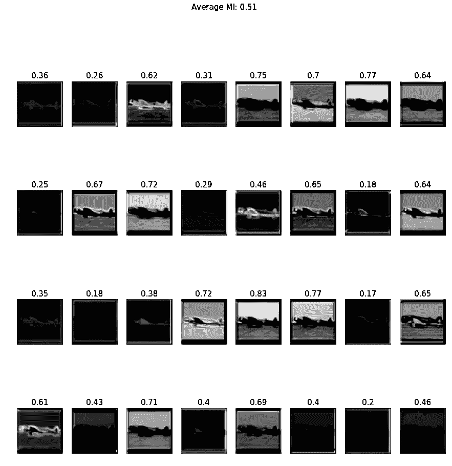

# 最大化互信息的特征，它们看起来怎么样？

> 原文：<https://towardsdatascience.com/features-that-maximizes-mutual-information-how-do-they-look-like-95267da510aa?source=collection_archive---------9----------------------->

## 我们可以通过最大化交互信息来创建潜在特征，但是它们看起来会是什么样的呢？

Image from [pixabay](https://pixabay.com/illustrations/woman-face-head-identity-search-565127/)

我要感谢[Fran ois Fleuret](https://www.idiap.ch/~fleuret/)博士、[Devon Hjelm](https://www.linkedin.com/in/devon-hjelm-a54b175/?originalSubdomain=ca)博士、[yo shua beng io](http://www.iro.umontreal.ca/~bengioy/yoshua_en/)博士提供了令人惊叹的[论文](https://arxiv.org/abs/1808.06670)和[参考资料](https://fleuret.org/files/complement-slides-MI-estimator.pdf)。最后，我要感谢我的导师布鲁斯博士的鼓励、耐心和有益的讨论。

**简介**

由于最近的发展，如 [MINE](https://arxiv.org/abs/1801.04062) 和 [DeepInfoMax](https://arxiv.org/abs/1808.06670) ，我们不仅能够估计两个高维随机变量的互信息，而且能够创建潜在特征，使输入数据的互信息最大化。

就我个人而言，我认为创造有意义的潜在变量的想法与本吉奥博士的[演讲有些关联。简而言之，更好的数据表示(也称为抽象表示)对机器学习模型有益。这也与我们想要最小化/最大化的目标函数不在像素空间中，而是在信息空间中的想法有关。](https://www.youtube.com/watch?v=Yr1mOzC93xs)

在这篇文章中，我将把重点放在可视化潜在变量上，这是通过最大化交互信息而产生的。而不是选择可用于任何下游任务的最佳“最佳”表示。

**方法**

**蓝色球体→** 来自 STL 数据集的输入图像(96*96) **蓝色矩形→** 编码器网络 **绿色矩形→** 局部信息最大化器 **红色矩形→** 全局信息最大化器 **黄色矩形→** 先验分布作为正则化

请注意，输入图像已经转换为灰度，因此没有任何颜色通道。此外，我们可以注意到，我们有三个网络作为目标函数，但是，它们都不是在像素空间，而是在信息空间。(详情请阅读论文 [DeepinfoMax](https://arxiv.org/abs/1808.06670) )。

> 此外，请注意，所有的目标函数网络都采用两个变量来最大化它们之间的互信息。在我们所有的例子中，我们给这些网络提供了**原始图像(如果需要，可以调整大小)和编码的潜在变量**。

**实验设置**

*情况 A)潜在变量具有较小的维数*

这种情况下，编码器仅由卷积层组成，没有任何填充。因此，在每次卷积操作之后，图像的空间维度将减小。

**维数:(96，96)→(94，94)→(92，92)→(90，90)→(88，88)**

*情况 B)潜在变量具有更大维度*

这是编码器由转置卷积层组成的情况。因此，在每一层之后，图像的空间维度将增加。

**维度:(96，96)→(98，98)→(100，100)→(102，102)→(104，104)**

*情况 C)潜在变量具有相同的维度*

在这种情况下，我们使用零填充执行典型的卷积运算，因此空间维度不会改变。

**维数:(96，96)→(96，96)→(96，96)→(96，96)→(96，96)**

*情况 D)潜在变量具有相同的维数(反向自动编码器)*

在这种情况下，我们首先通过转置卷积来增加空间维度，但是在没有任何填充的情况下应用卷积来立即减小空间维度。(因此反向自动编码器)。

**维数:(96，96)→(98，98)→(100，100)→(98，98)→(96，96)**

对于上述所有方法，我们将通过创建两幅图像的直方图来测量原始图像和潜在变量之间的互信息，更多细节[在此](https://stackoverflow.com/questions/20491028/optimal-way-to-compute-pairwise-mutual-information-using-numpy)或[在此](https://matthew-brett.github.io/teaching/mutual_information.html)。此外，所有超参数保持不变，例如学习速率、迭代次数和批量大小。

**结果**

当我们比较 50 次迭代的损失时，我们可以清楚地看到，当我们保持空间维度与输入数据相同时，互信息最大化。

让我们按照情况 a、b、c 和 d 的顺序，比较每种方法创建的不同特征图。

Left Case a Right Case b

Left Case c Right Case d

当我们考虑原始图像和 32 个特征图之间的平均互信息时，我们可以看到互信息对于情况 c 是最高的。

让我们比较另一幅图像，这次是一匹马的图像。

Left Case a Right Case b

Left Case c Right Case d

对于马的图像也获得了类似的结果。

最后，当我们比较 STL 数据集中所有 5000 个图像的最大互信息时，我们可以看到，相对于输入数据保持维度相同具有最高频率的生成具有高互信息的潜在变量。

**结论/交互代码**

要访问案例 a 的代码，[请点击此处。](https://github.com/JaeDukSeo/Daily-Neural-Network-Practice-2/blob/master/Personal%20Milestones/first/1%20View%20Maximize/a%20smaller.ipynb)
要访问案例 b 的代码，[请点击这里](https://github.com/JaeDukSeo/Daily-Neural-Network-Practice-2/blob/master/Personal%20Milestones/first/1%20View%20Maximize/b%20larger%20.ipynb)。
要获取案例 c 的代码，[请点击此处。](https://nbviewer.jupyter.org/github/JaeDukSeo/Daily-Neural-Network-Practice-2/blob/master/Personal%20Milestones/first/1%20View%20Maximize/c%20same.ipynb)
要访问案例 d 的代码，[请点击此处](https://nbviewer.jupyter.org/github/JaeDukSeo/Daily-Neural-Network-Practice-2/blob/master/Personal%20Milestones/first/1%20View%20Maximize/d%20same%20%28auto%20encoder%29.ipynb)。
要访问用于创建可视化效果的代码[，请点击此处](https://nbviewer.jupyter.org/github/JaeDukSeo/Daily-Neural-Network-Practice-2/blob/master/Personal%20Milestones/first/1%20View%20Maximize/e%20analyze.ipynb)。

请注意，我已经修改了来自 [DuaneNielsen 的原始实现。](https://github.com/DuaneNielsen/DeepInfomaxPytorch)

**遗言**

为什么这和我有关系？我认为这种创造潜在变量的形式可能是克服过度拟合的一个好主意。诚然，我们可以使用生成模型来创建新的数据点，这些数据点可以用作数据扩充，但它们也有自己的一系列问题，如模式崩溃。拥有多样化的数据扩充方法对每个人都有好处。

最后，所有的参考文献都被链接到[这里](https://medium.com/@SeoJaeDuk/archived-post-reference-for-features-that-maximizes-mutual-information-how-do-they-look-like-3bb6ce4904ab)。