# 使用 PySyft 的联邦学习

> 原文：<https://towardsdatascience.com/federated-learning-3097547f8ca3?source=collection_archive---------1----------------------->

## 具有设备上能力的训练机器学习模型的新时代。在本教程中，我将使用 PyTorch 和 PySyft 来训练一个使用联邦方法的深度学习神经网络。

# 联邦学习简介

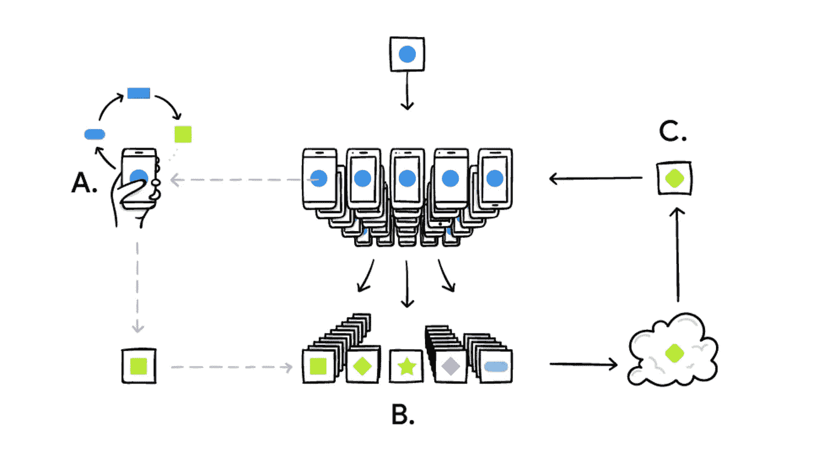

# 什么是联合学习？

联合学习是一种分布式机器学习方法，它能够在大型分散数据语料库上进行模型训练。联合学习使手机能够协作学习共享的预测模型，同时将所有训练数据保留在设备上，将机器学习的能力与将数据存储在云中的需求分离开来。这超越了在移动设备上进行预测的本地模型的使用(如移动视觉 API 和设备上智能回复),还将模型训练带到了设备上。

目标是机器学习设置，其中目标是利用分布在大量客户端上的训练数据来训练高质量的集中式模型，每个客户端都具有不可靠且相对较慢的网络连接。

这个新领域由一系列技术组成，这些技术允许 ML 工程师在不直接访问用于训练的数据的情况下训练模型，并避免他们通过使用密码术获得关于数据的任何信息。

该框架依赖于三种主要技术:

*   联合学习
*   差异隐私
*   安全多方计算

在本文中，我将介绍联合学习及其在预测波士顿房价中的应用。

# 谷歌如何使用联邦学习？

How google uses Federated Learning to make more accurate keyboard suggestions

# 应用程序是如何工作的？

随着 PySyft、Tensorflow Federated 等很多著名库的兴起。对于普通开发者、研究人员和机器学习爱好者来说，创建一个去中心化的机器学习训练模型变得更加容易。在这个项目中，我使用 PySyft——一个用于安全、私人深度学习的 Python 库——来训练一个数据集，其目的是预测波士顿市所列房产的房价。PySyft 使用 PyTorch 中的多方计算(MPC)将私有数据从模型训练中分离出来。

在训练深度学习预测模型时，数据会与 Alice 和 Bob 一起安全地保存在本地。对于一个私人训练，我使用了一种联合的方法，其中 ML 模型是用 Alice 和 Bob 两方拥有的移动设备的设备上能力在本地训练的。随着移动设备的计算机性能的提高，以更高的效率训练 ML 模型变得更加容易。

# 联合学习方法中涉及的步骤

1.  移动设备下载全球 ML 模型
2.  当用户使用与 ML 模型关联的应用程序时，数据正在生成
3.  随着用户开始更多地与应用程序进行交互，用户可以根据其使用情况获得更好的预测
4.  一旦模型准备好与服务器进行预定的同步。利用设备上的能力进行训练的个性化模型被发送到服务器
5.  收集来自所有设备的模型，并且使用联合平均函数来生成比先前模型改进得多的模型版本
6.  一旦被训练，改进的版本被发送到所有设备，在那里用户获得基于全球所有设备的使用的体验

# 安装 PySyft

PySyft 是一个用于安全、私人深度学习的 Python 库。PySyft 使用 PyTorch 中的[联邦学习](https://ai.googleblog.com/2017/04/federated-learning-collaborative.html)、[差分隐私](https://en.wikipedia.org/wiki/Differential_privacy)和[多方计算(MPC)](https://en.wikipedia.org/wiki/Secure_multi-party_computation) ，将私有数据从模型训练中分离出来。

**为了安装 PySyft，建议您先设置一个 conda 环境**

```
conda create -n pysyft python=3
conda activate pysyft
conda install jupyter notebook
```

**然后你需要安装软件包**

```
pip install syft
```

# 使用联邦学习方法开发神经网络的分步指南

## **1)导入库**

*以下 Python 库用于开发项目。*

1.  **Numpy** — NumPy 是 Python 编程语言的库，增加了对大型多维数组和矩阵的支持，以及对这些数组进行操作的大量高级数学函数。
2.  **PyTorch** — PyTorch 是基于 Torch 库的开源机器学习库，用于计算机视觉、自然语言处理等应用。它主要是由脸书人工智能研究小组开发的。它是免费的开源软件。
3.  **PySyft** — PySyft 是一个用于安全、私人深度学习的 Python 库。PySyft 使用 PyTorch 中的联邦学习、差分隐私和多方计算(MPC)将私有数据从模型训练中分离出来。
4.  Pickle—Pickle 模块实现了二进制协议，用于序列化和反序列化 Python 对象结构。

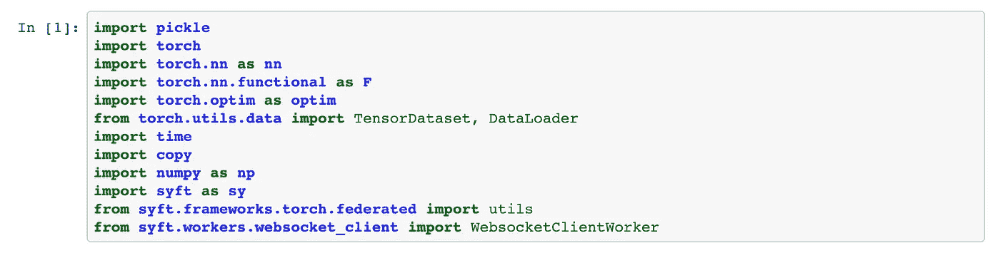

Importing libraries in the Jupyter Notebook

## 2)初始化训练参数

我们已经对神经网络进行了 100 多次的训练，以获得良好的结果。通过创建总共 8 个批次的记录，我们能够获得良好的结果。的学习率设置为 0.001，以使用随机梯度下降作为网络的优化器。到目前为止，PySyft 只支持 SGD 优化器用于反向传播算法来计算误差和更新网络参数。

**梯度下降**是一种寻找函数最小值的一阶迭代优化算法。为了使用**梯度下降**找到函数的局部最小值，人们采取与当前点的函数的**梯度**(或近似**梯度**)的负值成比例的步骤。

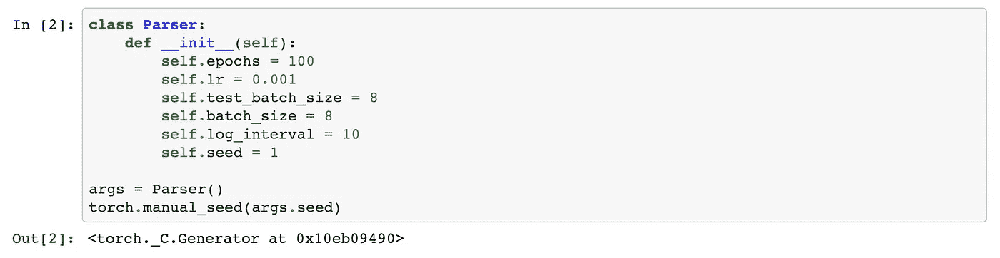

Initiating the learning parameter in the Jupyter Notebook

## **3)数据集预处理**

下一步包括将数据集读入 Jupyter 笔记本，并在用数据训练神经网络之前对其进行预处理。预处理数据有助于我们更好地了解数据集，并帮助我们选择有助于预测输入结果的最佳特征。

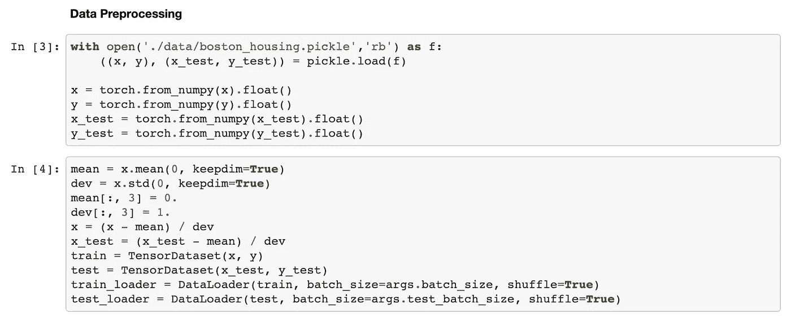

Data Preprocessing for the Boston Housing dataset

在这个项目中，我们使用了最常见的波士顿住房数据集来训练神经网络。我们根据不同的定价特征来预测各种房产的价格。下面列出了其中的一些。你可以在这里找到数据集。

数据库中的每条记录都描述了波士顿的一个郊区或城镇。数据取自 1970 年波士顿标准大都市统计区(SMSA)。

## 属性定义如下

1.  CRIM: *城镇人均犯罪率*
2.  ZN: *面积超过 25，000 平方英尺的住宅用地比例*
3.  印度河:*每个城镇的非零售商业用地比例*
4.  CHAS: *查尔斯河虚拟变量(= 1，如果区域边界为河流；0 否则)*
5.  氮氧化物:*氮氧化物浓度(百万分之一)*
6.  RM: *每个住所的平均房间数*
7.  楼龄:*1940 年前建成的自住单位比例*
8.  DIS: *到五个波士顿就业中心的加权距离*
9.  RAD: *放射状公路可达性指标*
10.  税:*每万美元的全价值财产税*
11.  PTRATIO: *按城镇分列的师生比率*
12.  b:*1000(Bk 0.63)2 其中 Bk 是按城镇划分的黑人比例*
13.  LSTAT: *%*
14.  MEDV: *以千美元为单位的自有住房中值我们可以看到，输入属性混合了多种单位。*

## 4)用 PyTorch 创建神经网络

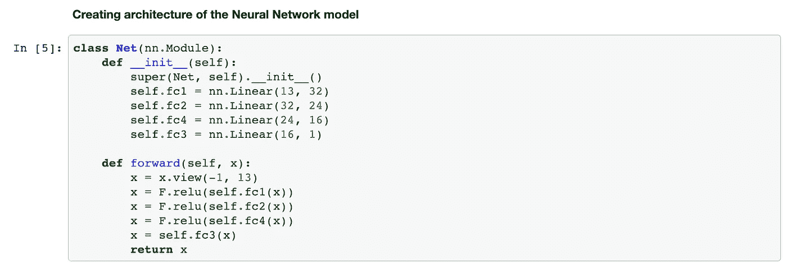

我们现在必须使用 PyTorch 为模型定义神经网络架构。深度学习网络由 2 个不同的隐藏层组成，并涉及网络中所有层的 Relu 激活函数的使用。输入层由 13 个不同的感知器组成，对应于训练数据集的每个输入特征。

## 5)将数据与远程移动设备连接

鲍勃和爱丽丝是参与整个循环的两个人。出于模拟目的，我们向所有使用全局 ML 模型与应用程序交互的网络客户端发送批量数据集。

我们可以看到，使用 PySyft 库及其 PyTorch 扩展，我们可以使用张量指针执行操作，就像我们可以使用 PyTorch API 一样(但仍有一些限制需要解决)。

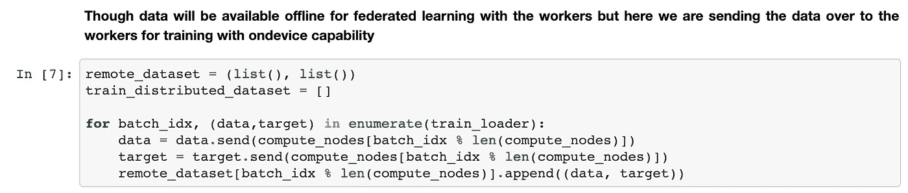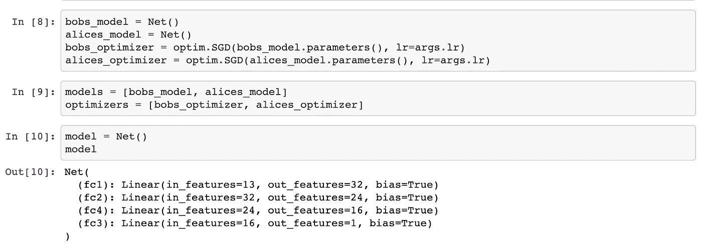

现在，我们联系名为 Alice 和 Bob 的工作人员，他们使用各方提供的数据来训练神经网络。

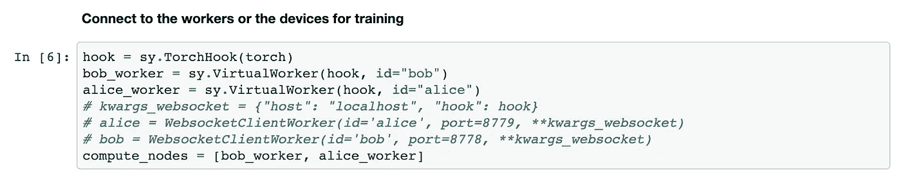

## 6)训练神经网络

多亏了 PySyft，我们能够在不访问远程和私有数据的情况下训练一个模型:对于每一批，我们将模型发送给当前的远程工作者，并在将它发送给下一批的工作者之前，将它返回到本地机器。

然而，这种方法有一个限制:通过取回模型，我们仍然可以访问一些私人信息。假设 Bob 的机器上只有一条数据记录。当我们取回模型时，我们可以用更新的权重来检查 Bob trained 用来重新训练模型的数据。

为了解决这个问题，有两种解决方案:差分隐私和安全多方计算(SMPC)。差分隐私将用于确保该模型不会提供对某些隐私信息的访问。SMPC 是一种加密计算，作为回报，它允许您私下发送模型，这样拥有数据的远程工作人员就看不到您使用的重量。

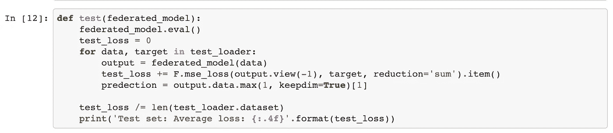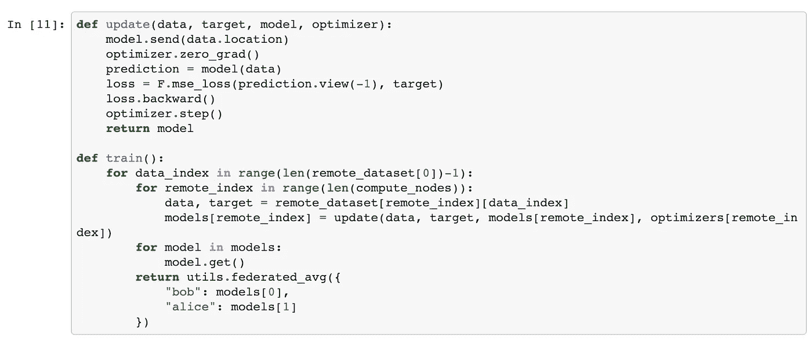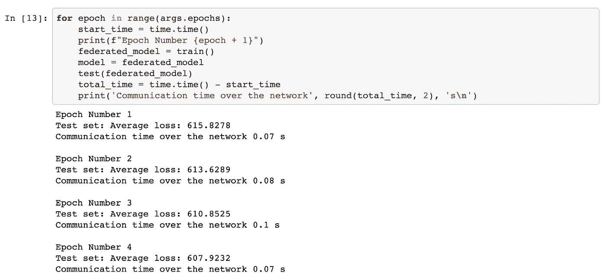

您可以使用下面的 Jupyter 笔记本来检查整个项目。我还留下了联邦学习项目的链接，可以在下面我的 GitHub 知识库中找到。

# 资源

如果你有兴趣学习更多关于安全和私人人工智能以及如何使用 PySyft 的知识，你也可以在 Udacity 上查看这个免费课程 [**。这是一门很棒的初学者课程，由 Andrew Trask 教授，他是 OpenMined Initiative 的创始人。**](https://eu.udacity.com/course/secure-and-private-ai--ud185)

*   [更多关于 Pysyft 的信息](https://github.com/OpenMined/PySyft)
*   [隐私保护深度学习的通用框架](https://arxiv.org/abs/1811.04017)
*   [联合学习:没有集中训练数据的协作机器学习](https://ai.googleblog.com/2017/04/federated-learning-collaborative.html)
*   [教程:采用联邦学习的深度学习新方法](https://medium.com/@saranshmanu/federated-learning-3097547f8ca3)

在 [GitHub](https://github.com/saranshmanu/Federated-Learning) 上查看项目

# 关于我

我是印度计算机科学与工程专业的大四学生，过去 5 年来一直从事编码工作。在从事了几个机器学习和 iOS 开发项目之后，我正在学习联邦学习的新技术，因为未来十年你如何在移动设备上训练深度学习模型取决于联邦协议。你可以在我的[网站](http://www.saransh.xyz)上了解我更多。更多项目请查看我的 [GitHub](https://github.com/saranshmanu) 档案。