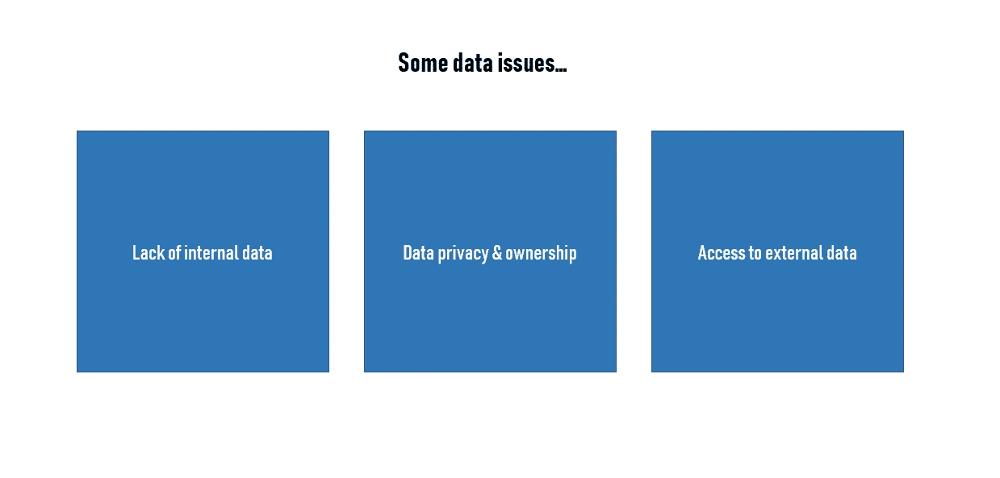
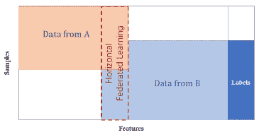
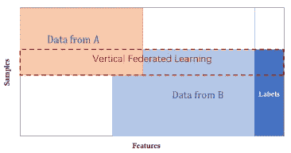
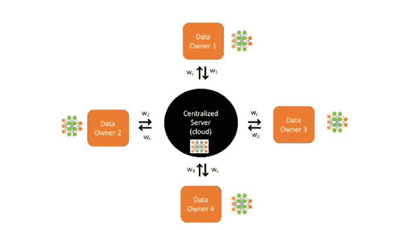

# 联合学习:一种新的人工智能商业模式

> 原文：<https://towardsdatascience.com/federated-learning-a-new-ai-business-model-ec6b4141b1bf?source=collection_archive---------13----------------------->

[Source](https://asia.nikkei.com/Economy/Abe-to-push-for-global-data-sharing-rules-at-Davos)

联合学习不仅是一项有前途的技术，也是一种全新的人工智能商业模式。事实上，作为一名顾问，我最近受命就一家医疗保健公司如何通过创建联合学习框架与一些竞争对手建立“数据联盟”提出建议。**这篇文章的目标是向你解释 FL 将如何产生一个新的数据生态系统和创建数据联盟。**

# ***什么是联邦学习(FL)* ？**

在不涉及太多技术细节的情况下，FL 可以被定义为一个分布式机器学习框架，它允许从分布在数据所有者之间的数据构建一个集体模型。

AI 项目需要的数据涉及多个要素。我会说，我们创造伟大的人工智能项目的能力总是有限的。对外部数据的访问非常受限，这是构建高级人工智能应用程序的一个现实问题。更糟糕的是，由于行业竞争、隐私安全和其他管理程序，即使是同一公司不同部门之间的数据集成也是一个挑战。

总的来说，集中式 ML 远非完美。事实上，训练模型需要公司积累大量相关数据到中央服务器或数据中心。在一些项目中，这意味着收集用户的敏感数据。

因此，大多数企业往往无法实现集中式机器学习。不用说，收集项目所需的所有数据的“简单”任务是相当昂贵和耗时的。

在从事 ML 项目时，我经常会遇到两个问题:

根据项目的不同，您需要的数据的所有者可能只是不想与您的公司共享这些数据。当涉及竞争敏感数据或受法律保护的医疗数据时，情况就是如此。

其次，大量有价值的训练数据是在缓慢且不可靠的网络边缘的硬件上创建的，例如智能手机或工业设施中的设备。**我意识到，对于公司来说，使用这样的设备进行沟通可能会很慢，而且成本很高。**

联合学习为与传统机器学习相关的大多数问题带来了答案。事实上，算法训练转移到了网络的边缘，因此数据永远不会离开设备，无论是手机还是医院分支机构的服务器。一旦模型从数据中学习，结果被上传并与来自网络上所有其它设备的更新相结合。**改进后的模型将在整个网络中共享。(**[**1**](https://workflow.servicenow.com/it-transformation/ai-federated-learning-edge/)**)**

# **新的商业模式？**

云计算模式正受到前所未有的挑战。公司不能再忽视数据隐私和数据安全日益增长的重要性。而且一个公司的利润和它的数据之间的关系在 AI 时代越来越明显。**然而，联合学习的商业模式为利用数据的应用提供了一个新的范例。**

联合学习的目标是，当每个公司使用的独立数据集无法创建准确的模型时，联合学习的机制使公司可以共享统一的模型，而无需直接的数据交换。**企业将有可能获得更多数据，更好地训练它们的模型。**

公平的数据共享可以通过从每一方建立的子模型建立一个元模型来实现，以便只传输模型参数，或者通过使用加密技术来允许不同方之间的安全通信。区块链技术也有助于加强数据控制。

简而言之，联合学习使不同的数据所有者在组织层面上协作和共享他们的数据成为可能。在最近的一篇论文中，研究人员(杨强等人)设想了发生这种情况的不同配置。

## 纵向和横向联合学习

让我们以来自同一个国家的两家银行为例。尽管它们有不重叠的客户群，但是它们的数据将有相似的特征空间，因为它们有非常相似的业务模型。在水平联合学习的例子中，他们可能会走到一起合作。

在垂直联合学习中，两家提供不同服务(如银行和电子商务)但拥有大量客户的公司可能会在他们拥有的不同特征空间上找到合作空间，从而为双方带来更好的结果。

在这两种情况下，由于区块链技术等原因，数据所有者可以在不泄露各自客户隐私的情况下进行协作。他们都将获得更多数据，以更好地改善他们的人工智能计划。

现在，联合学习似乎非常适合医疗保健和银行业。对于银行，我们可以想象一个系统，其中多家银行可以训练一个通用的强大的欺诈检测模型，而无需通过联合学习相互共享敏感的客户数据。关于医院和其他医疗保健机构，如果他们同意以保护隐私的方式共享用于模型训练的患者数据，他们可能会受益。

# 建立数据联盟

当我负责围绕联合学习框架建立数据联盟时，我注意到公司通常对数据隐私非常怀疑。事实上，他们都不想通过分享他们的数据来帮助竞争。主要的挑战将在这里…如何说服公司打开他们的数据战箱，并与他人分享？

我的观点是，这种基于联合学习的新商业模式必须得到工业数据联盟的支持，否则注定会失败。联盟可以有几个实体，通过加入联盟，实体可以在联邦学习框架下使用数据进行合作。

[Source](http://databrainpro-fl1.blogspot.com/2018/10/collaborative-learning-without-data.html)

***我正在研究的数据联盟将是这样的:***
它将是一个多方系统，由两个或两个以上的组织组成联盟，通过联合学习在各自的数据集上训练共享模型。将鼓励选定的公司和组织加入该联盟，该联盟将有明确的激励机制。

我认为，为了将不同组织间的联合学习完全商业化，需要开发一个公平的平台和激励机制。

联盟成员享有权利和利益，也履行责任。在我看来，联盟必须利用区块链来建立各方的共识，在一个永久的数据记录机制中记录各方的贡献，并奖励做出突出贡献的各方。

> **“保持数据私有是每个参与实体实现共同目标的联合学习的主要附加值。”(**[**2**](https://medium.com/hackernoon/a-beginners-guide-to-federated-learning-b29e29ba65cf)**)**

我建议依靠中立的第三方。他们可能负责“提供基础设施来聚合模型权重，并在联盟中的公司之间建立信任”。([**3**](https://searchenterpriseai.techtarget.com/feature/Federated-deep-learning-offers-new-approach-to-model-training)**)**

此外，数据结构和参数通常是相似的，但不需要相同，但在每个客户端需要大量预处理来标准化模型输入。一个中立的第三方可以完美地处理项目的这一部分。

目前，数据孤岛和对数据隐私的关注是人工智能的重要挑战，但联合学习可能是一个解决方案。它可以为多个组织建立一个统一的模型，同时保护本地和敏感数据，以便他们可以共同受益，而不必担心数据隐私。

# 联合学习的挑战

将联合学习从概念过渡到生产并非没有挑战。事实上，在联邦学习的效率和准确性方面已经取得了很多成就，在我看来，更重要的挑战与安全性有关。

联合学习的关键因素是保护与数据相关的隐私。似乎即使没有公开实际数据，也可以利用重复的模型权重更新来揭示不是对数据全局的而是对单个贡献者特定的属性。( [4](https://medium.com/datadriveninvestor/an-overview-of-federated-learning-8a1a62b0600d)

这种推断既可以在服务器端执行，也可以在客户端执行。一个可能的解决方案是使用“差别隐私”技术来降低这种风险。

# 结论

联合学习使得在监管和竞争行业中应用机器学习变得更容易、更安全、更便宜。通过 FL，公司可以改进他们的模型，增强他们的人工智能应用。**在医学领域，FL 可能是更好的治疗和更快的药物发现的同义词。**

我认为，当前大公司为了竞争优势而集中汇总数据和创建孤岛的思维模式将是推动采用联合学习的主要障碍。大多数公司最近才开始他们的人工智能之旅……我们将需要有效的数据保护政策、适当的激励措施和围绕分散数据的商业模式，以解决这些问题并开发联合人工智能生态系统。

简而言之，我期望在许多垂直市场中看到更多的工业数据联盟，例如，金融行业可以形成金融数据联盟，而医疗行业可以形成医疗数据联盟。从长远来看，我们还可以期待来自不同行业但拥有相同人工智能愿景的公司之间的数据联盟。

**如果你有兴趣有更多的技术细节，我推荐这个** [**网站**](https://www.groundai.com/project/federated-machine-learning-concept-and-applications/) **。**