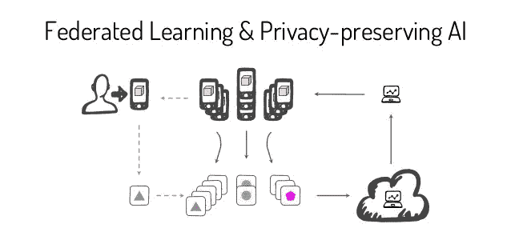

# 联合学习和隐私保护人工智能

> 原文：<https://towardsdatascience.com/federated-learning-and-privacy-preserving-ai-fcddbeb426c5?source=collection_archive---------42----------------------->

## 通过联合学习，保护用户隐私安全，并使您的模型训练有素。

上个月，我在寻找一些在我的新项目中使用的技术，然后，我发现了一些关于从保持隐私的人那里获得训练数据的东西。我了解到这被称为“联合学习”,这是机器学习保持数据隐私的最佳方式。但是它是如何工作的呢？请继续阅读，寻找答案！

from slideshare.net

联合学习与一个设备网络一起工作，这些设备能够在没有中央服务器的情况下进行自我培训，因此我们可以将联合学习定义为分散式学习，我们用作培训平台的设备是我们的智能手机，足够智能来做到这一点。使用这种技术，我们不仅可以保护用户的隐私，还可以改善用户的体验。

那么它是如何工作的呢？设备只有在有资格参与时才能参与(空闲状态)，但开发人员正在努力将对性能的影响降至最低。然后，符合条件的设备只从自身获取有用的数据，并将其放入数据集，利用该数据集训练模型，然后将其发送到服务器，服务器只获取加密数据，而不使用密钥。然后，服务器可以在没有数据本身的情况下读取经过训练的模型。

但是服务器怎么区分我最近的搜索是不是例外呢？也许有人有对模型没有用的独特数据，所以我们需要通过限制手机对模型的贡献来排除这些数据，并添加噪声来掩盖罕见的数据。这被称为**差分隐私**，当共享模型的参数受唯一数据影响太大时非常有用。

如果设备忙于训练，我们如何测试模型？我们可以使用其他设备来测试我们的模型！通过这种方式，我们可以在每天使用模型的用户手中测试模型。然后我们就有了一个由同型号的训练员和测试员私下组成的网络，没有任何侵犯隐私的地方！

一个真实的例子是在医疗保健行业，由于严格的隐私保护法律，组织不能获取患者的数据并使用它们来训练一个可以有效帮助他们的模型。联合学习可以保护患者的隐私，同时也可以利用数据。英特尔与宾夕法尼亚大学生物医学图像计算和分析中心成功演示了联合学习如何应用于医学成像，要了解更多信息，请点击[此处](https://www.intel.ai/federated-learning-for-medical-imaging/)。

最后，联合学习是训练一个完美模型的最好方法，我认为几年后它将无处不在，但它也是现在。使用联合学习的应用程序的一个例子是我开始写这篇文章的 Gboard，在这种情况下，键盘可以建议你输入单词，分析你以前在网上做过的任何事情。

如果你想了解更多关于联邦学习的知识，我推荐你访问 https://federated.withgoogle.com/。