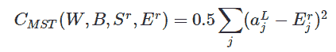
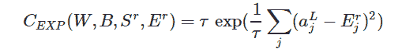
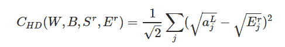
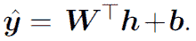
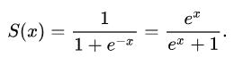
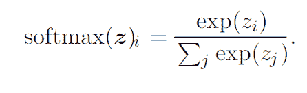
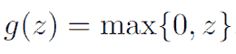
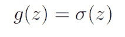
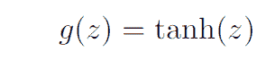
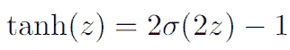

# 前馈神经网络简介

> 原文：<https://towardsdatascience.com/feed-forward-neural-networks-c503faa46620?source=collection_archive---------2----------------------->

**深度前馈**网络或者也称为 [**多层感知器**](https://en.wikipedia.org/wiki/Multilayer_perceptron) 是大多数 [**深度学习**](http://deeplearning.net/) 模型的基础。像[**CNN**](https://medium.com/alumnaiacademy/introduction-to-computer-vision-4fc2a2ba9dc)和 [**RNNs**](https://medium.com/alumnaiacademy/natural-language-processing-3981827918b) 这样的网络只是前馈网络的一些特例。这些网络主要用于 [**监督机器学习**](https://dataconomy.com/2015/01/whats-the-difference-between-supervised-and-unsupervised-learning/) 任务，其中我们已经知道目标功能，即我们希望我们的网络实现的结果，并且对于实践机器学习极其重要，并且形成了许多商业应用的基础，这些网络的存在极大地影响了诸如 [**计算机视觉**](https://medium.com/alumnaiacademy/introduction-to-computer-vision-4fc2a2ba9dc) 和 [**NLP**](https://medium.com/alumnaiacademy/natural-language-processing-3981827918b) 等领域。

前馈网络的主要目标是逼近某个函数 f*。例如，回归函数 y = f *(x)将输入 x 映射到值 y。前馈网络定义了映射 y = f(x；θ)并学习导致最佳函数逼近的参数θ的值。

这些网络被称为前馈网络的原因是，信息流发生在正向，因为 x 用于计算隐藏层中的某个中间函数，该中间函数又用于计算 y。在这种情况下，如果我们将最后一个隐藏层的反馈添加到第一个隐藏层，它将代表一个递归神经网络。

这些网络由许多不同功能的组合来表示。每个模型都与描述功能如何组合在一起的非循环图相关联。例如，我们可能有三个函数 f (1)、f (2)和 f (3)连接成一条链，形成 f (x) = f(3)(f (2)(f (1)(x))。其中 f(1)是第一层，f(2)是第二层，f(3)是输出层。

输入层和输出层之间的层称为隐藏层，因为训练数据不会显示这些层的预期输出。网络可以包含任意数量的隐藏层和任意数量的隐藏单元。一个单元基本上类似于一个神经元，它接受来自前几层单元的输入，并计算自己的激活值。

现在出现了一个问题，当我们有线性机器学习模型时，为什么我们需要前馈网络，这是因为线性模型仅限于线性函数，而神经网络不是。当我们的数据不是线性的时，可分离的线性模型在逼近时会遇到问题，而对于神经网络来说却很容易。隐藏层用于增加非线性并改变数据的表示，以便更好地概括函数。

对于设计任何前馈神经网络，有一些事情你需要决定，大多数网络需要一些成分，其中一些对于设计机器学习算法是相同的。

# 【计算机】优化程序

优化器或优化算法用于最小化成本函数，这在每个训练周期或**时期**之后更新权重和偏差的值，直到成本函数达到全局最优。

优化算法有两种类型:

> **一阶优化算法**

这些算法使用成本函数相对于参数的**梯度值最小化或最大化成本函数。**一阶导数告诉我们**函数在特定点**是减少还是增加，简而言之，它给出了与曲面相切的线。

> **二阶优化算法**

这些算法使用**二阶导数来最小化成本函数，也被称为 Hessian** 。由于二阶导数的计算成本很高，所以二阶导数并不常用。**二阶导数告诉我们一阶导数是增加还是减少，这暗示了函数的曲率。**二阶导数为我们提供了一个二次曲面，它触及误差曲面的曲率。

有许多算法用于优化，例如:

> [**随机梯度下降**](https://developers.google.com/machine-learning/crash-course/reducing-loss/stochastic-gradient-descent)
> 
> [**阿达格拉德**](http://akyrillidis.github.io/notes/AdaGrad)
> 
> [**亚当**](https://machinelearningmastery.com/adam-optimization-algorithm-for-deep-learning/)
> 
> [rms prop](/a-look-at-gradient-descent-and-rmsprop-optimizers-f77d483ef08b)

[The architecture of the feedforward neural network](https://www.houseofbots.com/news-detail/1443-1-what-is-deep-learning-and-neural-network)

# 网络的架构

网络的架构是指**网络的结构即隐藏层数和每层中隐藏单元的数量。**根据通用逼近定理**具有线性输出层和至少一个具有任何“挤压”激活函数的隐藏层的前馈网络可以从一个有限维空间到另一个空间以任何期望的非零误差量逼近任何 Borel 可测函数，只要网络被给予足够的隐藏单元。**这个定理简单地陈述了无论我们试图学习什么函数，总有一个 MLP 能够代表这个函数。

我们现在知道总会有一个 **MLP 能够解决我们的问题，但是没有特定的方法来确定这个架构。**没有人可以说，如果我们使用 n 个层和 M 个隐藏单元，我们将能够解决给定的问题，找到这种没有试凑法的配置仍然是一个活跃的研究领域，目前只能通过试凑法来完成。

找到正确的架构很难，因为我们可能需要尝试许多不同的配置，但是**即使我们有了正确的 MLP 架构，**它仍然可能无法代表目标功能。发生这种情况有两个原因，首先是**优化算法可能无法找到对应于所需函数**的参数的正确值，另一个原因是**训练算法可能由于过度拟合而选择错误的函数。**

# 价值函数

**成本函数**在训练的任何一点都显示了我们的模型得出的近似值与我们试图达到的实际目标值之间的差异并且总是单值的，因为它的工作是评估网络作为一个整体如何。就像机器学习算法一样，也使用基于梯度的学习来训练前馈网络，在这种学习方法中，使用像随机梯度下降这样的算法来最小化成本函数。

整个训练过程在很大程度上取决于我们的成本函数的选择，对于其他参数模型，成本函数的选择或多或少是相同的。

在我们的参数模型定义分布 p(y | x；𝛳)，我们简单地使用训练数据和模型预测之间的交叉熵作为成本函数。我们还可以采取另一种方法，通过预测以 x 为条件的 y 的一些统计量，而不是预测 y 上的完整概率分布。

为了将函数用作反向传播算法的成本函数，它必须满足两个特性:

> 成本函数必须能够写成平均值。
> 
> **成本函数必须不依赖于输出层之外的网络的任何激活值。**

成本函数主要是 C(W，B，Sr，Er)形式，其中 W 是神经网络的权重，B 是网络的偏差，Sr 是单个训练样本的输入，Er 是该训练样本的期望输出。

一些可能的成本函数是:

## 二次成本

quadratic cost function

这个函数也被称为*均方误差*、*最大似然*和*平方和误差。*

## 交叉熵成本

Cross-entropy cost function

这个函数也被称为*伯努利负对数似然*和*二元交叉熵*

## 指数成本

Exponential cost function

## 海灵格距离

Hellinger distance cost function

这是一个也被称为统计距离的函数。

# 输出单位

输出单元是存在于输出层的那些单元，它们的工作是给我们期望的输出或预测，从而完成神经网络必须执行的任务。输出单位的选择与成本函数的选择紧密相关。神经网络中任何可以作为隐单元的单元也可以作为输出单元。

可供选择的输出单位有:

## 线性单位

最简单的输出单元是用于高斯输出分布的线性输出单元，这些单元基于仿射变换，其**不会给输出层**带来非线性。给定 h 特征，线性输出层产生矢量:

linear unit function

对于线性图层，最大化对数似然相当于最小化均方误差，最大似然使得更容易获得高斯分布的协方差。

这些线性单元的优点是它们不会饱和，即它们的梯度总是保持不变，永远不会接近零，因此这些单元不会给基于梯度的优化算法带来困难。

## 乙状结肠单位

sigmoid unit function

为了**解决二元分类问题**，我们将 Sigmoid 输出单元与最大似然相结合。一个 Sigmoid 输出单元有两个组件，一个是使用线性层计算 z = w*h+b，然后使用激活函数将 z 转换为概率。当使用其他损失函数时，例如均方误差，损失可以在任何时候饱和，即梯度可以收缩得太小而对学习无用。因此，最大可能性是首选。

## Softmax 单位

Softmax 单元用于众多输出分布，它用于具有 n 个可能值的离散变量的概率分布，这也可以看作是代表二元变量概率分布的 sigmoid 函数的推广。Softmax 函数由下式定义:

Softmax unit function

像 Sigmoid 函数一样，Softmax 函数也可以饱和，即梯度可以收缩得太小，对学习没有用处。在 Softmax 的情况下，由于它有多个输出单元，只有当输入值之间的差异变得极端时，这些单元才会饱和。

这些单元受赢家通吃原则支配，因为总概率总是 1 且不能超过，其 1 的值越接近 1，则其他输出单元的输出值肯定越接近 0。

**隐藏单位**

选择隐藏单元的类型也是积极的研究，没有特定的单元可以保证它在每个问题上都优于所有其他单元，但我们仍然有一些单元在开始时是默认选择，例如，校正线性单元或通常称为 Relu 的单元是最常用的，这是由于直观的原因而不是实验性的，在现实中，通常不可能预先预测哪一个将工作得最好。选择隐藏单元需要反复试验，凭直觉判断某种隐藏单元可能工作良好，然后进行测试。

隐藏单元的可能选择有:

## 整流线性单位

这些函数使用由 g(z)定义的激活函数

Relus 易于优化，因为它们类似于线性单元，它们之间的唯一区别是它们一半域的输出为 0。它们如此著名的原因是，每当单位活动时，它们总是有一个恒定的大梯度。与引入二阶效应的激活函数相比，方向的梯度对学习更有用。

ReLU 有一个缺点，即它们不能通过基于梯度的方法学习，因为它们的激活是零。

Relu 有很多概括，这些是；

> **绝对值整流**
> 
> **泄漏继电器**
> 
> **参数 ReLU**
> 
> **最大输出单位**

最大输出单元应用元素式函数 g(z)，最大输出单元将 z 分成 k 个值的组。然后，每个最大输出单元输出这些组之一的最大元素。最大输出单元被认为是 ReLU 的最佳概括，因为它们具有冗余，这是由于每个单元都由多个过滤器驱动而导致的，这些过滤器帮助它们抵抗**灾难性遗忘**，在这种遗忘中，神经网络忘记如何执行它们被训练的任务。

## 逻辑 sigmoid 和双曲正切

逻辑 s 形由下式给出:

Logistic sigmoid

双曲正切由下式给出:

Hyperbolic tangent

这些单元密切相关，如:

The relation between the hyperbolic tangent and sigmoid

在 **ReLU、**之前，这些是神经网络最著名的选择，但现在它们的使用被忽略了，因为当 z 非常大时它们饱和到一个高值，当 z 非常小时饱和到一个低值，并且只有当 z 接近 0 时对它们的输入非常敏感。s 形单位的普遍饱和会使基于梯度的学习变得非常困难。