# 2019 年 CVPR 的少数镜头学习

> 原文：<https://towardsdatascience.com/few-shot-learning-in-cvpr19-6c6892fc8c5?source=collection_archive---------6----------------------->

TL；全民博士(？)来自 CVPR 2019 的几篇论文。这些是我最初为自己写的笔记，所以不要全信。有些论文我有幸在海报会议上与作者讨论过，有些我读过，有些我只是浏览了一下。如果我做错了什么，请让我知道。

# 背景

少镜头物体识别最近成为热门话题(从 CVPR18 的 4 篇少镜头论文到 CVPR19 的 20 篇左右)。通常的设置是你有许多例子的类别，你可以在训练时使用；然后在测试的时候，给你一些新奇的类别(通常是 5 个)，每个类别只有几个例子(通常是 1 或 5 个；称为“支持集”)并从相同的类别中查询图像。

接下来，我试着把少拍法分解到不同的家庭。虽然这些族没有被很好地定义，并且许多方法属于不止一个族。

“较老的”建议方法基于**度量学习**，其目标是学习从图像到嵌入空间的映射，在嵌入空间中，来自相同类别的图像靠在一起，而来自不同类别的图像相距很远。希望它能适用于看不见的类别。

随后，出现了**元学习**方法。这些是以当前任务为条件的模型，因此使用不同的分类器作为支持集的函数。想法是找到模型超参数和参数，使得它将容易适应新的任务，而不会过度适应可用的少数镜头。

与此同时，**数据增强**方法也非常流行。我们的想法是学习数据扩充，这样我们就可以从少数可用的例子中生成更多的例子。

最后，**基于语义的方法**正在兴起。它受零触发学习的启发，零触发学习只基于类别名称、文本描述或属性进行分类。这些额外的语义问题在缺少可视例子时也会有所帮助。

# 本文涉及的论文

## 度量学习方法

**【李】等.al； [**现实场景中本地化的少镜头学习**](https://arxiv.org/abs/1904.08502) ，Wertheimer 等。al； [**【密集分类与植入】用于少镜头学习**](https://arxiv.org/abs/1903.05050) ，Lifchitz 等。al； [**变型原型-编码器:用原型图像一次性学习**](https://arxiv.org/abs/1904.08482) ，Kim et al .艾尔。**

## **元学习方法**

**[**元学习与可微凸优化**](https://arxiv.org/abs/1904.03758) **，**李等人。al； [**边缘标记图神经网络用于少拍学习**](https://arxiv.org/abs/1905.01436) ，Kim 等。al； [**少镜头学习的任务不可知元学习**](https://arxiv.org/abs/1805.07722) ，Jamal et al .al； [**元迁移学习对于少投学习**](http://arxiv.org/abs/1812.02391) ，孙等。al； [**用 GNN 去噪自动编码器生成分类权重进行少拍学习**](http://arxiv.org/abs/1905.01102) ，Gidaris et。al；**【李】等。铝****

## ****数据扩充方法****

****[**LaSO:多标签少拍学习的标签集运算网络**](https://arxiv.org/abs/1902.09811) ，Alfassy et。al；**【张】等。al；[**【Spot and Learn:一个用于少镜头图像分类的最大熵面片采样器**](http://openaccess.thecvf.com/content_CVPR_2019/papers/Chu_Spot_and_Learn_A_Maximum-Entropy_Patch_Sampler_for_Few-Shot_Image_CVPR_2019_paper.pdf) ，Chu 等。al； [**图像变形元网络的一次性学习**](https://arxiv.org/abs/1905.11641) ，陈等。铝******

## ****基于语义的方法****

****[**婴儿迈向多语义少镜头学习**](https://arxiv.org/abs/1906.01905) ，Schwartz 等。al； [**通过对齐的变分自动编码器**](https://arxiv.org/abs/1812.01784) 、Schonfeld et。al； [**网:面向低镜头学习的任务感知特征嵌入**](https://arxiv.org/abs/1904.05967) ，王等。al； [**大规模少投学习:知识随班级等级转移**](http://openaccess.thecvf.com/content_CVPR_2019/papers/Li_Large-Scale_Few-Shot_Learning_Knowledge_Transfer_With_Class_Hierarchy_CVPR_2019_paper.pdf) ，李等。铝****

## ****面目全非(其他任务的少量学习)****

****[**RepMet:用于分类和少镜头对象检测的基于代表的度量学习**](https://arxiv.org/abs/1806.04728) ，Karlinsky 等人。al； [**CANet:具有迭代求精和专注少拍学习的类不可知分割网络**](https://arxiv.org/abs/1903.02351) ，张等。铝****

# ****mini-ImageNet 基准测试的性能****

****只有相关的和被报道的报纸；根据单镜头性能排序****

****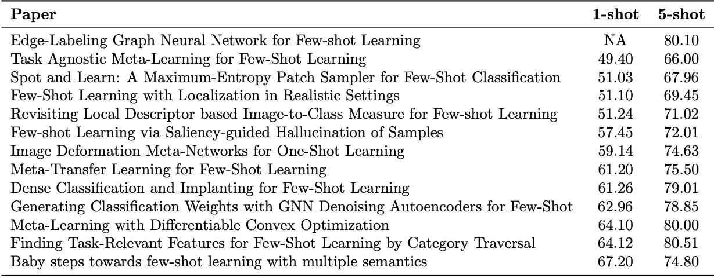****

# ****度量学习方法****

******再论基于局部描述子的图像到类的度量用于少镜头学习，**李等。铝****

****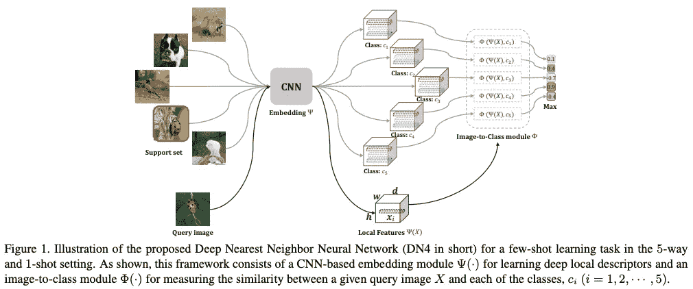****

****在这项工作中，作者感到有点怀旧，回到了单词袋时代的本地描述符，但特征是用 CNN 提取的，一切都是端到端学习的。结果在基准的低端。****

******在现实环境中进行局部化的少镜头学习**，Wertheimer 等人。铝****

****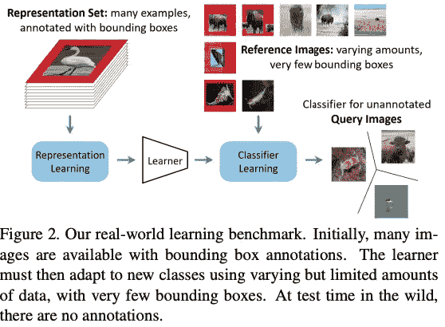****

****他们理所当然地声称标准的少量测试基准不现实，因为他们人为地平衡了类和测试 5 路任务，他们建议了一个新的数据集/基准。该模型学习同时定位和分类；明显的缺点是需要带有边界框注释的数据集。分类器基于原型网络，但是所使用的特征向量是聚集的前景和背景表示的串联。****

******针对少镜头学习的密集分类和植入**，Lifchitz 等。铝****

****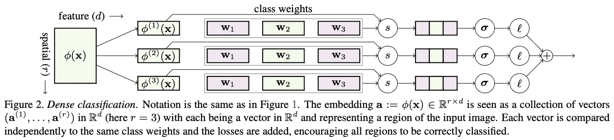****

****密集地执行分类，即，代替最终的全局平均汇集，所有空间位置都需要被正确分类。此外，他们不是在测试时微调最后一层，而是通过添加神经元来加宽每一层，并对其进行微调(只训练额外的权重，旧的被冻结)。****

******变型原型-编码器:用原型图像进行一次性学习**，Kim 等人。艾尔。****

****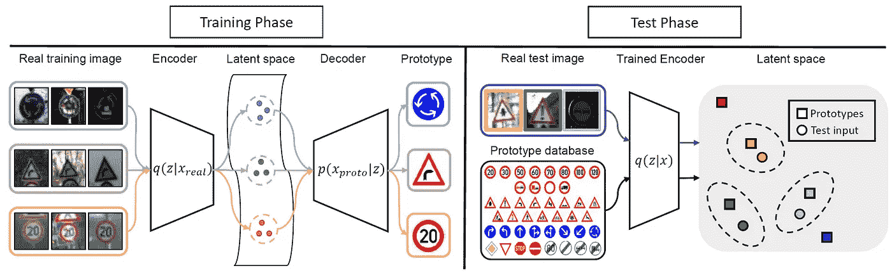****

****这更像是一次性分类在标识或路标分类中的具体应用。在这种情况下，他们将图形图像(与野外的标识/标志形成对比)视为原型。并且他们通过学习将野外徽标/标志图像映射到原型图像的元任务来学习良好的表示。****

# ****元学习方法****

******可微凸优化元学习，**李等。铝****

****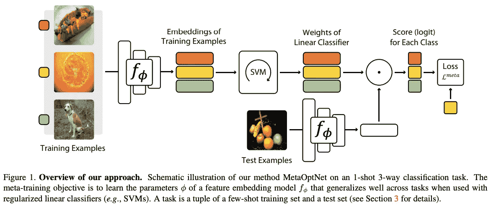****

****这项工作是基准测试中的佼佼者之一(对于不使用语义信息的方法而言)。该方法非常简单，一个强大的骨干加上 SVM 分类器训练端到端。他们表明，即使只是使用主干网和原型网络也能达到很高的精度。SVM 使用也提高了性能。特征维数(分类器输入)保持得相当高，我想知道 SVM 是否能更好地处理这种高维度，这就是提升的原因。****

******边缘标记图神经网络用于少拍学习**，Kim 等。铝****

****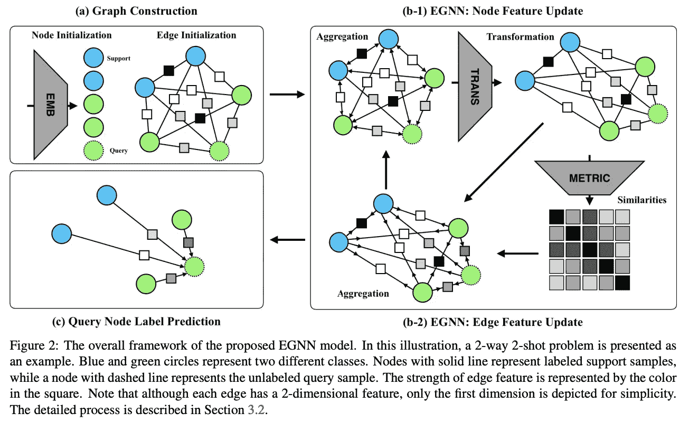****

****图形神经网络以前曾被用于少镜头学习。基本思想是，每个图像可以表示为图中的一个节点，并且信息(节点表示)可以根据它们的相似程度在它们之间传播。虽然通常根据节点之间的距离表示隐式地进行分类，但是这里作者建议每条边具有描述其节点之间相似性的显式特征。****

******用于少量学习的任务不可知元学习**，Jamal 等人。铝****

****在这项工作中，为了避免元学习模型对训练任务的过度拟合，将正则化项添加到输出预测中。正则化或者迫使预测具有更高的熵(即，预测的概率不表现得像独热向量)，或者迫使模型在任务之间具有更低的不平等(即，在不同的任务上表现得同样差或好)。显然，拥有一个强正则化对于少炮是重要的，但是我没有一个好的直觉为什么这些特殊的正则化项是需要的。他们在 MAML 上测试了这种方法，结果显示它的性能更好，看看在其他方法上使用这种方法是否也有帮助将会很有趣。****

******少镜头学习的元迁移学习**，孙等。铝****

****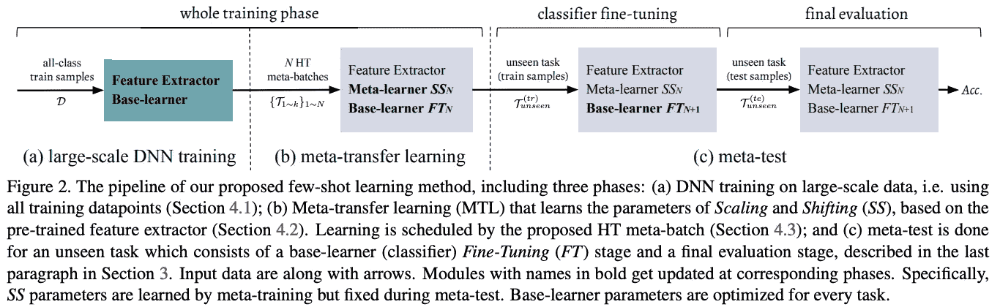****

****该方法有两个主要元素:1 .微调预训练模型，其中权重被冻结，并且仅学习每层的比例和偏移 2。硬任务挖掘。如果我没有弄错的话，在 MAML，finetune 被应用于批处理规范层，它的效果不就和学习缩放和移位一样吗？当应用于 MAML 之上时，硬批量挖掘(从先前任务中精度较低的类组成一个任务)似乎也是有益的。****

******使用 GNN 去噪自动编码器生成分类权重，用于少量拍摄学习**，Gidaris 等人。铝****

****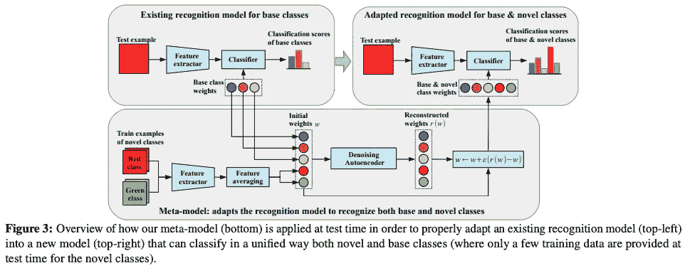****

****此处，模型再次预测了未知类别的分类器权重。此外，所有分类器权重都经过去噪自动编码器(基本和任务新颖类),该编码器被实现为图形神经网络，因此 1。允许分类器适应当前的任务类别。从基本分类器向新分类器传播知识。使用去噪自动编码器是有意义的，因为它可以帮助固定预测的分类器，这些分类器是基于仅仅几个例子预测的并且明显有噪声。****

****【通过类别遍历寻找少镜头学习的任务相关特征】李等。铝****

****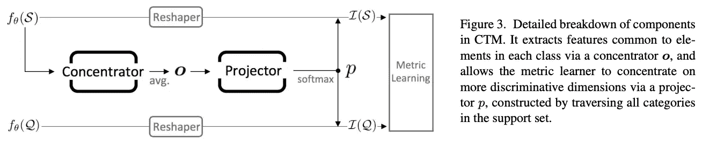****

****这项工作是基准测试中的佼佼者之一(对于不使用语义信息的方法而言)。给定特征提取器，该模型基本上预测特征向量上的注意力图。“集中器”查看每个类(或图像？我不确定),而“投影仪”将任务中所有类别的信息结合起来，生成注意力地图。“集中器”和“投影仪”都是作为一个小 CNN 实现的。我喜欢它是一个简单的模块，当在几个已知的基于度量的方法上使用时，它们显示出持续改进的性能。****

# ****数据扩充方法****

******LaSO:多标签少镜头学习的标签集运算网络**，Alfassy et。铝****

****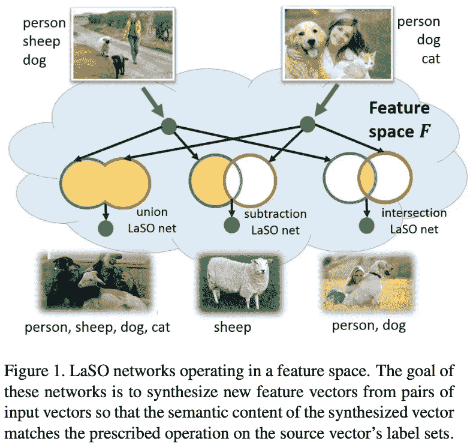****

****为这篇处理多标签少镜头分类的很酷的论文向我的同事们欢呼吧。这里，模型被训练为在嵌入空间中对多标签样本的标签集执行集合运算(并、减和交)。例如，通过对一只狗和一只猫的图像应用联合操作，我们得到了一个同时包含一只狗和一只猫的图像的表示。然后，这些操作用于扩充数据并提高分类性能。****

******显著性引导的样本幻觉少镜头学习**，张等。铝****

****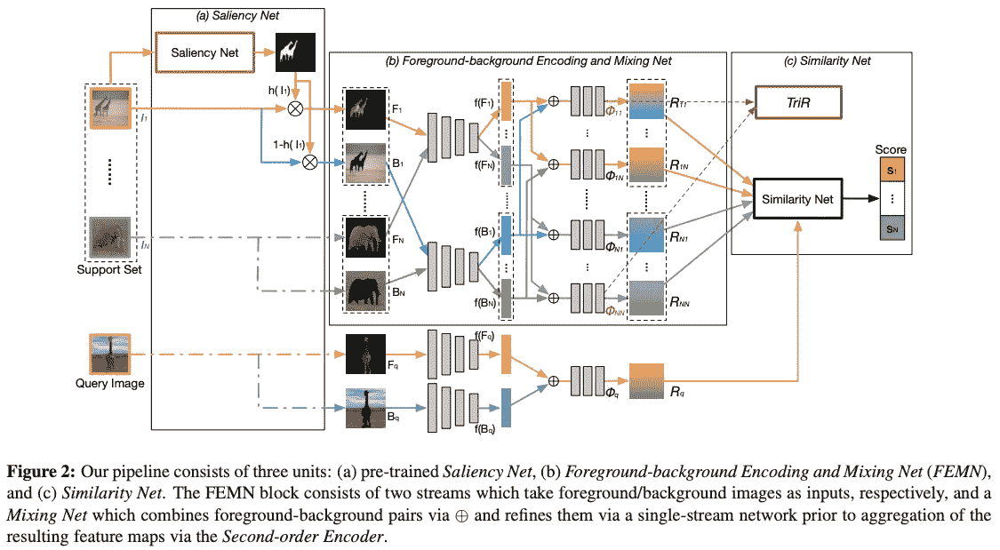****

****使用预先训练的(不相交类别上的)显著性模型来分割前景与背景。训练两个特征提取器，一个用于前景和背景，第三个模型用于组合它们。明显的缺点是，你需要一个预先训练好的显著性模型。我认为这是增加数据的一种很酷的方式，但是我不确定背景的增加对于正确分类(不同于检测)有多重要，如果你已经能够分割前景，那么只使用前景进行分类不是更好吗？****

******Spot and Learn:一种用于少镜头图像分类的最大熵面片采样器。铝******

****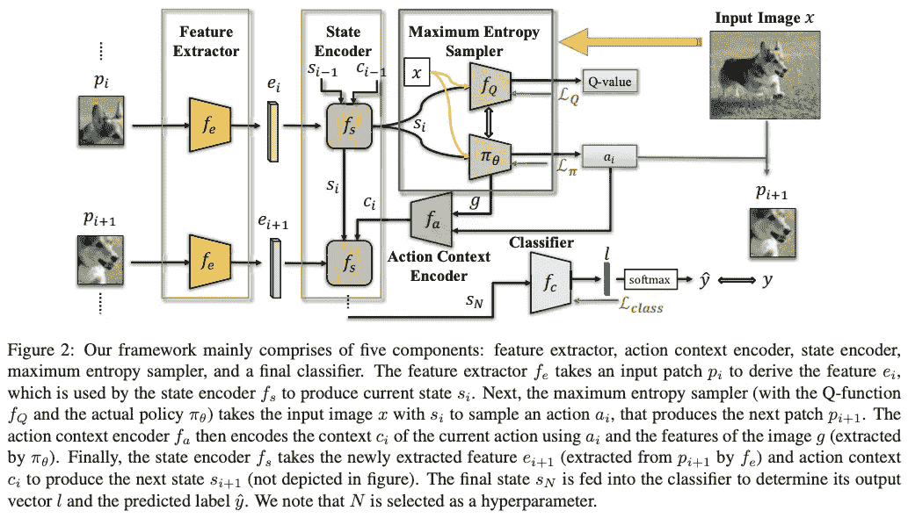****

****这里，不是学习整个图像的表示，而是使用 RNN 对每个片计算该表示，并且使用增强学习模型预测片上的最优轨迹(即，接下来应该使用哪个片的决定)来聚集该表示。我猜想，与简单的注意力模型相比，它更好，因为数据增加了(在同一张图像上使用不同的轨迹)。然而，基准测试的结果还可以。我想知道仅仅使用随机轨迹的增强效果是否会很好。****

******图像变形一步学习元网络**，陈等。铝****

****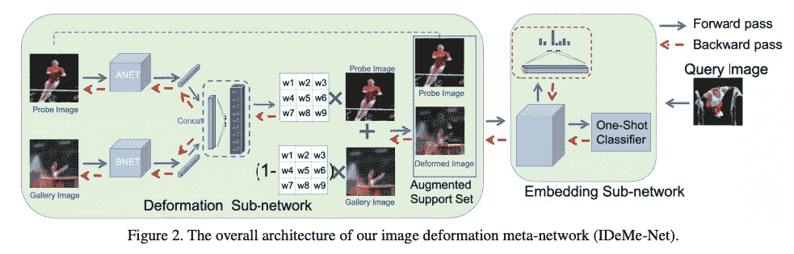****

****一种非常酷的数据扩充方法。类似于“混合”，但是图像根据网格划分，并且对于每个单元使用不同的(预测的)混合系数。训练是端到端的，同时学习分类器和最优混合(在更好的分类意义上的最优)。它们与 mixup 相比较，但我想知道当系数是预测的而不是随机的时，mixup 对整个图像的作用有多好，即每个单元不同的 mix 有什么影响。****

# ****基于语义的方法****

******婴儿迈向多语义少镜头学习**，Schwartz 等人。铝****

****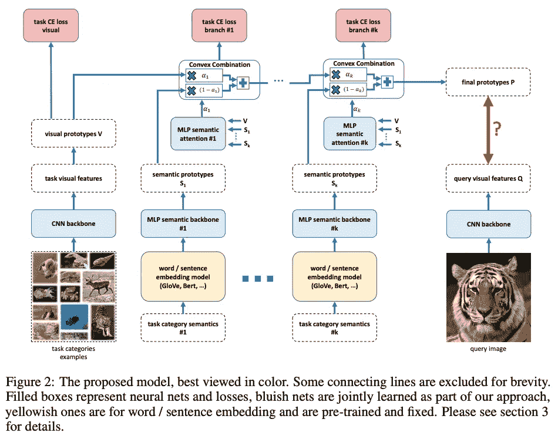****

****不要脸的插上我在 CVPR 语言和视觉研讨会上发表的作品。我们建立在 AM3 模型的基础上。al，2019]并将其概括为使用多种语义。我们使用类别的简短文本描述(这些描述是 ImageNet 的一部分，但到目前为止还没有用于少数镜头)来提高性能。我们从视觉原型开始，用一系列语义嵌入迭代更新它们。通过这样做，我们在 miniImageNet 上观察 SOTA 结果。****

******通过对齐的变分自动编码器进行的广义零次和少次学习**。铝****

****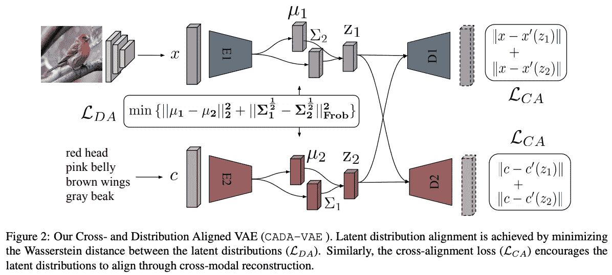****

****训练两个 vae，一个用于视觉特征，一个用于语义特征。目标是能够从潜在的视觉特征中重建语义特征，反之亦然。我以为这就足够了，但是他们表明，迫使两个潜在空间有相同的分布也有帮助。****

******-Net:面向低镜头学习的任务感知特征嵌入，**王等。铝****

****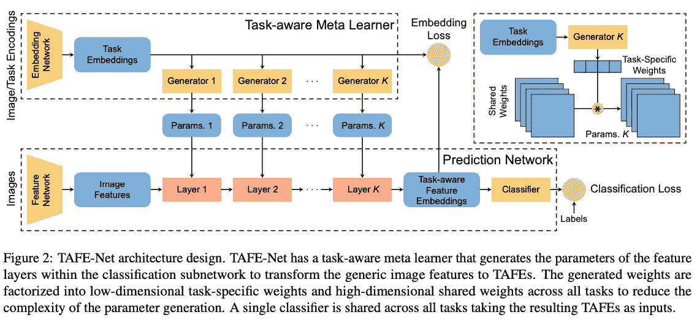****

****在这项工作中，标签嵌入(手套)用于预测视觉特征提取器模型的权重。他们提出了一个分解权重的好技巧，因此只需要预测一个较低维度的权重向量。此外，语义嵌入和视觉嵌入之间的对齐是通过“嵌入损失”来强制的。这篇论文很有趣，因为它结合了两种方法——元学习(基于任务预测模型)和使用语义信息(标签)。然而，对于少杆任务，结果似乎低于 SOTA。****

****【大规模少投学习:知识转移与班级层级，李等。铝****

****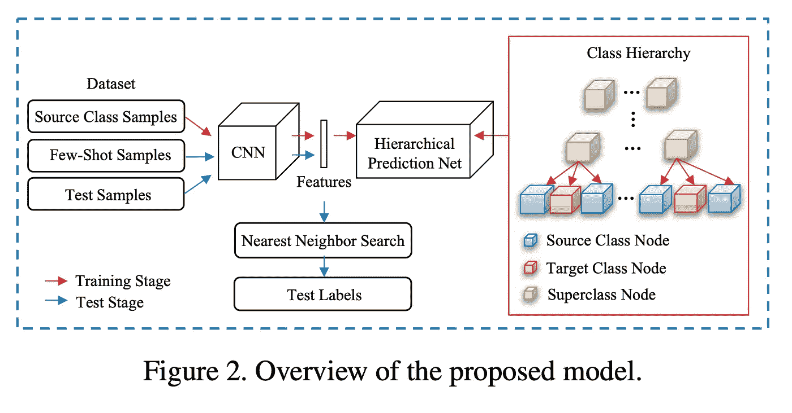****

****据称，目前的方法在大规模的少数镜头上失败，即在 imagenet 上进行预训练，而不是在 mini-imagenet 中的 64 个基类上，并且不比朴素基线好。这里，再次使用了语义标签。他们使用标签嵌入来无监督地建立类层次结构，这是一种有趣的方法，据说学习以这种层次方式分类有助于模型捕捉在看不见的类上表现更好的特征。一个警告是，看不见的类标签被用来构建类的层次结构，这是不是有点欺骗？****

# ****面目全非(其他任务的少量学习)****

******RepMet:用于分类和少量拍摄对象检测的基于代表的度量学习**，Karlinsky 等人。铝****

****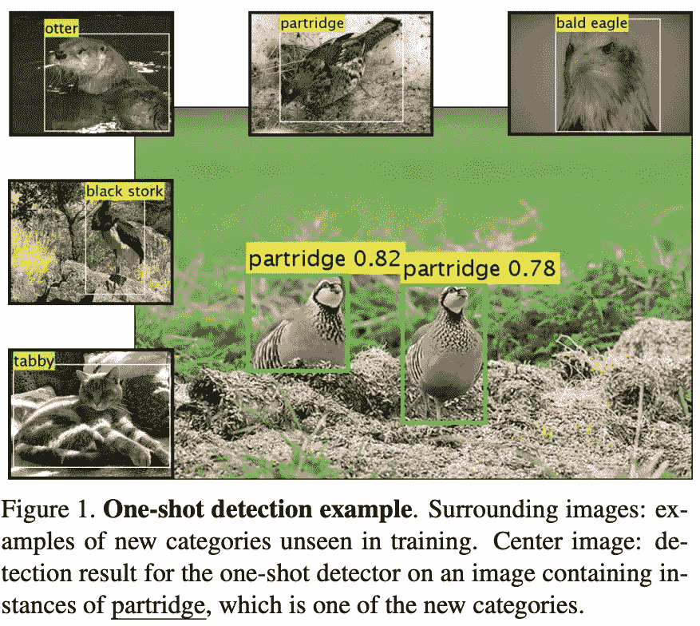****

****不要脸的塞，再一次，塞到我合著的一部作品里。我们是第一批研究少量拍摄物体检测的。我们的解决方案是将基于度量的方法(如原型网络)扩展到检测。我们使用现成的检测器架构(FPN-DCN)并用基于度量的分类器代替(线性)分类器头，其中基于到已学习的类代表的距离来完成对每个提议区域的分类。我们提出了一个新的少数镜头检测基准，并显示了竞争方法的改进。****

******CANet:具有迭代细化和专注的少数镜头学习的类别不可知分割网络**，张等人。铝****

****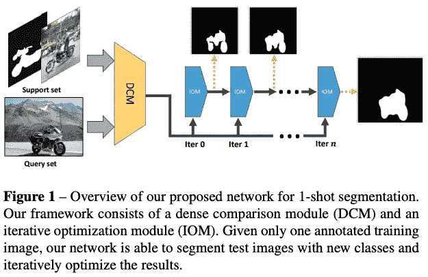****

****将度量学习扩展到少量镜头分割的密集情况。将查询图像中的所有局部特征与支持集中的对象上的所有局部特征进行比较是非常昂贵的。因此，他们选择将查询中的局部特征与支持集图像的全局表示进行比较。****