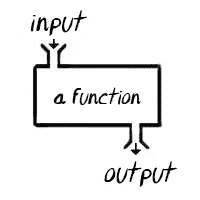
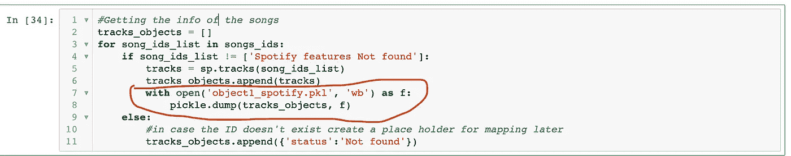

# 收集数据时可以使用的一些技巧

> 原文：<https://towardsdatascience.com/few-tips-you-can-use-while-collecting-data-f34dfc6f6880?source=collection_archive---------34----------------------->

## 在为我最新的 DS 项目收集数据时，我是如何解决一些问题的

几周前，我花了大量的时间从互联网上为我最近的项目收集数据(网络抓取、API 调用等等)。我将在以后的帖子中分享一个总结。第一天非常令人沮丧，因为我的代码总是失败，或者我没有得到预期的结果。在我的任务中遇到的问题的解决是由于几个小的修复。下面几段我和大家分享四个。

## **1-组织你的脚本**

I consider each scripts executing specific tasks separate to keep my Jupyter Notebook clean and neat…

收集数据时保持有条理是很重要的。这有助于轻松找到你的错误所在。编写一段代码没有任何帮助。我建议养成两个习惯:保留代码注释和在笔记本上写代码(我用 Jupyter 笔记本，很少去其他 IDE 写 Python 代码)
一边写代码一边写注释是跟踪交付成果的一种方式。想象一下，两年后回到你的旧剧本，却不记得你以前想要达到的目标。清晰的评论真的很有帮助。此外，我们还为其他数据科学家编写代码(记住，Python 是一种‘免费’的编程语言)。通过注释我们的代码，我们使我们的同行变得容易。
关于 Jupyter 笔记本的意见有分歧，一些数据科学家不喜欢它，更喜欢使用其他 IDE。你的电话。在一天结束时，审查和执行短代码比长代码更可取。我在使用 Jupyter 时发现的主要优点是，我可以有几个脚本，而不是一个完整的块。我可以打印我的变量；检查我的数据帧的描述或很容易找到我的列表的长度。
在检查错误或调试时，对每一小块代码进行注释可以节省大量时间。同样，将执行特定任务的脚本放在同一个区域可以让我的 Jupyter 笔记本保持整洁。

## 2-使用功能

The function is only written once. It can be used multiple times to produce different outputs depend on the input.

函数是避免重复和更有效的好方法。在我的例子中，一旦我知道我的函数起作用了，我就有信心在数据收集过程的不同阶段使用它。我不用再写步骤了，远离了错误。例如，我不得不从同一个网站的不同部分或者去不同的页面收集一些数据。在那种情况下，我的数据收集结构并没有真正改变。我必须确定我将不得不多次执行的任务，并使用一个函数来使它对我来说更容易。

## 3-按需保存

在我第一次尝试抓取一些数据时，几分钟后我的脚本失败了。我丢失了所有被废弃的东西，因为我只是添加了一个收集到的数据列表。大错特错。想象一下，如果 2 或 3 个小时的数据收集没有了，我会有多沮丧。

我不得不经历的一个简单的解决办法是保存我得到的每一组新数据。在一个“for 循环”中，我正在 Pickle…Pickle 和 Json 在这方面非常有用。pickle 的主要优点是你可以保存任何东西:列表、Pandas 数据框、字典作为一个 pickle，并在以后使用初始数据类型中保存的项目。Json 格式只要求您稍后通过它来获取数据。

让我分享我在最近的项目中使用的一个脚本。客观地说，我从 Spotify 上收集歌曲。我在一个用于 API 调用的列表中有一个歌曲/艺术家的初始组合。出于什么其他原因，我应该在获得歌曲功能时保存它们？首先，Spotify 上可能找不到歌曲/艺术家的组合。这会导致错误并终止请求。其次，请求可能会超时。保存迄今收集的所有数据变得很重要。如果我遇到任何问题，我知道从哪里着手。

After each songs, my list containing all features had been appended and saved

## 4-用 try 捕捉错误…除了

在我的数据收集之旅中，我不得不求助的一个最佳解决方案是用‘Python try…except’处理错误。这个想法是让 Python 评估代码，根据某些条件处理错误，并根据评估和错误处理来执行代码。“尝试…例外”的三个步骤通过以下方式实现:

测试代码块错误的`try`块；不管 try- and except 块的结果如何，`except`块处理错误，而`finally`块执行代码。当错误发生时，或者我们称之为异常时，Python 通常会停止并生成一条错误消息。这些异常可以使用“try”语句来处理。

在数据收集过程中，我如何使用异常？基本上，我没有等待错误来破坏我的代码，而是让 Python 捕捉错误并继续收集数据，即使没有找到请求的歌曲。

使用 Python 收集数据时，有不同的方法来处理类似的问题。我分享了一些与我的情况相关并且非常有帮助的例子。如果你有任何其他建议，欢迎在评论中与我分享，或者在 [LinkedIn](https://www.linkedin.com/in/fabricemesidor/) 或 [Twitter](https://twitter.com/FabriceMesidor) 上与我联系，我们可以讨论。