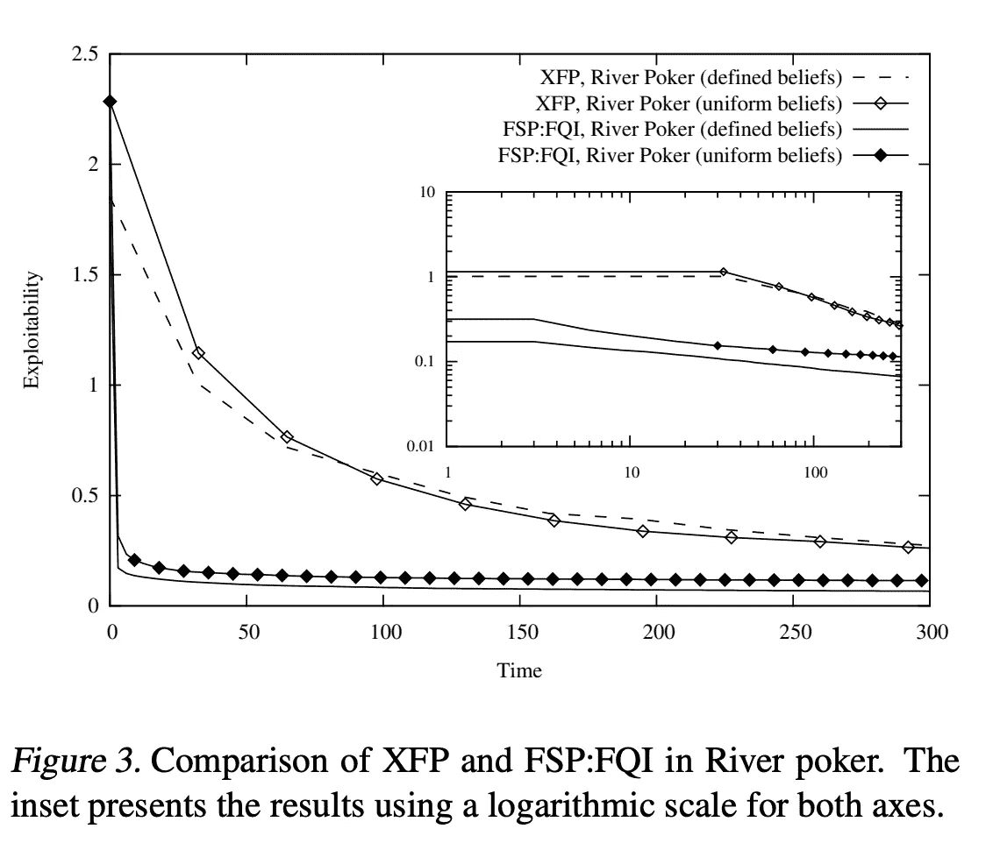

# 虚拟自我游戏

> 原文：<https://towardsdatascience.com/fictitious-self-play-30b76e30ec6a?source=collection_archive---------23----------------------->

## 强化学习向自我游戏迈进了一步

Photo by [Markus Spiske](https://unsplash.com/@markusspiske?utm_source=medium&utm_medium=referral) on [Unsplash](https://unsplash.com?utm_source=medium&utm_medium=referral)

**更新**:学习和练习强化学习的最好方式是去 http://rl-lab.com

## 介绍

在零和游戏中使用强化学习需要一些比标准的[虚拟游戏](/introduction-to-fictitious-play-12a8bc4ed1bb)更复杂的方法。标准虚拟游戏用于不考虑时间的标准形式游戏。要将强化学习应用于零和游戏，需要另一种方法。这篇文章是基于约翰尼斯·海因里希&大卫·西尔弗的论文“[广泛形式游戏中的虚拟自我游戏](http://proceedings.mlr.press/v37/heinrich15.pdf)”。

## 扩展形式游戏

正常形式的游戏被建模为一个表格，其中每个玩家的行动(称为策略)是行和列的标题，每个单元格的内容是每个玩家采用的策略的收益。

这种形式的问题是它没有捕捉到序列或时间。出于这个原因，扩展形式游戏使用树状表示，其中每个节点是玩家，每个边是策略，并且可以清楚地看到从一个节点到另一个节点的顺序。

请注意，对于每个扩展形式的游戏，我们可以找到一个正常形式的游戏，产生相同的结果。

## 学问

学习的目的是找到该玩什么策略才能达到纳什均衡，这样我们才不会输(平均而言)。
换一种方式说同样的话，**学习**的过程就是找到使用每一个策略(或行动)的概率(或概率分布)，这样我们平均起来就不会输。

## ε-最佳对策

在标准的虚拟游戏中，每个玩家都将寻求对对手行动的最佳反应。
最佳对策是指在当前情况下能带来最佳价值或回报的策略。认为 R 是对最佳反应的奖励。我们将ε-最佳反应定义为导致奖励 ***r*** 使得 ***r ≥ R-ε*** 的反应集合。

## 广义弱化虚拟游戏

广义的弱化虚拟博弈是一个迭代过程，使用当前策略**计算混合策略∏** ，ε-最佳对策 ***bɛ*** ，以及其他一些扰动 m

从这种方法中得到的重要收获是**它在两人零和游戏**的情况下收敛。这种方法的原因稍后会更清楚。

莱斯利·柯林斯写的一篇论文中可以找到广义弱化虚拟游戏的细节。

## 广泛形式的虚拟游戏(XFP)

广泛形式的虚拟游戏采用广义弱化虚拟游戏的概念来迭代计算纳什均衡，因此在两人零和游戏中，XFP 收敛。

但是，有一个问题。
XFP 饱受维度诅咒之苦。在每次迭代中，游戏的所有阶段都需要进行计算。这将导致指数计算。

为此，强化学习开始发挥作用，以创造虚拟的自我游戏。

## 虚构的自我游戏(FSP)

考虑一个扩展形式的游戏。在他们的论文中，Heinrich 和 Silver 证明了扩展形式的博弈是由马尔可夫决策过程(MDP)定义的，因此它适合于强化学习方法。我们称之为虚构的自我游戏(FSP)。

请记住，XFP 使用最佳对策和策略更新的计算，但这种计算是指数级的。FSP 所做的是用机器学习方法取代这两种计算，如下所示:

1.  最佳反应:FSP 使用强化学习方法逼近最佳反应。顾名思义，近似意味着最佳响应不是计算出来的，而是与之接近的东西，即ε-最佳响应。
2.  策略更新:FSP 将平均策略更新为一项监督学习任务，每个玩家学习自己行为的转换模型。

重要细节:
确定 FSP 符合广义弱化虚拟对策(记住我们需要收敛性质)。已经证明，数据的采样应该是这样的，即以概率η从最佳响应中采样，以(1η)从当前策略中采样。
这可以从下面算法的**generated data**方法中看出:
σ←(1η)π+ξβ

算法解释

*   游戏的情节是从代理人的策略中模拟出来的，使用**生成数据**的方法。
*   数据以当前状态、动作、下一个奖励、下一个状态的过渡元组集的形式存储。

*   由此产生的经验或数据存储在两种代理**大小受限的 FIFO** 存储器中:
    - Mʀʟ存储代理对手行为的经验。换句话说，它模拟了代理人面对的“环境行为”。这就需要使用强化学习算法来学习最佳对策。
    - Msʟ存储代理自己的行为，并用于监督学习以更新代理策略。
*   每个代理通过从 Mʀʟ.学习偏离策略来计算近似最佳响应
*   每个智能体通过监督学习记忆 Msʟ.来更新自己的平均策略

## 实验

在两个参数化零和不完全信息博弈中对这两种算法进行了评估。Leduc 德州扑克和 River poker。
在两人零和游戏中，策略组合的可利用性π被定义为δ = R1 + R2
其中 R1 是参与人 1 的最佳对策的报酬，R2 是参与人 2 的最佳对策的报酬。
理想情况下，纳什均衡的δ应该趋于零。

图 2 显示，在 6 张牌和 60 张牌的 Leduc Hold'em 扑克中，XFP 的表现明显优于 FSP。

在图 3 中，在两次河牌游戏中，FSP 改进其平均策略的速度比全宽策略快得多。在扑克游戏中，FSP 在 30 秒后获得 0.11 的可利用性，而 XFP 在 300 秒后获得 0.26 以上的可利用性

## 结论

Heinrich & Silver 认为，XFP 是一种虚拟游戏算法，它保持了在具有虚拟游戏属性的游戏中保证的收敛性。然而，它遭受了维数灾难。
FSP 是一种基于样本的方法，**在机器学习框架**中实现广义弱化虚拟游戏。在每次迭代计算预算有限的情况下，能否保证收敛仍然是一个悬而未决的问题。

## 相关文章

[神经虚构自我游戏](/neural-fictitious-self-play-800612b4a53f)
[虚构游戏简介](/introduction-to-fictitious-play-12a8bc4ed1bb)