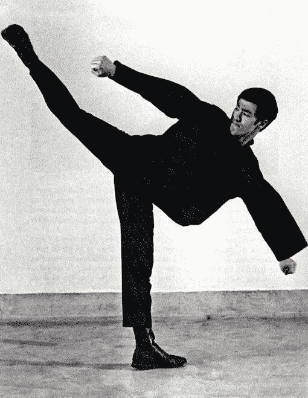
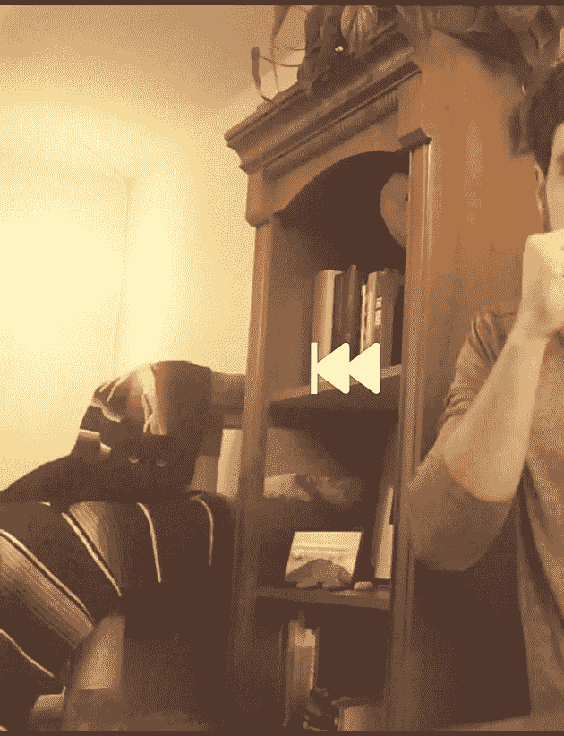
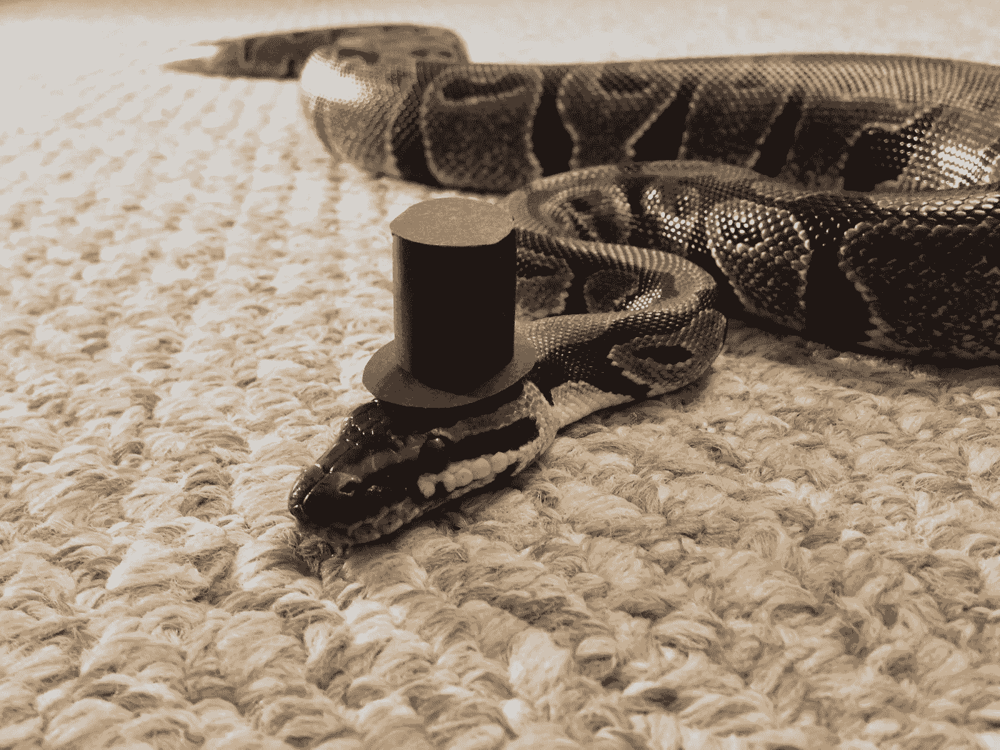
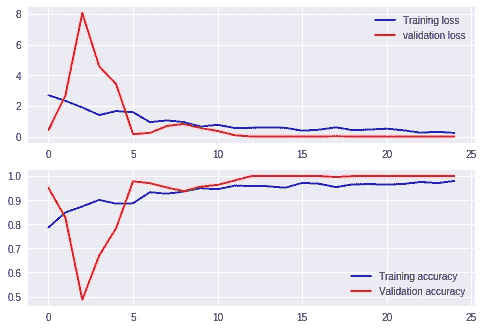
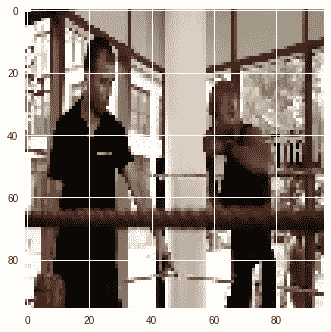
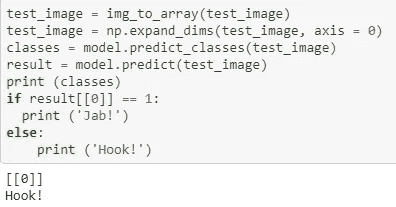

# 战斗行动预测者(又名 FAP)

> 原文：<https://towardsdatascience.com/fighting-actions-predictor-aka-fap-f1c9ce4c6d03?source=collection_archive---------20----------------------->

Be water, my friend

对于那些没有打过太多次仗的人来说，了解对手是至关重要的。如果你做得好，你几乎肯定会赢。但是如果你做错了，你可能会发现你在地上的速度比你打字的速度还快(“Hello World”)。

本文将介绍我用来创建卷积神经网络模型的方法，该模型可以检测战斗动作并在以后预测它们。
模型的输入是几个人挥拳的简短视频(这个简化的模型只使用了[刺拳](https://en.wikipedia.org/wiki/Jab)和左[钩拳](https://en.wikipedia.org/wiki/Hook_(boxing))，尽管可以很容易地添加更多的动作)。

# 1.采取的方法

首先，我必须收集一个视频数据集，其中包括我想要的武术动作(考虑到我必须为特定动作编辑每个视频，这并不太容易)。在花了相当多的时间在网上找到几个视频并对它们进行剪辑后，我选择从不同的角度拍摄自己的每个动作(别担心，我是专业的)。对于这个危险的任务，我用手机的摄像头记录下来，我女朋友的猫作为观众。如你所见，这只猫很享受。

A thrilled cat

# 2.使用 Python 的魔力来编辑视频

我用 Jupyter Notebook 给文件重新命名(给 Jab0，Jab1… Hook0…)，把它们放在相应的文件夹里，并把它们整理成框架。由于我的电脑没有我需要的那么快，我在建模项目的剩余部分使用了 Google Colab。

# 3.Google Colab

我安装了我的驱动器([没有双关语的意思](https://en.wikipedia.org/wiki/Mount_(grappling)))，并使用了谷歌的神话般的 GPU。然后，我采取了 CNN 通常的步骤——导入库，标记类，为训练/评估进行分割。、定义模型、创建生成器、设置一些参数(提前停止等。)，最后拟合模型。

我运行了 25 个时期的模型，并获得了以下结果。

Don’t you just love graphs?

# 4.预言；预测；预告

正如你所看到的，这个模型惊人的准确。

# 4.思想

最初我计划在这个数据集上使用 Inception V3 模型来节省一些时间。Inception V3 模型是一个非常好的图像识别模型，在 ImageNet 数据集上进行了训练。然而，在看到 25 个周期后的结果后，我意识到这可能有点过头了。

# 5.未来的改进

这个项目只是我今天早餐前做的一个有趣的活动。有很多方法可以改进它，增加它，并用它创造出真正奇妙的东西(或危险的东西)。

What would you do?

# 6.谢谢

感谢女友的猫对我的表现评价很大(一如既往)，鼓励我远离他珍贵的安息之地。还要感谢把猫借给我，鼓励我运动的女朋友。

完整的代码可以在我的 GitHub 上找到，还有许多其他适合全家人的有趣活动。

直到下一次，

山猫。