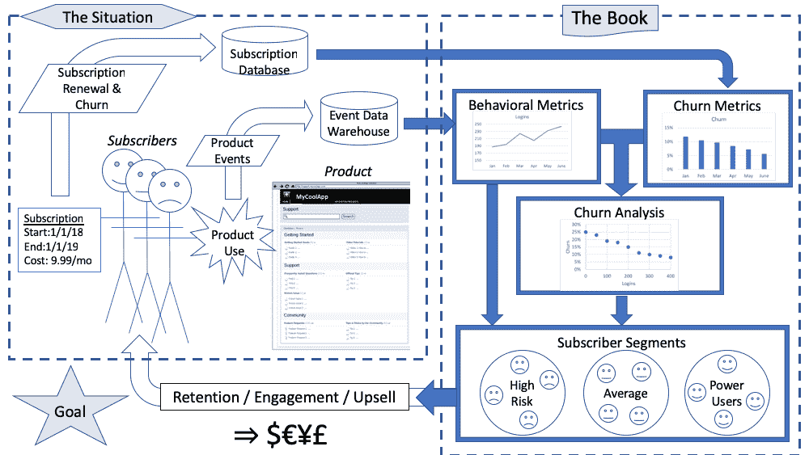
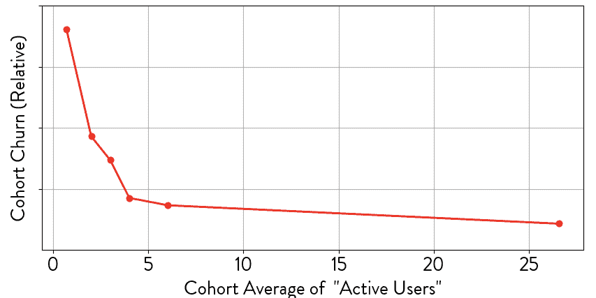
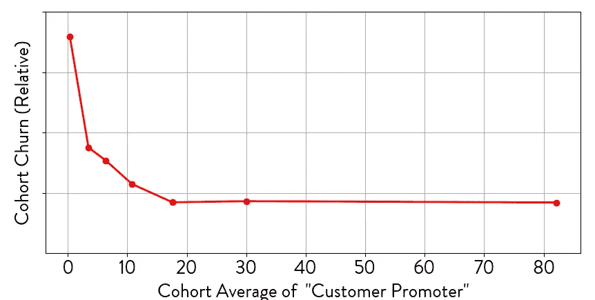
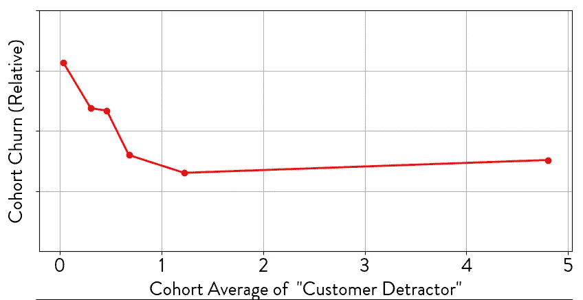
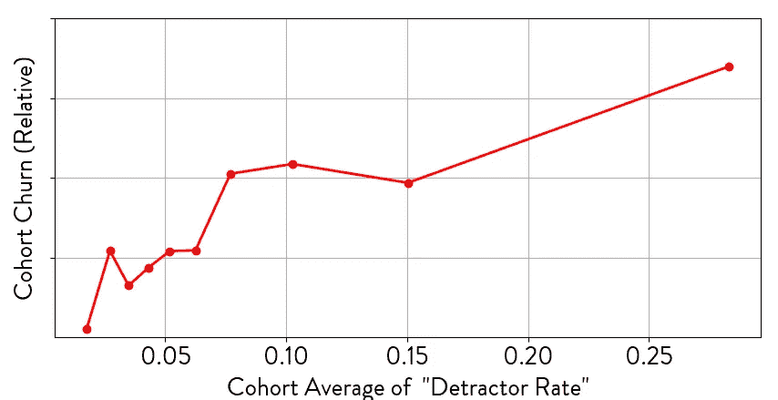
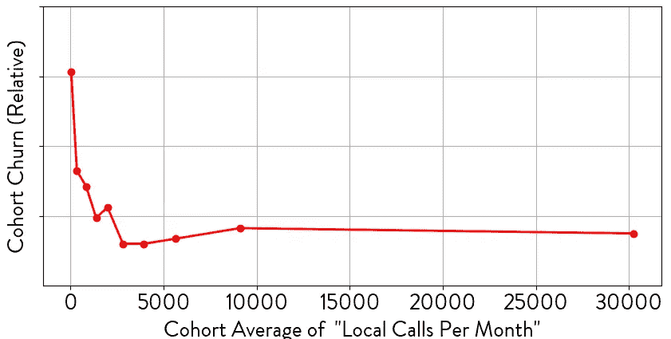
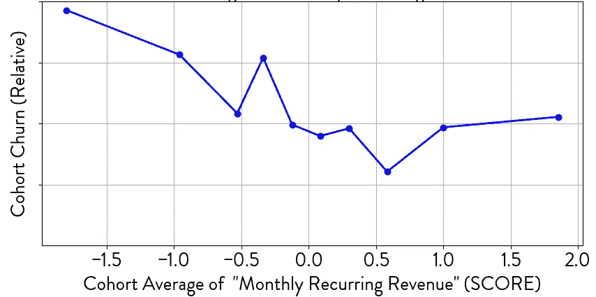
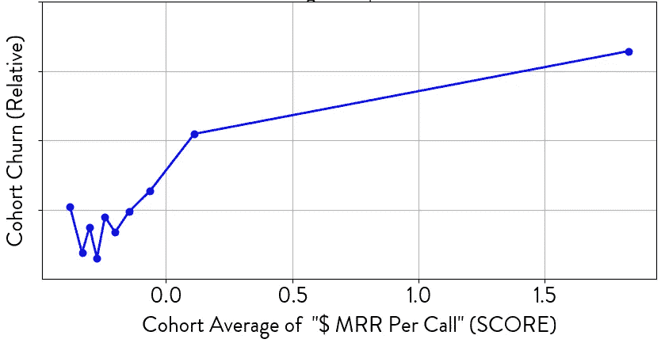

# 用数据应对客户流失

> 原文：<https://towardsdatascience.com/fighting-churn-with-data-5e0153f60228?source=collection_archive---------15----------------------->

## 到底是怎么做到的

## 用数据推动客户参与和保持

Fighting Churn With Data?

这篇文章是关于使用数据和分析技术减少客户流失，提高客户参与度和忠诚度的系列文章的第一篇。该系列基于我正在写的一本书的内容，书名也是[用数据对抗流失](https://www.manning.com/books/fighting-churn-with-data):我将从这本书中提取这些帖子的关键要点，并为这本书留下细节，包括代码。(如果你想了解更多细节，这本书已经在*[有了电子版](https://www.manning.com/books/fighting-churn-with-data)，完整的印刷手稿将于 2020 年初出版。本书完成部分的代码在 github 上有[。)](https://github.com/carl24k/fight-churn)*

# *1.什么是客户流失，你为什么反对它？*

*任何产品或服务的主要目标都是增长。当通过营销和销售增加新客户时，增长就会出现，但当客户离开时，增长就会抵消，甚至会导致收缩。对于提供此类服务的企业而言，客户退出服务被称为“流失”。大多数服务提供商专注于收购，但要取得成功，服务还必须努力减少流失。如果客户流失得不到解决，一项服务将无法发挥其全部潜力。*

*术语“流失”实际上起源于“流失率”:流失率是指在给定时期内离开的客户的比例，这将在下面更详细地讨论。这导致客户或用户群随着时间的推移而变化，这就是为什么术语“搅动”是有意义的:因为单词“搅动”最初的意思是“剧烈地移动”,就像搅动黄油一样。但在商业语境中，术语“客户流失”现在也用作动词:“客户正在流失”；“客户搅动了”；作为一个名词:“客户是一个客户流失者”。如果你更愿意看到半满的杯子，没有从某项服务中流失的客户也可以从积极的角度来看待。在这种情况下，人们谈论“客户保留”。*

*下面的草图总结了应对客户流失的典型情况:*

**

*Schematic of How Fighting Churn With Data Works*

*这些是关键组件:*

1.  *通常(但不一定)在订阅基础上提供的产品或服务*
2.  **与产品交互的订户(或用户)**
3.  *订户通常签订*订阅*以接收产品或服务。订阅通常(但不总是)会产生金钱成本。替代方案包括应用内购买和添加支持的产品。*
4.  *订阅可以终止或取消，称为流失。一些订阅必须定期更新，而另一些则只是持续到用户选择流失。*
5.  *订阅(或其他购买)的时间、价格和付款正在某种数据库中被捕获。*
6.  *当用户使用产品或服务或与之交互时，这些事件被跟踪并存储在数据仓库中。*

*考虑到这些因素，数据流失的应对方式通常是这样的:*

1.  *订阅数据用于识别客户流失和创建客户流失指标。流失率是流失率指标的一个例子。流失数据库还允许识别流失和更新的订户的例子以及他们这样做的确切时间，这些都是进一步分析所需要的。*
2.  *事件数据仓库用于创建总结与每个订户相关的事件的行为指标。行为度量是允许数据仓库中的事件被解释的关键步骤。*
3.  *已识别的流失和更新的行为指标在流失分析中一起使用。流失分析以严格的方式识别订户的哪些行为是更新的预测，哪些是流失的预测，并且可以为每个订户创建流失风险预测。*
4.  *基于他们的特征和风险，用户被分成组合了他们的风险水平、他们的行为和任何其他重要特征的组或段。这些细分的目的是针对他们进行干预，旨在最大限度地延长用户寿命和服务参与度。干预措施可以包括电子邮件营销、电话营销、培训和折扣。另一种类型的长期干预是对订阅产品或服务本身的改变，并且来自流失分析的信息对此也是有用的。*

# *2.为什么流失很难对抗*

*有那么难吗？如果你已经是一个数据科学家，你可能会看到这是怎么回事，并认为这应该是小菜一碟。嗯，有几件事让你变得与众不同。*

## *2.1 客户流失难以预测*

*即使使用最新的机器学习技术，客户流失也很难预测。如果你考虑一下自己上次取消订阅的行为，就很容易理解为什么预测客户流失很难:你可能很长时间没有充分利用订阅，但你花了这么长时间取消订阅，因为你太忙了，或者你花了一些时间研究替代方案，或者你只是忘记了。如果数据人员或分析系统在这段时间观察你的行为，它会将你标记为风险，并在你下定决心并找到时间取消计划的整个时间内都是错误的(从你没有流失的意义上来说)。变动的时刻是由太多无法预测的外部因素决定的。*

*更一般地说，对于那些希望减少客户流失的人来说，许多重要的方面通常是不可知的。考虑以下附加信息，如果您知道这些信息，它们将有助于预测客户流失，但您可能永远也不会知道:*

1.  *顾客的支付能力通常是未知的。同样，对于免费(feed 或广告支持)产品，用户在这类内容上花费的时间和注意力是未知的。*
2.  *与用户已经采用的任何替代解决方案(包括但不限于竞争产品)一样，到替代服务或实现相同目的的手段的转换成本也常常是未知的。)*
3.  *服务的效用或享受是一种基本的主观体验，因人而异，即使在完全相同的情况下也是如此。这对于消费者服务尤其重要，因为消费者服务的流失率很难预测。当决定更新或取消服务时，企业倾向于使用更合理的成本效益分析，但即使这样也会受到主观因素的影响。*

*如果你在一个项目中预测到了客户流失，并且发现很容易预测到很高的准确度，那么你可能预测客户流失太晚了，因为这是不可能停止的——我将在以后的文章中讨论这个问题。*

## *2.2 流失更难预防*

*准确预测客户流失很难，但防止客户流失更难。原因很简单:为了以长期可靠的方式防止客户流失，服务必须实际提高服务带来的收益，或者降低使用服务产生的成本。想一想，怎样才能让你不再重复使用你过去用过但现在不再使用的产品:更好的内容和功能会让你不再重复使用吗？也许吧。更低的价格会让你停止生产吗？也许吧。一个改进的用户界面怎么样——这会让你停止鼓捣吗？可能不会，除非用户界面一开始就很糟糕。来自该产品的更频繁的电子邮件和通知会让你停止搅拌吗？肯定不是！*

*因此，要减少用户流失，你确实需要增加用户获得的价值，但这比让人们首先注册一项服务要困难得多。因为这些人已经确切地知道服务是什么样的，所以通过营销或销售代表做出的承诺不太可能获得很大的吸引力。正如稍后将详细讨论的，可用的最佳选项之一是试图确保订户利用已经可用的服务的所有最佳方面，但是这有局限性。*

*作为数据人员，你可能需要“银弹”来减少流失，但坏消息是:*

*没有减少客户流失的灵丹妙药*

*当然，另一种选择是降低服务成本。但降低货币成本是付费服务的核心选择——收入流失或降价销售可能比完全和全部流失要好，但它仍然是流失。*

***警告**降价是对付流失的“钻石子弹”:它总是有效的，但你负担不起。*

# *3.如何应对客户流失*

## *3.1 防止客户流失是企业的工作*

*防止流失并不是数据人员的工作，或者至少不是数据人员一个人能够完成的。过去几年，人工智能和数据科学取得了显著进步，但在很大程度上，防止流失需要与客户或用户进行人性化接触。考虑以下能够真正减少流失的角色示例:*

1.  ***产品经理和工程师(针对软件)以及制作人、人才和其他内容创作者**(针对媒体)通过改变产品功能或内容来提高用户从服务中获得的价值或乐趣，从而减少客户流失。这是减少客户流失的最主要或最直接的方法。软件中的一个相关方法是试图增加“粘性”，这大致意味着通过提供难以复制或设计为难以转移的有价值的功能，修改产品以增加客户转向替代产品的转换成本。*
2.  ***营销人员**通过精心策划有效的大众传播，将用户引向最受欢迎的内容和特色，从而减少用户流失。这实际上更多的是一种营销教育功能，而不是销售功能:记住，用户已经有了访问权限，知道服务是什么样的，所以承诺不会有帮助。尽管如此，这一职能通常由市场营销人员承担，因为他们有能力打造有效的大众传播。*
3.  ***客户成功和支持代表**确保客户接受产品，并在他们无法接受时给予帮助，从而防止客户流失。客户支持是传统上帮助客户的部门，但客户成功在许多组织中是一个新的独立职能，其明确设计为比客户支持更主动。当客户寻求帮助时，客户支持会帮助客户，而客户成功会尝试监控客户，发现客户何时需要帮助，并在客户请求帮助之前*联系客户。“客户成功”还负责“接纳”客户或确保他们采取一切必要措施开始利用订阅。因此，如果有一个客户成功团队，它通常是数据人员每天最密切合作的团队。数据人员通常会帮助设计指标或模型，客户成功代表将使用这些指标或模型来检测陷入困境的客户。此外，当营销教育活动通常与客户成功紧密配合时，客户成功部门可能会为此设计内容，而营销的角色将只是使其看起来不错，并管理分发内容的电子邮件活动(等等)。**
4.  ***销售部门的客户经理**(如果有的话)可能是阻止客户流失的最后手段，假设这项服务有金钱成本的话。客户经理是实际上可以降低价格或更改订购条款的人，他们管理着客户降售更便宜版本的过程。在没有销售部门的付费消费者服务中，这一角色通常由拥有类似权限的高级客户支持代表承担。虽然我们将销售的角色描述为防止客户流失的“最后手段”，但在许多组织中，更主动的方法是首先“确定合适的销售规模”，这意味着更好地销售最适合客户的产品版本，而不是销售最昂贵的版本。这可能会损害每次销售对服务的短期收益，但如果处理得当，将会减少客户流失，并最终提高每个客户的平均终身价值。这也可能损害客户经理的销售佣金，因此可能需要调整销售补偿系统(这是一个复杂的主题，超出了本书的范围。).*

*这些角色因产品和组织的类型而异，我的描述只是概括。但关键是，最终减少客户流失取决于采取行动影响客户，而这些行动通常是由不同业务部门的专家采取的，而不是由争论数据的程序员采取的。*

*这些角色显然非常多样化，由于没有更好的术语，我将所有这些功能称为“业务”。这并不意味着数据人员不是公司的一部分，但数据人员通常对具体的业务成果(如收入)没有直接的责任，而其他角色的人通常有。从数据人的角度来看，“业务”是流失分析结果的最终用户。*

## *3.2 数据在支持业务中的作用*

*由于上面提到的所有因素，业务人员需要帮助他们对抗客户流失的是一套*简明的*事实或规则来理解客户参与。这些规则需要对业务具有可操作性，这意味着它们知道如何根据调查结果减少客户流失。这反过来要求你发现的事实是客户流失和参与的真正原因或驱动因素。这些事实通常表现为客户行为与流失或保留之间的关系。举个简单的例子，您可能会发现这样的业务规则:“每月使用(查看)功能 X 超过五次的客户流失率是每月使用不到两次的客户的一半”。像使用或查看某个特定功能的更多部分这样的事情可能看起来并不复杂，但是只要它是对数据的正确读取，它就真的很有用。企业的每个部分都可以不同地使用这样一个事实:产品创造者将知道 X 提供的价值，并改进它或使它更像它。营销部门可以设计一个活动来吸引用户使用该功能。当客户成功/支持人员与客户交谈时，他们可以询问客户是否正在使用该功能，如果没有，鼓励客户尝试一下。*

*这种类型的分析不是当今媒体和大学教育中最受关注的那种人工智能算法。这可能会让一些读者失望:为了减少流失，部署一个能够赢得数据科学预测竞赛的“人工智能”系统是不够的。如果你试图交付一个预测客户流失的分析，而没有用具体的规则来解释它，企业将不能容易地使用它，所以他们可能根本不会使用它。虽然有一些技术可以使黑盒机器学习模型更具可解释性，但我将向您展示，您可以通过更直接的方法得出更好的结论。*

*通过使用简单的方法，您可以真正地让业务人员成为调查过程的一部分，获取他们更多的领域专业知识，并给予他们对结果更大的信心和更好的解释能力。客户流失的预测模型可能是有用的，但是当预测是从数据团队到企业的调查和知识转移计划的自然延伸时，它们更有用。*

# *4.案例研究:重要的度量标准(对抗流失的武器)*

*在本节中，我将介绍*

## *4.1 Klipfolio 的活跃用户和许可证使用情况*

*[Klipfolio](https://www.klipfolio.com/) 是一款数据分析云应用，用于构建和共享实时业务仪表盘。这些指示板可以由多个用户创建，对于允许多个用户使用一个订阅的任何产品，一个通用指标是活动用户的数量。下图展示了 Klipfolio 客户每月活跃用户数量与客户流失之间的关系。*

**

*Behavioral Cohort Churn vs. Klipfolio’s Active Users*

*上图使用了一种称为行为群组的技术来显示行为和流失之间的关系。你将在下面和书中看到很多这样的图，并学习如何创建它们，现在我将简要解释它是如何工作的:给定一个客户池和一个行为指标，如每月活跃用户数，客户根据他们对该指标的测量被组织成群组。通常使用十个群组，因此第一个群组包含该指标下的 10%客户，第二个群组包含接下来的 10%，直到最后一个群组包含该指标下的前 10%客户。一旦群体形成，你就可以计算出每个群体中有百分之多少的顾客流失了。结果显示在类似上图的图中:图中的每个点对应于一个群组，该点的 x 值由群组中所有客户的指标平均值给出，该点的 y 值由群组中客户流失百分比(即流失率)给出。*

*关于群组图，我应该提到的另一件事是，它没有显示实际的流失率，只显示了群组之间的相对差异。这是因为流失率是一个非常重要的运营指标，在案例研究中揭示公司的真实流失率是不合适的。类似地，书中没有一个行为群组流失率图用 y 轴上的标签显示实际流失率。但是，行为群组图的底部总是被设置为零流失率，因此这些点与群组图底部的距离可用于比较*相对*流失率。例如，如果一个点与另一个点之间的距离是图底部的一半，这意味着该群组中的流失率是另一个点的一半。*

*转到流失群组图的细节，它显示最低群组每月有不到一个活跃用户(多个月的平均值),最高群组每月有超过 25 个活跃用户。每月活跃用户最少的群组的流失率大约是活跃用户最多的群组的 8 倍。同时，流失率的大部分差异发生在每月 1 到 5 个活跃用户之间。*

*虽然衡量活动用户的数量是应对客户流失的一个很好的指标，但下图显示了一个更好的指标:这是通过将活动用户的数量除以用户购买的座位数量计算出来的许可证利用率指标。许多 SaaS 产品是按“座位”销售的，这意味着允许的最大用户数(这称为许可座位数)。如果活动用户数除以许可的席位数，则得出的指标衡量客户对席位许可证的利用率百分比。*

**

*Behavioral Cohort Churn vs. Klipfolio’s License Utilization (active users per seat)*

*上图中的结果显示，许可证利用率是一个非常有效的应对客户流失的指标:许可证利用率最低的群组的平均利用率略高于零，而最高群组的许可证利用率约为 1.0。最低群组的流失率大约是最高群组的 7 倍，并且不同群组之间的流失率或多或少是连续变化的——与活跃用户群组数量的流失率相反，实际上不存在更高利用率不再产生影响的水平。这使得它比单独的活跃用户更有效地区分流失风险。正如后面的帖子和本书将进一步解释的那样，每月活跃用户的原因实际上合并了两个不同的与流失相关的潜在因素:向客户出售了多少座位，以及典型用户活跃的频率。利用率是衡量用户活跃度的指标，与售出的座位数量无关，通常对于根据客户参与度和流失风险对客户进行细分非常有用。*

## *4.2 广义的促进者和贬低者的数量和比率*

*[广义而言](https://broadly.com/)是一项在线服务，帮助中小型企业(SMB)管理他们的在线状态，包括评论。对 wide 的客户来说，一个非常重要的事件是该业务获得正面评价或推广的次数。下图显示了广泛客户每月的推广人数与客户流失之间的关系。(有关群组图的详细说明，请参见最后一节的开头。)在下图中，每月具有最少启动子的群组(平均略高于零个启动子)的流失率比具有最多启动子的群组高约 4 倍；流失的减少主要发生在每月 0 到 20 名推广人员之间。这是一个重要事件的明确关系，很容易理解为什么拥有更多在线推广人员的客户更有可能继续使用 Broadly service，因为收到积极的评论是客户使用 broad 的主要目标之一。*

**

*Behavioral Cohort Churn vs. Broadly’s Customer Promoters (per Month)*

*对 wide 的客户来说，与推广者数量相关的另一个重要事件是诋毁者的数量，或业务被负面评价的次数。下图显示了广泛客户每月的批评者数量与流失率之间的关系:每月批评者最少的群体(略高于零)的流失率比批评者最多的群体(平均每月不到 5 名批评者)高出约 2 倍；流失率的降低通常发生在每月 0 到 1 个批评者之间。*

*虽然这种关系看起来很像上面显示的客户促销员之间的关系，但这里是不是有点不对劲？获得负面评价是一件坏事，大概也不是 browide 的客户所期待的结果——那么为什么负面评价与客户流失减少有关呢？*

**

*Behavioral Cohort Churn vs. Broadly’s Customer Detractors (per Month)*

*为了理解为什么更多的坏事，如贬低者，可能与更少的客户流失有关，看看另一个更好的衡量标准会有所帮助:如果你用贬低者的数量除以评论的总数(推广者加贬低者)，那么结果就是贬低者的百分比，我称之为贬低率。下图显示了流失率和贬损率之间的关系——这可能更像是您预期的对客户不利的产品事件的关系:贬损率越高，流失率越高，而且非常显著。*

**

*Behavioral Cohort Churn vs. Broadly’s Detractor Rate*

*那么，为什么单从贬低者数量来看，贬低者越多越好，而从贬低率来看，贬低者越多越不好呢？答案是，中的*贬损者总数*实际上与中显示的推广者总数相关，因为总体上收到大量评论的客户很可能会收到更多的好评和差评，这仅仅是因为有大量的评论。因此，当你以简单的方式查看对批评者数量和流失之间关系的影响时，它合并了驱动该指标的两个潜在因素:有大量评论(这是好的)，以及有高比例的差评(这是坏的)。当单独分析差评的比例时，你会得到更有用的结果。*

## *4.3 Versature 的通话和每次通话成本指标*

*Versature 为企业提供电信服务。作为统一通信提供商，他们许多最重要的事件都是语音呼叫，其持续时间存储在与每个事件相关的字段中。下图显示了 Versature 客户拨打的语音电话数量与客户流失之间的关系。就本地通话而言，最低群组实际上没有通话，流失率比每月有数千次本地通话的客户群组高三倍左右。*

**

*Behavioral Cohort Churn vs. Versasture’s Local Calls*

*当试图理解客户流失时，重要的是不仅要考虑客户使用服务的数量，还要考虑他们支付的费用。每月经常性收入(MRR)是计算客户为使用订阅服务而支付的金额的标准指标:它是客户每月为使用服务而支付的总额，但不包括任何安装费或不定期费用。(我在书中更多地谈到了 MRR 以及如何计算它。)也可以使用行为群组方法分析客户支付的金额，以寻找与流失的关系，如下所示。*

**

*Behavioral Cohort Churn vs. Versature’s Customers Monthly Recurring Revenue (Score)*

*下面的行为群组图做了一些新的事情:它没有直接显示群组的平均 MRR，而是显示了每个 MRR 测量值被转换为*分数*后的平均 MRR。如果你熟悉“曲线分级”的概念，那么度量分数也是同样的概念:度量从一种尺度转换到另一种尺度，但顺序保持不变。因此，如果将指标转换为分数，某个特定群组(如指标中倒数 10%的群组)仍然是同一组客户，并且该群组具有完全相同的流失率。这意味着将指标转换为分数只会影响群组沿群组图横轴的分布，而不会影响点的垂直位置，即流失率。当水平访问上的重新缩放使结果更容易理解时，指标被转换成分数。我在书中更多地说了度量分数以及如何计算它们。*

*群组流失率表明，MRR 也与流失率相关，尽管没有打电话那么强烈:不同群组中的流失率并不完全一致，最低群组流失率仅比最高流失率群组少大约一半或三分之一。但这是另一个例子，它让你停下来想想它在说什么:支付更多的人流失更少。这是你所期望的吗？这可能令人惊讶，但实际上很常见，尤其是在商业产品中。这是因为大客户的商业产品售价更高，而大客户流失更少的原因有很多:他们有更多的员工，所以当涉及到打电话或使用软件等产品使用时，为产品支付更多费用的客户通常也使用得更多。因此，支付较高 MRR 的客户流失率较低，实际上与上面显示的通话次数较多的客户流失率较低有关。*

*但是，我们可以从另一个角度来看客户支付金额与客户流失的关系:MRR 指标除以每月通话次数。这将产生一个指标，即客户每次通话的成本。我称之为“价值衡量”，因为它解释了顾客花了多少钱得到了多少服务。就像 MRR 的数字一样，每次通话的成本数字显示的是群组平均得分，而不是美元。每次通话成本的行为群组流失率图显示，当根据所消费的服务量来衡量付费时，付费更多的客户确实会流失更多。每次通话成本最高的群组的流失率比每次通话成本最低的群组高 6 倍左右。像这样的价值衡量标准是理解客户流失原因的重要武器，也是将在后面章节中全面探讨的重要主题。*

**

*Behavioral Cohort Churn vs. Versature’s Customers Cost per Call*

# *5.未来的战斗*

*这个系列将不同于许多关于数据科学的文章，因为我不会告诉你你需要一些闪亮的新技术或复杂的算法。相反，我强调使用你的大脑(通过科学方法)和以下领域:*

1.  *全栈分析:从原始数据开始，经过特性工程和分析，一直到向企业解释结果。*
2.  *度量设计也称为“特征工程”受到关注，因为这些是成功的最重要的活动*
3.  *节俭和敏捷:正确地做，快速地做，因为你将不得不一遍又一遍地做*
4.  *可解释性和沟通:如果你不能向人类解释，客户流失就是一个失败的领域(我会在下面解释原因……)*