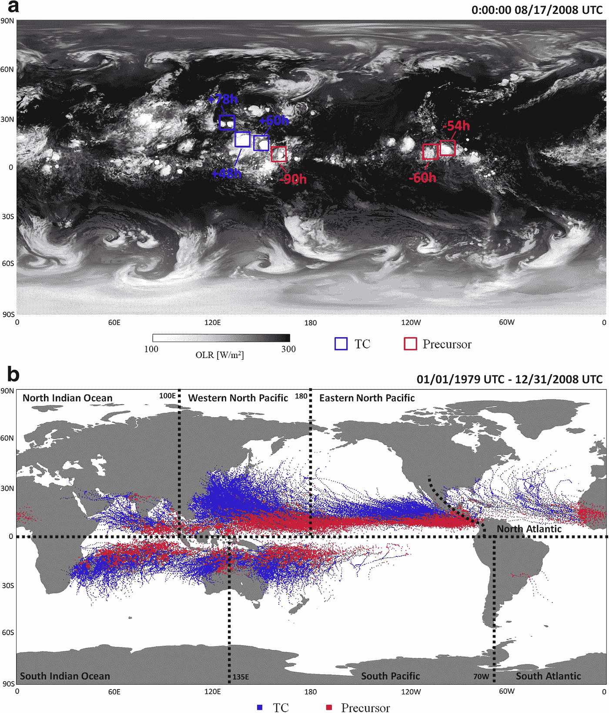

# 对抗气候危机:深度学习使 6 个未来游戏规则改变者成为可能

> 原文：<https://towardsdatascience.com/fighting-the-climate-crisis-5-future-gamechangers-made-possible-by-deep-learning-f301f29f632c?source=collection_archive---------20----------------------->

Figure 1: A Deep Learning algorithm predicts, localizes, and simulates tropical cyclones and their precursors [1].

想象你自己在一个关键的、高风险的气候研究和发展部门/工业综合体中，忍受着详尽的分析，只找到大环境数据中的几个趋势。你的气候研究部门负责每天完成数千个最新观察到的趋势和预测。因此，你和你的部门处理数百万个数据点，等待下一个“重大突破”的发现和结果。更重要的是，你要明白，收集、预处理和利用这些趋势对于预测来年的下一次自然灾害、干旱、飓风或高强度气旋是至关重要的。在过道的另一边，您的研究同事正在使用一种经典的、处理速度缓慢的化学发现算法，来潜在地锁定和优化最可持续和最节能的太阳能燃料分子。你突然意识到——你和你的同事正试图使用经典、传统的数据科学方法来揭示数十亿种环境数据的排列。

气候 R&D 设施的呆滞记录遵循现场实地测试和卫星数据可视化的习惯路线。按照惯例，气候科学家手动处理和分析卫星和野外数据库，以识别/预测离散的天气模式和现象。通过对这些数据的逐步逐块大规模解释，工程师和科学家有了有用的全球气候信息。在发现可持续能源的环境工程和材料科学领域，工程师必须在初始阶段考虑成百上千的现有能源材料。相比之下，**深度学习(DL)提供了一个以监督、半监督和非监督的方式从气候数据中分析和推断关键模式的机会。**从新的太阳能燃料分子的发现到更好的能源管理，机器学习有能力解释和重建大量数据，以便更好地可视化、预测和解决正在出现的气候危机。

# 1.新型节能材料的发现

在某些方面，我们可以将高度优化的分子能量结构的搜索与深度学习和**药物发现**的持续发展进行比较。更具体地说，强化学习(RL)、生成/预测网络和递归神经网络(RNN)的使用可以作为基于属性的化学设计的垫脚石。结合起来，RNNs 和生成模型能够制造新颖的文本副本，同时仍然保留周围角色的上下文。以长短期记忆(LSTM)网络的文本生成为例，这是一种 RNN，可以解析顺序数据，将数据存储在存储单元中，并学习在数据序列中传输数据。进一步，我们可以看一下文本生成的类比

Figure 2: Sentence Generation via predictions by an LSTM network.

LSTM 网络可以使用示例输入句子，并提取上下文中的单词种子，以提供下一个预测单词。这种句子的递归和连续生成只有通过首先向网络输入上下文中可理解的和结构化的句子才是可能的。网络能够将单词的种子序列存储到其存储器状态中，以提供下一个预测单词的预测，直到短语结束。现在，考虑到这一点，用一个包含数百万节能化学配方的数据库来取代这个包含数百万个句子的数据集。在药物发现中，这种类似的“完成句子”的方法被用于完成化学式的下一个字符。这种中央堆叠 RNN 可以由数百层构成，更重要的是，它包括一个强化学习(RL)网络，该网络基于结果预测优化对架构进行奖励和折扣。

Figure 3: RNN sequence prediction and optimization of drug SMILES, finally converted into molecular structures.

合成的节能复合物，如太阳能燃料中发现的那些，在所用化合物的配方中具有特定的物理和化学性质。理论上，研究人员将能够优化和放大，例如，在可持续能源中发现的光电化学电池或太阳能电池的特性。通过定位和表达这些离散的化学属性，研究人员可以将高效材料的搜索和验证范围缩小十倍以上。

# 2.自然灾害预测

Figure 4: Comparison of Acoustical data and Time to Failure in Kaggle’s 2019 Earthquake prediction challenge

另一方面，通过对大数据的预测和解释，防止自然灾害的间接和破坏性影响至关重要。事实证明，预测股票走势的相同预测算法也有可能预测地震活动、飓风前兆等。预测和预报高强度飓风、气旋和地震可以节省数十亿美元的经济成本，并保护分散在高风险地区的不发达地区的生计。大气气象数据的非线性和异常性造成了一种不稳定的局面，弱势群体中的科学家不知道会发生什么。然而，Sheila Alemany 等人题为**“使用递归神经网络预测飓风轨迹”**的研究论文利用完全连接的 RNN 来模拟飓风行为。作者基本上使用 RNN 自动回归和预测潜在飓风影响的轨迹和方向路线。以下轨迹揭示了模型预测的网格位置:

预测的 RNN 轨迹和验证轨迹之间的地面事实比较强调了深度学习的潜力，特别是完全连接的 RNNs-它们有能力根据之前训练的记忆状态预测数据中的输入序列。理论上，气候科学家可以将先前存在的气候数据专门化并扩展到更强大的存储库中，以巩固一个考虑到全球发生的自然灾害的模型。通过优化自然灾害预测的 rnn，人们可以在天气现象影响他们所在地区的几小时甚至几天前得到警告。此外，下一个序列的相同 RNN 预测可以用于从地震预测地震活动。

# 3.可扩展的农业设计和监测

Figure 6: Segmentation and highlighting of crop regions to predict their respective yields.

通过利用可追溯到 20 世纪晚期的实时哨兵卫星图像数据集，可训练模型可以部署到超精确水平上监测作物条件和特征。尽管已经实施了传统的作物监测方法，但卷积神经网络(CNNs 计算机视觉的使用可以分割负面的作物结果、干旱或破坏。更重要的是，一种称为“类别激活映射”(CAM)的方法可以用来监控给定田地中作物状态的强度，这种方法使用高度集中的特征对图像区域进行热图绘制。下面演示了航空影像上的类激活映射示例。网络的全局平均池层可防止过度拟合，并允许将多种图像输入尺寸输入到模型中，它采用每个传入特征地图的平均值，以给出网络聚焦位置的“某种”热图样式的可视化:

Figure 7: A Global Averaged neural network reveals localized “areas of trouble” on aerial satellite imagery

# **4。森林砍伐模式的空中追踪**

Figure 8: Detection and Segmentation of Deforestation Patterns

森林砍伐占全球温室气体排放的近 10%,然而，人工追踪的古老方式可以被部署的计算机视觉应用程序所取代。最近的经济开发和森林砍伐的增加造成了一个关键的跷跷板，在这个过程中，一些地区的土地被置换、再利用或彻底毁坏。归根结底，森林砍伐是一个大规模的成本效益问题，需要自动化系统的密切监控。由于公共/私人毁林过程涉及多个部门和行业，计算机视觉可以被用来通过地面传感器和实时航空图像了解树木覆盖的损失，所有这些都在一个不断的反馈回路中相互连接。此外，可以利用机器学习来检测链锯的声音，以自动向当地执法部门发出非法砍伐森林活动的警报。通过实施分割算法(例如 [UNET](https://arxiv.org/abs/1505.04597) )，甚至可能是实时对象检测技术，可以实时检测森林砍伐区域的裸露斑块，并且可以通过算法按比例计算消除的森林面积。

# **5。创建更高效的基础设施**

自从注入工业冷却、加热、通风、照明和电气维护的基础设施出现以来，由于对周围环境的不适当响应/敏感性，建筑物已经使用了过量的能量。换句话说，建筑中的物联网系统无法有效应对外部气候波动，从而相应地调整其能耗。通过使用天气预报、环境因素和一般建筑占用的聚合，机器学习-物联网主干可用于调整室内建筑温度，并进一步与电网通信以减少广泛的电力消耗，这取决于在给定时间低碳电力供应是否稀缺。理论上，建筑物可以使用 RNN 预测，并创建一个反馈回路，对 RNN 算法预测的阈值做出响应。一旦预测超过特定的敏感度阈值，建筑物就可以相应地调节其温度和能源效率，从而减少对电网的电力依赖。

Figure 9: Predictive/Analytical features of A.I. in Power Systems

# 6.可视化区域气候变化的影响

Figure 10: A Cycle-Consistent Style-Transfer GAN predicts Streetview images before and after extreme weather events.

传统的气候预测模型通常使用可量化的严重程度和轨迹来了解天气模式的风险。然而，对于土地所有者和公众来说，想象极端天气事件的后果可能很难理解或者难以理解。仅仅看图表上的轨迹和数字并不能告诉普通人潜在损害的程度。可视化预计的财产损失可以为房主、保险公司和城市承包商提供在高风险地区做好准备的更好的概念。Schmidt 等人的题为[“使用周期一致的对抗网络可视化气候变化的后果”](https://arxiv.org/abs/1905.03709)的研究论文利用周期一致的生成对抗网络(CycleGANs)在遭受破坏的房屋和正常的街景房屋之间转移风格，以预测极端天气的表面后果。

生成对抗网络(GANs)是一种特殊的生成模型，它使用对抗过程来匹配输出结果和输入分布。粗略地说，这个网络由两个竞争的极小极大模型组成——生成器和鉴别器。生产者可以被认为是一个欺诈性的伪造者，生产训练数据的虚假副本，而鉴别者是“执法人员”，识别和承认这些数据的虚假模仿。最终，鉴别器使用与发生器反向相关的损失函数。因此，如果鉴别器变得善于区分这些错误的分布副本，生成器就会自我改进。下图描述了 GAN 模型。

Figure 11: General Schematic of a GAN distinguishing the distribution probability of A (fake, generated) vs B (real).

在研究论文中，Schmidt 等人更进了一步——他们实施了周期一致损失/方法。循环一致性通过映射分布 A 和 B 来实现。如研究论文中所述，分布 A 可以是正常房屋的数据输入，而 B 被定义为毁坏的属性。通过**领域适应**(两个数据集之间特征的映射和连接)，生成器学习如何将风格从一个被破坏的房子对抗性地转移到一个正常的房子。这种周期一致的风格转换过程可以帮助想象一个正常的房子如何承受极端天气模式的后果的高分辨率图像。下面的示意图是从最初的 CycleGan 论文中提取的，该论文的标题为“[使用循环一致的对抗网络](https://arxiv.org/pdf/1703.10593.pdf)进行不成对的图像到图像的翻译”，该论文描述了映射函数和对抗鉴别器之间的映射函数。

Figure 11: Schematic of associated mapping functions and adversarial discriminators in a CycleGAN

# **结论**

随着气候科学家在气候变化的环境中以更大的分析“马力”和更紧迫的条件前进，深度学习在大环境数据的监督-非监督操纵和解释中的出现是一个关键因素。从表面上看，气候变化是一种复杂且相互依存的过渡力量，它会根据农业、工业使用和能源效率水平等因素影响几代人。变化的环境不是一个具有连续变量的统一系统，而是一个具有不同变量以不同速率变化的无序系统。通过在高能材料创造、自然灾害预测、农业和森林砍伐监测以及基础设施物联网电力系统等用例中利用深度学习，效率的前沿可以在未来十年得到优化。

# 文献学

Alemany，S. (2018 年)。用递归神经网络预测飓风轨迹。 *Arxiv，*1–8。检索于 2019 年 6 月 30 日，来自 https://arxiv.org/pdf/1802.02548.pdf.

Cho，R. (2019)。人工智能——气候变化和环境的游戏规则改变者。检索自[https://blogs . ei . Columbia . edu/2018/06/05/人工智能-气候-环境/](https://blogs.ei.columbia.edu/2018/06/05/artificial-intelligence-climate-environment/)

郝，k .(2019 . 6 . 20)。以下是人工智能帮助对抗气候变化的 10 种方式。检索于 2019 年 6 月 30 日，来自[https://www . technology review . com/s/613838/ai-climate-change-machine-learning/](https://www.technologyreview.com/s/613838/ai-climate-change-machine-learning/)

恩迪库马纳，E. (2018)。使用法国 Camargue 的多时相 SAR Sentinel-1 进行农业分类的深度循环神经网络。*遥感，*1–16。检索时间 2019 年 6 月 30 日。

鲁斯托维茨河(未注明日期)。多时相卫星图像的作物分类。*斯坦福*。检索自[http://cs 229 . Stanford . edu/proj 2017/final-reports/5243811 . pdf](http://cs229.stanford.edu/proj2017/final-reports/5243811.pdf)

张，x(未注明)。通过深度学习方法用地震台网络定位地震。*语义学者，*1–14。检索时间 2019 年 6 月 30 日。