# 用数据科学的方法计算出一辆二手车的合理价格

> 原文：<https://towardsdatascience.com/figuring-out-a-fair-price-of-a-used-car-in-a-data-science-way-11450b3b252b?source=collection_archive---------6----------------------->

## 使用 DS 方法计算二手车合理价格的整个过程。


## 介绍

计算二手车价格的一般方法是什么？你搜索类似的车辆，估计大致的基线价格，然后根据当前的里程、颜色、选择数量等进行微调。你使用领域知识和当前市场状态分析。

如果你深入了解，你可能会考虑在该国平均价格较高的不同地区销售该车。你甚至可以调查汽车在目录中列了多长时间，并检测定价过高的样品，以做出更明智的决定。

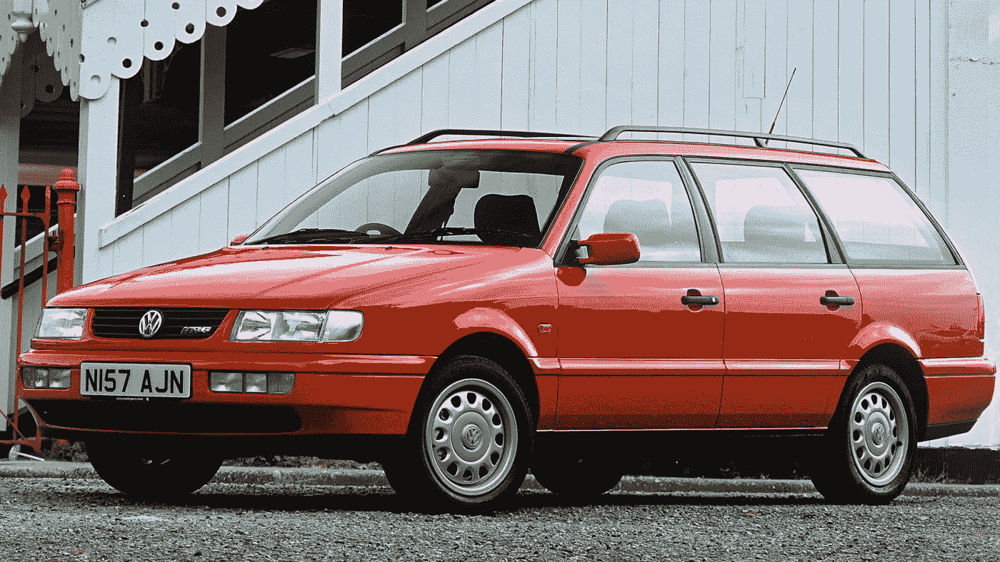

Original ad of late 1990s VW Passat estate in “**Rosso corsa**” color, which turned out to be the “average car” in Belarus according to dataset statistics

所以有很多要思考的，我在这里面对的问题是“*有没有可能使用数据科学的方法(收集和清理数据，训练 ML 模型等。)能在痛苦的决策过程中节省你的时间和脑力？*

我打开笔记本电脑，创建了一个新项目，并打开了计时器。

## 第一阶段。收集数据

不涉及太多细节:我已经设法在两天内收集了一个[数据集](https://www.kaggle.com/lepchenkov/usedcarscatalog)，包含大约 40，000 个汽车广告，有 35 个特征(大部分是分类的)。收集数据本身并不太难，但是以一种有组织的方式来组织它需要一点时间。我用过 Python，Requests，Pandas，NumPy，SciPy 等。

关于这个特定数据集有趣的是，大多数分类特征没有以任何方式编码，因此可以很容易地解释(如*engine _ fuel =*“diesel”)。

## 第二阶段。着眼大局，处理不良数据

最初的数据分析很快发现了可疑的样本，包括 800 万公里里程表状态、10 升引擎掀背车、600 美元的混合柴油汽车等。我花了大约 6 个小时编写脚本来检测和处理这些问题。

可视化数据(我已经使用了 MatPlotlib 和 [Seaborn](https://seaborn.pydata.org/) )让我对整个市场形势有了很好的认识。

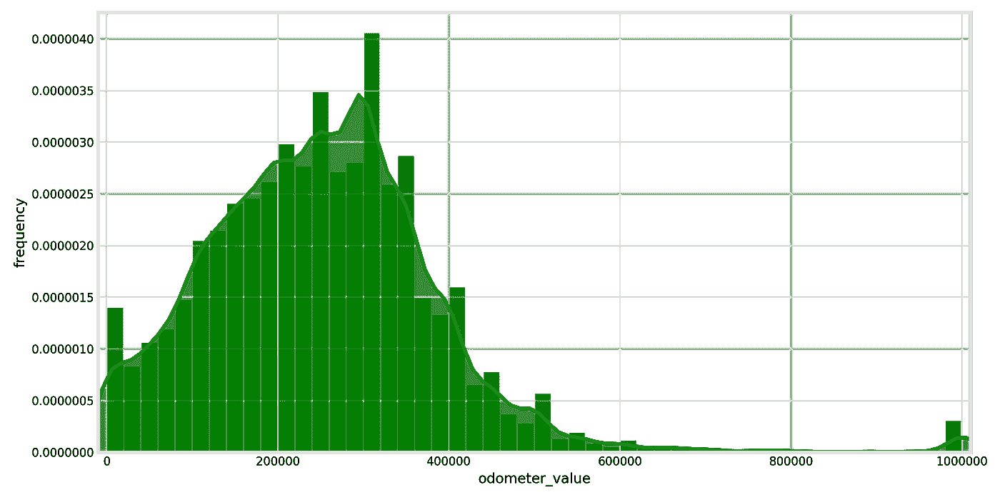

Odometer_value distribution (it is a distance traveled by a vehicle in kilometers)

大多数汽车都被频繁使用，平均里程数为 250，000 公里，这是一个很大的数字！我还注意到，人们更喜欢给里程表值分配一个好听的数字，比如 250，000 公里、300，000 公里、350，000 公里等等。一堆车有一百万公里*里程表 _ 数值*如果你看数值分布就没什么意义了。我可能认为 100 万公里更像是一种说法“这辆车见过很多，我真的不知道它的确切公里数。”

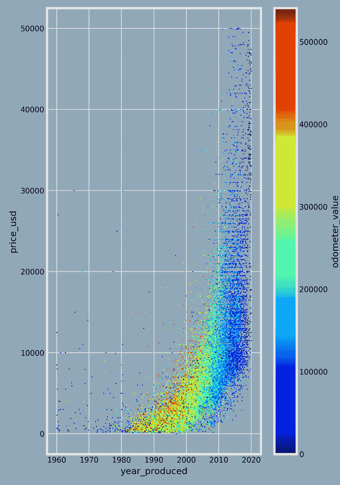

汽车定价背后的总体趋势非常直观:车越旧，价格越低。我希望车的年龄是整体特征层次中的第一特征。

此外，一般来说，车越老，里程表值越高，这是合理的。

为了构建*价格 _ 美元*散点图，我将最高汽车价格限制在大约 50，000 美元，并移除了几个百万级别的公里数*里程表 _ 价值*异常值。

实际上，价格低于 50，000 美元的汽车占目录的 99.9 %，因此散点图可以很好地反映价格趋势。

关于车龄:大部分车已经使用了一段时间，平均*年 _ 产*值为 2002。我认为，生产年份的分布(如下图所示)受从国外进口汽车的关税政策影响很大。

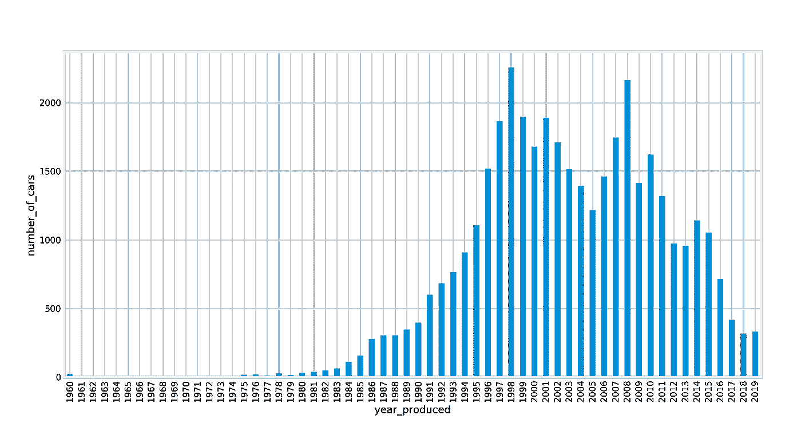

Distribution of the cars in the catalog by their production year.

价格分布( *price_usd* 将是模型训练期间该项目的目标值)高度向右倾斜，相应的平均价格和中间价格分别为 7，275 美元和 4，900 美元。

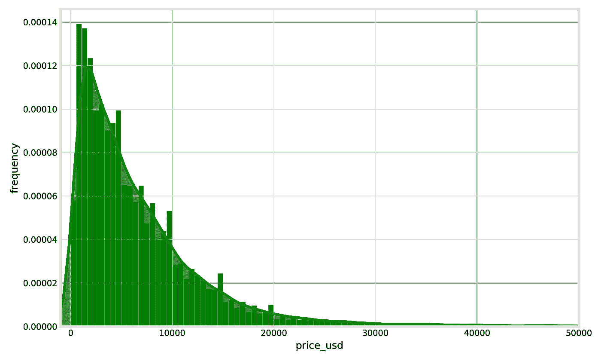

price distribution

像 *up_counter* (广告被手动推广的次数)这样的一些功能根本不能反映汽车的参数，但是既然这个数据已经有了，我决定把它包含到项目中。这种分布是如此的偏斜，以至于正确绘制的唯一方法就是使用对数标度。

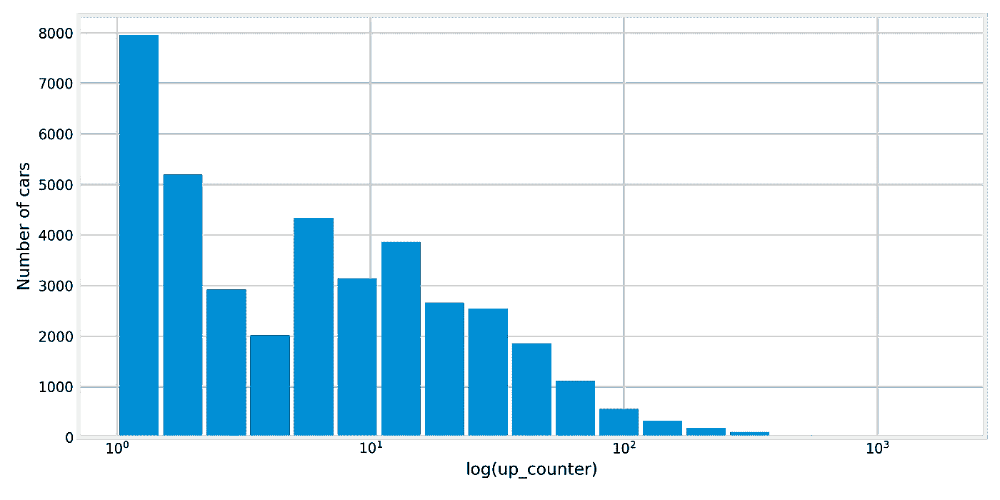

distribution of up_counter metric

品牌受欢迎程度的分布对我来说并不意外，目录中最受欢迎的车型是大众帕萨特，白俄罗斯交通工具的传奇来源。

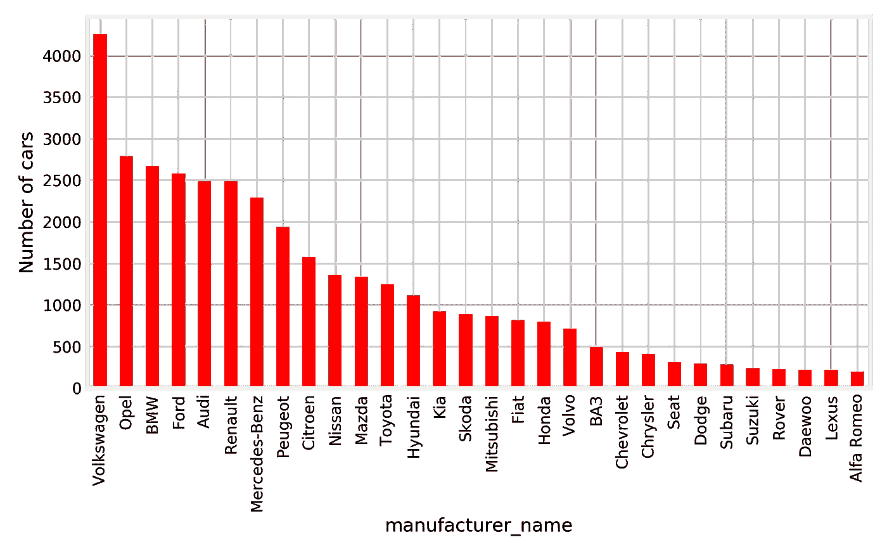

我还使用了 [Tableau](https://www.tableau.com/) 来更好地显示制造商的市场份额和每个品牌的平均价格。

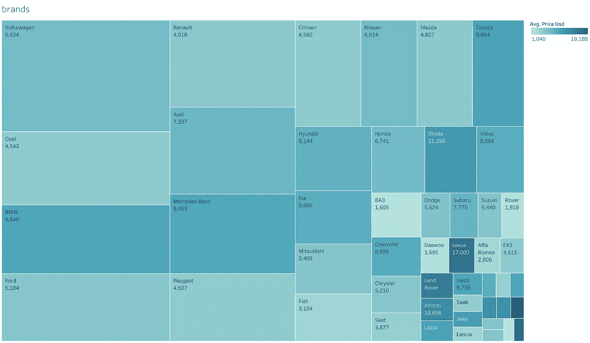

汽车拥有的*照片数量*的分布形状类似于*价格 _ 美元*分布(分布向右倾斜)。

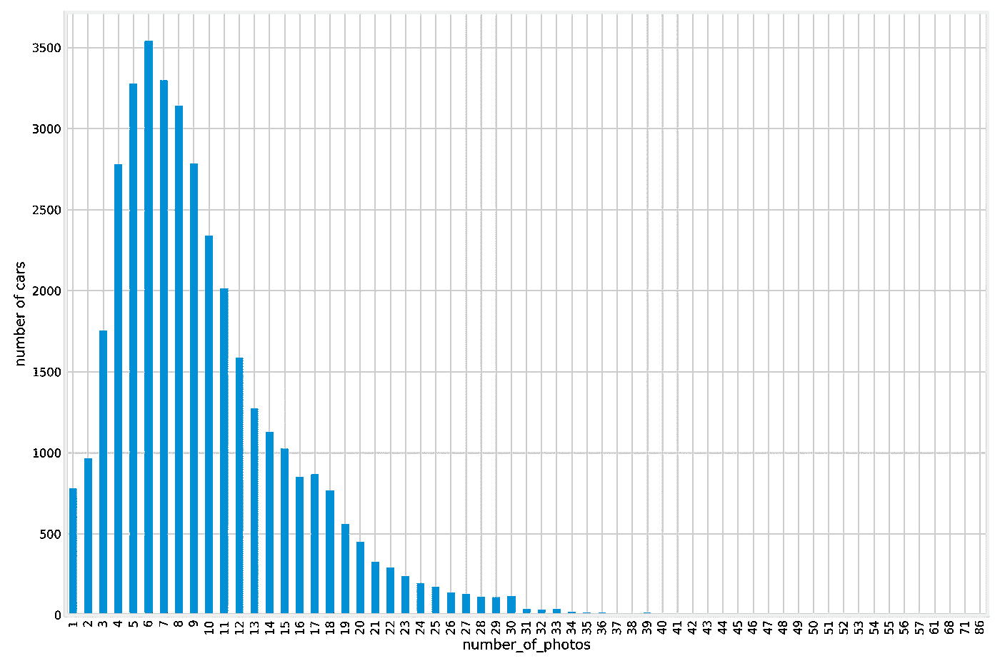

Distribution of number of photos that listed cars have

也许汽车的价格越高，照片的数量就越多？

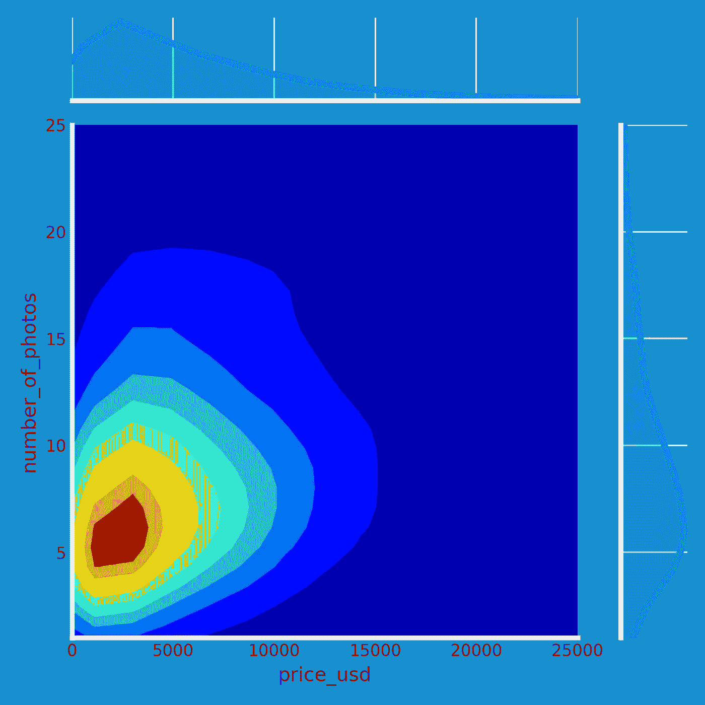

我做了一个联合图，它显示了轻微的相关性，但更重要的是，它清楚地表明，大多数汽车都很便宜，照片少于 15 张。

一些功能，如*传动系统*只是有趣的探索。在下面的柱状图中，你可以看到后轮驱动汽车的比例在过去 30 年中是如何下降的。

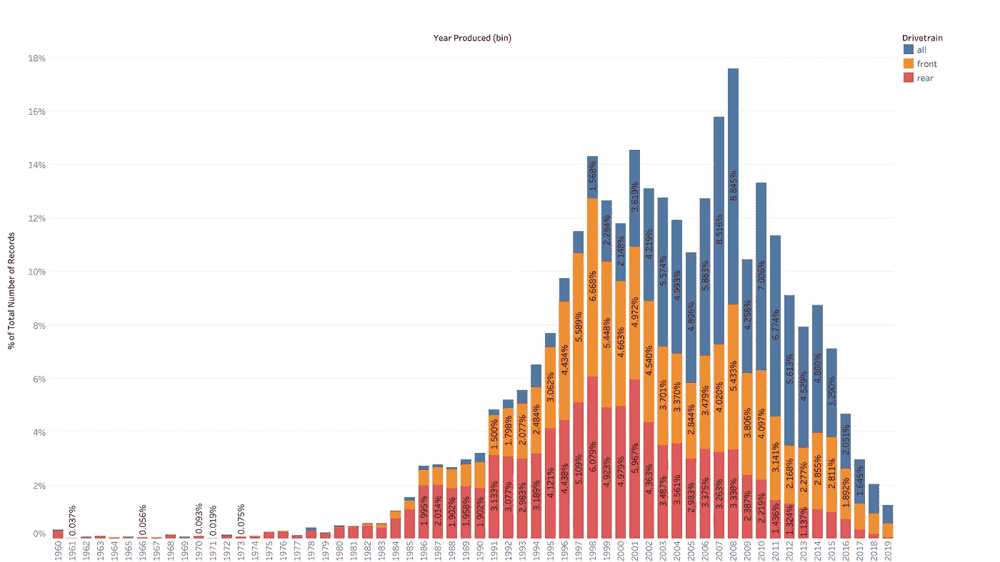

Histogram that illustrates the migration from rear-wheel drive to front- and all- wheel drive over the past years

数据集的整个相关矩阵如下所示(数据集中的大多数特征都是不言自明的，除了*feature _ 0*…*feature _ 9*:这些是布尔列，表示汽车具有合金车轮、空调等特征。)

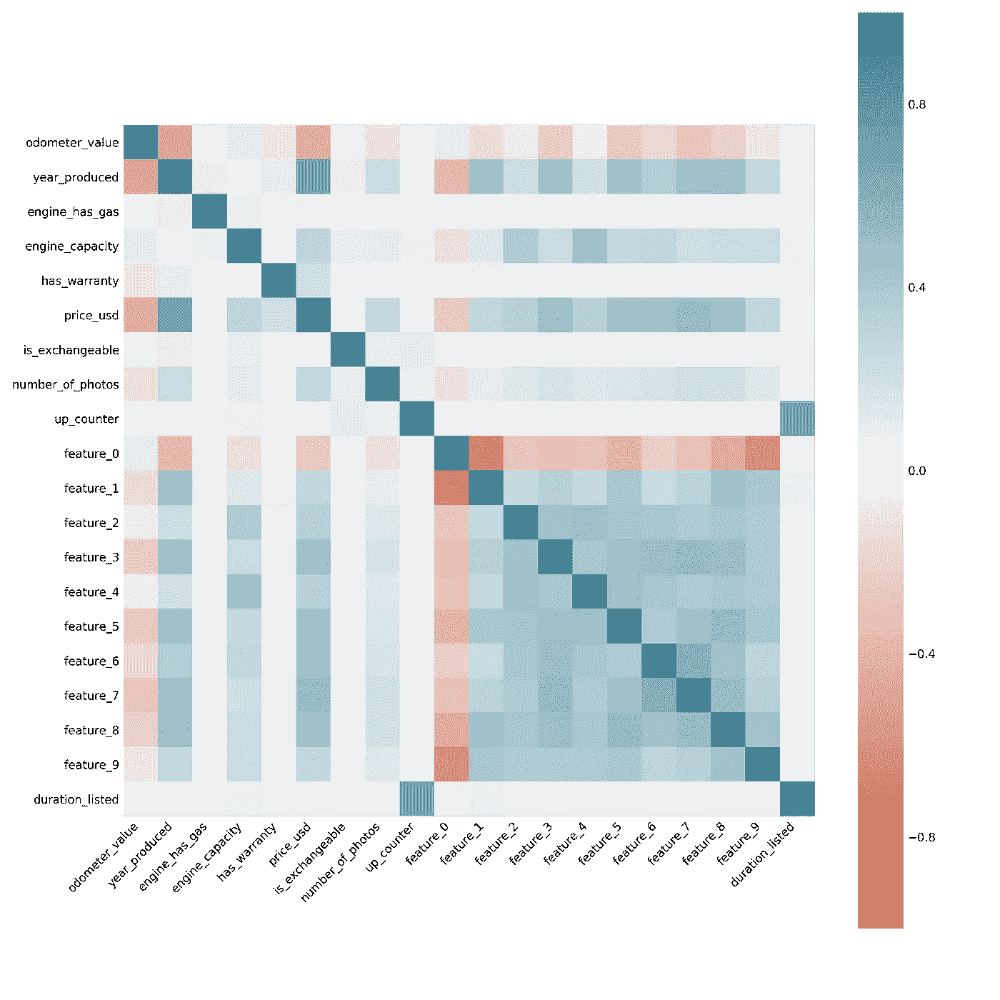

Correlation matrix for the whole dataset

我不打算在这里发表完整的探索性分析，你可以在[内核](https://www.kaggle.com/lepchenkov/exploratory-notebook)中查看。我花了大约 6 个小时(我还需要 60 个小时来修复数据集中有问题的样本)来挖掘数据和工程特征，直到那时我才进入模型训练。

## 第三阶段。模特培训

由于我已经清理了数据集，并应用了一些未来机器学习的特征工程，因此构建和训练基线模型轻而易举。

为了以最少的努力获得最大的结果，我使用了[](https://catboost.ai/)****(Yandex 开发并开源的具有全面分类特征支持的决策树库上的梯度提升)。我已经在这个项目上花了太多时间，所以我只是将数据扔进模型中，调整学习率、树深度和系综中的数量树，训练几个模型，并开始用 [SHAP](https://shap.readthedocs.io/en/latest/) (由斯科特·伦德伯格等人开发)探索模型决策。总时间:4 小时。****

> ****有趣的事实:在最初的预测探索阶段，我对模型的性能感到失望，开始探索错误，并发现我的数据集中的价格列被错误地解析，一些价格使用美元货币，一些价格使用白俄罗斯的国家货币:BYN。我已经修复了解析器的代码，再次收集数据，然后运行清理、特征工程和分析工作，并开始训练模型，结果好得多。****

****为了训练和评估第一个模型，我过滤掉了价格超过 30，000 美元的汽车(在探索阶段，我发现这些样本需要一个单独的模型)。****

## ****第四阶段。模型评估****

****我没有时间和计算资源来运行适当的网格搜索和顺序特征选择(SFS)作业，所以我只是调整了几次树的数量和学习速率，并使用 5 重交叉验证来评估模型的性能(检查完整的[内核](https://www.kaggle.com/lepchenkov/catboost-model-with-shap-values))。****

****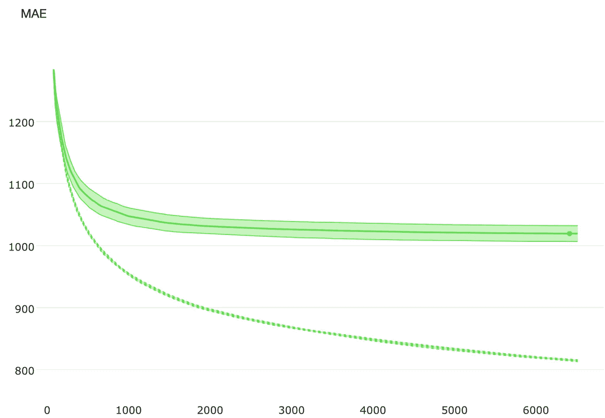****

****Plot illustrates model training: number of trees on X-axis and MAE $ on the Y-axis****

****第一个像样的 CatBoost 模型让我达到了大约 1000 美元(平均绝对误差)，这是 *price_usd* target 平均值的 15 %。准确地说，得分是:****

```
**Best validation MAE score: $1019.18 on iteration 6413 with std $12.84**
```

****我还使用 early_stopping 参数在验证分数停止变好时跳过进一步的训练。在没有试图以任何方式改进模型的情况下，我进入了预测分析。****

****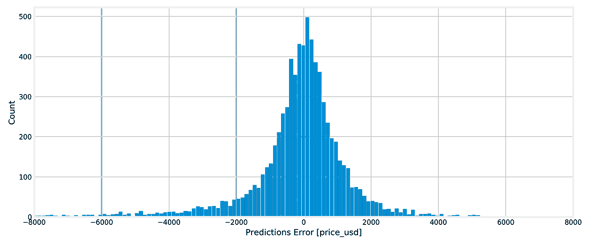****

****Distribution of errors****

****查看真实值和预测值的误差分布和 2d 直方图不会告诉您太多关于预测质量的信息。****

****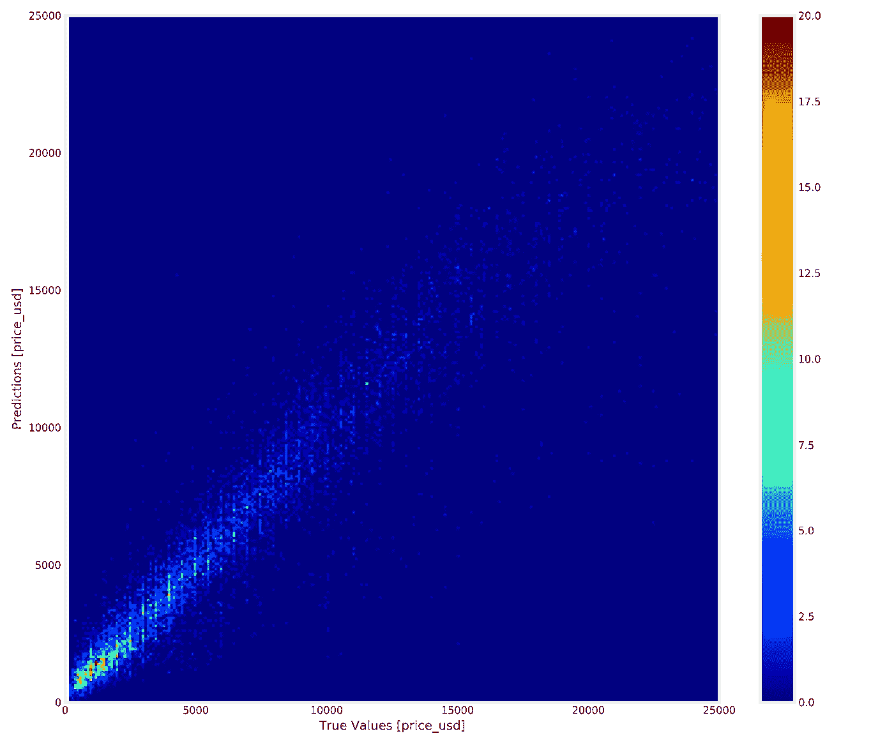****

****2d histogram plot for true and predicted values. You can notice the dense region below $3000 threshold****

****除了*里程表 _ 值*要素位置较低之外，数据集中要素的 SHAP 值等级(仅显示前 20 个要素)对我来说并不奇怪。你可以在类似[和](/deep-dive-into-catboost-functionalities-for-model-interpretation-7cdef669aeed)的文章中找到关于非参数模型解释的很好的解释。****

****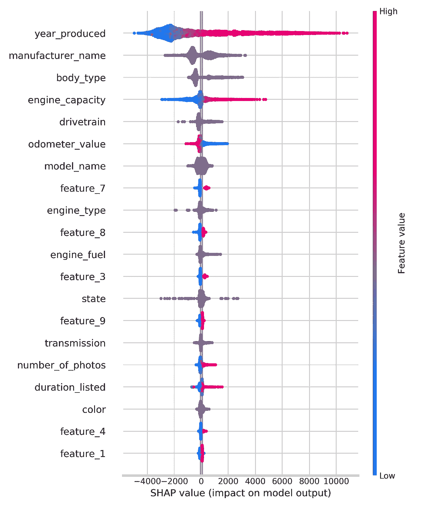****

****Summary_plot for top 20 features****

****车龄、品牌、车身类型、发动机容量和动力传动系统都是最重要的，这看起来非常合理。****

*****陈述*事实证明这是一个有趣的特征:绝大多数汽车都是“被拥有的”，但也有一小部分“新”汽车(它们很贵)和一些“应急”车辆被损坏。****

****受损汽车的问题是显而易见的:该列是布尔型的，没有这种“紧急状态”的程度(稍后将详细介绍)。****

## ****第五阶段。使用领域知识探索个人预测，并找出模型的局限性****

****探索个人预测很快让我意识到模型和数据的局限性。我将列出一些样本，以便更好地理解模型的决策过程。****

*******样品 0:*** 大众 T5 Caravelle，2009，机械变速箱，28.7 万公里，柴油。标价为***13600 美元。*** 预测值低 1，200 美元(该模型的 MAE 约为 1，000 美元，因此这是一个相当典型的情况)。****

****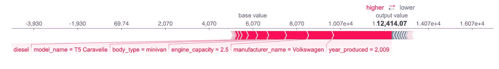****

****Prediction interpretation (force_plot) for T5 Caravelle****

****你可以看到大众*品牌*和小型货车 *body_type* 做出个人贡献，使得一个样品的预测价格更高。****

****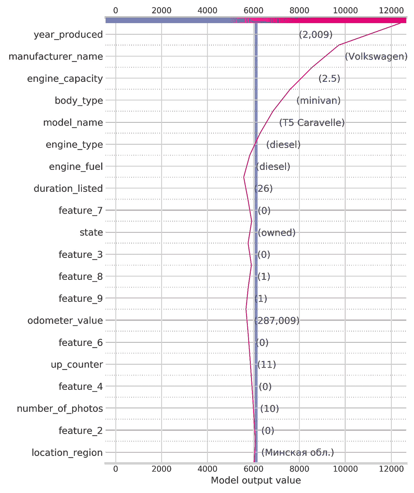****

****Prediction interpretation (decision_plot) for T5 Caravelle****

****使用 SHAP，我们可以通过使用“[决策图](https://slundberg.github.io/shap/notebooks/plots/decision_plot.html)”功能以更好的方式绘制决策解释。****

****决策图最近被添加到库中，并提供了模型内部工作的更详细的视图。****

****与力图相比，决策图的主要优点是它们能够清楚地展示更多的特征。****

****你可以在这里阅读更多关于这种类型的剧情[。](/introducing-shap-decision-plots-52ed3b4a1cba)****

*******样本一:*** 奔驰 E270，2000，机械变速箱，46.5 万公里，柴油。标价为***4999 美元。*** 预测高出 198 美元。那一点也不坏！****

****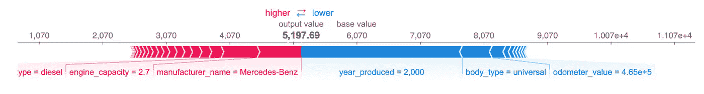****

****Prediction interpretation for E270 Mercedes****

*******样品二:*** Jeep 大切诺基，2007，自动变速箱，16.6 万公里，柴油。标价是***14500 美元。*** 预测低 2796 美元。差预测，一看就是，但是车型已经列入目录 498 天了！感觉这个样品的价格定得太高了。也是在全国最穷的地区上市，那里的车一般都比较便宜，上市时间也比较长。****

****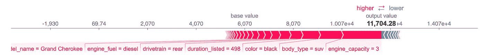****

****Prediction interpretation for Jeep Grand Cherokee****

*******样本三:*** 大众帕萨特，2012，自动变速箱，10.2 万公里，汽油。上市价格为***11499 美元。*** 预测低 64 美元。****

********

****Prediction interpretation for VW Passat****

*******样本四:*** VAZ 2107(俄罗斯车)，1987 年，机械变速箱，12 万公里，汽油。标价是 ***$* 399 *。*** 预测高出 34 美元。这是一个从价格范围的低端。****

****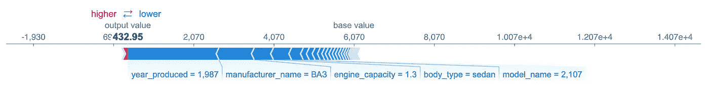****

****Prediction interpretation for VAZ 2107****

****我们可以看到这个样本的所有特征值是如何对预测价格产生负面影响的。****

*******样本五:大众帕萨特*** ，1992 年，机械变速箱，39.8 万公里，汽油。标价是***750 美元。*** 预测高出 721 美元(几乎是挂牌值的两倍)！为什么？****

****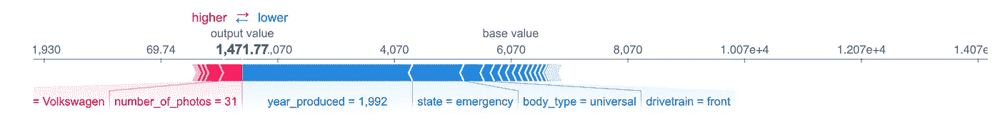****

****Prediction interpretation for emergency VW Passat****

********

****Actual image of the “emergency” VW Passat sample****

****如果我们仔细观察模型解释，我们可以看到*状态=紧急状态*是预测价格的重要因素。对这一特殊情况的进一步人工调查显示，一辆汽车被倒下的树损坏。****

****这显然是现有数据的局限性:布尔 T20 状态列根本不能反映损害程度的总体范围。我相信这个问题可以通过应用另外两种机制来“容易地”解决:使用某种预训练的深度 CNN 进行图像分析，以及使用 RNNs 从样本描述中提取实体。****

****我将以一辆豪华宝马 3 系结束这次样品挑选。****

*******样本六:宝马 316*** ，1994 年，机械变速箱，32 万公里，汽油。标价为***1650*。**** *预测高出 55 美元。我们可以清楚地看到，作为一个奢侈品牌给样本加分。*****

*****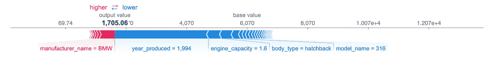*****

*****Prediction interpretation for BMW 316*****

*****我花了大约 3 个小时研究模型的预测，并手动探索样本。*****

## *****技术结论*****

*****我在整个数据集上使用 CatBoost 回归器获得了大约 1，000 美元的 MAE。但我也尝试对不同的型号使用相同的方法，并立即将误差减半至 500 美元。我相信，如果我们根据 *year_produced* 特征将数据集划分为子数据集，并在这些子数据集上训练多个模型，模型的性能会更好。*****

*****我也一直在想， *duration_listed* 特性可以用来惩罚数据集中的样本权重。例如，如果汽车上市一年，这可能意味着价格设置得太高，因此我们可以使用池功能将该样本的权重设置得较低。*****

*****总的来说，我觉得我训练的模型表现得相当不错，但是还有很大的改进空间。*****

*****关于这个项目中使用的技术:CatBoost 似乎是正确的选择，因为它提供了很好的开箱即用的分类特性支持。在 2019 年的 MacBook pro 上进行 5 重交叉验证的训练需要大约 13 分钟，但如果我在一个数据集中有数百万个样本，这不是问题，因为 CatBoost 支持在 GPU 上进行[训练。它还具有非常快的预测时间，这有助于模型进入生产。](https://catboost.ai/docs/features/training-on-gpu.html)*****

## *****总体结论*****

*****在这次冒险中，我试图回答的问题是*“如果你打算出售自己的汽车，使用数据科学方法是否合理？”*这个问题的明显答案是**否**:如果你只是在网上手动搜索类似的车辆，你会更容易算出价格。我花了几天时间以一种简单的方式完成了这个项目，我还可以做很多事情来提高模型的性能，如应用适当的特征选择、网格搜索等。*****

*****同时，如果你有成百上千辆车要卖，答案肯定是**是的**。使用 Python 和丰富的数据科学包生态系统，您可以自动化收集数据、构建分析和训练预测模型的工作。你还可以发现趋势，预测市场的未来。您可以将模型隐藏在一些 API 之后，这样它们就可以以可靠和方便的方式服务于业务。*****

*****还有更多。如果你经营从国外进口二手车的业务，你可以训练单独的 ML 模型，根据它们对公司的盈利能力对样本进行排序。你也可以预测这些样品在实际交易前的上市时间。你甚至可以选择合适的地区进行销售。如果你有足够的数据，可能性是无限的。*****

*****但如果你只是为自己做这种兼职项目，你会像我一样获得巨大的乐趣！*****

*****感谢阅读，我希望你喜欢这篇文章，你可以检查我的[内核](https://www.kaggle.com/lepchenkov/usedcarscatalog/kernels)和一个[数据集](https://www.kaggle.com/lepchenkov/usedcarscatalog)。如果您有任何反馈，可以通过 [**LinkedIn**](https://www.linkedin.com/in/kirill-lepchenkov) 联系我。*****