# 财务分析—股票数据的探索性数据分析

> 原文：<https://towardsdatascience.com/financial-analytics-exploratory-data-analysis-of-stock-data-d98cbadf98b9?source=collection_archive---------11----------------------->


Photo by [M. B. M.](https://unsplash.com/@m_b_m?utm_source=medium&utm_medium=referral) on [Unsplash](https://unsplash.com?utm_source=medium&utm_medium=referral)

随着分析越来越多地渗透到我们生活的方方面面，金融业无疑是最早抓住这一趋势的行业之一。鉴于金融科技和金融领域的市场规模不断扩大，传授一些金融技能将是一件好事！

注意:这篇文章旨在教你一些操作股票数据集的基础知识，而不是让你成为一个定量分析师/股票经纪人/算法交易员。为了在这些领域取得进步，你肯定需要更多的交易、金融和计算方面的知识。

# **1。导入数据**

你需要的大部分金融数据都可以在[雅虎财经](https://sg.finance.yahoo.com/)上轻松找到！你只需要输入股票数据，点击**历史数据**

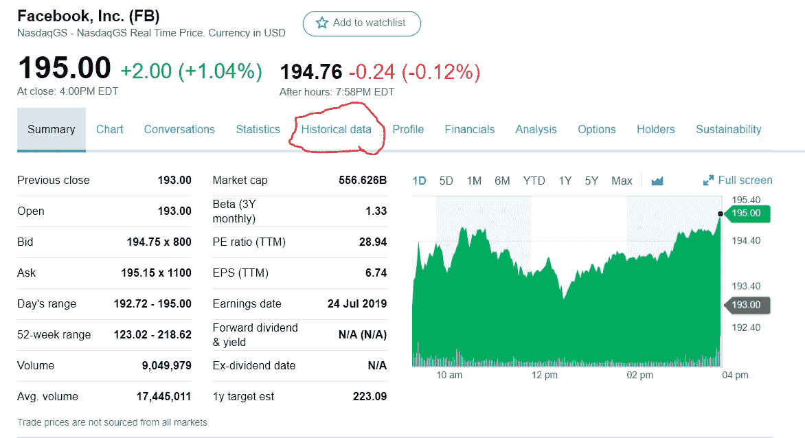

source: [https://sg.finance.yahoo.com/quote/FB?p=FB&.tsrc=fin-srch](https://sg.finance.yahoo.com/quote/FB?p=FB&.tsrc=fin-srch)

之后，设置合适的时间段，记得点击**应用！(见鬼，当我第一次开始时，我一直想知道为什么我下载的 csv 没有给我正确的时间框架)**

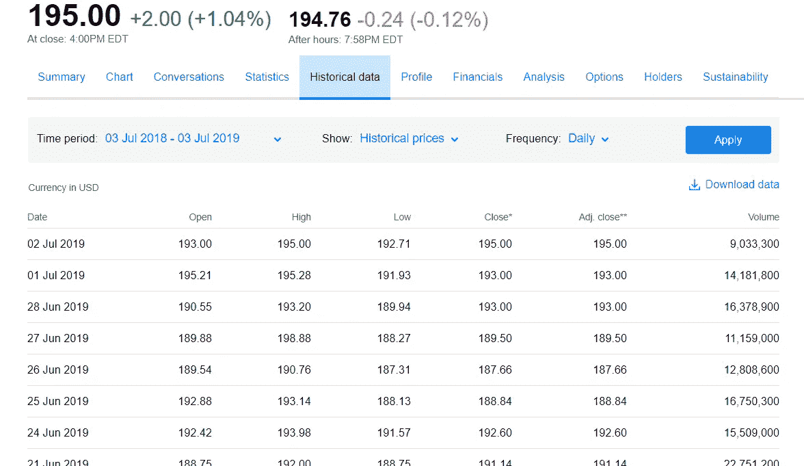

source: [https://sg.finance.yahoo.com/quote/FB/history?p=FB](https://sg.finance.yahoo.com/quote/FB/history?p=FB)

对于本教程，我将使用脸书 2019 年 6 月 18 日至 6 月 16 日的数据。下面是我将用来操作数据的库

```
import pandas as pd 
import numpy as np
from scipy.stats import norm
```

像往常一样，在我们做任何进一步的分析之前，我们应该总是检查数据并理解数据帧

```
df = pd.read_csv('stock data/FB_16June18_16June19.csv')
df.head()
```

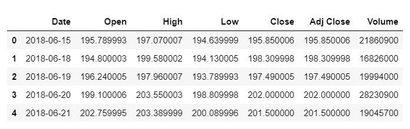

接下来，我们将使用 df.info()检查数据帧的数据类型

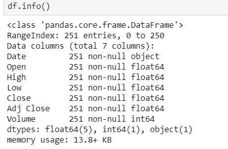

在这里，我们可以看到“日期”列显示为对象，而不是日期时间数据类型。当我们绘制直方图/折线图时，这可能会有问题，所以我们首先将其转换为日期时间对象

```
df['Date'] = pd.to_datetime(df['Date'])
```

现在让我们再次检查数据类型

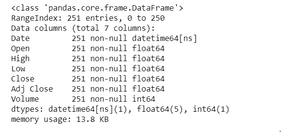

不错！我们现在已经将“日期”列变成了日期时间对象！

# 2.测绘

是时候进口神奇的东西了

```
import matplotlib.pyplot as plt
%matplotlib inline
```

matplot 库给了我们制作强大图表的能力，让我们对股票有了更深入的了解

```
plt.figure(figsize=(20,8))
plt.plot('Date','Close',data=df)plt.xlabel('Date')
plt.ylabel('Close Price')
plt.xticks(rotation=45)
```

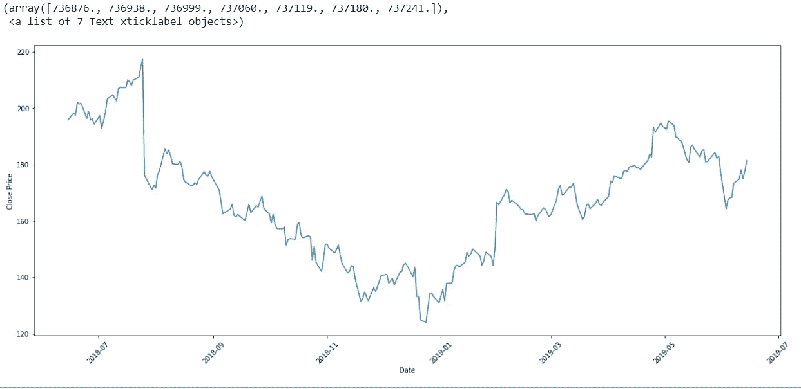

如果你一直关注财经新闻，你会知道 7 月份的大幅下降是因为脸书没有达到他们的收入目标，而 1 月份是因为隐私问题。

# 3.创建列

现在，让我们创建一些有用的列来对股票进行一些有趣的推断

首先，我们将创建“每日滞后”列，它基本上只是将“收盘”价格向后移动一天。(注意:我们通常可以使用各种指标，但为了方便起见，我选择了“接近”)

```
df['Daily Lag'] = df['Close'].shift(1)
df.head()
```

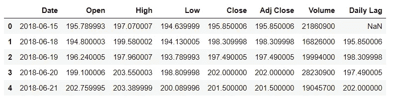

创建“每日滞后”的原因是为了让我们创建“每日回报”列

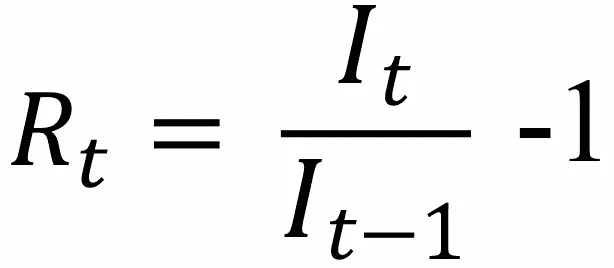

source: [http://www.crsp.com/products/documentation/crsp-calculations](http://www.crsp.com/products/documentation/crsp-calculations)

每日回报告诉我们在股价收盘后一天内获得的回报(咄！)

```
df['Daily Returns'] = (df['Daily Lag']/df['Close']) -1
df.head()
```

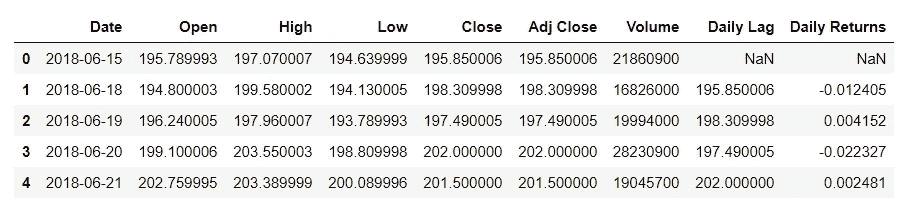

# 4.更多绘图

现在，让我们看看“每日收益”

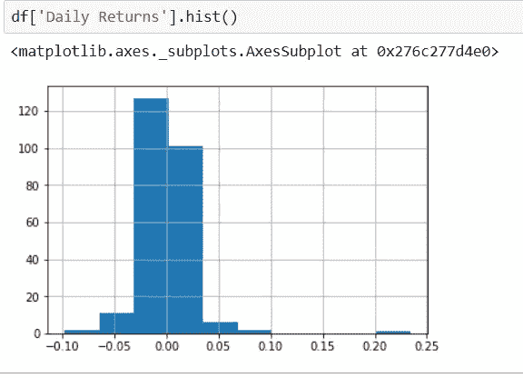

我们意识到，如果我们使用**默认 bin=10，就很难辨别形状。让我们把它增加到 20。在此之前，让我们找到均值和标准差。**

```
mean = df['Daily Returns'].mean()
std = df['Daily Returns'].std()
print('mean =',mean)
print('Std deviation =',std)
```

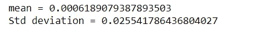

哎哟，一般来说回报是负的，但是请记住，这只考虑了每天的回报，所以它只是告诉你，一般来说，如果你在同一天买入和卖出，你将会亏损。

```
df['Daily Returns'].hist(bins=20)
plt.axvline(mean,color='red',linestyle='dashed',linewidth=2)
#to plot the std line we plot both the positive and negative values 
plt.axvline(std,color='g',linestyle='dashed',linewidth=2)
plt.axvline(-std,color='g',linestyle='dashed',linewidth=2)
```

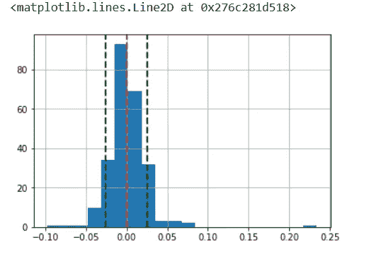

最后，我将向您介绍峰度值。

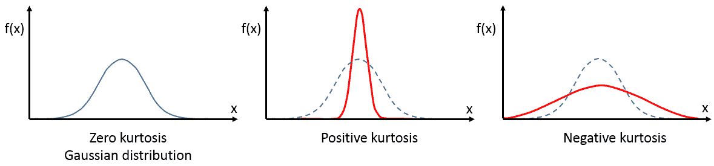

source: [https://community.plm.automation.siemens.com/t5/Testing-Knowledge-Base/Kurtosis/ta-p/412017](https://community.plm.automation.siemens.com/t5/Testing-Knowledge-Base/Kurtosis/ta-p/412017)

峰度告诉你尾部的“肥度”,这很重要，因为它告诉你这些值能有多“极端”。

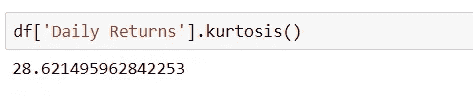

在我们的例子中，该值为正，因此这表明出现“极端”值的可能性很小。(注意:实际确定这一点的正确方法是使用 Z 值，我将在另一个单独的教程中展示它！)

# 5.结论

这是一个非常简单的演练，对股票数据的一些操作进行探索，并发掘一些简单的见解！肯定还有更多要发现，但我认为这是一个教程已经很多了！

我将在以后的教程中使用 python 写更多关于进一步的统计分析，甚至一些交易技术，如快慢线和布林线。

所有代码都来自我自己的 Jupyter 笔记本，我可能会很快上传到我的 github，所以保持警惕！