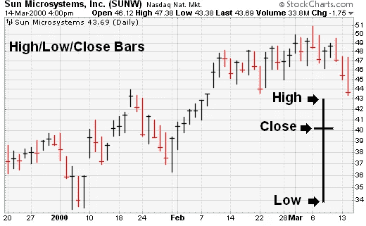
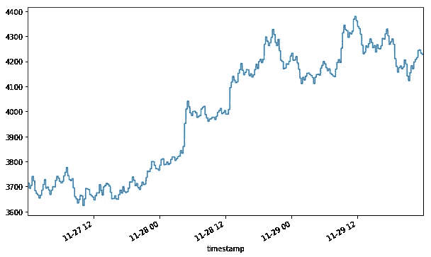
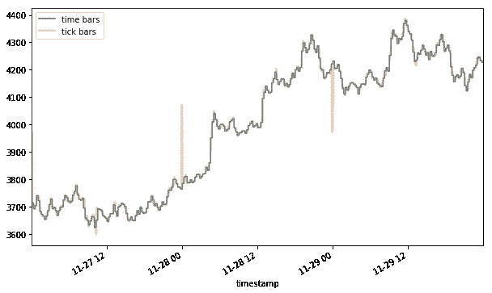
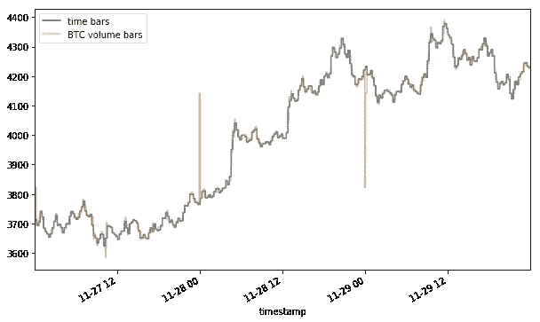
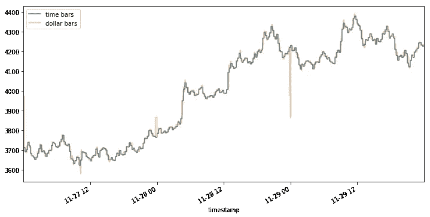
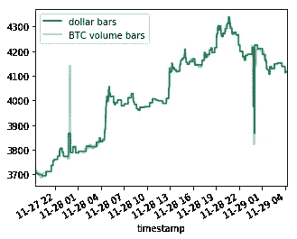
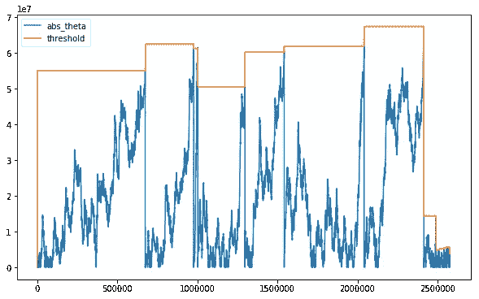
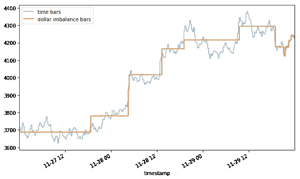

# 金融机器学习第 0 部分:棒线

> 原文：<https://towardsdatascience.com/financial-machine-learning-part-0-bars-745897d4e4ba?source=collection_archive---------1----------------------->

# 前言

最近，我拿到了一份由[马科斯·洛佩兹·德·普拉多](http://quantresearch.org)撰写的[金融机器学习进展](https://www.amazon.com/dp/1119482089/ref=cm_sw_r_tw_dp_U_x_VXFACbQSY9MCN)。洛佩兹·德·普拉多是著名的量化研究员，在他的职业生涯中管理了数十亿美元。这本书对任何对数据科学和金融感兴趣的人来说都是一个惊人的资源，它提供了关于如何将先进的预测技术应用于金融问题的宝贵见解。

本文是致力于将 Lopez de Prado 介绍的方法应用于真实(有时是合成)数据集的系列文章的第一篇。我的希望是，通过写这些帖子，我可以巩固我对材料的理解，并分享一些经验教训。

事不宜迟，让我们继续这篇文章的主题:酒吧。


wrong kind of bar

# 什么是酒吧？

构建一个好模型的第一步是将数据聚集成一种方便的格式，以便进一步分析。[条](https://www.investopedia.com/terms/b/bar.asp)指的是包含金融资产价格变动最基本信息的数据表示。典型的棒线可能包含时间戳、最高价、开盘价和收盘价等特征。



HLC bar chart (stockcharts.com)

条形图通常是用于训练和测试 ML 预测器的输入数据格式。很容易想象，原始数据的聚合方式会对整个模型产生重大的下游影响。

# **动机**

尽管以固定的时间间隔(例如每天/每小时/每分钟等)进行价格观察似乎很直观。，这不是一个好主意。通过市场的信息流在一段时间内不是均匀分布的，并且在某些时段会有较高的活动，例如在开市后的一个小时内，或者就在期货合约到期之前。

我们的目标必须是一个条形图，其中每个条形图包含相同数量的信息，但是基于时间的条形图会对慢速时段进行过采样，而对高活动时段进行欠采样。为了避免这个问题，这个想法是抽样观察作为市场活动的一个功能。

# **设置**

使用交易账簿数据集，我们将为实际金融工具构建多种类型的棒线。我将使用在 [BitMex](https://www.bitmex.com/app/trade/XBTUSD) 上市的比特币永久掉期合约的数据作为 [XBT](https://www.bitmex.com/app/contract/XBTUSD) ，因为谈论比特币是这些天令人兴奋的事情，也因为交易账簿数据在[这里](https://public.bitmex.com/)可用。我们将比较时间棒线和分笔成交点棒线、成交量棒线、美元棒线和美元不平衡棒线。提供了 Python 3 片段以供参考。

首先，做一点设置:

```
import numpy as np
import pandas as pd
import matplotlib.pyplot as plt
import matplotlib.dates as mdates
from datetime import datetime# raw trade data from [https://public.bitmex.com/?prefix=data/trade/](https://public.bitmex.com/?prefix=data/trade/) 
data = pd.read_csv(‘data/20181127.csv’)
data = data.append(pd.read_csv(‘data/20181128.csv’)) # add a few more days
data = data.append(pd.read_csv(‘data/20181129.csv’))
data = data[data.symbol == ‘XBTUSD’]
# timestamp parsing
data[‘timestamp’] = data.timestamp.map(lambda t: datetime.strptime(t[:-3], “%Y-%m-%dD%H:%M:%S.%f”))
```

# 时间条

我们现在已经为 BitMex 上的 XBTUSD 股票载入了几天的交易数据。让我们来看看以 15 分钟为间隔计算的[成交量加权平均价格](https://www.investopedia.com/terms/v/vwap.asp)是什么样的。如前所述，这种表示与市场信息流不同步，但是，我们将使用它作为基准进行比较。

```
def compute_vwap(df):
    q = df['foreignNotional']
    p = df['price']
    vwap = np.sum(p * q) / np.sum(q)
    df['vwap'] = vwap
    return dfdata_timeidx = data.set_index('timestamp')
data_time_grp = data_timeidx.groupby(pd.Grouper(freq='15Min'))
num_time_bars = len(data_time_grp) # comes in handy later
data_time_vwap = data_time_grp.apply(compute_vwap)
```



XBT time bars

请注意，我们在最后一个系列中保存了小节数。为了比较不同的方法，我们希望确保我们有大致相同的分辨率，以便比较是公平的。

# 刻度条

分笔成交点背后的想法是每 N 个交易采样一次观察值，也称为“分笔成交点”，而不是固定的时间段。这允许我们在很多交易发生时获取更多的信息，反之亦然。

```
total_ticks = len(data)
num_ticks_per_bar = total_ticks / num_time_bars
num_ticks_per_bar = round(num_ticks_per_bar, -3) # round to the nearest thousand
data_tick_grp = data.reset_index().assign(grpId=lambda row: row.index // num_ticks_per_bar)data_tick_vwap =  data_tick_grp.groupby('grpId').apply(compute_vwap)
data_tick_vwap.set_index('timestamp', inplace=True)
```

**这与时间条系列相比如何？**



XBT time and tick bars

将两者放在一起，你可能会注意到时间条(蓝色)中隐藏了约 10%的暴涨和暴跌(黄色)。根据你的策略，这两个事件可能意味着巨大的交易机会(均值回归)或交易成本(滑点)。

# 音量条

分笔成交线的一个缺点是，不是所有的交易都是平等的。考虑购买 1000 份合约的订单作为一个交易执行，100 份合约的 10 份订单将计为 10 个交易。考虑到这种有些武断的区别，不管发生了多少交易，对每 N 份交易合同进行抽样观察可能是有意义的。由于 XBT 是 BTC 掉期合约，我们将以 BTC 来衡量交易量。

```
data_cm_vol = data.assign(cmVol=data['homeNotional'].cumsum()) 
total_vol = data_cm_vol.cmVol.values[-1]
vol_per_bar = total_vol / num_time_bars
vol_per_bar = round(vol_per_bar, -2) # round to the nearest hundreddata_vol_grp = data_cm_vol.assign(grpId=lambda row: row.cmVol // vol_per_bar)data_vol_vwap =  data_vol_grp.groupby('grpId').apply(compute_vwap)
data_vol_vwap.set_index('timestamp', inplace=True)
```



XBT time and volume bars

请注意，成交量图显示了比分笔成交点更剧烈的上涨和下跌(4100+对 4000+的峰值和 3800-3900+的低谷)。到目前为止，为条形选择的聚合方法会影响数据的表示方式，这一点应该已经很明显了。

# 美元吧

即使这里使用的数据集很小，您可能会注意到，当 BTC 相对于美元的价值在短短 3 天内移动超过 20%时，作为 BTC 交易数量的函数对数据进行采样是没有意义的。在 11 月 27 日上午买入 1 BTC 和在 11 月 29 日晚上买入 1 BTC 是一个截然不同的决定。这种价格波动是美元棒线背后的基本原理——作为美元(或你选择的货币)交换函数的采样，理论上应该使频率对价值波动更加稳健。

```
# code omitted for brevity
# same as volume bars, except using data['foreignNotional'] instead of data['homeNotional']
```



XBT dollar bars

请注意，BTC 成交量棒线在 11–28 00 和 11–29 00 附近显示了几乎相同的跳跃，但是美元棒线在 11–28 00 的初始峰值与后者相比看起来相对温和。



dollar bars vs BTC volume bars

这是由抽样引起的差异的一个主要例子——尽管许多比特币在 01 年 11 月 28 日左右易手，但当时它们的美元价值相对较低，因此该事件被描述为不太严重。

# 不平衡条

不平衡棒是 MLDP 称之为“信息驱动”的那种棒。这些扩展了替代酒吧的想法，以更先进的方法。不平衡棒线特别试图在买卖活动异常不平衡时取样，这可能意味着市场参与者之间的信息不对称。基本原理是，消息灵通的交易者要么大量买进，要么大量卖出，但很少同时做两件事。当不平衡事件发生时，取样可以让我们关注大的波动，忽略不太有趣的时期。

**实施美元失衡杠**

实现不平衡棒保证了更详细的解释。给定每个分笔成交点的美元数量和价格，流程如下:

1.  计算签名流:

*   计算分笔成交点方向(价格变化的标志)。
*   将分笔成交点方向乘以分笔成交点体积。

2.累积不平衡棒线:

*   从第一个数据点开始，遍历数据集，跟踪累积的带符号流量(不平衡)。
*   只要不平衡的绝对值超过预期的不平衡阈值，就取样。
*   当您看到更多数据时，更新不平衡阈值的期望值。

让我们进一步展开这些步骤。

**1.1 计算滴答方向:**

给定一系列 *N* 分笔成交点{ ( *p* [ *i* ]，v[*I*]}，其中*I*∈1……*N*的 *p* [ *i* 是相关价格， *v* [ *i* 是美元交易量，我们首先计算变化

δ*p*[I]:=*p*[*I*-*p*[*I*-1]

*b*[*I*]:= b[*I*-1]如果δ*p*[I]= 0

*b*[*I*]:= sign(δ*p*[I])否则

幸运的是，在我们的数据集中，刻度方向已经给了我们，我们只需要将它们从字符串转换成整数。

```
def convert_tick_direction(tick_direction):
    if tick_direction in ('PlusTick', 'ZeroPlusTick'):
        return 1
    elif tick_direction in ('MinusTick', 'ZeroMinusTick'):
        return -1
    else:
        raise ValueError('converting invalid input: '+ str(tick_direction))data_timeidx['tickDirection'] = data_timeidx.tickDirection.map(convert_tick_direction)
```

**1.2 计算每个节拍的符号流:**

签约流量[*I*]:=*b*[*I*]**v*[*I*]为第 *i* 步的美元成交量

```
data_signed_flow = data_timeidx.assign(bv = data_timeidx.tickDirection * data_timeidx.size)
```

**2。累积美元不平衡棒线**

为了计算美元不平衡棒线，我们通过数据向前推进，跟踪自上一个样本以来的不平衡，并在不平衡的幅度超过我们的预期时取样。该规则详述如下。

*样品栏何时:*

*|不平衡| ≥预期不平衡*

*哪里有*

实验。不平衡:=(每根棒线的预期分笔成交点数)* |每笔分笔成交点的预期不平衡|

我们将 *t* 分笔成交点子集的不平衡定义为*θ*[*t*]*:=∑b*[*I*]** v*[*I*]*对于 i∈1…t*

让 *T* 表示每根棒线的分笔成交点数量，它不是常数。然后，Eₒ[ *T* 是每根棒线的预期分笔成交点数量，我们将其估计为先前棒线的 *T* 值的[指数加权移动平均值](https://www.investopedia.com/terms/e/ema.asp)。

最后，我们估计每一个分笔成交点的预期不平衡，eₒ[*b * v**，*为先前棒线的 b[i]*v[i]值的指数加权移动平均值。

综上所述，我们必须逐步迭代数据集，每隔 *T** 个节拍采样一次，定义如下

*t *:= arg min(t)s . t . |θ*[*t*]*|≥*eₒ[*t*]** |*eₒ[*b * v**|*

本程序的重要注意事项:

*   开始时，我们没有任何先前的棒线作为我们估计的基础，所以我们必须为计算第一个阈值提供初始值。
*   随着算法累积越来越多的条，EWMA 估计“忘记”初始值，取而代之的是更新的值。确保您设置了足够高的初始值，以便算法有机会“预热”估计值。
*   该算法对用于 EWMA 的超参数非常敏感。因为没有直接的方法来获得与前面演示中相同数量的条形，所以我们将只选择最方便/合理的超参数。

记住这一点，让我们把逻辑放到代码中。我使用来自 [stackexchange 的 EWMA 的](https://stackoverflow.com/a/51392341)[快速实现](https://gist.github.com/maks-ivanov/24022b2be6c83220b47143bab88619c7)。

```
from fast_ewma import _ewmaabs_Ebv_init = np.abs(data_signed_flow['bv'].mean())
E_T_init = 500000 # 500000 ticks to warm updef compute_Ts(bvs, E_T_init, abs_Ebv_init):
    Ts, i_s = [], []
    i_prev, E_T, abs_Ebv  = 0, E_T_init, abs_Ebv_init

    n = bvs.shape[0]
    bvs_val = bvs.values.astype(np.float64)
    abs_thetas, thresholds = np.zeros(n), np.zeros(n)
    abs_thetas[0], cur_theta = np.abs(bvs_val[0]), bvs_val[0] for i in range(1, n):
        cur_theta += bvs_val[i]
        abs_theta = np.abs(cur_theta)
        abs_thetas[i] = abs_theta

        threshold = E_T * abs_Ebv
        thresholds[i] = threshold

        if abs_theta >= threshold:
            cur_theta = 0
            Ts.append(np.float64(i - i_prev))
            i_s.append(i)
            i_prev = i
            E_T = _ewma(np.array(Ts), window=np.int64(len(Ts)))[-1]
            abs_Ebv = np.abs( _ewma(bvs_val[:i], window=np.int64(E_T_init * 3))[-1] ) # window of 3 bars return Ts, abs_thetas, thresholds, i_sTs, abs_thetas, thresholds, i_s = compute_Ts(data_signed_flow.bv, E_T_init, abs_Ebv_init)
```

我们来绘制|θ[ *t* ]|和不平衡阈值(eₒ[*t*]* |eₒ[*b * v*]|)看看是怎么回事。



Threshold vs. magnitude of imbalance

似乎在上升趋势加快的地方和同一趋势反转的地方附近，采样频率较高。在我们可视化条形之前，我们需要相应地对分笔成交点进行分组。

**根据计算出的边界将分笔成交点聚集成组**

```
n = data_signed_flow.shape[0]
i_iter = iter(i_s + [n])
i_cur = i_iter.__next__()
grpId = np.zeros(n)for i in range(1, n):
    if i <= i_cur:
        grpId[i] = grpId[i-1]
    else:
        grpId[i] = grpId[i-1] + 1
        i_cur = i_iter.__next__()
```

**综合来看:美元不平衡棒线**

```
data_dollar_imb_grp = data_signed_flow.assign(grpId = grpId)
data_dollar_imb_vwap = data_dollar_imb_grp.groupby('grpId').apply(compute_vwap).vwap
```



Dollar imbalance bars

我们看到，当趋势发生变化时，DIB 倾向于采样。它可以被解释为包含相同数量的关于趋势变化的信息的 DIB，这可以帮助我们开发趋势跟踪的模型。

# 摘要

我们已经使用了一个交易账簿数据集来计算 BTC 掉期合约的时间、价格点、美元、成交量和美元不平衡棒线。每种替代方法讲述了一个略有不同的故事，每种方法都有优势，这取决于市场微观结构和特定的用例。

为了进一步探索这一点，考虑测量每个条形序列的统计属性，如峰度和序列相关性，以查看哪些条形更容易用 ML 算法建模。我希望你喜欢这个演示，如果你发现错误或有任何问题，请联系我们！