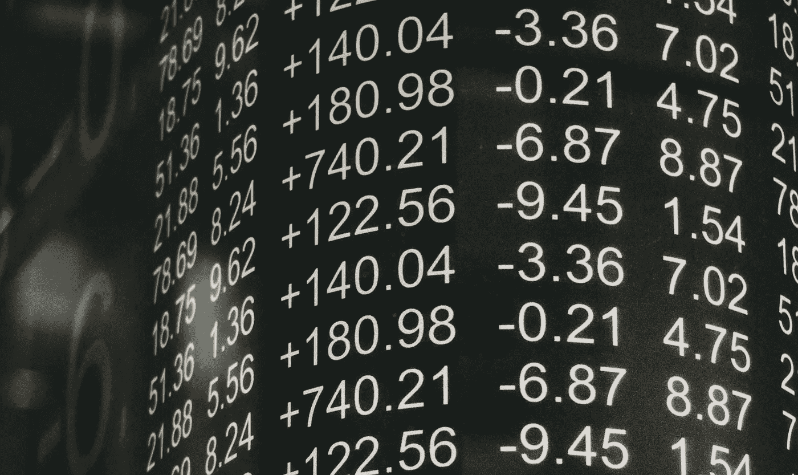
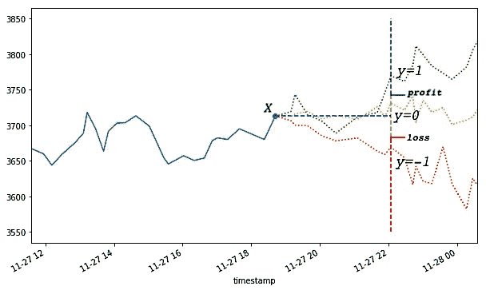
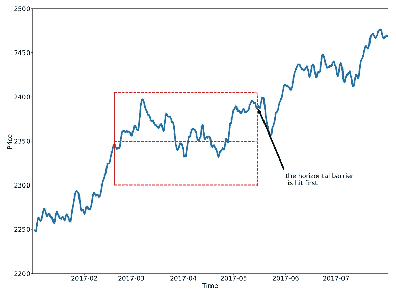
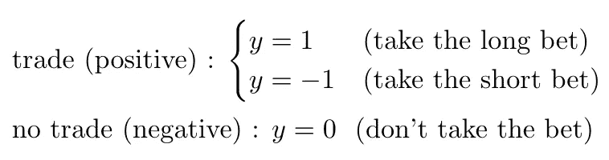
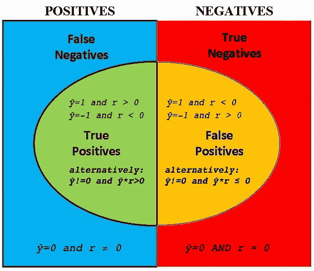
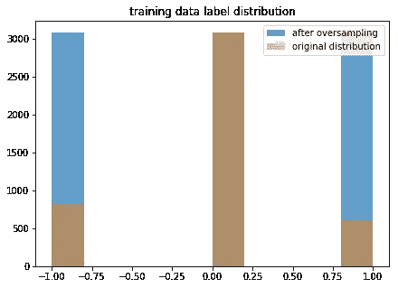
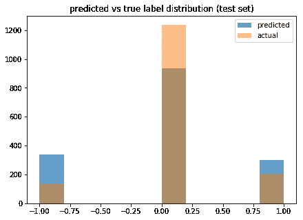
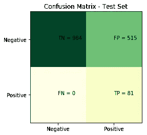
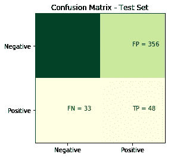

# 金融机器学习第 1 部分:标签

> 原文：<https://towardsdatascience.com/financial-machine-learning-part-1-labels-7eeed050f32e?source=collection_archive---------9----------------------->



## 设置监督学习问题

## 介绍

在[的上一篇文章](/financial-machine-learning-part-0-bars-745897d4e4ba)中，我们探讨了几种为金融工具收集原始数据的方法，以创建被称为棒线的观察值。在这篇文章中，我们将关注机器学习管道的下一个关键阶段——标记观察。提醒一下，机器学习中的标签表示我们想要预测的随机变量的结果。

就像本系列的其余部分一样，这篇文章中显示的技术是基于 [**金融机器学习的进步**](https://www.amazon.com/Advances-Financial-Machine-Learning-Marcos/dp/1119482089) 由 [**马科斯洛佩兹德普拉多**](http://www.quantresearch.org/) 。我推荐你去看看这本书，它对这个问题有更详细的论述。话虽如此，是时候跳进水里游一游了。

# 标记观察

在金融环境中，解决监督学习问题的一个简单方法是尝试预测某个工具在未来某个固定时间范围内的价格。请注意，这是一个回归任务，即我们试图预测一个连续的随机变量。这是一个很难解决的问题，因为价格是众所周知的嘈杂和序列相关的，并且所有可能的价格值的集合在技术上是无限的。另一方面，我们可以将此视为一个分类问题—我们可以预测离散化的回报，而不是预测精确的价格。

大多数金融文献使用固定范围标记方法，即根据未来某个固定步数的回报来标记观察值。标签由利润和损失阈值离散化:



这种标记方法是一个良好的开端，但它有两个可解决的问题。

1.  阈值是固定的，但波动性不是——这意味着有时我们的阈值相距太远，有时又太近。当波动性较低时(例如，在夜间交易时段)，我们将获得大部分的 *y=* 0 标签，即使低回报是可预测的且具有统计显著性。
2.  标签是路径独立的，这意味着它只取决于地平线上的回报，而不是中间回报。这是一个问题，因为标签没有准确反映交易的现实——每个策略都有止损阈值和止盈阈值，可以提前平仓。如果中间回报触及止损阈值，我们将实现亏损，持有头寸或从中获利是不现实的。相反，如果中间回报达到获利阈值，我们将关闭它以锁定收益，即使回报为零或为负。

**计算动态阈值**

为了解决第一个问题，我们可以将动态阈值设置为滚动波动率的函数。我们假设在这一点上我们已经有了 OHLC 酒吧。我使用 [BitMex:XBT](https://www.bitmex.com/app/seriesGuide/XBT) 的美元条，这是上一篇文章中的比特币永久互换合约——如果你是从零开始，这个[代码片段](https://gist.github.com/maks-ivanov/e668c47addfa69e86da5a44e3f634dd5)将帮助你赶上。

在这里，我们将估计每小时的回报率波动，以计算利润和损失的阈值。下面你会发现一个直接来自 Lopez De Prado 的稍加修改的函数，为了清楚起见还添加了注释:

```
def get_vol(prices, span=100, delta=pd.Timedelta(hours=1)):
  # 1\. compute returns of the form p[t]/p[t-1] - 1 # 1.1 find the timestamps of p[t-1] values
  df0 = prices.index.searchsorted(prices.index - delta)
  df0 = df0[df0 > 0] # 1.2 align timestamps of p[t-1] to timestamps of p[t]
  df0 = pd.Series(prices.index[df0-1],    
           index=prices.index[prices.shape[0]-df0.shape[0] : ]) # 1.3 get values by timestamps, then compute returns
  df0 = prices.loc[df0.index] / prices.loc[df0.values].values - 1 # 2\. estimate rolling standard deviation
  df0 = df0.ewm(span=span).std()
  return df0
```

**添加路径依赖:三重屏障法**

为了更好地结合假设交易策略的止损和止盈场景，我们将修改固定范围标记方法，以便它反映哪个障碍首先被触及——上限、下限或范围。因此得名:三重屏障法。



***Triple-Barrier Label y=0* |** Source: quantresearch.org

标签模式定义如下:

*y=* 1 *:首先碰到顶部护栏*

*y=* 0 *:先击中右侧护栏*

*y=* -1 *:首先碰到底部护栏*

**赌的一方呢？**

上面的模式适用于只做多的策略，但是当我们同时考虑多头和空头时，事情就变得复杂了。如果我们做空，我们的盈利/亏损与价格走势相反——价格下跌时我们盈利，价格上涨时我们亏损。


“Because I was inverted” — Maverick | Top Gun

为了说明这一点，我们可以简单地将*侧*表示为长 1，短-1。因此，我们可以将我们的收益乘以边数，所以每当我们做空时，负收益变成正收益，反之亦然。实际上，如果*侧* =-1，我们翻转 *y* =1 和 *y* =-1 标签。

让我们试着实现一下(基于 MLDP 的代码)。

首先，我们定义了获取视界屏障时间戳的程序:

```
def get_horizons(prices, delta=pd.Timedelta(minutes=15)):
    t1 = prices.index.searchsorted(prices.index + delta)
    t1 = t1[t1 < prices.shape[0]]
    t1 = prices.index[t1]
    t1 = pd.Series(t1, index=prices.index[:t1.shape[0]])
    return t1
```

现在我们有了我们的水平障碍，我们定义一个函数，根据前面计算的波动率估计值设置上限和下限:

```
def get_touches(prices, events, factors=[1, 1]):
  '''
  events: pd dataframe with columns
    t1: timestamp of the next horizon
    threshold: unit height of top and bottom barriers
    side: the side of each bet
  factors: multipliers of the threshold to set the height of 
           top/bottom barriers
  ''' out = events[['t1']].copy(deep=True)
  if factors[0] > 0: thresh_uppr = factors[0] * events['threshold']
  else: thresh_uppr = pd.Series(index=events.index) # no uppr thresh
  if factors[1] > 0: thresh_lwr = -factors[1] * events['threshold']
  else: thresh_lwr = pd.Series(index=events.index)  # no lwr thresh for loc, t1 in events['t1'].iteritems():
    df0=prices[loc:t1]                              # path prices
    df0=(df0 / prices[loc] - 1) * events.side[loc]  # path returns
    out.loc[loc, 'stop_loss'] = \
      df0[df0 < thresh_lwr[loc]].index.min()  # earliest stop loss
    out.loc[loc, 'take_profit'] = \
      df0[df0 > thresh_uppr[loc]].index.min() # earliest take profit
  return out
```

最后，我们定义一个函数来计算标签:

```
def get_labels(touches):
  out = touches.copy(deep=True)
  # pandas df.min() ignores NaN values
  first_touch = touches[['stop_loss', 'take_profit']].min(axis=1)
  for loc, t in first_touch.iteritems():
    if pd.isnull(t):
      out.loc[loc, 'label'] = 0
    elif t == touches.loc[loc, 'stop_loss']: 
      out.loc[loc, 'label'] = -1
    else:
      out.loc[loc, 'label'] = 1
  return out
```

将所有这些放在一起:

```
data_ohlc = pd.read_parquet('data_dollar_ohlc.pq')
data_ohlc = \
  data_ohlc.assign(threshold=get_vol(data_ohlc.close)).dropna()
data_ohlc = data_ohlc.assign(t1=get_horizons(data_ohlc)).dropna()
events = data_ohlc[['t1', 'threshold']] 
events = events.assign(side=pd.Series(1., events.index)) # long only
touches = get_touches(data_ohlc.close, events, [1,1])
touches = get_labels(touches)
data_ohlc = data_ohlc.assign(label=touches.label)
```

# 元标记

在概念层面上，我们的目标是在我们预计会赢的地方下注，而不是在我们预计不会赢的地方下注，这就归结为一个二元分类问题(其中失败的情况既包括下注方向错误，也包括在我们应该下注的时候根本没有下注)。下面是我们刚刚生成的标签的另一种查看方式:



二进制分类问题提出了 I 型错误(假阳性)和 II 型错误(假阴性)之间的折衷。增加真阳性率通常以增加假阳性率为代价。

为了更正式地描述这一点，让我们首先定义:

*ŷ ∈* {0，1，-1} : *观测的主模型预测*

*r:观察的价格回报*

然后在预测时，主模型的混淆矩阵如下所示。



我们不太担心假阴性——我们可能会错过一些赌注，但至少我们没有赔钱。我们最担心的是假阳性，这是我们损失金钱的地方。

为了反映这一点，我们的元标签 *y** 可以根据图表来定义:

*y*=* 1 **:** *真正*

*y*=* 0 **:**

实际上，主模型应该有高的[回忆](https://en.wikipedia.org/wiki/Precision_and_recall)——它应该以许多假阳性为代价，正确地识别更多的真阳性。第二模型然后将过滤掉第一模型的假阳性。

## 元标记实现

首先，我们创建一个主模型。在我们这样做之前，一个重要的预处理步骤是确保我们的训练数据有平衡的标签。



原始数据集中的标签在很大程度上受 0 值支配，所以如果我们在这些标签上训练，我们会得到一个每次都预测 0 的退化模型。我们通过应用[合成少数过采样技术](https://arxiv.org/pdf/1106.1813.pdf)来创建标签计数大致相等的新训练数据集，从而解决这一问题。

```
from imblearn.over_sampling import SMOTE
X = data_ohlc[['open', 'close', 'high', 'low', 'vwap']].values
y = np.squeeze(data_ohlc[['label']].values)
X_train, y_train = X[:4500], y[:4500]
X_test, y_test = X[4500:], y[4500:]
sm = SMOTE()
X_train_res, y_train_res = sm.fit_sample(X_train, y_train)
```

接下来，我们将逻辑回归模型拟合到重新采样的训练数据中。注意，在这一点上，我们不应该期望我们的模型做得很好，因为我们还没有生成任何特征，但是当在基线模型上使用元标记时，我们仍然应该看到 F1 分数的提高。

```
from sklearn.linear_model import LogisticRegression
clf = LogisticRegression().fit(X_train_res, y_train_res)
y_pred = clf.predict(X_test)
```



我们可以看到，我们的模型比我们的测试数据预测了更多的 1 和-1。最左和最右列的蓝色部分代表假阳性，我们打算通过元标记和训练二级模型来消除假阳性。

让我们将三重障碍预测映射到前面介绍的二元正/负元标签中，并检查混淆矩阵:

```
def true_binary_label(y_pred, y_test):
    bin_label = np.zeros_like(y_pred)
    for i in range(y_pred.shape[0]):
        if y_pred[i] != 0 and y_pred[i]*y_test[i] > 0:
            bin_label[i] = 1  # true positive
    return bin_labelfrom sklearn.metrics import confusion_matrix
cm= confusion_matrix(true_binary_label(y_pred, y_test), y_pred != 0)
```



primary model

正如所料，我们没有看到假阴性和大量的假阳性。我们会尽量减少假阳性而不增加太多的假阴性。

.

.

```
# generate predictions for training set
y_train_pred = clf.predict(X_train) 
# add the predictions to features 
X_train_meta = np.hstack([y_train_pred[:, None], X_train])
X_test_meta = np.hstack([y_pred[:, None], X_test])
# generate true meta-labels
y_train_meta = true_binary_label(y_train_pred, y_train)
# rebalance classes again
sm = SMOTE()
X_train_meta_res, y_train_meta_res = sm.fit_sample(X_train_meta, y_train_meta)
model_secondary = LogisticRegression().fit(X_train_meta_res, y_train_meta_res)
y_pred_meta = model_secondary.predict(X_test_meta)
# use meta-predictions to filter primary predictions
cm= confusion_matrix(true_binary_label(y_pred, y_test), (y_pred * y_pred_meta) != 0)
```



secondary model

二级模型中的结果表明，我们引入了一些假阴性，但是我们从初级模型中消除了超过 30%的假阳性。虽然这并不总是一个有价值的交易，但记住交易的背景——我们错过了一些交易机会(假阴性)，但这是减少许多在我们面前爆炸的交易(假阳性)的廉价代价。分类报告证实了我们的直觉，即通过 [F1 分数](https://en.wikipedia.org/wiki/F1_score)测量，分类器的效率提高了。

```
# WITHOUT META-LABELING label    precision    recall  **f1-score**   support

           0       1.00      **0.66**      **0.79**      1499
           1       0.14      1.00      **0.24**        81

   micro avg       0.67      0.67      **0.67**      1580
   macro avg       0.57      0.83      **0.52**      1580
weighted avg       0.96      0.67      **0.76**      1580# WITH META-LABELING label    precision    recall  f1-score   support

           0       0.97      **0.76**      **0.85**      1499
           1       0.12      0.59      0.20        81

   micro avg       0.75      0.75      **0.75**      1580
   macro avg       0.55      0.68      **0.53**      1580
weighted avg       0.93      0.75      **0.82**      1580
```

虽然这两个模型都不太好，但请记住，我们只是在演示一种提高分类器效率的技术，这种技术可以在更大的数据集、更好的模型和更强大的功能上很好地工作。

## 元标记:定量方法

总的来说，元标注+二级模型的解释就是预测一级模型的置信度。在我们的例子中，主模型和次模型都是数据驱动的，但是并不总是这样。

除了提高 F1 分数，元标记还有另一个极其强大的应用——它可以在非 ML 模型之上添加一个机器学习层，包括计量经济学预测、基本面分析、技术信号，甚至是酌情策略。这提供了人类直觉/专业知识和数量优势的强大组合，因其可解释性和稳健性而受到许多资产经理的青睐。

# 摘要

标注观察值是监督学习的重要组成部分。在这个演示中，我们开发了一种标记金融资产观察结果的方法，以及一种元标记技术，以帮助在分类问题中获得更好的 F1 分数。我鼓励您将这些标注技术与其他数据集和参数相结合，并分享您的结果。感谢您的阅读，欢迎您随时提出意见/建议！