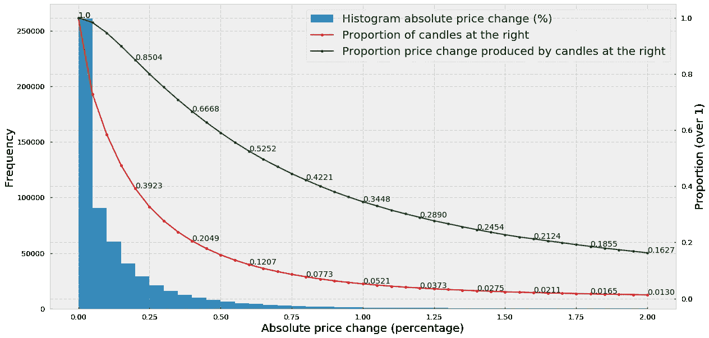

# 金融机器学习从业者一直在使用错误的烛台:原因如下

> 原文：<https://towardsdatascience.com/financial-machine-learning-practitioners-have-been-using-the-wrong-candlesticks-heres-why-7a3fb85b5629?source=collection_archive---------2----------------------->

## 在本文中，我们将探讨为什么传统的基于时间的蜡烛图是一种低效的价格数据汇总方法，特别是在以下两种情况下:(a)高度波动的市场，如加密货币；(b)使用算法或自动交易时。为了证明这一点，我们将分析比特币-美元历史价格的行为，我们将研究为什么市场不再遵循阳光周期，以及为什么我们使用的数据类型可以成为竞争对手的优势。最后，我们将简要介绍替代和最先进的价格汇总方法，如成交量或分笔成交点不平衡棒线，旨在减轻传统烛台的缺点。

## 高度波动市场中的过采样和欠采样

加密货币市场极其不稳定。价格变化很快，在几分钟内价格下跌或下跌 5-20%之前，价格横向移动几个小时是很常见的。虽然长期交易策略可能在忽略日内波动的情况下仍然有利可图，但任何中期或短期策略(更不用说高频交易)都必须以某种方式解决波动问题。

在下面的图中，我们使用 5 分钟蜡烛图分析了 Bitfinex 交易所自 2013 年 3 月至 2019 年 4 月的比特币-美元对的波动性(数据从 [CryptoDatum.io](https://cryptodatum.io) 获得)。具体来说，我们显示:(1)绝对价格变化直方图(计算为收盘价相对于开盘价的变化百分比)，(2)直方图右侧特定点的蜡烛线比例(红线)以及(3)右侧蜡烛线产生的价格变化总量的比例(绿线)。

因此，我们可以观察到:

1.  大多数 5 分钟蜡烛线(约 70%)的价格变化低于 0.25%，其中大部分几乎没有价格变化(第一个直方图峰值在 0.00–0.05%)。
2.  20% (0.2049)的烛台解释了近 67% (0.6668)的价格变化总量。
3.  2%的烛台解释了 21%的价格变化总量，表明在 2%的 BTC-美元烛台中，巨大的价格变化发生在 5 分钟的短时间内(高波动性)。

从第 1 点我们可以得出的结论是，*基于时间的烛台显然对低活动期*(活动被理解为价格变化)进行了过采样。换句话说，在 70%的蜡烛中，没有任何事情真正发生，所以问题是:如果我们想训练一个基于 ML 的算法，我们需要所有这些没有观察到变化的蜡烛吗？找到一种移除或丢弃大多数无意义蜡烛的方法对丰富我们的数据集有用吗？

> 基于时间的蜡烛图过采样低活动期和欠采样高活动期

另一方面，第 2 点和第 3 点表明，大多数价格变化发生在几个百分比的烛台上，这表明*基于时间的烛台低于样本高活动期*。这意味着，如果价格在 5 分钟内变化 10%，并且我们使用 5 分钟蜡烛线，我们的算法将无法看到基于时间的蜡烛线在开盘和收盘之间发生的任何事情，可能会错过一个良好的交易机会。因此，理想情况下，我们希望找到一种方法，在市场活动增加时多取样一些蜡烛，在市场活动减少时少取样一些蜡烛。

## 市场可能不再遵循人类的日光周期

我们使用基于时间的烛台的主要原因是因为我们人类生活在时间中，因此，时间是我们组织自己和同步我们的生物节律的非常方便的东西。此外，阳光周期对人类至关重要，因为它决定了清醒-睡眠周期，这与我们的生存有着生物学上的相关性。作为白天周期的结果，传统的证券交易所仍然[在上午 9:30](https://www.worldtimezone.com/markets24.php) 开门(这样真正的人可以在醒着的时候交易)[在下午 4 点](https://www.worldtimezone.com/markets24.php)关门(这样交易者可以安心睡觉——但是……他们会吗？).

随着技术的出现，自动交易机器人已经开始取代真正的人类交易员，特别是在加密货币领域，市场不再遵循白天周期，因为它们仍然全天候开放。在这种情况下，继续使用基于时间的烛台，一个纯粹的标准，人类便利的结果，有意义吗？洛佩兹·德·普拉多在他的书*金融机器学习的进步*中对此做了很好的总结:

> 尽管时间条可能是从业者和学者中最受欢迎的，但还是应该避免。[……]市场不会以固定的时间间隔处理信息。[……]作为生物，人类根据阳光周期组织自己的一天是有意义的。但是今天的市场是由算法操作的，这些算法在松散的人工监督下进行交易，对这些算法来说，CPU 处理周期比时间间隔更重要

## 每个人的数据都不是任何人的优势

为什么大多数好的交易算法是一个很好的秘密，因为当从一个不平衡的情况下，我们可以预测到另一个平衡时，钱就赚了。一般来说，平衡意味着每个人都已经意识到发生了什么，并且有足够的积极和消极的力量来保持新达到的平衡。

为了预测均衡的变化，我们必须反向而行，同时又是正确的:也就是说，我们必须知道一些其他人不知道的事情，并且我们的断言是正确的。我们必须找出大多数交易者不知道的失衡，否则我们就又回到了平衡状态。它通常被称为“零和”游戏，尽管我并不特别喜欢这个定义。

> 每个人的数据都不是任何人的优势

为了成为反向投资者，我们必须用新的创造性方法来看待和分析数据，让我们在尊重他人的基础上获得一定的优势。这就是我们用来训练算法的数据类型等小细节能够产生重大影响的时候。实际上，这意味着如果每个人都使用基于时间的蜡烛棒，为什么我们要和其他人一样使用呢？如果有更好的替代物存在，为什么我们还会使用基于时间的烛台？

## 另类烛台

很少有比读完德·普拉多的《金融机器学习的进步》一书的前几章更让我感到受启发的了。在他的书中，这位经验丰富的基金经理揭示了他 20 多年来一直用来管理千万富翁基金的常见做法和数学工具。特别是，他从第一手资料中知道，这些年来市场的行为发生了巨大的变化，与交易机器人竞争是一种规则而不是例外。在这种情况下，de Prado 介绍了一些替代类型的烛台，旨在取代传统的基于时间的烛台，并为金融领域带来必要的创造性和新颖性。

以下是德普拉多推荐的一些替代烛台或烛台的例子:

*   **分笔成交点**:每次预定数量的交易发生时，我们对一根棒线进行采样。例如，每次在交易所进行 200 笔交易，我们通过计算 OHLCV 棒线的开盘价-盘高-收盘价来取样。
*   **音量条**:每次交换预定音量时，我们都会对音量条进行采样。例如，我们在交易所中每交易 10 个比特币就创建一个条形。
*   不平衡棒线:我们分析交易顺序的不平衡程度，每次不平衡超过我们的预期时，我们就取样一根棒线。

在以后的文章中，我将分析书中描述的每一种可供选择的烛台。我们将了解如何构建它们，将它们的统计属性(如正态性和序列相关性)与传统烛台进行比较，并分析这些条形如何克服传统烛台的缺点。

感谢阅读，更多内容即将推出，敬请关注！

您愿意自己尝试一下我们在文章中提到的另类酒吧吗？在 CryptoDatum.io，我们努力提供最先进的加密货币数据集，以插入您自己的基于 ML 的交易算法。在 [*查看我们 https://cryptodatum . io*](https://cryptodatum.io)*。*

所提供的信息仅用于教育目的。它绝不代表任何财务建议，信息必须“按原样”采用，没有任何形式的保证。

