# 使用时间序列分类的金融故事

> 原文：<https://towardsdatascience.com/financial-storytelling-using-time-series-classification-185094f80db5?source=collection_archive---------20----------------------->

## 让我们教一台机器来描述市场是如何运动的。

Source: Pexels

说到叙事，金融市场特别有吸引力，因为它们只会随着时间的推移沿着一个轴移动。一个人可能会感到饥饿而快乐，但在金融领域，事情会起起落落；变强或变弱；膨胀或收缩。

作为人类，当我们看市场走势图时，我们可以很容易地得出一个市场在一段时间内表现的基本故事:

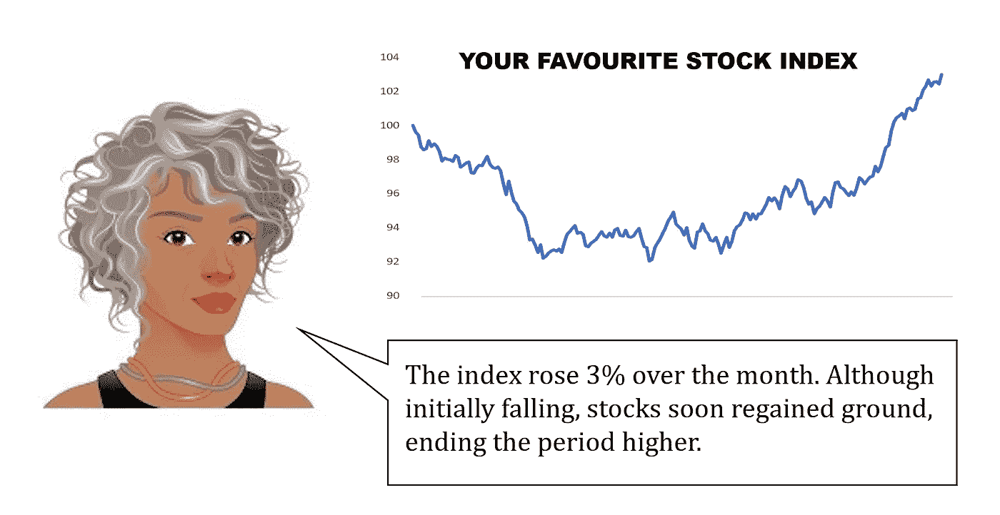

但市场用噪音弥补了这种简单。在上面的例子中，下面的三幅图像描述了一个相似的场景，第四幅描述了一个不同的场景:

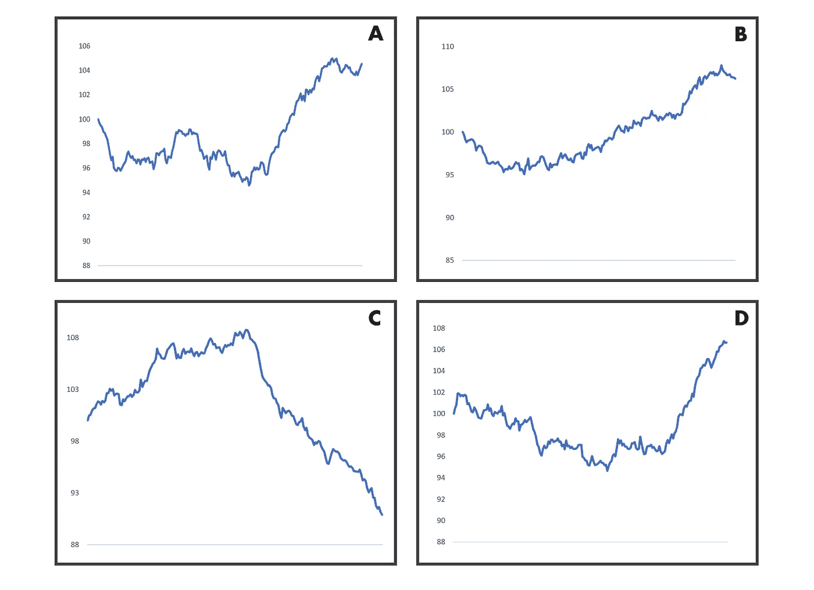

对我们来说，这一切都很清楚。但是你能教计算机把这些输入转化成适当的叙述吗？

一种方法是，对于给定的财务表现时间序列，决定哪种给定的叙述最能描述它。

请注意，虽然这是一个自然语言生成(NLG)问题，但机器吐出的实际文本并不完全是由机器生成的；大部分是由人类预先写好的。

一些 NLG 从业者现在认为这种方法相当过时。这部分是因为确定选定的叙述让人感觉要么文本不够丰富，要么有太多的叙述不值得努力。(如果你不得不写 1000 种不同的叙述，这真的省去了麻烦吗？)

我们自以为是。我们可能相信人类渴望无限的叙事多样性，但即使在小说中，我们实际上也被很少几种类型的情节所吸引([七种](https://en.wikipedia.org/wiki/The_Seven_Basic_Plots)，根据布克的说法；[六](https://www.theatlantic.com/technology/archive/2016/07/the-six-main-arcs-in-storytelling-identified-by-a-computer/490733/)，据冯内古特)。

在金融学中，最简单的叙述形式只考虑起点和终点，而忽略了中间的一切。例如:“黄金价格在一个月内上涨”。让我们称之为两点叙述。

这种形式的叙述是可以的，但是当讨论市场时，很大程度上取决于时间框架和背景。比方说，对于股票，你可能想更详细地了解一年来的涨跌情况；一个下午，不太多。以下是稍微丰富一些的例子:

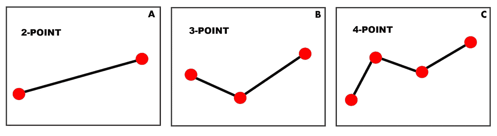

现在，让我们来看看由[资产管理公司施罗德](https://www.schroders.com/en/insights/economics/quarterly-markets-review---q1-2019/)发布的这些写得很好的总结要点:

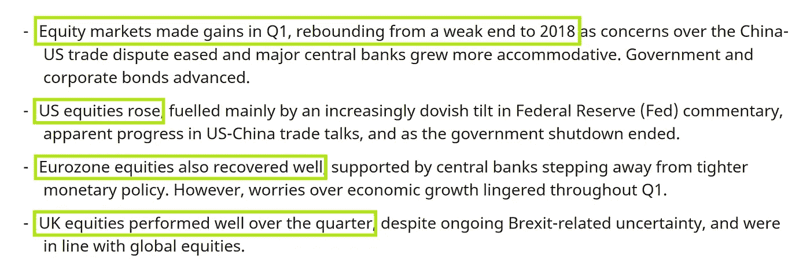

请注意，第一个和第三个项目符号是 3 点记叙文，第二个和第四个是 2 点记叙文。

我们不介意叙述简单，因为句子的后半部分丰富了文本。第一部分是对发生的事情的叙述，第二部分——非常松散地——谈论为什么。

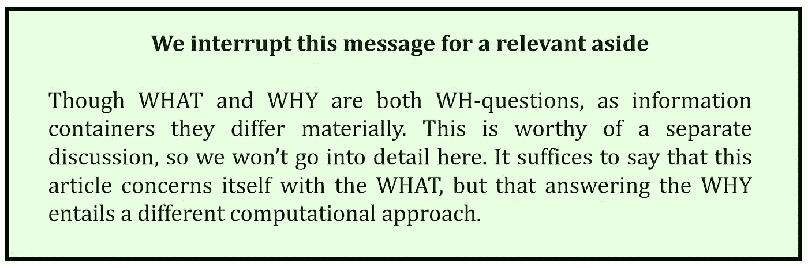

回到我们自己的问题，我们将限制自己不到 20 种叙事类型，包括 2 点和 3 点叙事。编写文本组件不会花很长时间，我们可以很容易地为相同的场景提供不同的措辞来进行混合。

# **我们的任务**

很明显，这是一个*分类*的问题，因为我们问:给定一个新系列，它最像我们选择的哪种叙事类型？因此，我们将构建某种形式的分类器。

但是我们用什么来训练它呢？

我们没有任何真实世界的标签数据(也就是说，一大堆过去的性能曲线，每一条都标有最合适的叙述类型)。获取这些数据既费时又费力。因此，我们将制造贴有标签的样品，看起来非常接近真实的东西。

## **对于本文的剩余部分，以下是计划**:

1.我们将为我们的数据生成基础:每个故事的大量样本。

2.我们将在每个数据样本中添加噪声，这样看起来就像金融市场的行为方式。

3.我们将使用现在有噪声的数据来训练分类器。

4.我们将在人造数据和真实数据上测试它，看看我们会得到什么。

# **1。生成叙述样本[这是容易的部分]**

假设在一个月内，一个指数从 100 开始，下降，然后再次上升，以高于开始的位置结束。现在我们知道这是一个三点叙事。

但是，有各种各样的事情可以变化，同时仍然与故事保持一致:指数何时达到最低点？这个低点有多低？而适当上升又是什么意思呢？

我们的第一点总是固定的:在时间 0，我们将该值归一化为 100。但其余的可以摇摆不定，上面的问题说明了参数，把我们从一个叙事的一般描述到一个具体的实例。

因此，每种叙事类型都有几个参数，这些参数可以在一个范围内变化。为了生成大量的样本，我们从这些范围中随机选取值。比方说，对于自下而上的叙述，我们可能会得到一堆类似这样的例子:

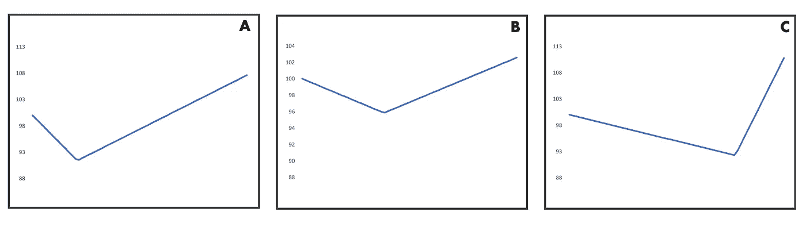

但这些看起来一点也不像现实生活中金融市场的运行方式。在现实生活中，市场是不稳定的，所以它们会来回波动。我们需要做的是把我们整洁的叙事样本，并添加一些噪音。

# **2。添加噪声【这是统计部分】**

我的问题是我需要添加足够多的噪声。

如果我加入的噪音太少，这些线会看起来不自然的直，完全不像真实市场的行为方式。但是如果我添加太多，或者不控制随机性，那么我华丽的叙述点可能会淹没在噪音中。

就我个人而言，我不知道这个问题的答案。

所以我求助于我丈夫的瑞士军刀，他建议我使用一种叫做布朗桥的东西。

这将是对它是什么以及它为什么起作用的一个没有痛苦的解释。出于这个目的，姑且说你严重醉酒。

酒吧刚刚关门，你的家在一英里外，你需要在日出前赶到那里。无论你多么努力想走直，你都会摇摇晃晃。当你试图移动时，有时你向前迈一步，有时后退一步。喝得这么醉，你完全不记得你之前做了什么。

一个小时后，你有什么进展吗？你追踪了一条随机路径，所以我们不能肯定。但是由于你沿着随机路径走的*方式*，我们知道你离起点的距离像[钟形曲线](https://www.investopedia.com/terms/b/bell-curve.asp)一样分布，其方差取决于你的步幅和你走的步数。

又一个小时过去了。因为你没有变得更清醒，你离起点的距离再次像钟形曲线一样分布，但是现在方差是原来的两倍。就这样继续下去。

我的朋友，你正在经历布朗运动。

布朗*桥*是**强制结束点的布朗运动:**它只看布朗运动在特定时间(日出)结束于特定点(比如你家)的轨迹。所以，这又是一个统计过程——我们无法确切知道在开始和结束之间的任何给定时间点你在哪里。但这是一个过程，是以在特定时间具有特定价值为条件的。

在开始和结束之间，你仍然像个醉鬼一样走路。但是因为你的未来已经被预言(你*将*在日出时结束在家里)，你不像以前那样自由自在地漫游。你在中距离左右最自由，越接近终点，你的自由就越小。

好了，别再用喝醉的比喻了，回到我们的话题。

我们希望固定的叙述点没有噪音，这样它们就不会移动。在这两者之间，我们希望它变得嘈杂，这样我们的股票市场运动就会跳跃。布朗桥正是这样做的:

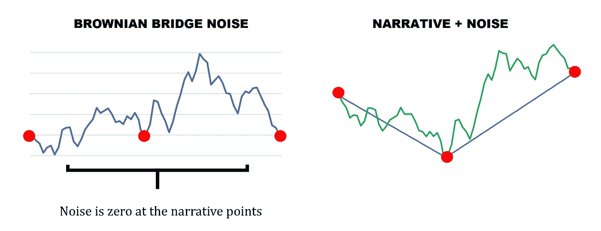

# **3。分类【这是机器学习部分】**

因为我们的数据是一个时间序列，我们完全处于时间序列分类的世界中。

但这是一个很大的世界。为了选择一种分类方法，我们将用一把大砍刀把它不相关的部分切掉。

首先，我们删减了用于*预测*目的的方法(例如，根据过去的数据猜测股票未来是涨还是跌)。那不是我们的任务。

然后，有一整类算法试图学习曲线的明确特征；2016 年对这一学派的评论见[1]。

显式特征对于那些对自己的数据没有太多假设的人来说非常有用，他们希望识别关键属性，以便能够生成类似的样本，或者描述哪些品质“造就”了某种具有代表性的事物。同样，也不是我们:

首先，我们已经对数据做了很多假设。另外，在样本和真实数据中，我们认为曲线的大部分只是随机噪声。

转向神经网络方法。在这里，我们分类，但不能完全描述一个类与另一个类的区别。最方便的是，今年 3 月发表的一篇文章回顾了时间序列分类的深度学习的不同方法[2]。

它有一个方便的图表，可以帮助我们进一步削减:和以前一样，我们对学习如何创建新样本的解决方案不感兴趣，我们对特征工程也不感兴趣:

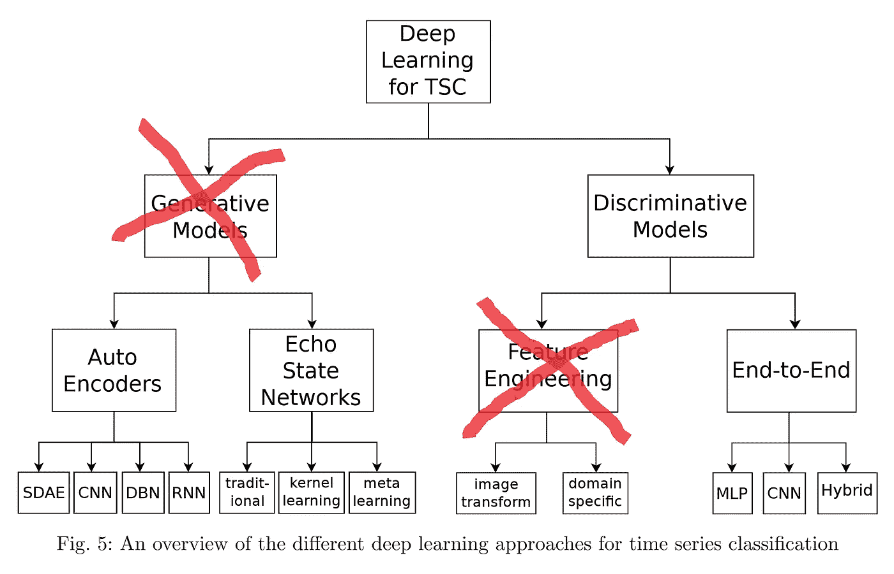

这给我们留下了端到端的方法。此外，这个名字承载着让生活变得简单的承诺，我觉得这非常有吸引力。

上述论文的结果表明，对于我们的一维问题(=所有东西都在一个轴上运动，这个轴就是时间)，在大多数数据集上表现最好的端到端方法是 ResNet。

作为一个最先进的图像分类器，这并不令人震惊。(这里有 [FastAi 解释它](https://course.fast.ai/videos/?lesson=7)，这里有 [PyTorch 源代码](https://pytorch.org/docs/0.4.0/_modules/torchvision/models/resnet.html)。我最终用 ResNet-34 获得了足够好的结果。

# **4。结果【这是好玩的部分】**

我几乎要让它听起来好像一切都立即工作。因为在现实世界中，任何人都只会关心:这有用吗？

起初，当然没有。但是出于非常有趣的原因。

**答:关于捏造数据**

当我看到最初的结果时，成功率并不大。但是很快就清楚了，对于许多曲线来说，尽管分类不同于*的意图*，但它的解释同样有效:

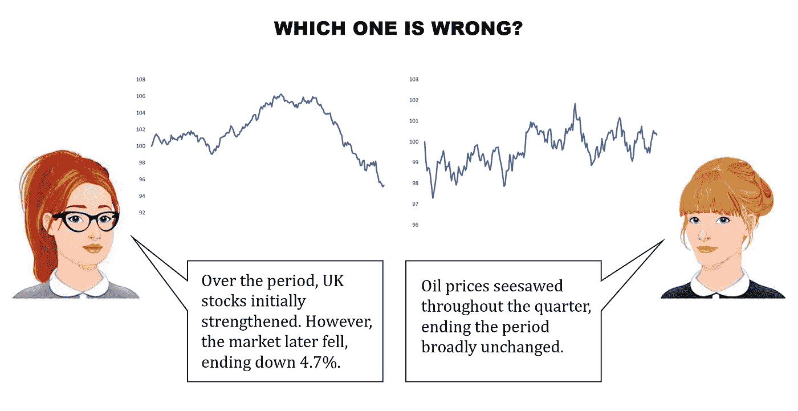

一旦我去除了噪音，重新训练了一个模型，当然，成功率激增；但这些数据不再像市场实际运行的那样。这意味着，一旦真正的噪音被加入，某些叙事类型之间的区别往往会变得模糊。

我发现这相当美妙:分类器本身往往不会出错*；它获得了我所希望的显著意义，只是以一种我认为不可信的方式。但这确实提出了一个问题:我到底应该致力于改善什么？*

*有一件事几乎立刻引起了注意，那就是，仅仅以时间序列作为输入，该模型很难推断出序列开始和结束之间的关系。但这意味着失去重要的信息，万一一个故事的结尾是相对于起点来定义的。*

*考虑到 ResNet 的工作方式，这并不奇怪，而且通过将输入更改为双倍序列也很容易解决:*

*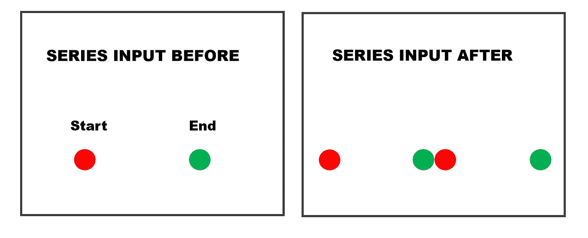*

*进一步的测试显示，对它来说，最难学习的事情之一是什么时候忽略噪音，看什么时候东西保持“差不多一样”。因此，解决性能问题的方法不是摆弄网络，而是更仔细地观察用于定义叙事的参数。我永远也不会完全摆脱因为能够讲述一条曲线的多个故事而产生的模棱两可。因此，我的目标是让它在捏造的数据上做得很好，但不是争取接近 100%的分类。最终，它在嘈杂的测试数据中达到了 85%以上的分类，错误很可能出现在密切相关的叙述中。*

***b .关于真实的过往数据***

*有了真实数据，一些正常化是必要的，以解释日本股市对油价的不同反应。例如，一些市场比其他市场有更多的内在差异。这些调整是利用我从 Investing.com[得到的历史数据完成的。](https://www.investing.com/markets/)*

*但是，即使试图做到严格，这样的调整也不是没有问题。例如，发达市场的股票一直受到永无止境的超级宽松货币政策的支撑，这导致了长期以来创纪录的低波动性。这意味着，即使分类器的噪声参数根据“真实市场数据”进行了调整，它们仍然偏向特定的经济环境。*

*尽管如此，结果还是不错的。*

*很自然，我想给这种说法加上一个数字，但这又让我们回到了起点:获取标签数据这个非常常见的问题。*

*因此，我将以最近几个月真实市场数据的一个小样本作为结束:*

*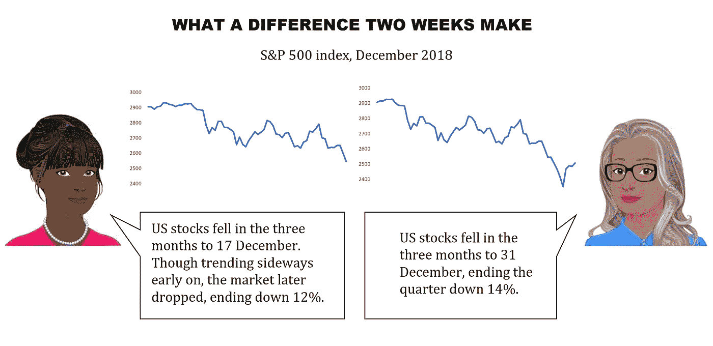**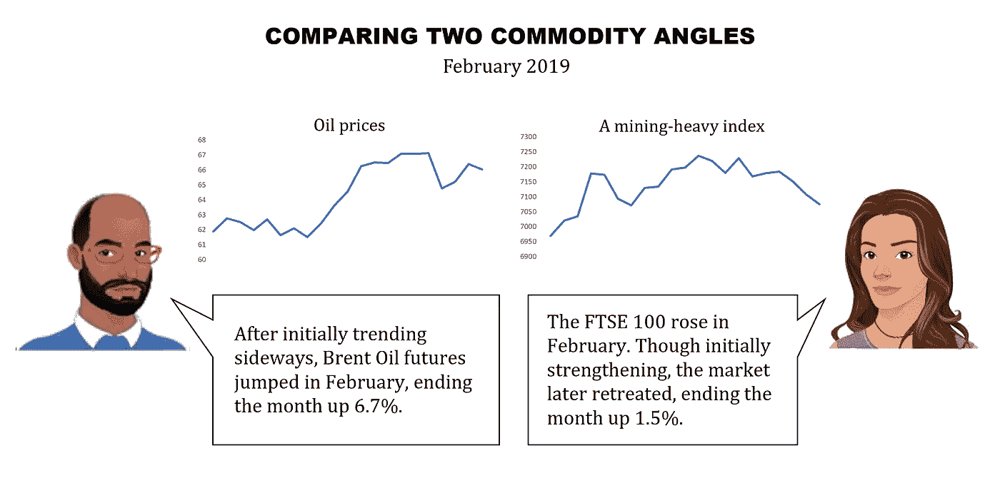*

# ***结论***

*前面，我提到了为什么人们不喜欢将解释局限于一些固定的叙述的方法。但我从没说过是什么让它如此伟大。*

*我们不仅仅在金融市场上有折线图。我们到处都有。*

*由于叙述结构不会改变，将现有系统应用到另一个领域的成本将是编写少量的自然语言组件，并可能微调参数(特别是噪声模式)。这似乎不是一个巨大的代价。*

*无论如何——原谅这个蹩脚的双关语——这是一个很好的学习曲线。希望你也喜欢它！*

***来源:***

*[1] A. Bagnall，J. Lines，A. Bostrom，J. Large，e .基奥，[The great time series class ification bake off:最近算法进展的回顾和实验评估](https://link.springer.com/article/10.1007/s10618-016-0483-9) (2016)，数据挖掘和知识发现。*

*[2] H. Ismail Fawaz，G. Forestier，J. Weber，L. Idoumghar，和 P.-A. Muller，[时间序列分类的深度学习:综述](https://arxiv.org/pdf/1809.04356v3.pdf) (2019)，Arxiv。*