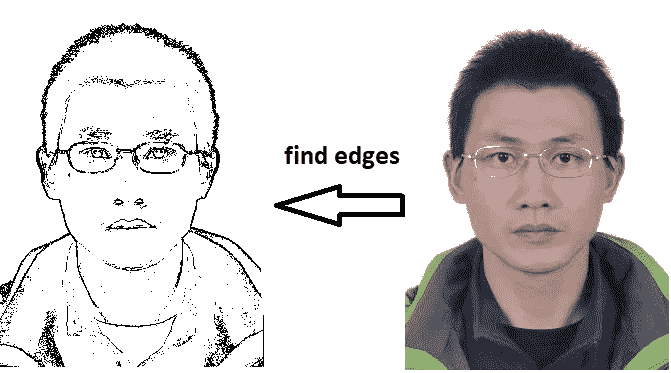

# 从头开始在 20 行代码中查找人脸边缘

> 原文：<https://towardsdatascience.com/find-face-edges-in-20-lines-of-code-from-scratch-8058e128c013?source=collection_archive---------23----------------------->



我在读一本机器学习的书，了解到边缘是机器学习图片中是否有物体(在这种情况下是人脸)的重要特征输入。看左边只有边缘的图形，人眼很容易分辨出是一张脸，不是吗？这同样有助于机器。

最初我认为寻找边缘本身需要一些“人工智能”。但我记得 Python PIL 库有 find_edges 过滤器，这绝对不是机器学习功能。然后，我开始思考如何找到边缘，并最终找到了一个非常简单的方法，只需要从头开始构建大约 20 行 Python 代码。

# 逻辑

我的逻辑很简单如下。

*   从上到下，从左到右扫描所有像素
*   如果像素与右侧或底部的相邻像素非常不同，则将其标记为边缘。

# 履行

我用 Python 代码实现了这一点，但是算法本身是独立于语言的。

以下是我们需要的库:

```
from PIL import Image
import numpy as np
import matplotlib.pyplot as plt
import math
```

如果你是 Python 新手，先安装 [Python3](https://www.python.org/downloads/) ，然后用 pip 安装需要的库。

`pip install -U Pillow numpy matplotlib`

首先，我们将图像读取为像素的 2D 阵列。每个像素是 3 个值[红、绿、蓝]的阵列，每个颜色值是 0 到 255，例如像素值[0，0，0]是黑色。

```
filename = 'old.jpg'
im = Image.open(filename)
im_array = np.asarray(im)
```

如果图像太大，您可以先调整其大小。

```
n = 2 # resize times
im = im.resize( (int(im.size[0]/n), int(im.size[1]/n)) )
```

其次，我们定义一个函数来度量两个像素之间的差异。我使用三个颜色值之间的均方差的平方根，就像均方根偏差( [RMSD](https://en.wikipedia.org/wiki/Root-mean-square_deviation) )。


difference between pixel a and b

例如，黑色像素 A 为[0，0，0]，白色像素 B 为[255，255，255]，因此 A 和 B 的平方根差为:

`sqrt(([255–0]**2 + [255–0]**2 + [255–0]**2)/3) = sqrt(255**2) = 255`。

注:x**2 表示 x*x。

这里有一个窍门。我们需要首先将像素值转换为 int 类型，即`int(a[i])`，以进行减法运算，因为像素值为 ubyte[0–255]，减法运算可能会变为负值，从而导致类型溢出问题。

然后我们从上到下，从左到右迭代图像数组。如果像素与其右侧或底部相邻像素之间的平方根差大于预定义的阈值，则将其标记为边缘像素，并将其设置为黑色[0，0，0]，否则将其设置为白色[255，255，255]作为背景。

main part

您可以微调图像的阈值`diff_threshold`。10 是我用来创建顶部图像的值。增加较少边的阈值。例如，通过增加到 20，我得到了一个新的图像如下。


最后，使用 matplotlib 将新的边缘图像保存到本地。

```
plt.imshow(new_array)
plt.savefig('new.jpg')
```

如果您想在弹出窗口中显示新图像，请使用下面的代码。

```
plt.imshow(new_array)
plt.show()
```

你可以在这里找到组合的完整代码[。](https://gist.github.com/peterjpxie/01595d4beb04e39ed97e6937d4424e7f)

# 笔记

请注意，这种算法不是专门针对人脸检测的。它可以找到所有图像的边缘。你自己试试。

感谢阅读。如有任何疑问，您可以通过 [Linkedin](http://linkedin.com/in/xiejiping) 联系我。