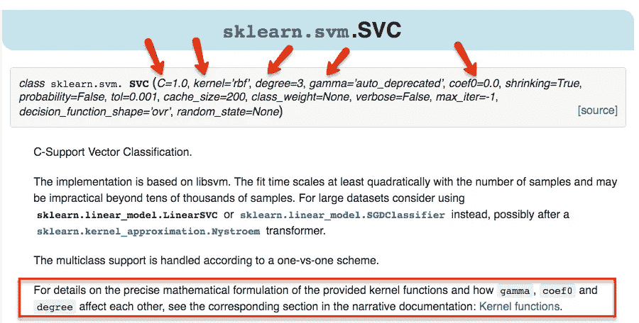
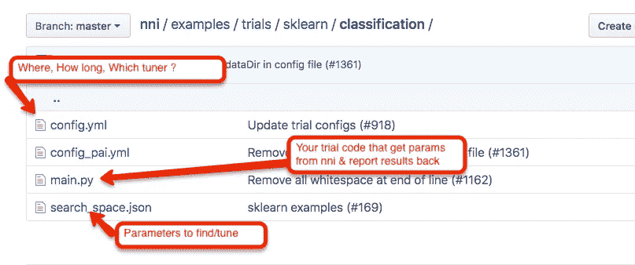
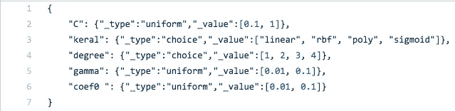
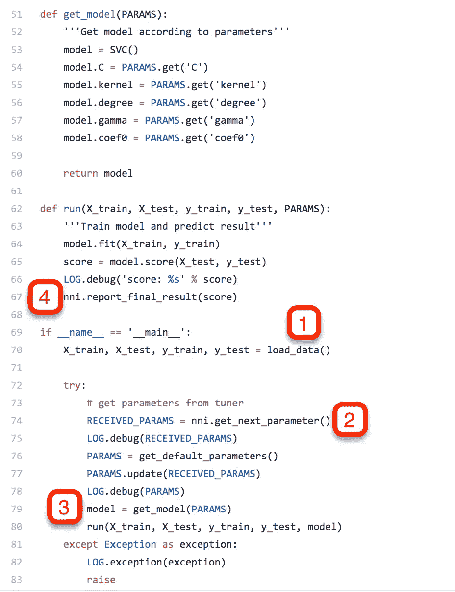
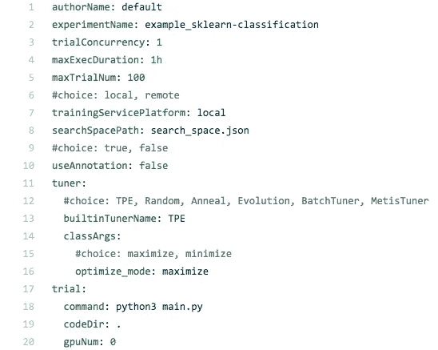
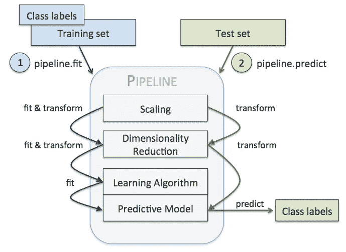
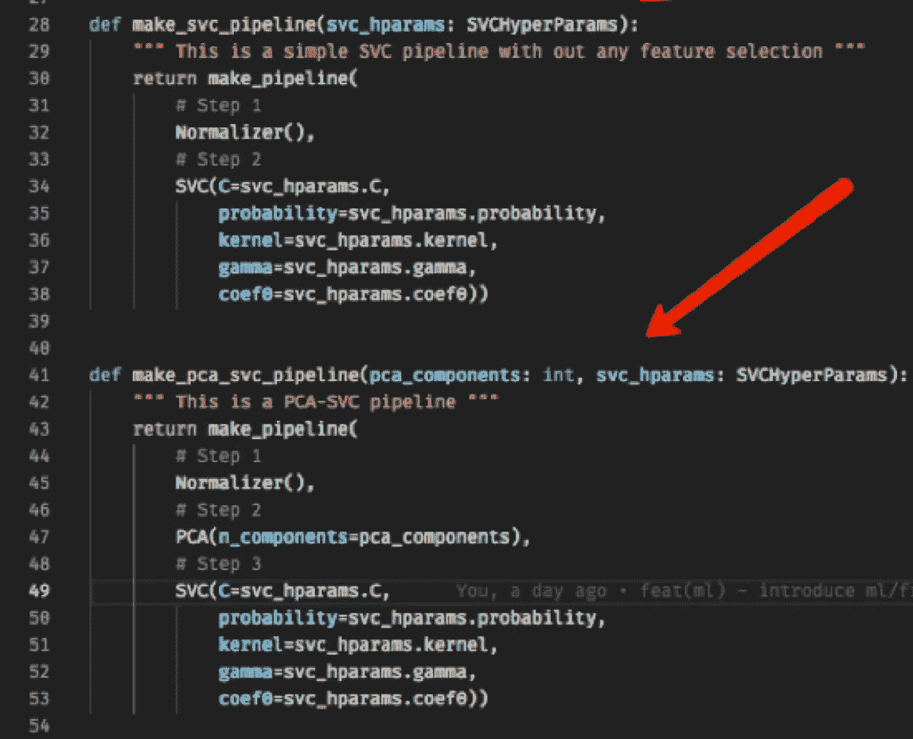
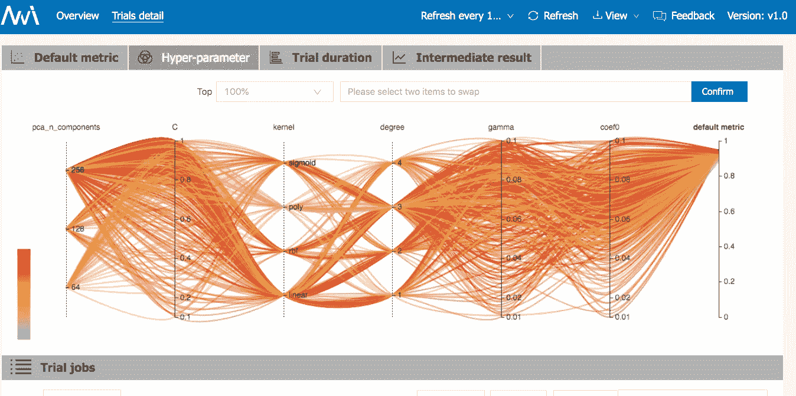

# 使用微软 NNI 查找 scikit-learn 管道的超参数

> 原文：<https://towardsdatascience.com/find-thy-hyper-parameters-for-scikit-learn-pipelines-using-microsoft-nni-f1015b1224c1?source=collection_archive---------29----------------------->


Source: [https://www.pexels.com](https://www.pexels.com/photo/person-woman-eyes-face-4636/)

# 什么是超参数搜索？

任何机器学习算法的目标都是**在样本数据中找到模式**，然后使用这些模式来预测给定的未知样本(测试)数据的结果。

机器学习算法学习的模式被编码在模型的权重(也称为参数)中。然而，机器学习算法可以应用于不同类型的数据，即使对于数据“类型”相同的情况，数据的分布也可能不同。

一个具体的例子，让我们看看 scikit-learn 的支持向量分类器(SVC)的 API。



Source : Screenshot of [https://scikit-learn.org/stable/modules/generated/sklearn.svm.SVC.html](https://scikit-learn.org/stable/modules/generated/sklearn.svm.SVC.html)

根据上图，您可以理解为不同类型和分布的输入数据集找到 C、核、度、Gamma 和 Coef0 的适当组合并不是一项简单的任务。

这些类型的参数(机器学习算法的输入，即上述示例中的 C、内核等)被称为超参数，找到它们的任务被称为超参数搜索或调整。

# 什么是微软 NNI？

微软 NNI(神经网络智能)是一个开源的神经架构搜索和超参数调整的 AutoML 工具包。

> **我了解超参数调优，但什么是 AutoML？**

实际上，在许多方面，超参数搜索/调整是一个叫做 AutoML 的大领域的一个子领域。也就是说，根据你在哪里阅读 AutoML，你可能会得到不同的印象。在这里，我提供了通常与 AutoML 相关的三个主要特性

**超参数搜索。**我的神经网络有多少层、神经元、宽度和深度？我的 SVM 的 C & gamma 值应该是多少？

**网络架构搜索(NAS)** 。神经网络中的哪种层组合可以产生最佳性能。例如，使用 NAS 发现了名为 **EfficientNet** 的最新领先 ImageNet 网络。我把这个定义过于简化了，但是希望你能明白其中的要点！

**基于云的 AutoML** 。云提供商公开了一项服务，并告诉我提供您的训练数据集并指定任务(分类或回归)，我将为您构建模型。回家睡觉吧！。这个定义意味着一个典型的机器学习管道的大部分(如果不是全部的话)方面(数据规范化、标准化、找到合适的算法、优化等)都是为你考虑的。这是一个自动化的机器学习。

还可以看到，上述特征很容易相互重叠。例如，有人可能认为网络架构搜索将/应该主要包括超参数搜索。

要进行超参数和架构搜索，一个简单的方法是尝试大量的组合，看看哪一个胜出！….但这不会有成效，不是吗？。这就是为什么有算法和技术的研究，为其他机器学习算法找到超参数。

这些超参数和架构搜索算法通常被称为 ***调谐器*** ，因为大多数时候它们从一组参数开始，然后根据看到的结果选择下一组参数。简而言之，他们*反复调整*它们。

微软 NNI 被称为工具包，因为

*   它已经实现了许多已知的艺术调谐器，并为您编写自己的框架。
*   它为您的实验提供编写、运行、记录和可视化支持。
*   您不仅可以在本地机器上运行您的实验，而且它还可以与各种编排系统(如 Kubeflow、OpenPAI 等)很好地集成。还有足够的扩展点来集成新的或专有的机器学习平台。
*   它支持大多数机器学习框架(Tensorflow、PyTorch、MXNET、Chainer 等)以及库(scikit-learn、xgboost、lightgbm 等)。

因此，它不仅提供了运行和可视化的工具，而且还可以扩展(因此是框架的概念)进行定制。

# 编写和运行一个简单的 NNI 实验(试用版)

尽管 GitHub repo 列出了支持的框架(Tensorflow、scikit-learn 等)，但对于大多数用例，微软 NNI 并不知道您正在使用的框架，甚至是您的培训模型。

下图显示了撰写典型试验所涉及的 3 种类型的文件:



Source : Screenshot of a trial example from [https://github.com/microsoft/nni](https://github.com/microsoft/nni)



Source: Screenshot of search-space.json

`search-space.json`该文件用于指定您正在搜索的超参数的范围！

这是您最终要编写的一种示例代码。



在这个例子中，您有一个 SVC 模型。进行试验包括 4 个步骤:

1)你加载你的数据。

2)你请求 NNI 给你试验参数。

3)将参数应用到正在训练的模型

4)你回分数。

基于`config.yml`文件中的`optimize_mode`(见下文)，调谐器将通过建议下一组模型的超参数来帮助最大化或最小化分数。

这里是一个例子`config.yml`的文件，它被用来指定这个试验的配置选项。即在哪里运行、应该运行多长时间以及使用哪个调谐器。所以让我们看看 config.yml 文件。



Source: Screenshot of example config.yml

在配置文件中，您还可以指定到`search_space.json`和`main.py.`的路径

运行实验的时间:

```
nnictl create --config <path_to>/config.yml
```

在执行上述命令后，您将在终端上看到如下所示的响应:

```
INFO: Starting restful server...
INFO: Successfully started Restful server!
INFO: Setting local config...
INFO: Successfully set local config!
INFO: Starting experiment...
INFO: Successfully started experiment!
--------------------------------------------------------------------
The experiment id is egchD4qy
The Web UI urls are: http://223.255.255.1:8080   http://127.0.0.1:8080
--------------------------------------------------------------------You can use these commands to get more information about the experiment
--------------------------------------------------------------------
         commands                       description
1\. nnictl experiment show        show the information of experiments
2\. nnictl trial ls               list all of trial jobs
3\. nnictl top                    monitor the status of running experiments
4\. nnictl log stderr             show stderr log content
5\. nnictl log stdout             show stdout log content
6\. nnictl stop                   stop an experiment
7\. nnictl trial kill             kill a trial job by id
8\. nnictl --help                 get help information about nnictl
--------------------------------------------------------------------
```

你现在可以用你的浏览器来查看 NNI 进行的各种实验。每个试验本质上对应于炒作参数的一个组合。

还可以选择使用命令(如上所示)来获取终端本身的实验和试验状态。命令应该是不言自明的。

# sci kit-学习管道

scikit-learn 是任何机器学习工程师最重要的库之一。它与许多优秀算法的实现捆绑在一起。scikit-learn 的一个我非常喜欢的特性是管道的概念。

管道旨在反映典型的机器学习实验，该实验由对输入特征的各种变换步骤组成，并最终以估计器(分类器或回归器)终止。转换器和估算器被称为流水线的组件。



在上图中，组件是缩放、降维、学习算法和预测模型。看看这些组件如何实现`fit, transform and predict`方法。

如果您与接口兼容，您还可以实现一个定制的转换器或估计器。

以下是如何使用 python 编写管道的示例:



Source: Author

上图中显示了两条管道-

a)make _ svc _ pipeline-标准化数据，然后应用 SVC

b) make_pca_svc_pipeline —规格化 pca(用于 dim 减少)和最终 svc

请注意，在这两个管道中，我是如何将所有的超参数(`pca_components & svc_hparams)` 作为函数的输入参数传递的。这样，我现在可以从 NNI 调谐器获得这些，并把它们传递给函数。

下面是 NNI 网络用户界面的一个标签的截图，显示了一个调谐器最后尝试的各种组合。



非常酷的可视化！我现在想编写由其他分类器组成的管道，例如，不使用 SVC，我想尝试 xgboost、lightgbm 等，但是我开始发现对于我的任务来说，这个过程是相当重复的，即对于每个实验编写`config.yml, search-space.json and pipelines + entrypoint script to get the parameters from NNI Tuner, return the score and invoke the pipelines.`

> 使用微软 NNI 进一步简化寻找 **scikit-learn 管道**的超级参数的任务不是很棒吗？

这就是我最终构建的东西，一个使用自省和配置文件来自动化上述步骤的小包。目前，我支持分类(很快也会支持回归)算法。

如果您对如何使用该软件包感兴趣，请继续阅读本文的其余部分。

# scikit-nni:一个小 python 包，用于自动搜索 scikit-learn 管道的超参数

```
pip install scikit-nni
```

sci kit-nni(【https://github.com/ksachdeva/scikit-nni】T2)是一个辅助工具(和一个软件包)，它:

*   生成 NNI 所需的配置(config.yml & search-space.json)
*   根据您的规范自动构建 scikit-learn 管道，并成为微软 NNI 运行的实验/试用代码

## scikit-nni 的特点

*   使用微软 NNI 搜索 scikit-learn 管道的超参数
*   定义管道不需要代码
*   内置数据源读取器，用于读取 npz 文件进行分类
*   支持使用自定义数据源读取器
*   定义 NNI 配置和搜索空间的单一配置文件

该软件包及其使用方法在 https://github.com/ksachdeva/scikit-nni[有很好的文档记录，所以请查看完整的文档和示例。](https://github.com/ksachdeva/scikit-nni)

简而言之，这是你最终会做的事-

在使用微软 NNI 时，你不用写 3 个(或更多)文件，你只需写一个配置文件。一个例子是-

看看`search-space.json` 和`config.yaml`是如何嵌入到这个配置文件中的。他们遵循与微软 NNI 相同的语法和惯例，所以我没有发明任何新的语法。最大的区别在于，您不是编写 python 代码，而是在配置文件本身中指定 scikit-learn 管道。阅读上述 YAML 文件中的注释。

你会意识到，这种自动化不仅有助于找到超参数，而且现在很容易尝试各种管道，而不必经历用代码编写它们、从 NNI 检索参数、发回分数和编写入口点脚本的麻烦。

一旦您编写了这个配置文件，然后发出以下命令:

```
sknni generate-experiment --spec example/pca_svc.nni.yml --output-dir experiments
```

像往常一样运行您的 NNI 实验，即现在发出以下命令

```
nnictl create --config experiments/pca-svc-classification/config.yml
```

然而，您需要做的是编写一个返回训练和测试数据的 callable。在存储库的文档中，我展示了如何根据项目的需求编写这样一个数据源。在不久的将来，我将为分类和回归需求捆绑一些常见的数据源。

将来会添加更多的数据源，但是您可以根据您的项目需求编写一个数据源。定制数据源的一个简单例子是

# 结束语

*   微软 AutoML 是一个真正设计良好的，可扩展的和文档化的解决方案
*   感谢 NNI，使用最先进的调谐器现在只是一个简单的配置问题，你不必狩猎和学习如何使用各种调谐器算法。
*   scikit-nni 利用微软 nni 来自动执行超参数搜索任务，而不需要在 python 代码中定义管道和实验。它还通过使用一致的语法将文件数量减少到 1 个来简化配置文件。

scikit-nni 非常新，请随时提交您可能遇到的任何问题([https://github.com/ksachdeva/scikit-nni](https://github.com/ksachdeva/scikit-nni))以及进一步改进它的想法。贡献总是被感激的！。