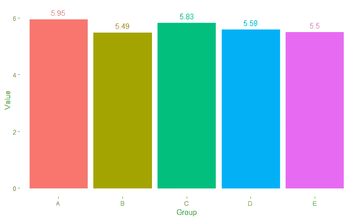
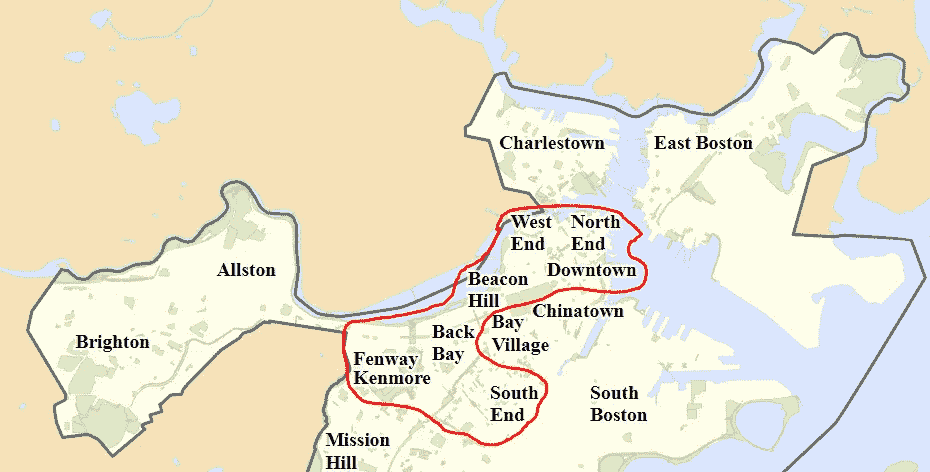
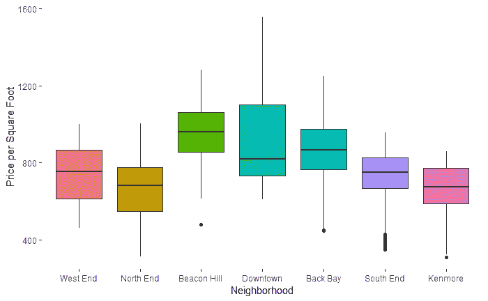
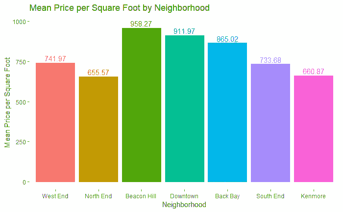
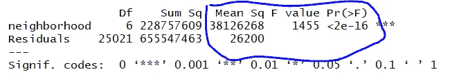
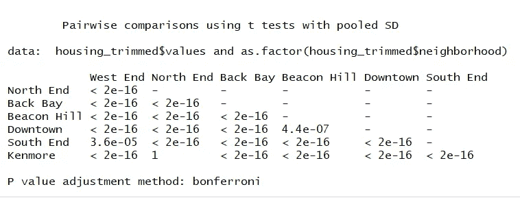
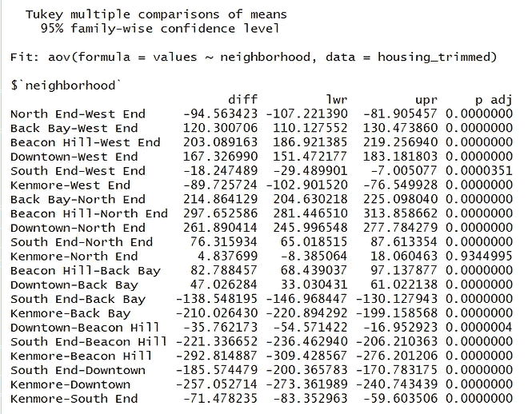
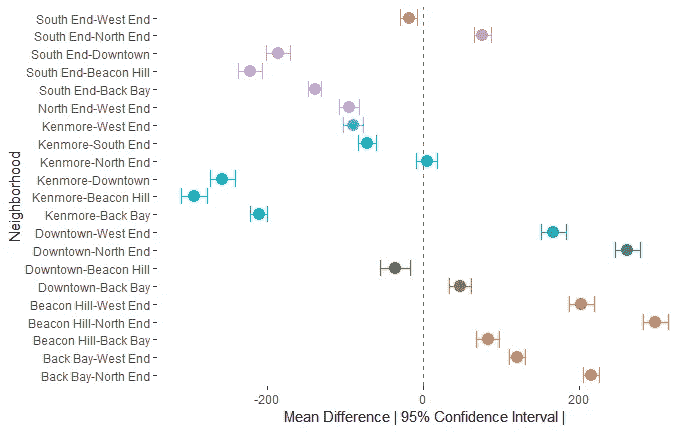

# 找到重要的差异

> 原文：<https://towardsdatascience.com/finding-a-difference-that-matters-21867ffa56c9?source=collection_archive---------18----------------------->

## 确定波士顿最昂贵的社区

A view of Back Bay, Boston

你运行一个分析，你会得到这样的结果:

平均值实际上是不同的吗？当有方法将统计的严谨性放在发现的后面时，不应该对“这看起来足够不同”做出决定。结果可能在两个方向上都令人惊讶——微小的差异可能具有重大意义；巨大的差异可以缺少它。

当我在我正在从事的 MSBA 项目中了解到这些概念时，我认为做一个案例研究来解释这些概念会很有趣。

*在 Github 上的项目代号是* [*这里是*](https://github.com/jordanbean/Boston-ANOVA) *。*

**波士顿的街区都一样贵吗？**

我以前写的一篇文章试图预测我居住的城市波士顿的房价。提高性能的一个关键因素是为属性所在的邻域添加一个变量。

如果邻域很重要，这意味着我们应该能够首先从统计上证明平均值之间存在差异，然后进入下一个层次，了解邻域之间的比较。

**数据探索**

为简单起见，我将提取最昂贵且位于市中心的街区:芬威/肯莫尔、后湾、比肯山、西区、北端、市中心和南端:

我还通过按邻域移除值的顶部和底部的 10%来将值修剪到中间的 80%,以考虑异常值和极值。由于分析是基于受异常值影响的平均值进行的，我们希望尽可能创建最具代表性的数据集。我们将分析每平方英尺的价格，作为最昂贵的替代。

让我们先来看看数据的分布:

我们看到不同群体之间存在一些差异。比肯山的中间值最高，但市区的第 75 个百分点高于比肯山。西区、北端、南端和肯莫尔都有类似的分布，但在第 25 和第 75 百分位之间有不同程度的分离。哪些是真正不同的？你能自信地说吗？

当看平均值时，我们看到比箱线图多一点的变化。视觉上，我们会说比肯山最贵，北端最便宜。这是真的吗？

**确定差异**

ANOVA 或方差分析衡量的是数据中一系列组的平均值相同的可能性。它通过测量“组间方差”和“组内方差”来做到这一点。

*组间方差*

组间方差和:每组的平均值减去总数据集平均值的平方，再除以自由度。

让我们把它翻译成英语。修整数据集中所有值的平均值为 788.55 美元。按邻域划分的平均值如上图所示。对于每一个平均值，我们减去 788.55 美元，对结果求平方，然后求和。自由度是样本平均数(7)减 1。

*组内方差*

简单地说，对于每个组，这是组的数量(7)减去 1 倍组的方差。然后，我们将这些值相加，除以观察总数(25，028)减去样本平均数(7)。

*方差分析*

与 ANOVA 相关的统计值 F 值是组间方差的*除以组内方差*的*，并创建一个分布，我们根据该分布计算所有组具有相同均值的可能性(p 值):*

解释上述内容的方法是，如果 p 值(Pr(>F))小于我们的显著性水平(通常为 0.05)，我们“拒绝零假设”，即所有平均值都相等，并得出组间平均值不同的结论。

> *这并没有告诉我们哪些群体是不同的，只是说有差异*。

这个发现给我留下了疑问。主要是，哪些不一样？

*成对比较和 Tukey HSD*

成对比较和 Tukey HSD(“真正的显著差异”…是的，确实是这个名字)是一种查看特定值对并确定其差异显著性的方法。

再说一次，让我们把它变成现实。笔架山比市区贵吗？肯莫尔比北端贵吗？

下面左边的成对表的解读方式是对于每一对(即左上角的北端和西端)，均值相等的概率是多少？较低的值意味着平均值不太可能相等。

对于 Tukey HSD，它计算平均值的差异并围绕该差异创建一个置信区间，查看 95%置信区间(“lwr”和“upr”)是否包含范围内的 0。如果有，那么平均值没有显著差异，因为 0-表示没有差异-是一个看似合理的值。否则，差异是显著的。如果“diff”为负，则第一个邻域比第二个更便宜，反之则为正。

Pairwise Comparison (left) and Tukey HSD (right)

我更喜欢视觉，所以我们来看一下图中的 Tukey HSD:

*但这意味着什么呢？*

比肯山看起来比市中心更贵。现在，我们可以说它是。95%置信区间不包含 0，差异具有统计学意义。我们现在有把握地知道，在 2018 年，每平方英尺的评估值在灯塔山最高，其次是市中心，然后是后湾。

事实上，在我们的样本社区中，唯一没有统计学意义的一对是肯莫尔和北端；我们不能断定这两个街区的平均值在每平方英尺的水平上是不同的。

**业务含义和结论**

方差分析和相关统计在商业中的应用非常广泛。例如，如果我们关注市场中不同公司的表现，我们想问的第一个问题是:

*   是否有机会在市场中脱颖而出？

如果所有平均值在统计上是相同的，那么公司不得不超越业绩来真正影响客户赢得率(服务、产品范围等)。).换句话说，如果产品性能是赢得合同的基准标准，那么下一级投资资本应该投向哪里才能真正实现差异化？

一旦我们确定了差异化的机会所在，我们就想知道:

*   公司差异化在哪里？

这时，我们可以进行成对比较或 Tukey HSD 来确定公司之间的差异。文章开头图表中 A 组的 5.95 分和 C 组的 5.83 分实际上有区别吗？

结果是在给定的市场中理解:

*   哪里有差异化的机会？
*   如今的公司差异化在哪里？
*   公司应该如何分配资本(M&A、R&D 等)。)是在差异化标准上加倍努力，还是加快对表现不佳的改进？

我坚信学习的实际应用，虽然对我每天都知道和经历的社区进行分析很有趣，但对商业的影响以及这些可以做什么的探索更重要也更有趣。