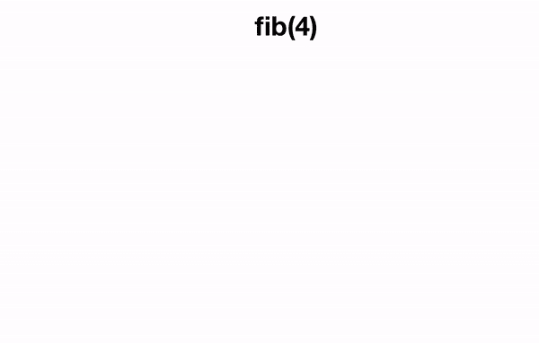

# 递归程序设计

> 原文：<https://towardsdatascience.com/finding-a-recursive-solution-184784b0aea0?source=collection_archive---------7----------------------->


## 如何通过假装你已经解决了问题来解决问题

尽管递归的概念经常在大多数项目的早期就被引入到编程中，但在第一次遇到它时，它可能看起来很奇怪，并且可能会令人不快。这看起来几乎是自相矛盾的:我们如何能够用一个问题的解决方案找到另一个问题的解决方案？


Recursion can be a bit of a headache

对于那些试图掌握递归概念的人来说，我经常觉得首先认识到递归不仅仅是一种编程实践是有益的——它是一种解决问题的哲学，适用于可以处理和部分解决的问题，而问题的其余部分保持同样的形式，但在某些方面更容易或更小。这不仅仅适用于编程中的函数；我们可以用递归构造简单的日常问题。举个例子，就拿我来说，写这篇文章:假设我想写 1000 字左右，如果我的目标是每次打开都写 100 字，那么第一次写 100 字，给自己留 900 字。下一次，我写 100 字，只剩 800 了。我可以继续这样写，直到我剩下 0 个字。每次，我都部分地解决了问题，剩下的问题正在减少。

撰写我的帖子的代码可能是这样的:

```
write_words(words_left):
  if words left > 0:
    write_100_words()
    words_left = words_left - 100
    write_words(words_left)
```

我也可以迭代地实现这个算法:

```
write_words(words_left):
  while words_left > 0:
    write_100_words()
    words_left = words_left - 100
```

如果你用任一实现完成函数调用`write_words(1000)`,你会发现它们有完全相同的行为。事实上，每一个我们可以用递归解决的问题，我们也可以用迭代来解决(`for`和`while`循环)。那么我们为什么会选择使用递归呢？


Me writing this post recursively

## 为什么是递归？

信不信由你，一旦我们掌握了它，有些问题用递归比用迭代更容易解决。有时候递归效率更高，有时候可读性更强；有时递归既不更快也不更可读，但实现起来更快。有些数据结构，如树，非常适合递归算法。甚至有一些编程语言没有循环的概念——纯函数式语言如 Haskell 完全依赖递归来迭代解决问题。要点很简单:你不必理解递归就能成为一名程序员，但是你必须理解递归才能成为一名优秀的 T4 程序员。事实上，我甚至可以说理解递归是成为一个好的问题解决者的一部分，除了编程！

## 递归的本质

一般来说，使用递归，我们试图将一个更复杂的问题分解成一个简单的解决步骤和一个更简单的相同问题的剩余部分。然后，我们可以重复这个过程，每次都朝着解决方案迈出相同的一步，直到我们用一个非常简单的解决方案解决我们的问题(称为基础案例)。我们基础案例的简单解决方案与我们实现目标的步骤聚合在一起，然后形成我们原始问题的解决方案。


We can solve P by breaking the problem into a step towards the solution and a remaining smaller problem of the same form as the original, until we reach a simple solution to a small problem (a base case).

假设我们得到一些数据类型的实际数据，称之为 dₒ.递归的思想是假装我们已经解决了问题，或者根据我们需要定义的某种难度*度*计算了比 dₒ简单的这种数据类型的所有形式的期望函数*f*。然后，如果我们能找到一种方法，用一个或多个 *f(d)* s 来表达 *f(dₒ)* ，其中所有这些 *d* s 都比 *dₒ* 更容易(具有更小的*度*),那么我们就找到了一种方法来简化和求解 *f(dₒ)* 。我们重复这个过程，希望在某个时候，剩下的 *f(d)* s 会变得如此简单，以至于我们可以轻松地对它们实现一个固定的、封闭的解决方案。然后，当我们对越来越简单的问题的解决方案聚集并级联到顶部时，我们对原始问题的解决方案就会显现出来。

在上面写这个帖子的例子中，数据是这个文档中包含的等待写的文本，难度的*度*是文档的长度。这是一个有点做作的例子，但假设我已经解决了如何写 900 字的问题 *f(900)* ，那么解决 *f(1000)* 我需要做的就是写 100 字，然后执行我的 900 字的解决方案， *f(900)* 。

一个更好的例子是考虑斐波那契数列，其中第一个斐波那契数列是 0，第二个是 1，第*个* ᵗʰ斐波那契数列等于前两个的和。假设我们有一个斐波纳契函数，它告诉我们 *n* ᵗʰ斐波纳契数:

```
fib(n):
  if n == 0:
    return 0
  if n == 1:
    return 1
  else:
    return fib(n-1) + fib(n-2)
```

这个函数的执行是什么样子的？让我们试试`fib(4)`:



Visualisation of a recursion tree showing the recursive computation that leads to fib(4) = 3, notice that computation is performed depth-first.

递归解决问题时采用的一个有用的口头禅是'*假装它'直到你成功'*，也就是说，假装你已经解决了一个简单情况的问题，然后尝试减少更大的问题，以使用这个更简单情况的解决方案。如果一个问题适合递归，实际上应该只有少量的简单情况需要你显式地解决，也就是说，这种化简为简单问题的方法可以用来解决所有其他情况。这在斐波纳契例子`fib`中举例说明，其中定义`fib(n)`我们只是像已经计算过`fib(n-1)`和`fib(n-2)`一样行动，正如我们所希望的，这级联并减少问题到逐渐更简单的情况，直到我们到达`fib(0)`和`fib(1)`，它们有固定和简单的解决方案。


Fake it ’til you make it!

# **递归策略**

递归有点微妙，实际上取决于你试图解决什么问题。然而，我们可以想出一些大致的步骤，这些步骤或多或少可以把我们引向正确的方向。这一战略包含三个步骤:

1.  订购您的数据
2.  解决小案子
3.  破大案

正如我以前说过的，我认为在我们学习的时候举一个例子是有用的，但是记住递归是依赖于问题的，所以在这里试着把重点放在一般的原则上。我们将使用反转字符串的简单示例，即我们希望编写函数`reverse`使得`reverse('Hello world') = 'dlrow olleH'`。我建议回去看看这些步骤是如何应用于斐波那契函数的，然后在其他一些例子中尝试一下(网上有很多练习)。

## **订购您的数据**

这一步绝对是开始递归解决问题的关键，然而它经常被忽视或被隐含地执行。无论我们在操作什么数据，无论是数字、字符串、列表、二叉树还是人，都有必要明确地找到一个合适的排序，给我们一个方向，让问题变得更小。这种排序完全取决于问题，但一个好的开始是考虑明显的排序:数字有自己的排序，字符串和列表可以按长度排序，二叉树可以按深度排序，人可以按无限多种合理的方式排序，例如身高、体重或在组织中的排名。如前所述，这种排序应该与我们试图解决的问题的难度相对应。


Order that data, yee-haw!

一旦我们对数据进行了排序，我们就可以认为它是我们可以减少的东西。事实上，我们可以把我们的排序写成一个序列:

*0* ， *1* ， *2* ，…， *n* 为整数(即对于整数数据 *d* ，*度(d) = d* )

[]，[■]，[■，■]，…，[■，… , ■]用于列表
(注意 len = 0，len = 1，…，len = n，即用于列表数据 *d* ，*度(d) = len(d)* )

从右到左，我们通过一般(“大”)情况，到基本(“小”)情况。对于我们的`reverse`例子，我们正在操作一个字符串，我们可以选择字符串的长度作为问题的排序或*度*。

## 解决小案子

这通常是容易的部分。一旦我们有了正确的排序，我们需要查看排序中的最小元素，并决定如何处理它们。通常有一个显而易见的解决方案:在`reverse(s)`的情况下，一旦我们到了`len(s) == 0`并且我们有了`reverse('')`，那么我们就知道我们的答案，因为反转空字符串不会做任何事情，也就是说，我们只是返回空字符串，因为我们没有要移动的字符。一旦我们解决了我们的基本情况，并且我们知道我们的排序，那么解决一般情况就像以这样一种方式减少问题一样简单，即我们正在操作的数据的*度*向基本情况移动。我们需要小心，不要遗漏任何小的情况:它们被称为基本情况的原因是因为它们覆盖了排序的基础——在更复杂的递归问题中，遗漏基本情况是常见的，因此归约步骤越过了我们排序的合理末端，并开始对无意义的数据进行操作，或者导致错误。

## 破大案

这里，我们在排序中向右处理数据，也就是高度数据。通常，我们考虑任意*次*的数据，并旨在通过将其简化为包含较小*次*的相同问题的表达式来找到解决问题的方法，例如，在我们的 Fibonacci 示例中，我们从任意 *n* 开始，并将`fib(n)` 简化为`fib(n-1) + fib(n-2)`，这是一个包含我们开始时的问题的两个实例的表达式，具有较小的*次(n-1* 和 *n-2*


Big case?

当谈到`reverse`时，我们可以考虑长度为 *n* 的任意字符串，我们可以假设我们的`reverse`函数对所有长度小于 *n 的字符串都有效。*我们如何利用这一点来解决长度为 *n* 的字符串的问题呢？嗯，我们可以把字符串反过来，除了最后一个字符，然后把最后一个字符放在前面。在代码中:

```
reverse(string) = reverse(string[-1]) + reverse(string[:-1]) 
```

其中`string[-1]`对应最后一个字符，`string[:-1]` 对应没有最后一个字符的字符串(这些都是 pythonisms)。最后一个`reverse(string[:-1])`项是我们的原始问题，但是是在一个长度为 *n-1* 的字符串上操作的，也就是说，我们已经将我们的原始问题表述为向解决方案迈进了一步，并结合了相同的降阶问题。

将我们的`reverse`函数的解放在一起，我们得到如下结果:

```
reverse(string):
  if len(string) == 0:
    return ''
  else:
    return string[-1] + reverse(string[:-1])
```


Visualisation of recursive function reverse operating on some sample data.

通常需要考虑不止一种递归情况，因为给定数据类型的数据可以采用稍微不同的形式，但这完全取决于问题。举个例子，如果我们想展平一个项目列表，其中一些项目本身就是列表，我们需要区分从列表中取出的项目是单个项目还是子列表，这至少会导致两种递归情况。

## 最终提示

提高递归的唯一真正方法是练习。在网上看看成千上万的递归问题中的一些，或者挑战自己提出你认为可能适合递归的问题。一旦你不可避免地掌握了递归的窍门，记住如果你发现自己很难递归地解决问题，那么尝试迭代。除了学习成为更好的程序员，递归还是一种解决问题的方法，让你的生活变得更容易。如果一个问题不适合递归，它就是不适合递归；当你花更多的时间处理那些适合递归或迭代方法的问题时，你会对此有一种感觉。

有时在更困难的递归问题中，我们上面看到的策略中的第 2 步和第 3 步采取了更循环的反馈循环过程的形式。如果你不能快速找到问题的整体解决方案，最好的过程是解决你能想到的递归/'大'案例，解决你能想到的基本/'小'案例，然后看看你的方法如何在不同的数据片段上突破。这将揭示任何缺失的基础和递归案例，或者任何相互之间交互不良并需要重新思考的案例。

最后，回想一下，知道您的排序是解决递归问题的最重要的步骤，您的目标始终是涵盖这种排序的向右(递归)和最左(基本)情况，以解决给定类型的所有数据的问题。


这是一个总结——感谢阅读！

如果你喜欢这篇递归介绍，请随时联系我( [*汤姆·格里格*](https://medium.com/u/de201d936fa2?source=post_page-----184784b0aea0--------------------------------) *)，对未来的博文有任何想法、疑问或建议！*

*现在，回到我的数据科学帖子，敬请关注！*