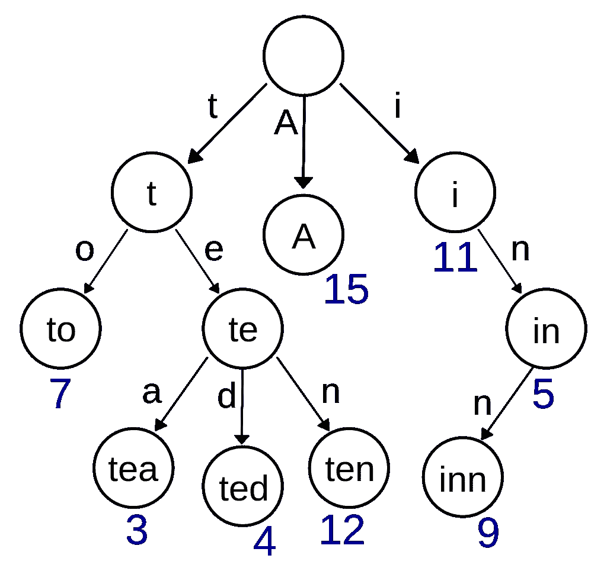

# 使用 Trie(前缀树)查找字符串中的所有单词

> 原文：<https://towardsdatascience.com/finding-all-words-inside-a-string-using-a-trie-prefix-tree-b721ea2f8b6f?source=collection_archive---------24----------------------->

## 如何使用 Trie 来存储前缀，以便在字符列表中查找句子。

A Trie example, Wikipedia Commons. [https://en.wikipedia.org/wiki/Trie](https://en.wikipedia.org/wiki/Trie)

找到字符列表中的所有单词是一个有趣的挑战，可能有很多方法可以做到。例如，我们以字符串“thedogatethecat”为例，它可以通过两种方式进行解析。第一个是“那只**狗吃了**猫”&第二个是“那只**做门**猫”，两个版本在语法分析上都是正确的，但其中只有一个对我们人类是正确的。

下面的解决方案将找到两个版本，并不会试图找出哪一个在语法等方面更正确。

这个想法是使用英语中的所有单词创建一个前缀树或 Trie 树，然后逐个字母地找出 Trie 树中是否有单词。很明显，有一些关于复杂性的问题，但是使用 Trie，我们将我们的词汇表中的搜索复杂性降低到 O(M ),其中 M 是您要搜索的文本的长度，而不是搜索 O(N ),其中 N 是词汇表的长度。值得注意的是，Trie 的空间复杂度更高，如果你对它感兴趣，可以在 Google 上搜索这个话题。

然而，最终的时间复杂度略高于 O(M ),因为我们是逐字母递归搜索，所以我把计算留给读者作为练习。

在运行下面的代码之前，请通过“pip install pytrie”来安装 [PyTrie](https://github.com/gsakkis/pytrie/) 。我们用字符串中所有可能的单词填充 Trie，显然，我们可以添加额外的单词，但这不会增加这个例子的价值。对于真实世界的例子，请使用适当的英语词典。我们一个字母一个字母地迭代，直到找到一个有效的前缀，递归地发送字符串的其余部分，继续搜索，在返回的路上收集所有结果。

输出应该很清楚，第一个例子是测试 Trie 中的' t '，' th '，然后是' The '，一旦找到，字符串的其余部分将从单词' the '的末尾开始递归处理。

我们可以看到，我们要找的两个句子被算法找到了。在收集了所有有效的句子之后，我们大概可以使用一个英语单词嵌入模型来看看我们的句子在全球范围内是否有意义。

Ori Cohen 博士拥有计算机科学博士学位，专注于机器学习。他领导着 Zencity.io 的研究团队，试图积极影响市民的生活。