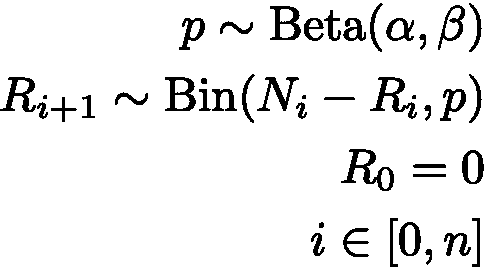
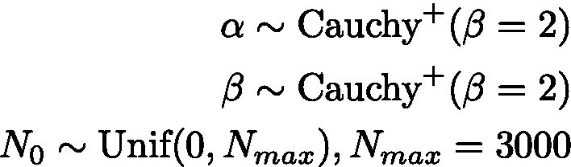
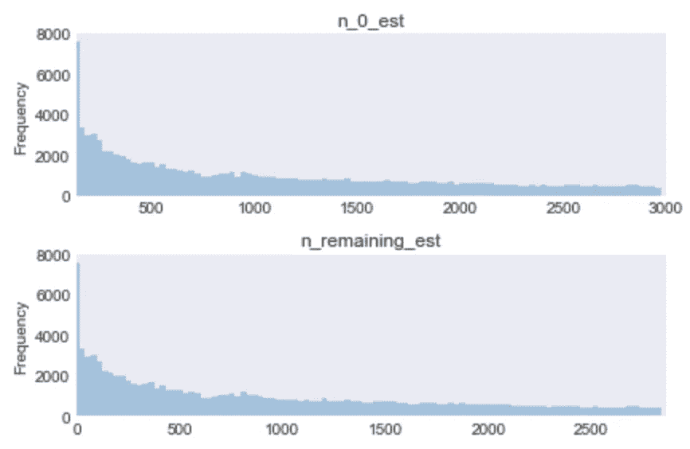
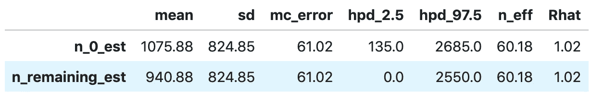
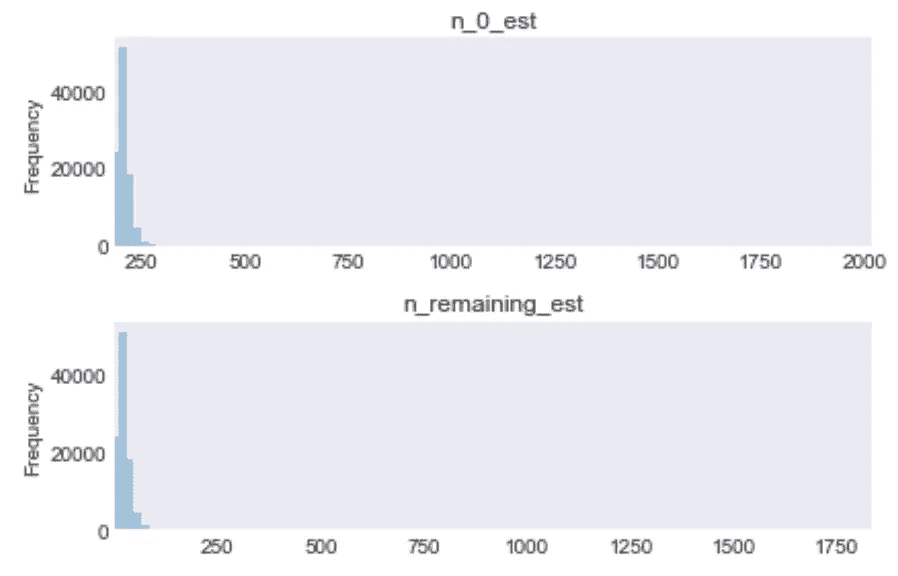
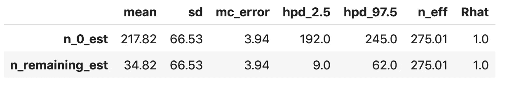
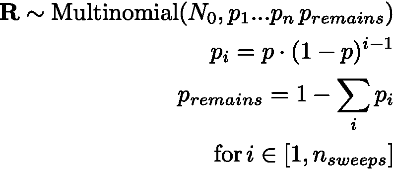
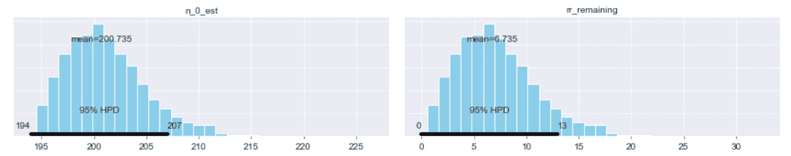
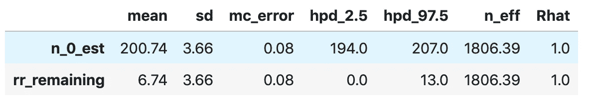
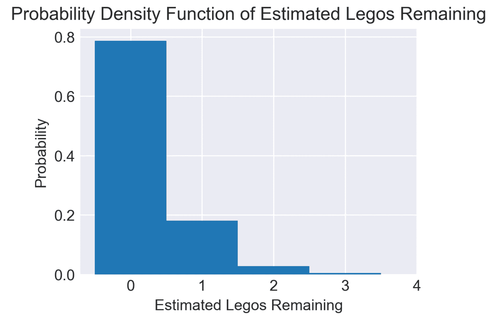

# 寻找贝叶斯乐高——第二部分

> 原文：<https://towardsdatascience.com/finding-bayesian-legos-part-2-a1b88674166a?source=collection_archive---------26----------------------->

## 一次拯救一只脚


*Photo by* [*Markus Spiske on Unsplash*](https://unsplash.com/photos/C0koz3G1I4I)

[上一集《寻找贝氏乐高积木》](/https-medium-com-hankroark-finding-bayesian-legos-part1-b8aeb886afba)，我和我亲爱的朋友乔试图找到一种方法来帮助乔树立信心，让他相信他已经捡起了他的孩子们留下的所有乐高积木。我的第一个建议是，我们通过对乔进行实验来确定他在任何给定的房间范围内捡一个乐高积木的概率，从而确定乔在捡乐高积木方面有多好。乔说，“不，继续这个计划！我真的不喜欢拿起乐高玩具。你就不能找个更好的办法吗？”

> "告诉我更多关于你如何收拾孩子的事."

乔向我解释说，他通常会在孩子们上床睡觉后再去拿乐高玩具。乔喜欢每天晚上读点书或看看电视来放松一下。在这本书的两章之间，或者在电视广告中，他会拿起乐高玩具快速扫一扫。第一次扫描似乎获得了大部分的乐高积木，每次扫描都获得了前一次扫描中遗漏的部分。他一直这样做，直到他收工睡觉。

> “乔，我想我们可以这样做。”

下次乔拿起乐高玩具时，我会让他做一点小工作。我让他数一数每次他捡了多少个并记录下来。他很不情愿地同意了，但是任何可以帮助他获得信心的事情，当他第二天早上起来走向咖啡机的时候，他都不会踩到乐高积木。

```
import numpy as np
import matplotlib.pyplot as plt
plt.style.use('seaborn-darkgrid')np.random.seed(42)  # It's nice to replicate even virtual experimentsimport pymc3 as pm
import scipy.stats as stats
print('Running on PyMC3 v{}'.format(pm.__version__))
> Running on PyMC3 v3.6
```

## 乔汇报道

几天后，我收到乔的电子邮件:他已经按照要求做了。Joe 报告说，他扫了六次，每次都捡了以下数量的乐高积木:

```
Removed[1:]
> array([135,  48,  11,   4,   3,   0])
```

那天晚上，我邀请乔过来吃晚饭，做一些贝叶斯分析。

## 与 PyMC 共进晚餐

在吃完我们的羽衣甘蓝、鳄梨和黑豆玉米煎饼碗的晚餐后，乔和我舒适地围着大屏幕进行分析。

我向乔解释说，每次他打扫房间时，就好像每个乐高都有可能被捡起来。我们不知道到底有多少乐高积木，这就是我们试图用概率来确定的。然后，Joe 可以将这个数字与他获得的总数进行比较，看看他是否想再进行一次传递。因为我花了几天时间来解决这个问题，所以我画了一个模型，然后回去解释它:



在这种情况下， *p* 表示乔捡起一个乐高积木的概率。概率 *p* 被建模为[贝塔分布](https://en.wikipedia.org/wiki/Beta_distribution)(在第 1 部分中我们介绍了为什么使用贝塔分布)。剩余的乐高数是 *N_i* ，在 *i* 扫完被乔捡起的乐高后；乔总共扫了 n 次。每扫一次，我就移除一个乐高积木。我们试图确定的是 *N₀* ，乔的后代最初留下的乐高积木的数量。 *R₀* 被设置为零处理边界条件，其中乔在第零次扫描时拾取零个乐高积木。

为了完成这个模型，我们需要一些关于 *N₀* 、 *α* 、 *β* 的先验分布。与第一集一样，我们选择参数，使建模前的分布信息较弱:



先验概率分布的参数与第一集相同。我问乔他的孩子可能会留下的绝对最大乐高玩具。Joe 估计大约有 2000 个，所以为了安全起见，我选择了最大值，*N _ max*3000 个，并使用 0 和 *N_max* 之间的先验概率的均匀分布来模拟留下的乐高积木的初始数量。

现在剩下的就是在 PyMC 中制作模型，并检查结果，看看它们是否能帮助 Joe。

## 模型设置和拟合

从模型到 PyMC 代码的转换实际上是一种直接的转换，并且适合默认的不掉头采样器。经过一番折腾后，调优样本的数量超过了默认值，目标接受率也比正常情况下设置得稍高一些；这样做是为了处理这个问题中的一些有问题的后验。很好，PyMC 库通过模型拟合检查和突出可能的问题，很好地帮助用户调整这些参数。

我想让乔在每次清扫后大概知道还剩多少乐高积木。这将有助于 Joe 更好地决定何时停止，因为我知道 Joe 非常想减少他在乐高玩具收集上投入的精力。这样，我们将从最少的信息开始，仅是在第一次扫描中删除的数字。此外，还包括了剩余乐高玩具估计数量的确定性计算，主要是为了让 Joe 更容易确定剩余的乐高玩具数量。即使 *n_remaining_est* 是确定性的，它也是随机变量，因为 *n_remaining_est* 的两个输入变量是随机变量。

```
sweep_model = pm.Model()with sweep_model:
    n_0_est = pm.DiscreteUniform('n_0_est', lower=0, upper=3000)
    alpha_sweep = pm.HalfCauchy('alpha_sweep', beta = 2.)  
    beta_sweep = pm.HalfCauchy('beta_sweep', beta = 2.)    

    p_sweep = pm.Beta('p_sweep', alpha=alpha_sweep, beta=beta_sweep)
    removed_sweep_1 = pm.Binomial('removed_sweep_1', p=p_sweep, 
                                   n=n_0_est, observed=Removed[1]  )
    n_remaining_est = pm.Deterministic('n_remaining_est', n_0_est - removed_sweep_1)with sweep_model:
    trace = pm.sample(50000, tune=7500, random_seed=123, progressbar=True, nuts_kwargs={"target_accept":0.95})
```

## 模型评估

完成模型拟合后，Joe 和我快速浏览了一下轨迹图。我们关注的是乐高玩具的初始数量和第一次扫描后剩余的估计数量。

不幸的是，仅仅一次清扫后，剩余的乐高积木数量与清扫前相比并没有减少多少。从数学直觉来看，这是有意义的:有两个参数需要估计，捡起一个乐高的概率和乐高的初始数量，但只有一个已知变量，第一遍捡起的乐高数量。仅仅用一个已知方程来求解两个未知变量是很困难的。

```
pm.traceplot(trace, varnames=['n_0_est', 'n_remaining_est'], combined=True);
```



```
pm.summary(trace, varnames=['n_0_est', 'n_remaining_est']).round(2)
```



## 第二次扫描

在这一点上，Joe 不确定这项工作是否值得。我鼓励乔，我们应该继续，因为他的脚如果没有别的。我们坚持下去，根据 Joe 提供的第一个和第二个观察到的扫描数据创建一个模型。模型创建代码开始看起来有点重复，但是为了快速实验，我做了一些代码的“复制-粘贴”并运行模型，想着如果它工作了，我以后会重构它。

在此模型中，我们从估计的初始乐高数中减去第一次扫描后剩余的乐高数，并将其用作第二次扫描剩余乐高数的输入。我们正在模拟重复的、连续的二项式试验。

```
sweep_model = pm.Model()with sweep_model:
    n_0_est = pm.DiscreteUniform('n_0_est', lower=0, upper=3000)
    alpha_sweep = pm.HalfCauchy('alpha_sweep', beta = 2.)  
    beta_sweep = pm.HalfCauchy('beta_sweep', beta = 2.)    
    p_sweep = pm.Beta('p_sweep', alpha=alpha_sweep, beta=beta_sweep)
    removed_sweep_1 = pm.Binomial('removed_sweep_1', p=p_sweep, 
                                  n=n_0_est, observed=Removed[1] )
    n_1_est = n_0_est - removed_sweep_1
    removed_sweep_2 = pm.Binomial('removed_sweep_2', p=p_sweep, 
                                   n=n_1_est, observed=Removed[2] )
    n_remaining_est = pm.Deterministic('n_remaining_est', n_0_est - removed_sweep_1 - removed_sweep_2)with sweep_model:
    trace = pm.sample(50000, tuning=7500, random_seed=123, progressbar=True,
                     nuts_kwargs={"target_accept":0.95})
```

> “乔，我们现在有所进展了。”

快速浏览一下模型结果，我们看到乐高剩余部分的估计范围已经缩小到 9 到 62 之间，置信度为 95%。在这一点上，Joe 受到了鼓舞，认为清点所有这些乐高积木可能是值得的。他想继续，但我有其他计划。

有点晚了，我决定是时候重构这段代码了。乔回家过夜，我们答应明天聚一聚。有了一点干净的代码，我希望能够移动得更快。

```
pm.traceplot(trace, varnames=['n_0_est', 'n_remaining_est'], combined=True);
```



```
pm.summary(trace, varnames=['n_0_est', 'n_remaining_est']).round(2)
```



## 通过数学清理代码

第二天晚上，乔手里拿着外卖来了。我抓起我的笔记本电脑，与乔分享了一夜之间发生的事情。

> "这确实是一个多项问题."

[多项式分布](https://en.wikipedia.org/wiki/Multinomial_distribution)模拟 *k* 个可能事件中的某个事件发生若干次 *n* 的次数。它是二项分布的推广。想象重复投掷一个六面骰子(6 个可能的事件，1 到 6，骰子的每一面一个)，并计算它每一面朝上落地的次数。多项式模型允许每个事件有不同的发生概率。继续 6 面骰子的类比，如果骰子以某种方式具有不同的每一面向上降落的概率。这就是多项式分布模型的过程。乔有点迷惑地看着我，所以我继续说。

在我们的场景中，每个落在 *n* 清扫**或**中的乐高积木都还没有被拾起。每扫一次，加上没被捡的事件，就像是骰子的一面。乐高在第一次扫描中被捡起的概率是未知的，被建模为 *p* 。乐高在第二次扫描中被捡起的概率是乐高**在第一次扫描中没有被捡起的概率**和在第二次扫描中被捡起的概率。剩余乐高积木的概率就是在所有的扫描中，将所有的乐高积木被选中的概率相加后剩下的概率。



这里 **R** 是每个给定概率的计数向量(也就是说，它是每次扫描中捡出的乐高积木的估计数量)， *N₀* 是试验次数(或者在我们的例子中，是最初留下的乐高积木的估计数量)， *p_i* 是在扫描中捡出一个乐高积木的概率， *i* ， *p_remains* 是一个乐高积木没有被捡出的概率

虽然 [PyMC3 具有多项分布](https://docs.pymc.io/api/distributions/multivariate.html#pymc3.distributions.multivariate.Multinomial)，但它不具有这种“不完全多项分布”，多项总体的大小是未知的，并且是待估计的。已经有几篇关于从观察到的图中估计多项人口规模的论文；我最喜欢的是 Sanathanan 的[。我致力于采用贝叶斯方法并使用 PyMC3。经过一点试验，我确定可行的解决方案是推广之前尝试的重复二项式方法。我写了一个封装了移除模型的函数，称这个新模型为`RemovalMultinomial`。虽然我肯定有更好的方法来做到这一点，乔和我已经准备好了。](https://projecteuclid.org/download/pdf_1/euclid.aoms/1177692709)

```
# Done quickly to make code a bit easier to deal with
# Doesn't do much / any error checking of the inputs, assumes observed information
def RemovalMultinomial(basename, n, p, observed):
    remaining = n
    results = []
    for idx, p_idx in enumerate(p):
        i = idx+1
        name = basename + '_{}'.format(i)
        removed = pm.Binomial(name, n=remaining, p=p_idx, observed=observed[idx])
        results.append(removed)
        remaining = remaining - removed
    remaining = pm.Deterministic( basename+'_remaining', remaining)
    results.append(remaining)
    return results
```

有了这个新函数，模型的设置就短得多，只需通过扫描次数就可以参数化。我们将用 3 次扫描来做这个模型，比上次多一次。这有助于乔和我了解我们一次又一次地收集了多少信息。此外，这可能有助于 Joe 根据他自己的风险模型确定他何时可以在传球中“提前”停止，这些风险模型是指地板上残留的一定密度的乐高玩具，如果他踩到它们，会给他带来疼痛。现在，乔一直在寻找乐高积木，直到他经过时，没有看到任何要捡起的乐高积木。

```
n_sweeps = 3sweep_model = pm.Model()with sweep_model:
    n_0_est = pm.DiscreteUniform('n_0_est', lower=0, upper=3000)
    alpha_sweep = pm.HalfCauchy('alpha_sweep', beta = 2.)  # Weakly regularizing prior
    beta_sweep = pm.HalfCauchy('beta_sweep', beta = 2.)    # Weakly regularizing prior
    p_sweep = pm.Beta('p_sweep', alpha=alpha_sweep, beta=beta_sweep)

    p_multinomial = [ pm.Deterministic('p_{}'.format(str(i+1)), p_sweep) for i in range(0,n_sweeps) ]

    removed = RemovalMultinomial('rr', n=n_0_est, p=p_multinomial, observed=Removed[1:] )with sweep_model:
    trace = pm.sample(50000, tuning=7500, random_seed=123, progressbar=True,
                     nuts_kwargs={"target_accept":0.95})
```

> “这看起来相当不错！”乔说

乔和我都很兴奋。在这最后一轮，经过三次捡乐高积木的扫描后，现在有 95%的置信区间是零(！)和剩余的十三块乐高积木。乔对这些结果非常满意，并认为这可以帮助他决定是继续传球还是收工。

```
pm.plot_posterior(trace, varnames=['n_0_est', 'rr_remaining']);
```



```
pm.summary(trace, varnames=['n_0_est', 'rr_remaining']).round(2)
```



## 一个最终模型

在最后一个模型中，我们想测试 Joe 目前的启发式方法对停止有多好。乔通常会在经过时停止寻找乐高积木，因为他发现没有更多的乐高积木可捡。现在我们有了数学，我们可以量化，至少基于这些结果和模型的假设，Joe 采用的停止策略的质量。我们创建了一个所有六个回合的模型，并使用它来估计剩余的乐高积木的数量。这里没有显示代码，但是可以在文章末尾链接的笔记本中找到。

```
plt.figure(figsize=(4,3), dpi=300)
plt.hist(trace['rr_remaining'], density=True, bins=range(0,5), align='left')
plt.xlabel('Estimated Legos Remaining')
plt.xticks(range(0,5))
plt.ylabel('Probability')
plt.title('Probability Density Function of Estimated Legos Remaining')
plt.grid(True)
plt.show();
```



## 有些模型是有用的

此时，Joe 和我对模型结果非常满意。看起来，至少在这个例子中，有大约五分之一(20%)的机会至少有一个乐高剩余。Joe 说，如果我把它清理干净并粘贴到移动应用程序中，他就可以拿走并使用它。乔是一个非常有趣的人！我同意将此代码签入 GitHub，并向 Joe 展示如何使用它。

一切都好，乔回家了。

然后几天后，电话来了，“汉克，第二天我还是*发现*乐高玩具，而且比我认为模型预测的要多得多。”

*本帖*[全 Jupyter 笔记本可用。](https://github.com/hankroark/finding-bayesian-legos/blob/master/2-RemovalPassesApproach.ipynb)