# 寻找循环模式:如何用 Python 实现 STFT 的教程

> 原文：<https://towardsdatascience.com/finding-cyclic-patterns-a-tutorial-on-how-to-implement-stft-in-python-e93cea9efd5a?source=collection_archive---------13----------------------->

如果你听说过 Python 和傅立叶名词，你可能会发现这篇文章很有用:在这里，我将探索一种简单的方法来实现 Python 中的短时傅立叶变换，以便运行频率分析来检测给定信号中的循环模式。我们开始工作吧！

去年，我和我研究组的同事应邀参加了一个 [Kaggle 的比赛](https://www.kaggle.com/c/LANL-Earthquake-Prediction)。这个想法对我来说听起来非常有趣，因为它是关于地震数据的，即时间序列，这在某种程度上与我习惯处理的信号类别有关——出于好奇，我将小波应用于从大脑信号中检测睡意。顺便说一下，当 Stéphane Mallat 将小波分析应用于地震和地质数据时，它就变得很有名了。

但是在我们开始处理小波之前(我打算在不久的将来回到小波)，这里的主要思想是熟悉周期信号。我的意思是，一个时间序列代表一些周期性事件，不时重复。因此，这通常可以被称为一种模式。

你可能会发现以最不同的形式表现的模式，但有一个是特别的圆:白天和晚上的时间，一年中的季节，水力发电产生的电力，所有这些都与一个圆形源有关(或者至少是一个近似的，因为地球是一个*扁球体*，它以*椭圆路径*围绕太阳运行。

从数学的角度来看，任何循环模式都可以用正弦和余弦三角函数来表示，正如法国数学家和物理学家约瑟夫·傅立叶所证明的那样，他在十九世纪初建立了今天所知的傅立叶级数和傅立叶变换。

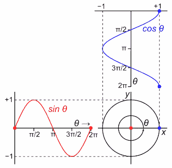

The sine and cosine functions are the projections of a circular movement over a vertical and horizontal axis, respectively.

我假设你已经熟悉三角信号及其与频率的关系。在任何情况下，重要的是要注意，周期性或循环信号将在给定的时间内重复自身，称为*周期* ( *T* )。而*频率* ( *f* )则由每秒的重复次数组成，以赫兹(Hz)为计量单位，以此向德国物理学家海因里希·赫兹致敬。

在接下来的章节中，我们将以一种非常实用的方式探索这些概念(我还假设您已经习惯了 Python)。我们将首先弄清楚如何生成和可视化一些周期波(或信号)，然后移动到*短时傅立叶变换*实现。最后，我们将看到一个例子，说明如何将这种分析应用于一个非三角函数，而是一个节奏函数，如大脑信号。

# 1.产生周期性信号

在*数据科学*——这里我考虑的是与之相关的所有学科，比如*模式识别*、*信号处理、机器学习*等等——深入了解我们的数据(也就是信号)在插入分析或分类工具时的表现总是有用的。问题是，起初我们通常对我们的数据知之甚少——在现实世界中，这些数据可能是复杂和嘈杂的——事实上，寻找分析工具就是试图理解它们。

在这种情况下，最好的替代方法是使用简单且众所周知的数据来探索分析工具。诺贝尔奖获得者理查德·费曼在 1988 年去世后，在他的黑板上留下了下面这句名言:“我不能创造的东西，我不理解”——我们将首先产生自己的周期信号。

时间序列通常是抽样过程的结果。当这个信号产生时，正如这里的情况，我们还必须确定信号应该出现的时间。下面的函数模拟采样过程，并将初始和最终时间样本作为输入。换句话说，它返回我们的信号将被放置的 x 轴基准。

让我们记住正弦信号是由函数产生的:

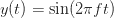

其中 *f* 是信号 *y(t)* 的频率，单位为赫兹， *t* 是上述代码生成的时间序列。然后将该等式转录为 Python:

几乎与生成信号同样重要的是提供一种可视化信号的方法。使用 Matplotlib 库，可以修改以下函数来查看任何时间序列:

编写一个包装函数来创建和可视化一个正弦函数，并将频率和幅度作为输入参数，这听起来也很实用:

最后，我们现在将一起执行这些函数，以便获得一些正弦波:

然后给出以下结果:

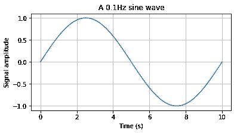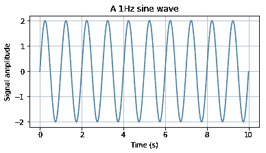

它可能看起来很简单，但重要的是要有一个我们确切知道它是如何产生的信号——我们持有它的模型，即它的公式。在上面的第一张图中观察到，频率为 *0.1Hz* 意味着信号将每 *10* 秒重复一次。在第二张图中，我们复制了信号的振幅，现在信号每秒钟重复一次。

将我们用 *numpy.concatenate* 方法定义的函数放在一起，如下所示，我们可以生成更复杂的波形:

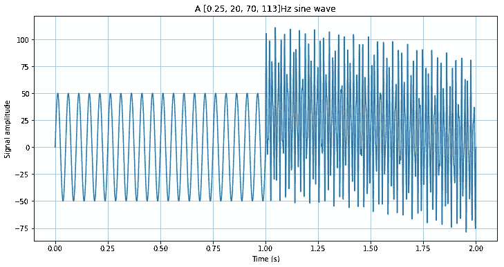

从我们的第一张图表可以清楚地看出，当我们处理低频和单一频率时，我们仍然只能通过时域信号中的视觉检查来识别循环模式(例如，在一秒钟内计数顶部)。然而，对于更复杂的波形(见上图中 *1s* 和 *2s* 之间的间隔),显然需要一种工具来识别任何循环模式。

# 2.短时傅立叶变换

要完全理解频域中的时间序列表示，需要深化线性代数和微积分，以便将信号展开成一系列函数。

不过，这里不会采用这种方法:那些已经理解这种数学抽象的人会发现用 Python 实现频率分析的实用代码。同理，第一次面对周期性信号的人，可能会从这些简单的例子开始加深自己的理论理解。

在我们开始编码之前，我将提供一个简短的定义*(请不要害怕这些符号……如果你愿意，你可以直接向下翻页跳过这一部分)*:傅立叶已经证明，可以将大量函数展开为*纯调和函数级数*(即正弦和余弦之和)。顺便说一下，从*欧拉公式*我们知道我们可以将调和函数表示为一个复指数:

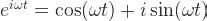

现在考虑我们可以将给定信号 *y(t)* 展开成傅立叶级数:

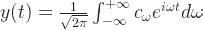

其中 *c_ω* 为信号经过*傅里叶变换*得到的*傅里叶系数*；而 *e^iωt* 是代表频率ω的谐波基函数。

重要的是要记住，每个系数——我们的计算机将为我们计算的系数——都与一个谐波基函数相关联，而谐波基函数又将该系数与特定频率相关联。然后，如果我们知道每个系数的值，我们可以知道信号 *y(t)* 中存在的每个频率分量的强度。

应该考虑的另一个重要方面是，这些基函数具有无限的持续时间，因此不适合表示具有不连续性的信号，或者也需要其时间或空间位置的信号(即，当我们试图知道给定频率或节奏在信号的哪个周期中出现得最多时)。

***短时傅立叶变换* (STFT)** 就是克服这一点的方法。其策略包括将变换的每个*基函数*乘以*窗口函数 w(t)。*因此，后者限于给定的时间段，即仅在有限的时间间隔内具有非空值。

考虑到傅立叶变换中的函数空间可以由复数形式的三角函数定义，对于 STFT，我们创建了由频率(ω)和位置(τ)定义的新基:

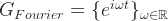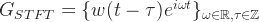

必须根据分析兴趣选择 *w(t)* 的形状和长度。形状取决于用来产生它的函数，并决定了它的频率分辨能力。另一方面，长度( *N* )定义了窗口间隔，并因此定义了其时间分辨率。

可以使用和尝试许多窗口功能(可以在[这里](https://en.wikipedia.org/wiki/Window_function#Hamming_window)找到其主要功能和差异的概述)。就我们的目的而言，或者在犹豫该选择哪一个时，汉恩的*窗口*可能是一个令人满意的选择:

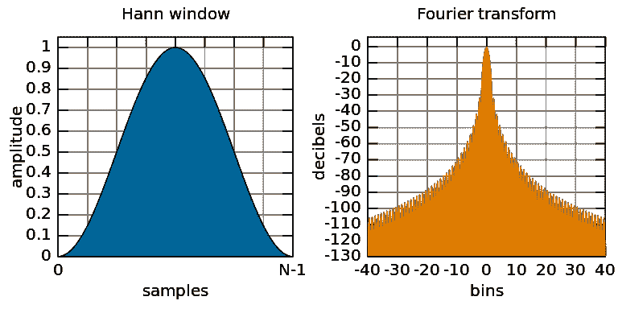

现在让我们回到我们的 Python 代码。一旦我们理解了 STFT 所依赖的基本原理，我们就可以利用 SciPy 库中的 [*信号*模块来实现*频谱图*——它由绘制 STFT 系数的平方幅度组成。](https://docs.scipy.org/doc/scipy/reference/generated/scipy.signal.stft.html)

因此，使用下面的代码，我们将计算第一个信号的 STFT(向上翻页，寻找*信号 1* )。此外，我们必须考虑到 SciPy 实现将始终将频率轴设置为采样频率的一半，这也是我设置 *plt.ylim()* 命令的原因。

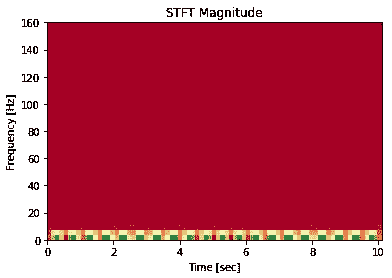

好吧，我同意你的观点，这个结果和我预期的相差甚远。好消息是(几乎)一切都是调整的问题。为了使事情变得简单，让我们编写下面的函数:

为了测试它，我们将创建一个新信号，其值易于理解和操作，一个振幅为 1000 的 100Hz 正弦波。由于我们将保持它持续 10s，以相同的采样率 *1kHz* ，我们可以使用之前定义的数组*时间*。

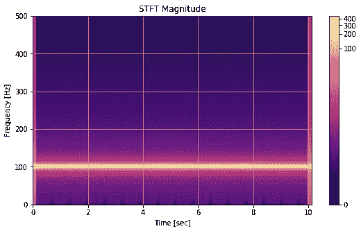

从一个简单的信号开始的目的是，它允许我们检查我们的代码中是否有重大错误。还好不是这样！正如预期的那样，绘图频率范围上升到 500Hz，是采样频率的一半。此外，我们可以精确地看到 *100Hz* 分量，其值被归一化(你会在这里找到归一化策略[的细节)。](https://matplotlib.org/users/colormapnorms.html)

更进一步，我们可以为我们的 STFT 指定其他参数。为了创建下面的图表，我为参数 *nperseg* 设置了不同的值，这些值对应于窗口函数的大小。对于左图， *nperseg = 64* ，而对于右图， *nperseg = 2048* 。请注意，窗口越大，频率分辨率越精确。反之亦然。

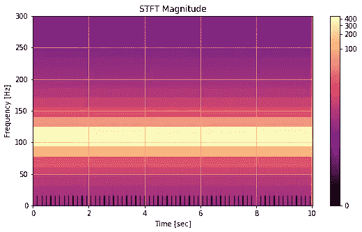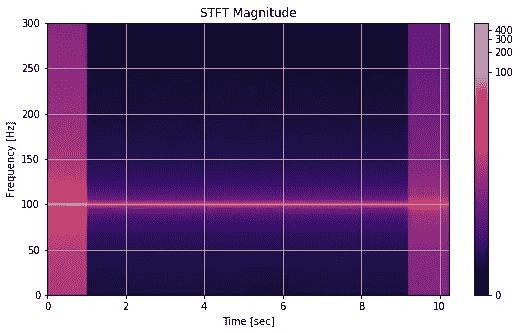

没有特定的规则来确定每个片段的样本数。然而，考虑采样率的 1/4 是有用的。例如，对于 *1kHz* 采样速率， *nperseg* 参数默认设置为 *256* 。如果我们分析我们的*复合信号*，这种权衡会变得更加清晰，复合信号是由 0.25 至 123Hz 的分量产生的:

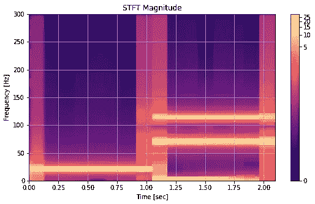

在上面的图中，信号的所有已知频率成分都变得明显，尽管时间分辨率较低。对于某些应用来说， *250ms* 并不重要。对其他人来说，这可能是限制性的。我必须预见到，没有一种分析工具可以像海森堡原理所证明的那样，在时间和频率上同时提供准确性——但这将是下一篇文章的主题。

# 3.大脑信号分析

为了举例说明 STFT 分析如何在“现实生活”中发挥作用，我们现在将应用我们在从脑电图(EEG)中获得的大脑信号片段上构建的函数。如果你想自己尝试一下，数据在这里[有](https://github.com/tbnsilveira/STFT_analysis/blob/master/brainSignal.mat)。

由于信号之前是在 Matlab 上处理的，我们首先必须使用 *loadmat* 方法将数据结构转换成 Python 字典。知道信号被标记为 *sD_W* ，我们可以继续加载它:

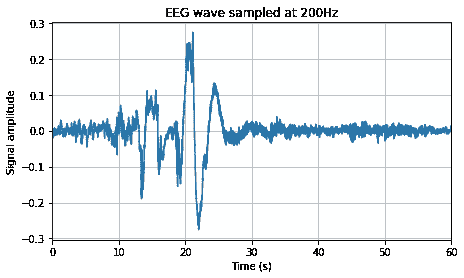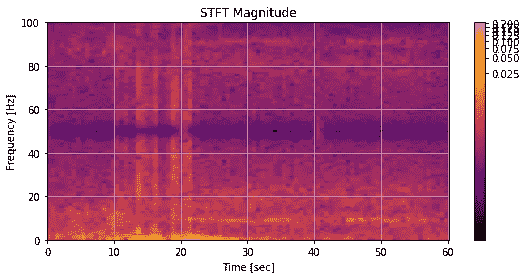

与处理正弦信号时不同，现在我们不能仅通过查看其时域图来推断 EEG 信号中存在的节律(即频率分量)。我们甚至可以说在 20 秒后会发生一些事情，但是我们不能给出任何细节。

另一方面，上面的声谱图向我们显示，在大约 *20s* 的事件之后，从 20s 到 36s，然后从 44s 到 56s，出现了一个良好建立的低频节奏。与任何数据科学活动一样，解释总是依赖于上下文。在这种情况下，该 EEG 信号来自接受多导睡眠描记术的受试者。所识别的频率范围对应于阿尔法节律，指示患者可能是清醒的和放松的，但是闭着眼睛。最后，50Hz 附近的黑暗区域对应于信号采集期间应用的带通滤波器，以便过滤来自交流电源的 50Hz 干扰。

# 4.结论

这篇文章的目标不仅是展示如何用 Python 实现 STFT，还简要介绍了这个强大的分析工具背后的理论——它支持更复杂的数学思想。

此外，通过能够理解在这种分析中应该观察的主要参数，并借鉴大脑信号的例子，我希望读者可以定制代码，并将这样的工具应用于他/她可能找到的任何循环信号:从生物医学或地震信号，甚至到股票市场价格或恒星的运动。

类别:[分析学&数据挖掘](https://tbnsilveira.info/category/ai-data-science/analytics-data-mining/)，[工程与物理](https://tbnsilveira.info/category/engineering-and-physics/)，[小波](https://tbnsilveira.info/category/mathematics/wavelets/)

*原载于 2019 年 2 月 23 日*[*http://tbnsilveira . info*](https://tbnsilveira.info/2019/02/23/finding-cyclic-patterns-a-tutorial-on-how-to-implement-stft-in-python/)*。*