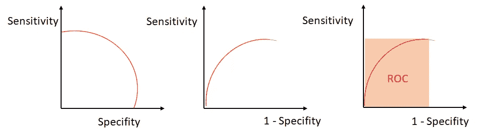
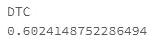

# 寻找捐赠者:PySpark 分类项目

> 原文：<https://towardsdatascience.com/finding-donors-classification-project-with-pyspark-485fb3c94e5e?source=collection_archive---------19----------------------->

## 了解如何使用 Apache PySpark 来增强您的分类预测


Picture from [Unsplash](https://unsplash.com/photos/Wpnoqo2plFA)

# 介绍

本文的目的是对机器学习中的分类问题做一个温和的介绍，并通过一个全面的指南来成功地使用 PySpark 开发一个类预测。

所以没有进一步的行动，让我们投入进去吧！

# 分类

如果你想深入了解分类问题、它的主要算法以及如何使用机器学习技术来处理它们，我强烈建议你去看看下面这篇文章，在这篇文章中，我详细地解释了这个概念。

[](/supervised-learning-basics-of-classification-and-main-algorithms-c16b06806cd3) [## 监督学习:分类基础和主要算法

### 了解机器如何分类

towardsdatascience.com](/supervised-learning-basics-of-classification-and-main-algorithms-c16b06806cd3) 

## 什么是分类？

分类是监督学习的一个子类，其目标是基于过去的观察来预测新实例的分类类别标签(离散的、无序的值、组成员)。

分类问题主要有两种类型:

*   二元分类:典型的例子是邮件垃圾邮件检测，其中每封邮件都是垃圾邮件→ 1 封垃圾邮件；或者不是→ 0。
*   多类分类:像手写字符识别(类从 0 到 9)。

下面的例子很有代表性地解释了二元分类法:

有两个类别，圆和十字，以及两个特征，X1 和 X2。该模型能够找到每个数据点的特征与其类别之间的关系，并在它们之间设置边界线，因此当提供新数据时，它可以估计其所属的类别，给定其特征。


Figure by Author

在这种情况下，新数据点落入圆形子空间，因此，模型将预测其类别为圆形。

## 分类主要算法

为了预测某些样本的类别，可以使用几种分类算法。事实上，在开发我们的机器学习模型时，我们会对其中的一定数量进行训练和评估，我们会保留那些预测性能更好的模型。

一些最常用的算法的非穷尽列表如下:

*   逻辑回归
*   决策树
*   随机森林
*   支持向量机
*   k-最近邻(KNN)

## 分类评估指标

当对事件进行预测时，我们可以得到四种结果:

*   真阳性:TP
*   真阴性:TN
*   误报:FP
*   假阴性:FN

所有这些都在下面的分类矩阵中表示:


**准确性**衡量分类器做出正确预测的频率。它是正确预测的数量与预测总数(测试数据点的数量)的比率。


**Precision** 告诉我们我们归类为某一类的事件的比例，实际上是那个类。它是真阳性与所有阳性的比率。


回忆(敏感度)告诉我们实际上属于某一类别的事件中有多少被我们归类为该类别。它是真阳性与所有阳性的比率。


**特异性**是被正确识别为阴性的类别占阴性类别总数的比例。


对于分类分布有偏差的分类问题，准确性本身并不是一个合适的度量。反而精度和召回率更有代表性。

这两个指标可以结合起来得到 **F1 分数**，它是精确度和召回分数的加权平均值(调和平均值)。这个分数的范围从 0 到 1，1 是可能的最佳 F1 分数(我们在处理比率时采用调和平均值)。


## 皇家对空观察队

最后，我们将在项目中使用的指标是**接收机操作特性或 ROC** 。

ROC 曲线告诉我们该模型区分两个类别的能力有多强。它可以得到从 0 到 1 的值(€[0，1])。模型越好，越接近 1 值。


Figure by Author

从上图中可以看出，我们的分类模型将在类别和之间绘制一个分离边界:

*   落在阈值左边的每个样本将被归类为负类。
*   落在阈值右边的每个样本将被分类为阳性类别，

预测的分布如下:


Figure by Author

**灵敏度&特异性**之间的权衡

当我们降低阈值时，我们最终会预测更多的正值，并提高灵敏度。因此，特异性降低。

当我们提高阈值时，我们最终会预测更多的负值并提高特异性。因此降低了灵敏度。

如**敏感性** ⬇️ **特异性** ⬆️

如**特异性** ⬇️ **敏感性** ⬆️

为了优化分类性能，我们考虑(1-特异性)而不是特异性。所以，当敏感性增加时，(1-特异性)也会增加。这就是我们计算 ROC 的方法。



Figure by Author

## 性能示例

如前所述，赋值器越接近 1，模型的预测性能就越好，类之间的重叠区域就越小。


Figure by Author

# 寻找捐助者项目

可以在以下文章中找到该项目的完整介绍:

[](/classification-project-finding-donors-853db66fbb8c) [## 机器学习分类项目:寻找捐赠者

### 使用此分类模型查找并预测谁将向慈善机构捐款！

towardsdatascience.com](/classification-project-finding-donors-853db66fbb8c) 

在本文中，我们将关注该项目的 PySpark 实现。

总之，在整个项目中，我们将使用许多不同的监督算法，使用从 1994 年美国人口普查中收集的数据来精确预测个人收入。

然后，我们将从初步结果中选择最佳候选算法，并进一步优化该算法以最佳地模拟数据。

我们实现的目标是构建一个模型，准确预测个人收入是否超过 50，000 美元。根据我们之前的研究，我们发现最有可能向慈善机构捐款的人是那些年收入超过 5 万美元的人。

因此，我们面临着一个二元分类问题，我们想确定一个人的年收入是否超过 5 万美元(第 1 类)或没有(第 0 类)。

这个项目的数据集来源于 [UCI 机器学习知识库](https://archive.ics.uci.edu/ml/datasets/Census+Income)。

## 数据

人口普查数据集由大约 45222 个数据点组成，每个数据点有 13 个特征。

**特性**

*   `age`:年龄
*   `workclass`:工人阶级(私营、自营企业、自营企业、联邦政府、地方政府、州政府、无薪、从未工作)
*   `education_level`:教育水平(学士、专科学校、11 年级、高级研究生、专业学校、acdm 协会、voc 协会、9 年级、7-8 年级、12 年级、硕士、1-4 年级、10 年级、博士、5-6 年级、学前班)
*   `education-num`:完成的教育年数
*   `marital-status`:婚姻状况(已婚-未婚-配偶、离婚、未婚、分居、丧偶、已婚-配偶不在、已婚-配偶)
*   `occupation`:工作职业(技术支持、工艺维修、其他服务、销售、行政管理、专业教授、搬运工人、清洁工、机器操作员、行政文员、农业渔业、运输搬运、私人服务、保安服务、武装部队)
*   `relationship`:关系状态(妻子、亲生子女、丈夫、非家庭成员、其他亲属、未婚)
*   种族(白人、亚洲太平洋岛民、美洲印第安爱斯基摩人、其他人、黑人)
*   `sex`:性别(女，男)
*   `capital-gain`:货币资本收益
*   `capital-loss`:货币资本损失
*   `hours-per-week`:每周平均工作时间
*   `native-country`:本土国家(美国、柬埔寨、英国、波多黎各、加拿大、德国、美国外围地区(关岛-USVI 等)、印度、日本、希腊、中国、古巴、伊朗、洪都拉斯、菲律宾、意大利、波兰、牙买加、越南、墨西哥、葡萄牙、爱尔兰、法国、多米尼加共和国、老挝、厄瓜多尔、台湾、海地、哥伦比亚、匈牙利、危地马拉、尼加拉瓜、苏格兰、泰国、南斯拉夫、萨尔瓦多、特立尼达和多巴哥&多巴哥、秘鲁、香港、荷兰)

**目标变量**

*   `income`:收入阶层(< =50K，> 50K)

## 导入数据和探索性数据分析(EDA)

我们将从导入数据集并显示数据的前几行开始，以对探索性数据分析进行初步近似。

```
**# File location and type**
file_location = "/FileStore/tables/census.csv"
file_type = "csv"**# CSV options**
infer_schema = "true"
first_row_is_header = "true"
delimiter = ","**# The applied options are for CSV files. For other file types, these will be ignored.**
df = spark.read.format(file_type) \
  .option("inferSchema", infer_schema) \
  .option("header", first_row_is_header) \
  .option("sep", delimiter) \
  .load(file_location)display(df)
```


我们现在将通过使用。describe()方法。

```
**# Display Dataset's Summary**
display(df.describe())
```


让我们也找出数据集的模式。

```
**# Display Dataset's Schema**
display(df.describe())
```


## 准备数据

因为我们想预测个人年收入是否超过 50K 美元，我们将把标签“收入”替换为“> 50K”。

为此，我们将创建一个新列，根据个人年收入是否超过 5 万美元，该列的值将为 1 或 0。然后我们将删除收入栏。

```
**# Import pyspark functions**
from pyspark.sql import functions as F**# Create add new column to the dataset**
df = df.withColumn('>50K', F.when(df.income == '<=50K', 0).otherwise(1))**# Drop the Income label**
df = df.drop('income')**# Show dataset's columns** df.columns
```


## 向量化数字特征和一次性编码分类特征

为了对模型的训练进行处理，Apache Spark 中的特征必须被转换成向量。这个过程将使用我们现在将要探索的某些类来完成。

首先，我们将导入相关的库和方法。

```
from pyspark.ml import Pipeline
from pyspark.ml.feature import StringIndexer, OneHotEncoder, VectorAssembler
from pyspark.ml.classification import (DecisionTreeClassifier, GBTClassifier, RandomForestClassifier, LogisticRegression)
from pyspark.ml.evaluation import BinaryClassificationEvaluator
```

现在，我们将选择分类特征。

```
**# Selecting categorical features**
categorical_columns = [
 'workclass',
 'education_level',
 'marital-status',
 'occupation',
 'relationship',
 'race',
 'sex',
 'hours-per-week',
 'native-country',
 ]
```

为了对这种分类特征进行一次性编码，我们将首先将它们通过索引器，然后传递给编码器。

```
**# The index of string values multiple columns**
indexers = [
    StringIndexer(inputCol=c, outputCol="{0}_indexed".format(c))
    for c in categorical_columns]**# The encode of indexed values multiple columns**
encoders = [OneHotEncoder(dropLast=False,inputCol=indexer.getOutputCol(),
            outputCol="{0}_encoded".format(indexer.getOutputCol())) 
    for indexer in indexers]
```

现在，我们将把分类编码的特征与数字特征结合起来，并用它们两者构成一个向量。

```
**# Vectorizing encoded values**
categorical_encoded = [encoder.getOutputCol() for encoder in encoders]
numerical_columns = ['age', 'education-num', 'capital-gain', 'capital-loss']
inputcols = categorical_encoded + numerical_columns
assembler = VectorAssembler(inputCols=inputcols, outputCol="features")
```

现在，我们将建立一个管道来自动化这个阶段。

```
pipeline = Pipeline(stages=indexers + encoders+[assembler])
model = pipeline.fit(df)**# Transform data**
transformed = model.transform(df)
display(transformed)
```


最后，我们将只选择具有相关特征的数据集。

```
**# Transform data**
final_data = transformed.select('features', '>50K')
```

## 初始化模型

对于这个项目，我们将研究三种不同分类算法的预测性能:

*   决策树
*   随机森林
*   梯度增强树

```
**# Initialize the classification models**
dtc = DecisionTreeClassifier(labelCol='>50K', featuresCol='features')
rfc = RandomForestClassifier(numTrees=150, labelCol='>50K', featuresCol='features')
gbt = GBTClassifier(labelCol='>50K', featuresCol='features', maxIter=10)
```

## 拆分数据

我们将在训练和测试数据之间执行经典的 80/20 拆分。

```
train_data, test_data = final_data.randomSplit([0.8,0.2])
```

## 训练模型

```
dtc_model = dtc.fit(train_data)
rfc_model = rfc.fit(train_data)
gbt_model = gbt.fit(train_data)
```

**获得预测**

```
dtc_preds = dtc_model.transform(test_data)
rfc_preds = rfc_model.transform(test_data)
gbt_preds = gbt_model.transform(test_data)
```

## 评估模型的性能

如前所述，我们的评估者将是中华民国。我们将初始化它的类，并将预测值传递给它，以便获得值。

```
my_eval = BinaryClassificationEvaluator(labelCol='>50K')**# Display Decision Tree evaluation metric**
print('DTC')
print(my_eval.evaluate(dtc_preds))
```



```
**# Display Random Forest evaluation metric**
print('RFC')
print(my_eval.evaluate(rfc_preds))
```


```
**# Display Gradien Boosting Tree evaluation metric**
print('GBT')
print(my_eval.evaluate(gbt_preds))
```


最佳预测器是梯度提升树。实际上，0.911 是一个非常好的值，当显示其预测值时，我们将看到以下内容:


## 提高模型性能

我们将尝试通过执行网格搜索交叉验证技术来做到这一点。有了它，我们将使用先前超参数值集的不同组合来评估模型的性能。

我们将调整的超参数有:

*   最大深度
*   最大箱数
*   最大迭代次数

```
**# Import libraries**
from pyspark.ml.tuning import ParamGridBuilder, CrossValidator**# Set the Parameters grid**
paramGrid = (ParamGridBuilder()
             .addGrid(gbt.maxDepth, [2, 4, 6])
             .addGrid(gbt.maxBins, [20, 60])
             .addGrid(gbt.maxIter, [10, 20])
             .build())**# Iinitializing the cross validator class**
cv = CrossValidator(estimator=gbt, estimatorParamMaps=paramGrid, evaluator=my_eval, numFolds=5)**# Run cross validations.  This can take about 6 minutes since it is training over 20 trees**
cvModel = cv.fit(train_data)
gbt_predictions_2 = cvModel.transform(test_data)
my_eval.evaluate(gbt_predictions_2)
```


我们在预测性能上获得了微小的改进。而计算时间，几乎到了 20 分钟。因此，在这些情况下，我们应该分析这种改进是否值得努力。

# 结论

在整篇文章中，我们做了一个端到端的机器学习分类项目。我们还学习并获得了一些关于分类模型的见解，以及使用 PySpark、其方法和实现来开发一个具有良好性能的分类模型的关键。

我们还学会了一旦识别出一个性能良好的模型，如何调整我们的算法。

在接下来的文章中，我们将学习如何在 PySpark 中开发回归模型。所以，如果你对这个话题感兴趣，我强烈建议你继续关注！

*如果你喜欢这篇文章，那么你可以看看我关于数据科学和机器学习的其他文章* [*这里*](https://medium.com/@rromanss23) *。*

*如果你想了解更多关于机器学习、数据科学和人工智能的知识* ***请在 Medium*** *上关注我，敬请关注我的下一篇帖子！*