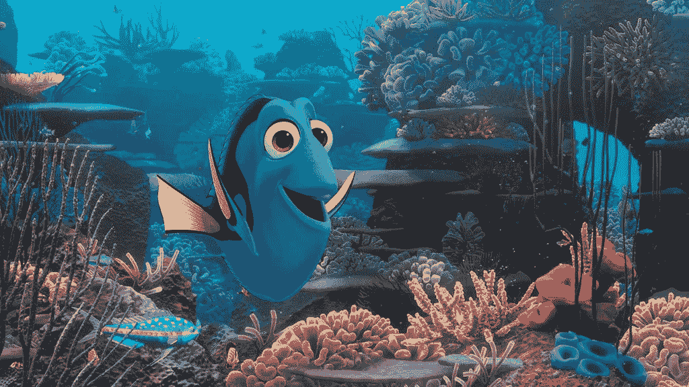
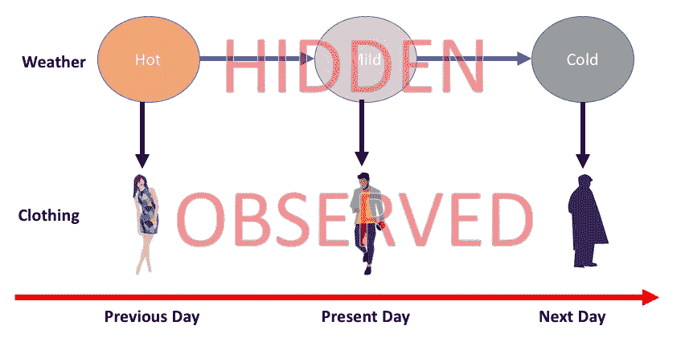

# 寻找多莉，隐马尔可夫模型和简化生活！

> 原文：<https://towardsdatascience.com/finding-dory-hidden-markov-models-and-simplifying-life-3a69f01b4d50?source=collection_archive---------35----------------------->

前几天和我的一个同事聊天，我刚刚意识到我可能是健忘的。或者至少比她“更多”的记忆——“更少”？在你开始把我的失忆和迪士尼*海底总动员/多莉*系列*中可怜的[多莉](https://en.wikipedia.org/wiki/Finding_Dory)的失忆联系起来之前，T5 被描绘成(有点[不公平和不准确地说](http://www.bbc.com/earth/story/20151111-finding-the-real-life-dory)一条实际上拥有良好记忆力的鱼！)，让我澄清一下，我以为我是无记忆的，尽管像[少数概率分布](https://en.wikipedia.org/wiki/Memorylessness)。如果你面临概率挑战，不要担心——那是因为概率不在你这边(双关语！)我马上就要讲到了——但基本上她是在告诉我她不会忘记别人说过的事情或发生过的事情！？这引发了一系列关于生活和生活窍门的讨论，以及后来更多的反思和一连串的思考——我刚刚意识到，随着生活的进程变得势不可挡，在我无数的愚蠢和失败中，我经常拯救自己的东西——是我大脑的“无记忆”性质(或者更确切地说是思维过程！).像马尔可夫模型一样没有记忆！*

> 那么这些马尔可夫模型是什么？马尔可夫模型是简单的系统(尽管他们的名字！)保持其状态有规律地变化。只是它每次都进入一个新的状态，只是基于现在，而不是看过去。当它改变状态时，它向世界表达(输出)一些信息。所以它去哪里和说什么纯粹是基于现在，使它没有记忆。事实证明，这些马尔可夫系统中的一些倾向于对它们的状态保密——虽然它在改变状态时会说些什么，但它从不透露它的状态。这些相当神秘的无记忆系统被称为隐马尔可夫模型(HMM)。下图显示了一个简单的例子。

A Simple Example of Hidden Markov Models to predict weather from clothing patterns

有趣的是，这些看似简单的健忘 hmm 其实是我们身边一些令人难以置信的技术的核心——当你对着亚马逊 Echo 设备喊“Alexa”或要求谷歌[将句子翻译成一种新语言](https://www.nytimes.com/2016/12/14/magazine/the-great-ai-awakening.html)时。很长一段时间以来，这些语音识别或翻译系统都是由 HMMs 驱动的(我作为一名数据科学家也曾在此基础上开发过无数可能的应用程序，但我们不会以简化事物为目标！).

如果人工智能(AI)系统可以在没有太多过去包袱的情况下做得很好(顺便说一下，国家本身可以有很多关于过去的信息编码在里面！)，有没有我们人类可以借鉴的地方？我知道这听起来很奇怪，因为人工智能系统通常是在人类知识的基础上训练的，事实上人工智能系统现在正试图让自己“[长期和短期记忆](https://en.wikipedia.org/wiki/Long_short-term_memory)”就像人类更好地完成工作一样，我在说人类希望向无记忆人工智能系统学习。

嗯，我认为毫无疑问，世界正变得越来越复杂，我开始相信，当我们在这个每时每刻都被信息冲击的复杂世界中航行时，对人类的救赎在于简化。简化我们看待周围世界的方式。正如一句流行的名言所说，一个人无法控制外部世界，但你可以控制如何做出反应。

《T4 人》中的尤瓦尔谈到了 21 世纪人类的三大追求——神性、不朽和幸福。尤瓦尔还相当怪异地补充道，对幸福的追求可能是通过生化手段！虽然我认为这些预测似乎有一点可怕的必然性，但就目前而言，我敢说简化我们的思维系统是生存的关键，也是通往幸福的希望之路。

所以，忘掉记忆，忘记过去，在你的人生追求中，做好你目前的状态。事实上，对我们来说，要表现得善良，多一点宽容和不报复的本性，或者表现出毅力和耐心，就需要一种无记忆的元素。让我用一句哲学的话来结束我的演讲——当我们说*时间治愈*时，这仅仅意味着我们的记忆会随着时间消逝，痛苦也会消失。所以，你越快养成无记忆，你就能越快前进:)当你做决定时，不考虑过去的包袱，这确实简化了生活！

*做马尔可夫！*

PS:我已经决定在 14 年后再次写作，这几乎是一个自我放逐的时期，因为我曾经用泰米尔语写短篇小说和博客。现在，这是一个担心和后悔的原因吗？错过了记录无数的观察，推论和在此期间生命旅程的细节的机会吗？*嗯，我是马尔科夫。我没有记忆；)*