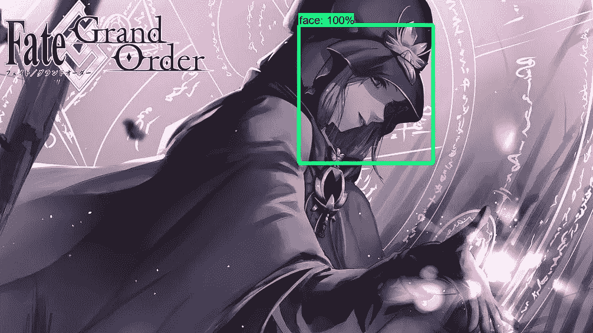

# 使用 Tensorflow 对象检测器、Pytorch 特征提取器和 Spotify 的 airy 查找熟悉的面孔

> 原文：<https://towardsdatascience.com/finding-familiar-faces-with-a-tensorflow-object-detector-pytorch-feature-extractor-and-spotifys-3e78858a8148?source=collection_archive---------31----------------------->

在一些不同的帖子中，我已经使用对象检测器和类似的暹罗网络将面部识别管道或类似的东西放在一起进行特征提取，以找到类似的图像，但我还没有真正深入研究如何以更实际的大规模方式使用这些特征向量。我在这里的意思是，你不希望在整个数据库中进行成对的比较，这是不实际的。所以在这篇文章中，我将演示如何使用 Spotify 的近似最近邻居库([骚扰](https://github.com/spotify/annoy))来根据一些初始图像找到相似的游戏角色。

Annoy 是 Spotify 开发的一个库，用于帮助大规模推荐音乐。它还有一些其他有用的属性，因为您可以预先计算索引，稍后可以调用这些索引来查找类似的项目，这在您进行大规模工作时很有帮助。它通过传递你所关心的任何东西(音乐、文本、动画人物的图片)的某种向量表示来工作，并基于此建立模型和生成索引。

这个管道的最简单的版本是使用一些神经网络进行特征提取，然后将这些特征向量传递给 airy，然后使用 airy 来查找相似的图像。这取决于您的用例。在这个具体的例子中，我想看看我是否会因为在不同的图像中返回相似或相同的字符而感到恼火。我对此进行了测试，并最终通过建立面部识别网络和传递面部生成的特征向量来尝试和集中管道以找到相似的字符，从而完成了两个阶段的方法。

对于这个项目的数据集，我将使用相同的命运大订单数据集，我已经在一些职位。主要是因为它是我最近建立的约 410 张图片的小数据集中最大的，所以它是这类事情的一个很好的测试案例。

进入这个项目时，我发现关键(像许多数据科学项目一样)是找到一种好的方法来表示我想要解决的问题的数据集。对于这种类型的任务，将 3D 像素阵列压缩成 1D 特征向量在机械上是正确的，但是确保最终的 1D 特征向量描述了您想要的也是重要的。

> 请随意查看我为这个[在这里](https://github.com/sugi-chan/fgo_face_similarity)使用的笔记本。这些笔记本不是超级可读的，因为我很快就把东西处理完了。我也不像往常一样在 repo 中提供模型/数据集文件。

# 版本 1:完整图像特征提取

因为这是最容易做到的事情，并且是为后面的测试设置我的通用管道的好方法，所以我使用了 pytorch 预训练网络(一个 ResNet101，它为每个矢量生成 1000 个特征以输入到 aroy ),并向它传递完整的图像，然后由 aroy 使用这些图像来查找类似的图像。这个初始过程产生了如下结果。最左边的图像是基础图像，接下来的 4 个是“数据库”中最相似的 4 个。

Left most image is the seed image followed by 4 of the top ones. (there was a duplicate in the dataset for this one)

看起来特征提取器从原始图像中获得了许多类似的深色细节，其中红色和黑色是焦点。然而，在这种情况下，我试图看看我是否可以得到类似的字符，所以这不是最好的输出。

这是另一个图像示例。

Left most image is the seed image followed by 4 of the top ones.

这一个有点棘手，因为在主图像中有两个角色，但是当整个图像被传递到烦人的模型中时，相似的图像有相似的颜色味觉(可能…)。

因此，从机械上来说，这一过程是可行的，但我要说的是输出很差。下一步是想办法让输出更连贯。在这种情况下，因为我想建立的是一些显示类似的字符给定一些基础图像，为什么不尝试，使它的图像是基于只是字符，而不是完整的图像？我可以想到很多方法来做到这一点，但对我来说最简单的是建立一个单一的类对象检测器来识别图像中的人脸，将该人脸传递到一个预训练的网络进行特征提取，然后将该特征向量传递到 are。当骚扰拉相似的图像，我可以让它返回基本图像，所以基本上它会找到数据库中的哪些面部与新提取的面部最相似，并返回这些面部出现的图像。

# 基于人脸识别的相似度

对于这个项目，我建立了一个简单的 1 类对象检测器，只识别图像中的动画人物的脸。我使用 Labelimg 来快速注释图像，我非常确定我只花了大约 20 分钟来标记我的测试和训练分割的 400 张图像。在这一点上，我已经做了相当多的工作，只有一个单独的类可以大大加快这个过程。在训练探测器时，我使用了一个更快的 RCNN-Inceptionv2 模型，该模型具有来自 Tensorflow 模型 [zoo](https://github.com/tensorflow/models/blob/master/research/object_detection/g3doc/detection_model_zoo.md) 的 coco 权重，并训练该模型大约 3 个小时。我从周五午夜开始训练，一直到周六凌晨 3 点左右，这打乱了我的睡眠时间表，因为那时我还在忙其他的事情。

对象检测器训练得相当快，输出看起来相当干净。这是令人振奋的，因为这将是在这个管道中找到更多的角色特定的相似图像的关键部分。

Example of some cropped image outputs

当使用对象检测器从原始数据集中裁剪头部时，我保存了头部到其原始图像的 csv 映射。我的想法是，我可以在头像上运行一个特征提取器，并将其存储在骚扰模型中，到时候我可以将骚扰输出与原始图像进行匹配。

# Pytorch 和 Annoy 的特征提取

现在我可以从图像中提取头部，我所要做的就是将这些头部通过特征提取器(再次是 ResNet101)，然后将这些特征向量传递给 aroy。

作为一个演示，这里有一张之前的图片，原始图片模型有一些问题。这是对象检测器检测图像中的两张脸的示例输出。因此，每张图像都有从中提取的特征，然后与更大的数据库进行匹配。

第一个输出来自主图像左边的角色(他出现在数据集中), 4 个相似图像的前两个和最后一个图像是该角色。这是对该图像的原始图像输入的改进，其中有 0 个匹配。

第二个角色(右边的一个)实际上并没有出现在数据库中…但是她的面部特征与左边的一个基本相同，所以四个图像 2 匹配(第一相似和第四相似)

Left is the base image, followed by 4 most similar

与只使用基本图像相比，这似乎是一个很好的改进，因为目标是返回相似的字符。现在让我们看看我之前为基本模型使用的另一个示例图像。

Left is the base image, followed by 4 most similar

因此，在这张照片中，他们看起来更有针对性，而不是仅仅得到一堆红色和黑色的图像。虽然第一、第二和第四个相似图像具有不同的特征，但是第三个图像具有相同的特征。这一次，所有人都至少与基本图像的性别相同。另一个只是让所有的男性角色和一个女性角色的基本图像配对。虽然这不是一个很好的结果，但似乎比以前的版本有所改进。

# 结束语

在查看了这两条管道的输出后，我觉得这些结果是可以接受的，但不是很好。使用基本图像返回具有相似感觉但不一定相似特征的图像。虽然面部检测器有助于将输出集中到相似的字符，但它通常不会返回总体相似风格的图像。

original full image model

虽然 4 个返回图像中的 2 个不是相同的字符，但我确实喜欢中间的第二个结果，因为它与基础图像有相似的“感觉”。

headshot based model

正如我之前提到的，基于头像的模型很好地聚焦于所讨论的角色。在这种情况下，所有字符都是相同的。然而，它不符合原始图像的感觉。我真正想要的是两者的某种结合，我可以得到相似的角色和相似的整体形象(基本上我自私地想要鱼和熊掌兼得)。

经过一些试验后，我发现我能够非常接近那个。

New model!

正如我在本文开始时提到的，从这条管道获得更好的输出基本上可以归结为修改哪些数据被压缩到最终的特征向量中，这些向量被传递到 annoy 中。虽然在大多数情况下鱼与熊掌兼得是不可行的，但在这种情况下却是可行的！我认为，这个“新模型”比其他两个做得更好，因为它获得了所有正确的字符(击败了基本图像模型)，并且显示的图像比头像模型更接近基本图像。

通常情况下，这只是一种我必须从新的角度解决问题的情况。

Still really enjoy big hero 6 and code to Immortals as a theme song for my life

我只是不得不重新思考我在最终的特征向量中编码了什么信息。我最终做的是将来自检测到的头像和基础图像的信息传递给一个组合的特征向量，该向量捕获了关于角色面部(以获得相似的角色)和基础图像(以获得整体“感觉”)的信息。

然而，这个最终模型并不那么简单，我花了一点时间才弄明白，所以我会再发一篇后续文章来保持这篇文章的合理长度。

因此，下次请继续收听，我将介绍我是如何将面部和基本图像信息组合成密集的表示形式，以让 Spotify 的 annoy 在性格和感觉方面找到相似的图像。

**跟进博文** [**此处**](/deeper-dive-into-finding-similar-faces-with-spotifys-annoy-tensorflow-and-pytorch-c434897bd627)

> 再一次，在这里你可以随意查看我为这个[使用的笔记本。这些笔记本不是超级可读的，因为我很快就把东西处理完了。我也不像往常一样在 repo 中提供模型/数据集文件。](https://github.com/sugi-chan/fgo_face_similarity)