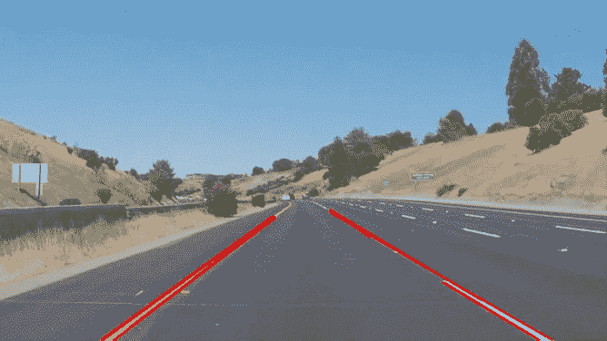

# 寻找车道线-用于车道检测的简单管道。

> 原文：<https://towardsdatascience.com/finding-lane-lines-simple-pipeline-for-lane-detection-d02b62e7572b?source=collection_archive---------6----------------------->

识别道路的车道是人类驾驶员执行的非常常见的任务。这对于保持车辆在车道的限制内是很重要的。这对于自动驾驶汽车来说也是非常关键的任务。并且利用简单的计算机视觉技术，非常简单的车道检测流水线是可能的。本文将使用 [Python](https://www.python.org/) 和 [OpenCV](https://opencv.org/) 描述可用于简单车道检测的简单管道。这个练习是作为[“uda city 无人驾驶汽车 nano degree”](https://classroom.udacity.com/nanodegrees/nd013/dashboard/overview)的一部分完成的。

请注意，该管道有其自身的局限性(如下所述),并且可以改进。改进将在后续文章中描述。

# 车道检测管道:

1.  将原始图像转换为灰度。
2.  使灰度图像变暗(这有助于降低道路变色区域的对比度)
3.  将原始图像转换到 HLS 颜色空间。
4.  将黄色从 HLS 中分离出来，得到黄色遮罩。(适用于黄色车道标线)
5.  将白色从 HLS 中分离出来，得到白色面膜。(适用于白色车道标线)
6.  逐位或黄色和白色掩码以获得公共掩码。
7.  逐位并使用暗化图像进行屏蔽。
8.  应用轻微高斯模糊。
9.  应用 canny 边缘检测器(调整阈值—试凑法)获得边缘。
10.  定义感兴趣的区域。这有助于剔除 canny 边缘检测器检测到的不需要的边缘。
11.  检索霍夫线。
12.  巩固和外推霍夫线，并绘制在原始图像上。

## 原始测试图像

Original Test Images

## 转换为灰度

将原始图像转换成灰度有它的好处。我们必须找到黄色和白色的车道，将原始图像转换为灰度可以增加车道相对于道路的对比度。

Original Images to Grayscale

## 使灰度图像变暗

这样做的目的是降低道路变色部分的对比度。

Darkened grayscale images

## 将原始图像转换到 HLS 颜色空间

原始图像是 RGB 的，但我们也应该探索其他颜色空间，如 [HSV](https://docs.opencv.org/3.4/de/d25/imgproc_color_conversions.html#color_convert_rgb_hsv) 和 [HLS](https://docs.opencv.org/3.4/de/d25/imgproc_color_conversions.html#color_convert_rgb_hls) 。当并排看时，可以很容易地看到，我们可以从道路的 HLS 颜色空间中获得更好的颜色对比度。这可能有助于更好的颜色选择，进而有助于车道检测。

RGB vs HSV vs HLS

## 颜色选择

这里我们使用 OpenCV 的 [inRange](https://docs.opencv.org/3.0-beta/modules/core/doc/operations_on_arrays.html?highlight=inrange) 来获取 thresh hold 值之间的掩码。经过反复试验，我们可以找出阈值的范围。

对于黄色面具:

1.  色调值介于 10 和 40 之间。
2.  我们使用较高的饱和度值(100–255)来避免山丘的黄色。

对于白色面具:

1.  我们使用更高的亮度值(200-255)作为白色蒙版。

我们按位或两个掩码来得到组合掩码。

下图显示了组合蒙版是逐位的，并带有暗化图像。

## 高斯模糊

[高斯模糊](https://docs.opencv.org/3.0-beta/modules/imgproc/doc/filtering.html#gaussianblur)(高斯平滑)是预处理步骤，用于减少图像中的噪声(或平滑图像)。我们使用这个预处理步骤来移除许多检测到的边缘，并且只保留图像中最突出的边缘。

OpenCV 的 GaussianBlur 期望模糊的内核大小(奇数值)。在尝试了一些值之后，我们使用了 7。

Gaussian Blur

## 应用 Canny 边缘检测

现在我们将 Canny 边缘检测应用于这些高斯模糊图像。Canny 边缘检测是基于梯度变化检测边缘的算法。并不是说 Canny 边缘检测的第一步是使用默认的核大小 5 进行图像平滑，我们仍然在上一步中应用显式高斯模糊。Canny 边缘检测的其他步骤包括:

*   寻找图像的强度梯度
*   非最大抑制
*   滞后阈值

这个[链接](https://opencv-python-tutroals.readthedocs.io/en/latest/py_tutorials/py_imgproc/py_canny/py_canny.html)很好的解释了 Canny 边缘检测。

## 选择感兴趣区域

即使在应用 Canny 边缘检测之后，仍然有许多边缘被检测到，它们不是车道。感兴趣区域是一个多边形，它定义了图像中我们感兴趣的边缘所在的区域。

注意，图像中的坐标原点是图像的左上角。行坐标自上而下增加，列坐标自左而右增加。

这里的假设是摄像机保持在恒定的位置，并且车道是平坦的，因此我们可以“猜测”感兴趣的区域。

Region of Interest applied to Canny Edge Detected Images.

## 霍夫变换线检测

霍夫变换是一种通过识别直线上所有点来找出直线的技术。这是通过将线表示为点来实现的。并且点被表示为线/正弦曲线(取决于笛卡尔/极坐标系统)。如果多条直线/正弦曲线通过该点，我们可以推断这些点位于同一条直线上。

Line in polar co-ordinates and sinusoidal that represent point , intersection point represent line.

更多信息可在[这里](https://docs.opencv.org/2.4/doc/tutorials/imgproc/imgtrans/hough_lines/hough_lines.html)找到。

从感兴趣区域图像中找出 Hough 线，然后在原始图像上绘制 Hough 线。

Hough Lines

## 霍夫线的合并和外推

我们需要追踪完整的车道标志。为此，我们首先需要区分左车道和右车道。有一个简单的方法来识别左车道和右车道。

*   **左车道:**随着列坐标值的增加，行坐标值减少。所以梯度一定是负的。
*   **右车道:**随着列坐标值的增加，行坐标值也增加。所以梯度一定是正的。
*   我们将忽略垂直线。

在识别左车道和右车道霍夫线之后，我们将外推这些线。我们做两件事:

1.  车道检测到多条线，我们将对这些线进行平均
2.  有一些部分检测到的线，我们将推断它们。

## 将管道应用于视频

现在让我们将这个管道应用于视频。

管道在直道上非常好用。

但是这对于弯曲的车道来说效果不好。

## 缺点

*   基于直线的霍夫线不适用于弯曲的道路/车道。
*   有许多试错法来获得正确的超参数。此外，感兴趣的区域假设摄像机停留在相同的位置，并且车道是平坦的。因此，在决定多边形顶点时涉及到“猜测”工作或硬编码。
*   一般来说，有许多道路可能没有车道标志，这是行不通的。

## 未来的改进

*   代替直线，使用在弯曲道路上有用的更高程度的曲线将是有益的。
*   即使当我们使用来自先前帧的信息时，仅仅平均车道可能不是很好的策略。可以是加权平均值，或者某种形式的优先级值也可以。

该代码可在 [GitHub](https://github.com/nachiket273/Self_Driving_Car) 上获得

如果你喜欢这篇文章，请一定给我一个掌声，并关注我以获得我未来文章的更新。

*还有，随时在*[*LinkedIn*](https://www.linkedin.com/in/nachikettanksale/)*上联系我或者在*[*Twitter*](https://twitter.com/nachiket273)*上关注我。*

如果你喜欢我的作品，请考虑赞助我，它会帮助我推出更多这样的作品。