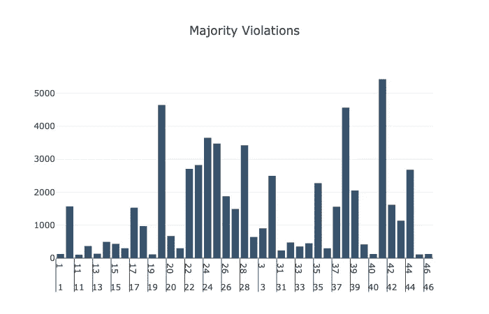

# 在芝加哥寻找低风险餐厅享受美食

> 原文：<https://towardsdatascience.com/finding-low-risk-restaurants-in-chicago-to-enjoy-food-c6fd12220d77?source=collection_archive---------26----------------------->


Photo by [Robin Stickel](https://unsplash.com/@robinstickel?utm_source=medium&utm_medium=referral) on [Unsplash](https://unsplash.com?utm_source=medium&utm_medium=referral)

作为一个美食爱好者，我总是对探索餐馆很感兴趣。因此，在这个项目中，我决定满足自己的渴望，处理食物关节数据。我建立了这个项目的目标，根据给定的位置探索芝加哥的餐馆。我去了 Kaggle，找到了完美的数据集。

[](https://www.kaggle.com/chicago/chicago-food-inspections) [## 芝加哥食品检验

### 来自芝加哥市公开数据

www.kaggle.com](https://www.kaggle.com/chicago/chicago-food-inspections) 

我开发了一个 Kaggle 内核，在那里我使用各种可视化工具探索了数据集，然后创建了一个方法来获取距离当前位置(使用纬度和经度定义)一定数量公里附近的餐馆。

[](https://www.kaggle.com/bhanotkaran22/facilities-in-chicago-risk-and-result-analysis) [## 芝加哥工厂(风险和结果分析)

### 使用来自多个数据源的数据

www.kaggle.com](https://www.kaggle.com/bhanotkaran22/facilities-in-chicago-risk-and-result-analysis) 

# 导入库和数据集

第一步是导入将要使用的库。我导入`numpy`和`pandas`进行数据操作。为了绘制图表和地图，我使用了`plotly`。注意，为了使用地图，我们需要一个访问令牌。我把令牌保存在`input`目录下的一个方法中，在执行过程中把它复制到`working`目录，使用它，最后会删除它。

最后，我导入数据集并将其保存到`dataset`变量中。有很多列。要开始了解每一列的值，请参考 Kaggle 数据集的`Data`部分并向下滚动。


仪表板可见。在右上方，可以看到`Views`。选择第三个选项，你会看到每一列的名称、类型、发行版等等。

# 数据分析

第一步是识别所有设施，并对每个设施进行最近的检查。我还将删除所有`Risk`、`Facility Type`、`DBA Name`、`Latitude`或`Longitude`为空的行。一些企业已经停止运营或不存在，因此也可以被移除。我将创建一个新列`Name`，它从`AKA Name`和`DBA Name`中提取姓名，并优先选择`AKA Name`。`Name`还将包括每个工厂的地址。

`latest_data`是我将在余下的探索中使用的数据集。

我还将为绘图中使用的颜色创建列。`All`、`Risk 1 (High)`、`Risk 2 (Medium)`和`Risk 3 (Low)`的风险颜色分别为黑色、红色、黄色和绿色。检查时，`Pass`和`Pass w/ Conditions`设置为绿色，而`Fail`、`No Entry`和`Not Ready`设置为红色。

所有的设置现在都完成了。让我们继续对我们的数据进行可视化。

# 数据可视化

## 设施类型

首先，我将为这次食品检查中包括的各种类型的设施绘制一个饼图。有一些设施不到 1%，因此，我会将它们全部组合在一起，并将其视为`Others`。


`Plotly`饼图提供了许多样式选项，如高度、宽度、内圆大小等。

> 大约 55%的设施是餐馆。

## 风险分析

接下来，我将基于上面创建的`Risk Color`列在芝加哥地图上绘制设施列表。


看来红点的数量在图中确实很高。这意味着大多数设施处于高风险状态。我们也可以从数据中证实这一点。

> 高风险贷款的数量多于中低风险贷款的总数。

## 成功和失败

接下来，我将探究最近的检查中有多少是`Pass`和多少是`Fail`。我认为`Pass w/ Conditions`是好的，而`No Entry`和`Not Ready`是坏的。


正如我们从上面的柱状图中所看到的，尽管许多设施处于高风险中，但它们中的大多数也通过了检查。

> 最大检查结果为`Pass`。

地图上的检查结果如下图所示。


> 大多数设施通过了检查，只有极少数没有通过。

## 逐区分析

每个设施都有一个与之相关联的`Ward`。我根据病房对所有设施进行了分组，然后在柱状图上绘制了合格与不合格数。


似乎 36 号病房通过检查的次数最多。

> 大多数检查是针对 36 号病房的，它具有最大的通过率。

## 多数违反

对于许多餐馆来说，在一定数量的检查中存在违规行为。因此，我决定在所有违规行为中找出关键的违规行为。

每个违规都作为句子添加到`Violations`栏的一个段落中。我必须从每个列值中提取所有的数字，创建一个数字列表，并计算数值计数。完成后，我选择了超过 100 的违规，并绘制了一个条形图。



> 最大违规发生在 41 号，它没有正确使用和存放抹布。

所有的可视化现在都完成了，让我们创建一个方法来找到我们的餐馆。

# 探索附近的餐馆

我将创建一个方法，该方法将接受一个位置列表，用户的当前位置(以纬度和经度表示)，您想要搜索的风险级别，以及需要搜索的餐馆的距离(以公里为单位)。

让我们首先创建一个方法，根据两个位置的纬度和经度值来获取它们之间的距离。

完成后，我们可以使用上面使用的代码来绘制所有设施点，但有基于数据值的限制。

我已经添加了默认值，以防某些值没有提供。在该方法中，我遵循以下步骤:

1.  过滤位置以仅包含餐馆
2.  根据`risk_level`选择要搜索的风险级别。这可能是`Low`、`Medium`、`High`或`All`
3.  过滤搜索距离内的餐馆并重置索引
4.  在地图上标出所有点

我使用以下命令来运行该方法:

```
get_plot(latest_data, 41.8781, -87.6298, 'Medium', 5)
```

我取`latest_data`中所有最近的数据，设定搜索中心为芝加哥中部，风险等级为`Medium`，搜索距离为 5 公里。


我们可以看到，这些地点被标为绿色，表示低风险，黄色表示中等风险。它看起来像一个半径为 5 公里的半圆。您可以调整搜索参数以获得想要的结果。

# 结论

在本文中，我探索了数据科学的数据可视化方面，以及如何用它来以一种简单的方式理解数据。

您可能还喜欢:

[](/plotting-business-locations-on-maps-using-multiple-plotting-libraries-in-python-45a00ea770af) [## 使用 Python 中的多个绘图库在地图上绘制商业位置

### 比较地图打印库

towardsdatascience.com](/plotting-business-locations-on-maps-using-multiple-plotting-libraries-in-python-45a00ea770af) [](/create-a-complete-machine-learning-web-application-using-react-and-flask-859340bddb33) [## 使用 React 和 Flask 创建一个完整的机器学习 web 应用程序

### 用 UI 和后端构建完整的 ML 应用程序

towardsdatascience.com](/create-a-complete-machine-learning-web-application-using-react-and-flask-859340bddb33) [](/predicting-presence-of-heart-diseases-using-machine-learning-36f00f3edb2c) [## 使用机器学习预测心脏病的存在

### 机器学习在医疗保健中的应用

towardsdatascience.com](/predicting-presence-of-heart-diseases-using-machine-learning-36f00f3edb2c) [](/deep-learning-to-identify-malaria-cells-using-cnn-on-kaggle-b9a987f55ea5) [## 在 Kaggle 上使用 CNN 进行深度学习以识别疟疾细胞

### 医学领域的深度学习

towardsdatascience.com](/deep-learning-to-identify-malaria-cells-using-cnn-on-kaggle-b9a987f55ea5) 

我希望你喜欢这篇文章。请和我分享你的想法和建议。我很乐意收到你的来信。