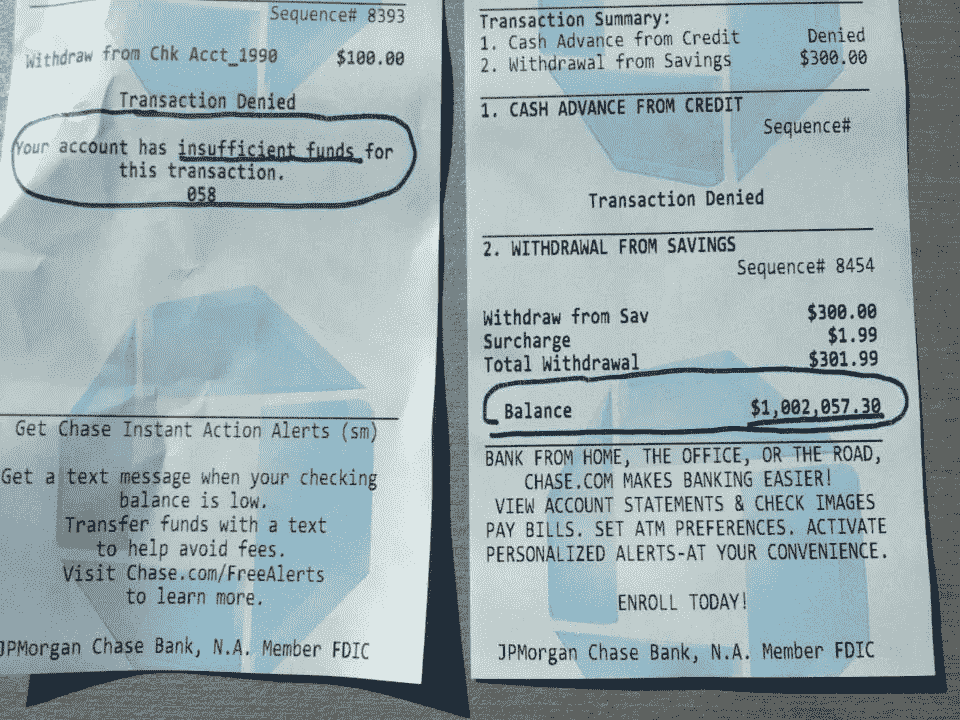
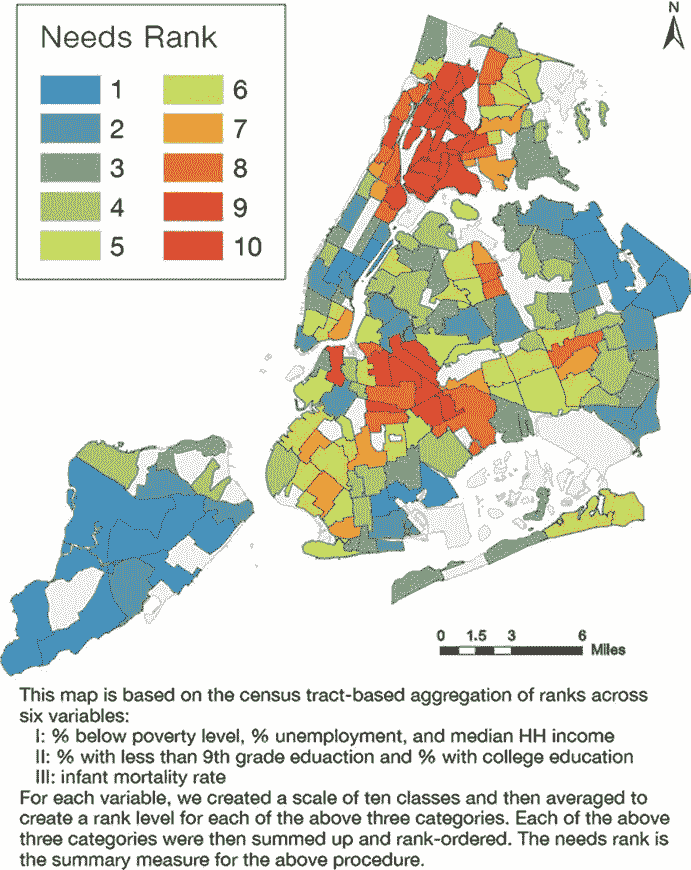
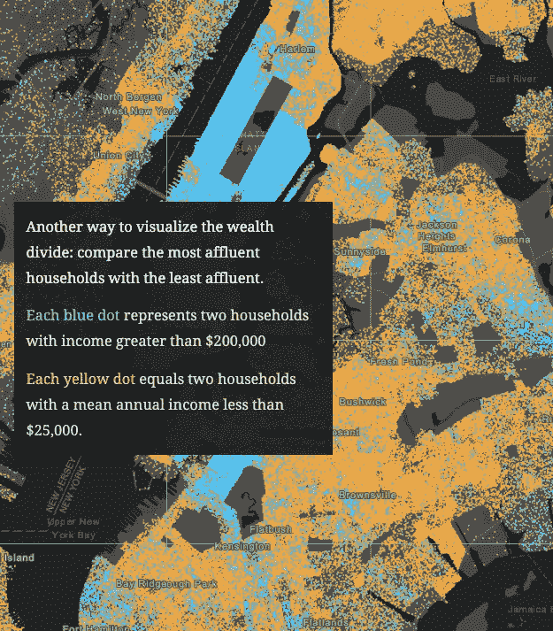
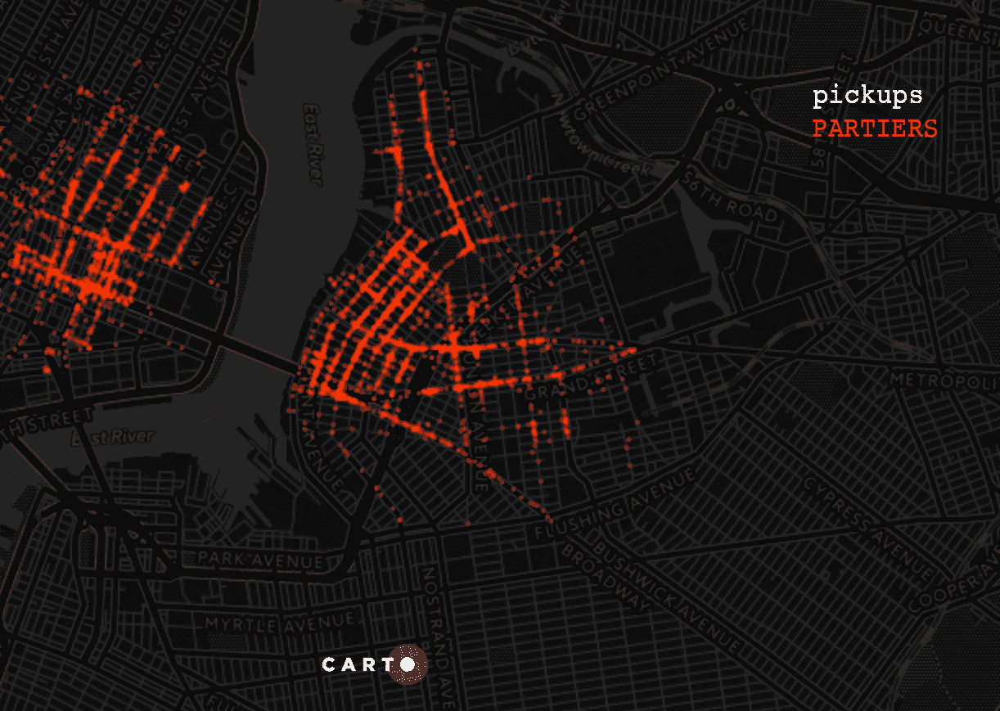
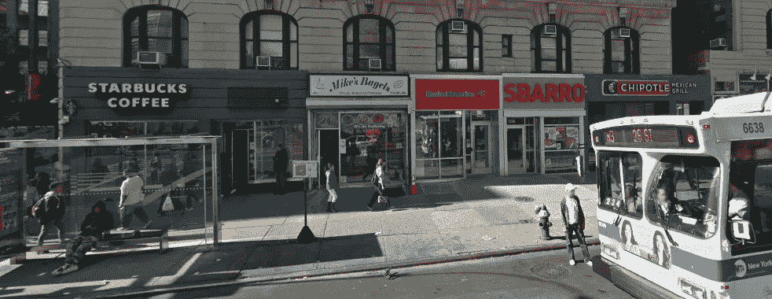
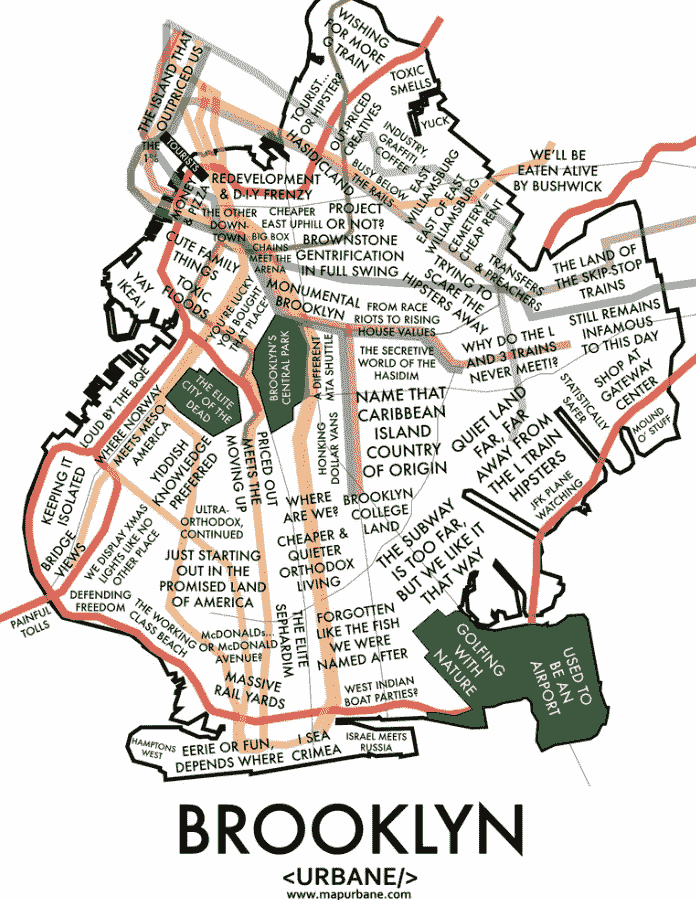
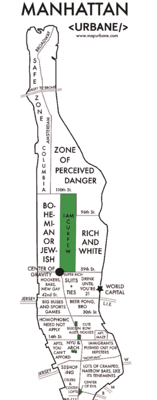

# 发现意义:小区域分析的情况和数据可用性的进展

> 原文：<https://towardsdatascience.com/finding-meaning-the-case-for-small-area-analysis-and-progress-in-data-availability-6ac541a9f6ba?source=collection_archive---------15----------------------->

作为纽约市的居民和教师，我的经历促使我着手一个研究项目，对纽约市的街区进行小区域分析比较。当时我并不知道，我最初的尝试发生在早几个月的时候，在之前的一篇**中有详细描述。**

# *接近并不意味着相似*

*你不必相信我的话。首先，看看这两张在纽约大通银行同时发现的收据就知道了。*

**

*I remembered seeing the photo circulating social media while I was living there, and had to dig it up for this article. I can’t access the original post through Facebook anymore, but the photo was extremely easy to [find](https://www.businessinsider.com.au/atm-receipt-1-million-cash-balance-2013-4) even after all these years — I still remembered the caption it had: “a tale of two New Yorks.”*

*一位匿名银行家是百万富翁，另一位的账户里连 100 美元都没有。他们在同一天使用了同一个自动取款机！考虑到纽约市的经济不平等，这并不奇怪，但这是这种不平等的明显表现。*

# *小区域分析的必要性和好处*

**

*Economic, education, and health needs in New York City neighborhoods from [Case Studies — Scientific Figure on ResearchGate](https://www.researchgate.net/figure/Economic-education-and-health-needs-in-New-York-City-neighborhoods_fig21_321169536)*

*在小范围内发现有意义的差异有明显的好处。小区域分析通常涉及分析大型数据库，以比较通常被视为整体的群体的子集内的资源可用性和使用情况。在这种情况下，整个就是组成纽约市的五个区。这个想法是发现差异有助于确定社区的需求。这将最终导致资源的重新分配或调查为什么分配的资源没有被一个子群体使用，并找到一种方法使它们更容易获得。*

*小区域分析在历史上一直是一件很难实现的事情，尤其是对于我所追求的细粒度。可靠的、有统计学意义的数据很难获得。这种情况正在改变，纽约市是带头冲锋的城市之一，因为该市承认，其巨大的多样性给平等带来了巨大的挑战，而且它有资源应对其中的一些挑战。*

# *开放数据来到纽约*

*2012 年，纽约市通过了[“开放数据法”](https://opendata.cityofnewyork.us/open-data-law/)，要求到 2018 年底，所有市政府的公共数据都可以通过一个单一的在线[门户](https://opendata.cityofnewyork.us/)免费获取。*

*世界上最大的城市之一的公共记录的大规模发布是迈向数据民主化的一大步。纽约人已经将这种资源很好地用于 T2 的 T3 航站楼。*

**

*[http://storymaps.esri.com/stories/2016/wealth-divides/index.html](http://storymaps.esri.com/stories/2016/wealth-divides/index.html)*

*一年前，认输并比较各区要容易得多，但我坚持捕捉较小社区之间的差异——这在当时导致了一些相当不起眼的分析。这一次，由于开放数据倡议，这将容易得多。虽然不是所有的数据对我分析小于全市或区范围的区域都有用，但大部分是有用的。*

# *纽约市的怪癖*

*如果你从未逛过纽约，可能很难理解为什么我这么想“放大”纽约的街区。我是说，至少布鲁克林是布鲁克林，布朗克斯是布朗克斯。有哈莱姆区，某处有唐人街，中央公园周围有价值百万的公寓。但仅此而已，对吧？*

*嗯……数据科学家徐仅在布鲁克林的威廉斯堡社区就能识别出 75 个不同的社区。她通过分析纽约市出租车和豪华轿车委员会的数据做到了这一点，正如她在[这篇文章](https://carto.com/blog/using-location-data-identify-communities-williamsburg-ny/)中概述的那样。诚然，这些“社区”中的大多数并不居住在布鲁克林，小区域分析通常集中在居住地，75 仍然很多。这是她的地图，显示了她所识别的五个社区的出租车数据。*

**

*Five Communities of Williamsburg*

*在纽约住了十年之前，我不知道街区变化有多快(跨越时空)。我想我从电影和电视节目《老友记》中获得了关于这座城市的大部分信息。虽然我知道这些是不切实际的描绘，但当我第一次冒险进入这座城市的不同地方时，它仍然让我感到惊讶。*

# *不到半英里外的世界*

*2015 年，我住在离纽约长老会医院两个街区远的地方，那里是哥伦比亚大学医学中心的所在地，当时我正在和一名住院医生约会。这套公寓是新装修的，保养得很好，地下室有洗衣房。这个社区安静、高档、专业，有相当多的种族多样性。地铁站就在我住的街区的尽头，我步行一分钟就能到达附近的一家墨西哥小吃店和一家星巴克，附近还有一些不错的餐馆，虽然价格有点高。*

**

*Economic, education, and health needs in New York City neighborhoods from [Case Studies — Scientific Figure](https://www.researchgate.net/figure/Economic-education-and-health-needs-in-New-York-City-neighborhoods_fig21_321169536) on ResearchGate.*

*当住院医生和我分手时，我是那个必须搬家的人，因为我们住在哥伦比亚大学的宿舍里。这很容易，我最好的朋友独自住在八个街区外，我的新公寓每月便宜 700 多美元，尽管哥伦比亚的住房有部分补贴。*赢*。*

*这个社区也很有趣。除了街对面的塔可钟之外，在几分钟的步行距离内没有任何大型连锁餐馆。有一些*非常好的波多黎各和多明尼加小餐馆，不过，大多数都很实惠。无论白天黑夜，任何时候都会有一群人坐在外面的小凳子或折叠椅上演奏加勒比音乐。哦，这个社区几乎完全是拉丁裔的 T4 人。街上听到的西班牙语比英语多。我的朋友是波多黎各人，所以她感觉非常自在。另一方面，我绝对是周围唯一的亚裔美国人和白人。我确实会说一些西班牙语，但是是轻微的美国口音加上墨西哥口音/方言。加勒比西班牙语几乎是另一种语言…**

*无论如何，更便宜的房租也意味着，总的来说，这个社区更穷。我现在正好在两个地铁站的中间，从大门到城市的其他地方大约需要走 7-8 分钟。相信我，在炎热潮湿的夏天和寒风凛冽的冬天，这几分钟非常重要。我注意到我每天见到的警察单位数量急剧增加。街道更加肮脏，建筑物更加破败。我在通勤开始和结束时看到的人似乎都很疲惫。这似乎是一件奇怪的事情，但我也累了——因为我每月节省的 350 美元(700 美元中我的份额)是有代价的。*

**

*This is the block I ***actually*** lived on. On the right a few buildings down is my old apartment building. The restaurant in the center, was one of my go-to spots. This photo was among the top twenty photos when I googled “Washington Heights.” Unfortunately, it belongs to a news [article](https://www.nydailynews.com/new-york/nyc-crime/man-stabbed-repeatedly-washington-heights-restaurant-article-1.2684869) about a stabbing.*

*我的公寓里有坏掉的炉子和烤箱，一个我们必须定期维修以便冲洗的厕所，墙上有大量的蟑螂和老鼠，一扇通往消防通道的窗户没有锁好，一个散热器将蒸汽泄漏到整个公寓，使它成为一个桑拿浴室，顺便说一下，也为黑色霉菌提供了理想的条件。如果问题很容易解决，大楼的负责人就很好，否则就不可避免地会很忙。此外，洗衣服从去地下室的几次旅行变成了去四个街区外最近的自助洗衣店的两个小时的旅行。*

*请记住，从高档社区到普通建筑的巨大变化都发生在八个街区之内。就规模而言，通常认为大约 20 个纽约市街区等于 1 英里，平均一个街区大约需要步行一分钟。我还没有核实，但听起来是对的。*

***

A definitely-not-completely-accurate-but-sometimes-funny-sometimes-just-weird takes on [Brooklyn](https://urbane-maps.myshopify.com/products/brooklyn-neighborhood-culture-map) and [Manhattan](https://urbane-maps.myshopify.com/collections/cultural-neighborhood-maps/products/manhattan-neighborhood-culture-map) neighborhoods by Urbane demonstrates how neighborhoods have identities unto themselves.* 

# *在布鲁克林教书*

*我在纽约教了四年高中数学、科学和计算机科学，我在一所公立特许学校工作，它是多元化特许学校联盟的成员，所以我的课堂是社会经济、种族和民族多元化的。很自然，我的不同学生从纽约市的许多不同社区来到学校。虽然大多数学生来自布鲁克林，但包括斯塔滕岛在内的每个区都有代表。一些学生的通勤单程时间超过两个小时。*

*面对全国重新种族隔离的趋势，我仍然钦佩学校对多样性的承诺。然而，在那里教书让我面对了一些令人不安的事实。我让一些学生带着所有最新的小玩意来学校，去街对面昂贵的咖啡店闲逛，而其他学生则报名参加任何周末聚会的俱乐部(比如我们的野营俱乐部)，因为这意味着他们可以在周末得到食物。纽约市各社区的经济差异非常显著，学生在学校的成绩往往与这些差异相关。*

*虽然整合学校可能是*所必需的*，以消除《不让一个孩子掉队法案》( 2001 年由老布什签署)和《力争上游》( 2009 年由奥巴马签署)试图消除的成绩差距，但这还不够。*

*当在学校学习、参与和集中注意力的能力依赖于一系列其他因素时，高质量的教师和学校资源只能做这么多，其中许多因素由学生的家庭和社区决定或与之相关。*

*不同社区之间的不平等可能是巨大的，甚至在小区域内也是如此。小区域分析是一种工具，有助于全面了解不同社区的需求，并在制定公共政策和资源分配决策时提供指导。虽然纽约市在这方面并不独特，但它是一个这些不平等经常被放大的城市，而且似乎是一个现在转向公开解决这些问题的战略的城市。这个开放数据项目将如何发展将会很有趣…*