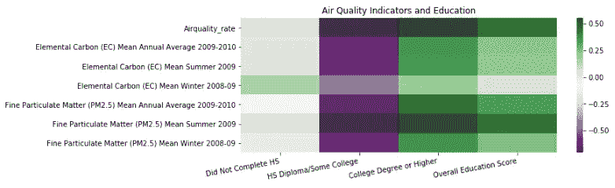

# 寻找意义:社会科学中小区域预测分析的数据问题(下)

> 原文：<https://towardsdatascience.com/finding-meaning-the-data-problem-with-small-area-predictive-analysis-in-the-social-sciences-part-f760019c9452?source=collection_archive---------24----------------------->

如果你还没有看过我这个项目的第一部分，请随意看看。虽然没有必要理解我在这里提出的问题，但我解释了什么是小区域分析，我对这个项目的灵感，我如何收集和准备我的数据，以及我在做这件事时面临的困难。这是一项正在进行的工作，在接下来的几天里将会有这个系列的第 3 部分。

> 本文原载于 2018 年 8 月。这是原物稍加编辑后的拷贝，被取了下来。

## 在这里，我将谈谈我在对纽约市五个区的 59 个指定社区的公共卫生、环境和教育数据建模时遇到的困难。


Community Districts of New York City

我将在这篇文章中讨论这三个主题。

*   我考虑和尝试的不同模型
*   有限数据的过拟合问题
*   使用机器学习进行解释和分析，而不是预测

甚至在开始使用模型之前，我就发现了每个特性与教育程度列之间的相关性。有些很有趣。看看不同社区的健康相关指标——尤其是“含糖饮料”的相关性。


在某些情况下，空气质量和“社区健康”指标(一个*社区*是否繁荣的指标)也有很强的相关性。



最后，种族与国家比率有着同等的相关性…


# 数据建模

开始时最明显的模型是简单的线性回归。虽然可以将 scikit-learn 的`LinearRegression`用于多个输出(在这种情况下，没有高中文凭的成年人的比率、有高中文凭(可能有大学文凭)的成年人的比率以及有大学或更高学位的成年人的比率)，但该模型假设输出是独立的，因此基本上创建了三个完全独立的线性回归模型，每个模型对应一个输出。

我继续做了，完成了对所有数据的线性回归，得到了 0.95 的 R 值(三个输出的平均值)。这一切都很好，但有两个突出的问题…

第一个问题是，三个产出显然不是独立的；事实上，它们是如此紧密地联系在一起，以至于在每种情况下，这三个比率的总和应该是 100(这是百分比的趋势)。因此，创建三个完全独立的线性模型实际上并不能准确描述情况。


seaborn pairplot of the educational attainment data

第二个问题是，虽然这个模型似乎告诉我们，模型中包含的特征似乎确实与教育成果数据相关，但当我将我的数据分为训练集和测试集时，无论大小如何，我总是得到训练数据大于 0.95 的 R 值，而测试数据通常是负值——我得到的最高值是 0.49，这完全是基于数据的随机分割的运气。所以这里肯定存在过度拟合的问题。只有 59 个样本，因为只有 59 个社区区，这似乎是一个不可避免的问题，无论模型。

以几种不同的方式在第一个相关教育成就特征的问题上取得进展。首先，我研究了可以处理多个输出的模型，同时考虑到它们是相关的。唯一有希望的途径似乎是尖端的神经网络。然而，这些只是在研究论文中提到过，还没有生产模型，所以在这一点上它真的只是在理论阶段…所以对我来说是一个死胡同。

唯一的另一种方法是将我的三个输出合并成一个单一的分数。最简单的方法是给每个教育程度分配一个值:0 代表没有完成高中学业，1 代表高中学历和大学学历，2 代表大学学历或更高。对于每个地区，我将每个百分比乘以其相应的值，然后将它们加在一起。这为每个地区创建了一个单一的，虽然有点抽象的“教育分数”，然后我可以用它来运行一个单一的线性回归。

```
educational_attainment['edu_score'] = educational_attainment.apply(
    lambda row: row['Eduhsdegreeorsomecollege_rate'] + 2 *
    row['Educollegedegreeandhigher_rate'], axis=1)
```

在整个数据集上，这种线性回归产生了 0.96 的 R 值；然而，当分成训练集和测试集时，它陷入了同样的过度拟合陷阱。

## 有序回归

我并不期望过拟合问题会有更好的结果，所以决定使用`mord`模块尝试一些有序回归。所以我用我的教育成绩，用平均值和标准差把数据分成 4 类。

```
# Get the mean and standard deviation (indices 1 and 2 respectively)
statistics = educational_attainment['edu_score'].describe()# Define my categories
def get_ordinal(row):
    if row.loc['edu_score'] >= (statistics[1] + statistics[2]):
        ordinal = 1
    elif row.loc['edu_score'] >= (statistics[1]):
        ordinal = 2
    elif row.loc['edu_score'] >= (statistics[1] - statistics[2]):
        ordinal = 3
    else:
        ordinal = 4
    return ordinal

educational_attainment['ordinal'] = educational_attainment.apply(
                               lambda row: get_ordinal(row), axis=1)
```

令我惊讶的是，当我使用`mord.LogisticIT()`(使用即时阈值变量的有序逻辑回归)时，这在过度拟合方面稍微好一些。当作为一个整体用于数据集时，R 值为 0.93。当分成训练集和测试集时，测试数据集的 R 值至少是*总是*正值，有时高达 0.5——仍然没有什么值得夸耀的，但却是一个相当大的改进。

对抗这种过度拟合的另一种方法可能是找到不同年份的相同数据，或者找到更多组邻域的相同数据。然而，看到找到*这个*数据有多么困难，我将把它留到以后再说。因此，虽然我们似乎可以找到相关性，但该模型的任何预测能力本质上都是无意义的，因此没有因果关系可以合理建立。

更有希望的途径似乎是使用 L2 正则化线性回归(也称为岭回归)来计算特征重要性，以伴随我们的原始相关性，以追求*理解*和*解释*数据，而不是试图建立一个纯粹的*预测*模型。对这种分析有用的其他模型是随机 L1 (Lasso)回归和 scikit-learn 的额外树回归。以下是我在实施这些策略时发现的结果。

## 岭回归、随机套索和额外树

这些模型是解释数据的绝佳工具，因为这些模型是*稳定的*并且有用的特征往往具有非零系数/分数——这是算法中的冗余和平均试验和/或惩罚高系数以确保特征不会被过度呈现的结果。

作为另一层，我使用了包含对`sklearn`的支持的`eli5`包来实现`PermutationImportance`，其中，一列接一列的值被打乱，以查看模型仍然可以预测目标的程度。

```
# Using robustly scaled columns...
def get_scores(X, Y, scale_method):
    index_tuples = []
    model_data = []

    for level in Y.columns:
        ridge_model = RidgeCV()
        et_model = ExtraTreesRegressor(n_estimators=50, 
            bootstrap=True)
        randL_model = RandomizedLasso()
        models = [ridge_model, et_model]   
        y = Y[level] for model in models:
            model.fit(X, y)
            score = model.score(X, y)
            model_name = f'{model}'.split('(')[0]
            try:
                coefs = model.coef_
            except:
                try:
                    importances = model.feature_importances_
                except:
                    importances = np.array(None)
            else:
                importances = np.absolute(coefs)
            finally:
                perm = PermutationImportance(model).fit(X, y)
                perm_importances = perm.feature_importances_
                index_tuple1 = (level, 'importances', score, 
                    model_name)
                index_tuple2 = (level, 'perm_importances', score, 
                    model_name)

                if importances.any():
                    index_tuples.append(index_tuple1)
                    model_data.append(importances)

                index_tuples.append(index_tuple2)
                model_data.append(perm_importances)
```

当我对这些不同模型的得分进行平均，并筛选出作为社区和环境健康指标的特征时，我得到了下面的结果。


The most important factors of Environmental and Community Health in predicting Educational Attainment of adults in the community. “Extremes” is an aggregation of rates for “Did Not Complete HS” and “College Degree or Higher”

在继续这项研究的过程中，我计划通过查看相关性和 p 值来选择适当的特征，从而减少特征的数量，希望将过度拟合的影响降至最低。我还计划继续寻找其他数据来源——尤其是可以显示随时间变化的数据。这是一项正在进行的工作。生活也是如此。