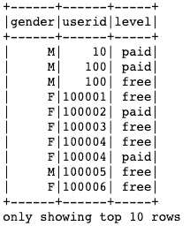
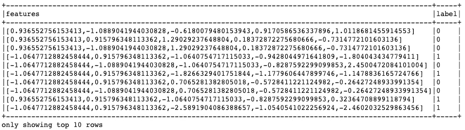

# 用 Apache Spark 大海捞针

> 原文：<https://towardsdatascience.com/finding-needle-in-haystack-with-apache-spark-eb4c846f998d?source=collection_archive---------29----------------------->


[*“HearU Music”*](https://www.behance.net/gallery/43892087/HearU-Music) *by Yi Mao is licensed under* [*CC BY-NC-ND 4.0*](https://creativecommons.org/licenses/by-nc-nd/4.0/?ref=ccsearch&atype=rich)

**TL；DR:** 客户流失对企业来说是一个真实的问题，在不断增长的(大)数据中预测哪个用户可能会流失可能很困难。Apache Spark 允许数据科学家在大数据中轻松地进行大规模数据清理/建模/预测。

大多数数据科学家都知道处理数据并不总是一帆风顺。像清理、输入缺失值、特征工程、建模和预测这样的过程，即使数据小到可以放入笔记本电脑的内存中，其本身也是一个巨大的问题。如果数据比这大得多，事情很容易变得更复杂。解决这个问题的一个非常常见的方法是将数据放在 SQL 或非 SQL 数据库中，在汇总数据并将汇总的数据移动到本地工作站进行建模之前，在那里进行大部分的争论/清理。

然而，有时数据科学家需要大量数据输入到他们的模型中，并根据大数据进行训练和预测。对于传统的库，如 Python Pandas、scikit-learn 或 R dplyr，这并不容易，因为我们只有有限的内存来容纳。

Apache Spark 是大数据生态系统中最大的明星之一。它允许数据科学家使用熟悉的工具工作，但允许 Spark 做所有繁重的工作，如并行化和任务扩展。它提供了类似 Spark 数据帧的工具，类似于 R 数据帧或 Pandas 数据帧。如果您更喜欢传统的 SQL，您可以使用 SQL 来处理数据，而不是使用数据框。Spark 通过 MLlib 库支持许多开箱即用的机器学习算法。它还通过 Spark Streaming 为数据工程师提供流支持，最后，它通过 GraphX 支持原生图形处理。Spark 是数据科学家/工程师在处理大数据时的一把瑞士军刀。

在本帖中，我们将研究一个商业案例，这是许多数据科学家的共同任务，因为它对商业营销或战略工作有非常直接的影响。我们将尝试预测可能会为音乐流媒体平台流失的用户。基于良好的预测，通过促销或折扣来保持用户的参与，以流失用户，这一点至关重要。

在本例中，我们有完整数据集(12GB)的一个小子集(128MB)。由于我在本地集群上工作(仅指我的笔记本电脑，而不是一组服务器)，我将对小数据集进行分析，但我们将探索的所有方法都适用于较大的数据，没有什么根本不同，只是 Spark 将在大多数情况下处理并行性。

> 我们使用的数据来自 [Udacity 数据科学家纳米学位计划 Apache Spark 顶点计划](https://d20vrrgs8k4bvw.cloudfront.net/documents/en-US/Data+Scientist+Nanodegree+Syllabus.pdf)

Import necessary libraries. We will import some of them again for clarity later

Spark 需要一个叫做 Spark Session 的东西，这是你的代码和主节点之间的驱动。让我们创建一个，如果还没有的话，或者如果已经有了就返回它。

Creating/getting Spark session. Note that our cluster is a local one.

# 加载和清理 Sparkify 数据集

我们将用户活动数据集`mini_sparkify_event_data.json`导入 Spark，然后清除一些缺失的值。

Read data into Spark and do few simple checks on data

让我们浏览一下前几行，感受一下我们的数据

```
data.take(5)[Row(artist='Martha Tilston', auth='Logged In', firstName='Colin', gender='M', itemInSession=50, lastName='Freeman', length=277.89016, level='paid', location='Bakersfield, CA', method='PUT', page='NextSong', registration=1538173362000, sessionId=29, song='Rockpools', status=200, ts=1538352117000, userAgent='Mozilla/5.0 (Windows NT 6.1; WOW64; rv:31.0) Gecko/20100101 Firefox/31.0', userId='30'), Row(artist='Five Iron Frenzy', auth='Logged In', firstName='Micah', gender='M', itemInSession=79, lastName='Long', length=236.09424, level='free', location='Boston-Cambridge-Newton, MA-NH', method='PUT', page='NextSong', registration=1538331630000, sessionId=8, song='Canada', status=200, ts=1538352180000, userAgent='"Mozilla/5.0 (Windows NT 6.1; WOW64) AppleWebKit/537.36 (KHTML, like Gecko) Chrome/37.0.2062.103 Safari/537.36"', userId='9'), Row(artist='Adam Lambert', auth='Logged In', firstName='Colin', gender='M', itemInSession=51, lastName='Freeman', length=282.8273, level='paid', location='Bakersfield, CA', method='PUT', page='NextSong', registration=1538173362000, sessionId=29, song='Time For Miracles', status=200, ts=1538352394000, userAgent='Mozilla/5.0 (Windows NT 6.1; WOW64; rv:31.0) Gecko/20100101 Firefox/31.0', userId='30'), Row(artist='Enigma', auth='Logged In', firstName='Micah', gender='M', itemInSession=80, lastName='Long', length=262.71302, level='free', location='Boston-Cambridge-Newton, MA-NH', method='PUT', page='NextSong', registration=1538331630000, sessionId=8, song='Knocking On Forbidden Doors', status=200, ts=1538352416000, userAgent='"Mozilla/5.0 (Windows NT 6.1; WOW64) AppleWebKit/537.36 (KHTML, like Gecko) Chrome/37.0.2062.103 Safari/537.36"', userId='9'), Row(artist='Daft Punk', auth='Logged In', firstName='Colin', gender='M', itemInSession=52, lastName='Freeman', length=223.60771, level='paid', location='Bakersfield, CA', method='PUT', page='NextSong', registration=1538173362000, sessionId=29, song='Harder Better Faster Stronger', status=200, ts=1538352676000, userAgent='Mozilla/5.0 (Windows NT 6.1; WOW64; rv:31.0) Gecko/20100101 Firefox/31.0', userId='30')]
```

每行标识一个用户活动，如当前艺术家、歌曲、会话 Id、用户 Id，以及用户正在从哪个设备收听、unix 时间戳、性别、用户是否登录和付费用户、用户详细信息..等等

# 数据清理

我们应该检查数据集中的空值。根据结构，我们可以省略一些列或估算(如果我们的分析需要的话)。让我们从统计和视觉两方面来看看

Checking Null and NaN values in our dataset

我们有大量的空值，特别是在某些列中，比如`artist`、`length`或`song`。

我们还观察到，在列组之间的空值计数方面可能存在相关性，例如`artist`、`length`或`song`都具有相同数量的空值。对于`firstName`、`gender`、`lastName`、`location`、`registration`、`userAgent`都是如此。

其他列都没有任何缺失值。

同样，让我们直观地检查缺失值，看看我们之前的相关性声明是否得到支持。如果这是真的，我们可以说不仅空计数是相同的，而且空值出现的行数也应该是相同的。

由于 pyspark 没有可视化库，我们采样 spark 数据帧并将其转换为 pandas 数据帧，然后使用 Seaborn 进行可视化。

```
plt.figure(figsize=(12, 12))
sns.heatmap(data.sample(False, 0.1, 42).toPandas().isnull())
```


Using Python Seaborn heatmap we can visualise NULL values in the dataset

上面的热图支持我们的说法，列在缺失值、数字和索引方面是相关的。

我想检查的最后一件事是，如果`firstName`和其他类似字段为空，那么`artist`和类似字段是否也为空？

```
sns.heatmap(data.filter(data.firstName.isNull()).toPandas().isnull())
```


Filelds like `artist`, `location`.. etc all are null when `fistName` is null

是的，它们是相关的，所以不仅空计数相等的组内部相关，而且组间空模式也相关。用简单的英语来说，如果`firstName`为空，那么`gender`也为空，因为它们的空计数相等，但是上面的图表也表明`artist` col 也将为空

根据下面的两个表，当用户注销或作为来宾收听时，`firstName`、`gender`、`lastName`、`location`、`registration`、`userAgent`和`auth`列具有空值。因为我们真正感兴趣的是那些已经注册并可能流失的用户，所以我们可以删除这些行，因为它们不是登录用户。

```
data.filter(data.firstName.isNull())\
    .groupBy('firstName','gender', 'lastName',
             'location', 'registration','userAgent', 'auth')\
    .count()\.show()
```


```
data.groupBy('auth').count().show()
```


Rows where firstName .. etc are null they all are either Guest or Logged out.

```
# Drop the rows with null values for the columns below
data = data.na.drop(subset=['firstName','gender', 
                            'lastName','location','registration',
                            'userAgent', 'auth'])sns.heatmap(data.toPandas().isnull())
```


Removing **logged out** users gives us a cleaner dataset

现在，我们有了一个更清晰的用户登录数据集。

`ts` 列是 unix epoch 格式的时间戳，我们最好转换成时间戳格式，并添加到`timestamp`列中

```
data = data\
    .withColumn('timestamp', from_unixtime(data.ts/1000))data.take(2)[Row(artist='Martha Tilston', auth='Logged In', firstName='Colin', gender='M', itemInSession=50, lastName='Freeman', length=277.89016, level='paid', location='Bakersfield, CA', method='PUT', page='NextSong', registration=1538173362000, sessionId=29, song='Rockpools', status=200, **ts=1538352117000**, userAgent='Mozilla/5.0 (Windows NT 6.1; WOW64; rv:31.0) Gecko/20100101 Firefox/31.0', userId='30', **timestamp='2018-10-01 00:01:57'**), Row(artist='Five Iron Frenzy', auth='Logged In', firstName='Micah', gender='M', itemInSession=79, lastName='Long', length=236.09424, level='free', location='Boston-Cambridge-Newton, MA-NH', method='PUT', page='NextSong', registration=1538331630000, sessionId=8, song='Canada', status=200, **ts=1538352180000**, userAgent='"Mozilla/5.0 (Windows NT 6.1; WOW64) AppleWebKit/537.36 (KHTML, like Gecko) Chrome/37.0.2062.103 Safari/537.36"', userId='9', **timestamp='2018-10-01 00:03:00'**)]
```

对于我们的模型，我们将删除一些我们不需要的字段，可能它们在其他列中有重复的信息或者只是不相关。在这一点上，我决定不在我的模型中使用它们，但是由于模型构建是一个迭代过程，如果我相信添加这些列会有所不同，我可能会在以后决定不删除这些列。

```
cols_to_drop = ['userAgent', 'artist', 'firstName', 
                'lastName', 'location', 'song', 
                'ts', 'registration', 'length', 
                'method', 'status']data = data.drop(*cols_to_drop)data.show()
```


User music after adding `**timestamp**` and removing irrelevant columns for prediction

下表告诉我们，免费和付费用户都可以取消他们的服务，但只有付费用户可以降级服务。嗯，有道理。我相信我们可以进一步过滤我们的数据框架来清理几行，因为像**设置**或**帮助**这样的页面不会告诉我们太多关于客户流失的信息。


Pages vs User Level. Next Song is the dominant as expected. There are 52 Cancellations (churns)

```
pages_to_keep = ['NextSong', 'Downgrade', 
                 'Cancellation Confirmation', 'Upgrade', 
                 'Add to Playlist', 'Cancel', 'Submit Upgrade', ]data = data.filter(col('page').isin(pages_to_keep))data.groupBy('auth', 'page').count().orderBy('auth').show()
```


After filtering out pages like Help, we are left with these above. **Cancellation Confirmation** is the churn KPI

# 探索性数据分析

`Cancellation Confirmation`是对流失最明确的 KPI。`Downgrade`页面被访问了数百次，但是数据并没有清楚地告诉我们用户在访问该页面后是否被降级，比如我们没有`Downgrade Confirmed`后面跟有`Downgrade`页面。此外，数据集中的`Downgrade`行数远远大于唯一用户数。因此，我坚持使用`Cancellation Confirmation`作为客户流失指示器。

```
# In our final dataset we do not have any null values
data.select([count(when(col(c).isNull(), c)).alias(c) 
               for c in data.columns])\
           .head()\
           .asDict(){'auth': 0,
 'gender': 0,
 'itemInSession': 0,
 'level': 0,
 'page': 0,
 'sessionId': 0,
 'userId': 0,
 'timestamp': 0}
```

我们的数据集中有多少不同的用户？

```
data.select('userId').distinct().count()>> 225
```

让我们来看看一个随机用户的听力活动。 `*itemInSession*` *连续收听时单调递增。我们可以提取每个会话的最大值，以了解用户参与度(稍后在功能工程部分)*

```
data.filter(col('userId') == 30).show(20)
```


User activity for user with userId 30\. Note that itemInSession increases when the page changes. sessionID stays the same for a continuous music streaming session.

让我们简要地看一下被搅动的用户/订户。看起来`free`和`paid`的客户都会流失。我们将这些数据保存到`churn_data`中，因为我们将在以后加入特征工程部分时使用这些数据

```
churn_data = data.filter(col('page')=='Cancellation Confirmation')
churn_data.show(10)
```


List of churned users, there are both free and paid customers. We store the userId for joining later with other summarised dataset

我们稍后将需要一个用户列表，当在特征工程部分加入数据集时，创建一个新的列名`churned`

```
churn_data_summary = churn_data.select('userId')\
                               .withColumn('churned', F.lit(True))churn_data_summary.show(10)
```


Churned userIds

# 特征工程

在这一部分中，我们将构建一些特征/预测器来预测不稳定的用户。这通常意味着使用现有的列创建新的列，并进行转换，以便我们可以输入到 ML 管道中。

**平均会话间隔时间**

衡量用户参与度的一个有用功能是查看用户收听 Sparkify 平台的频率。我们会查看用户有多少个会话以及会话之间的平均时间。如果用户经常访问我们的应用程序/平台，他们可能会更加投入，因此，对于投入的用户来说，平均会话间隔时间应该更短。


userId 10 has 6 streaming sessions and mean time between sessions is 7 days.

在我们的模型中，我们只需要将`sessionsFreqDay`作为我们的特征，而`userId`是连接下面其他数据集的关键，剩余的列是不必要的，所以我们要过滤掉

```
listen_freq = listen_freq.select('userId', 'sessionsFreqDay')listen_freq.show(10)
```


we use userId as key when joining with other data. sessionsFreqDay is a new feature engineered predictor

**会话计数，平均歌曲计数/会话**

另外两个好的预测指标是给定用户的总会话数和每次会话收听的平均歌曲数。如果用户有更多的会话，并且每个会话听很多首歌，他们可能会更投入。

下面是另一个聚合数据集，显示了每个用户的收听活动摘要、他们收听了多少个会话以及所有会话的平均歌曲数。


user with id 10, has 6 sessions and on average he/she listened to 133.7 songs/session, whereas user with id 100006 has only 1 session and listened to 45 songs. User 100006 is engaged less.

下面是上面用于`user_engagement`的 pyspark 代码的 SQL 等价物，我只是在这里添加作为参考，它给出了完全相同的数据，但是使用了更容易阅读的参考。对于那些更喜欢 SQL 而不是 Dataframe 方法的人来说，他们会很高兴地看到他们几乎可以只用 SQL 来进行数据操作。


Same result is achieved with SQL

**用户功能**

*像* `*gender*` *和* `*level*` *这样的用户特征在预测客户流失时会很有用，因为免费用户和付费用户或者女性和男性用户的行为可能会有所不同。让我们将这些特征保存到* `*user_feature*` *数据帧*中

```
user_features = data.select('gender', 'userid', 'level')\
                    .distinct().orderBy('userId')user_features.show(10)
```



User Features

最后，让我们将上面创建的所有功能加入到一个`joined`数据框架中


churned column is the target variable and all other columns (except userId) are predictors

现在我们有 5 个流失预测列:

*   `gender` : M 或 F
*   `level` : **付费**或**免费**
*   `sessionCount`:用户听了多少次音乐？每个会话有多首歌曲
*   `meanSongCount`:对于给定的会话，每个用户平均听了多少首歌？(一次会议持续多长时间)
*   `sessionFreqDay`:会话之间的平均天数是多少？更低意味着更多的参与。

在继续之前，让我们做一个理智检查，看看我们的预测是否有意义。下面是每个`churned`和`gender`组的`sessionCount`、`meanSongCount`和`SessionFreqDay`的平均值

```
joined.groupBy('churned','gender')\
      .agg({'sessionCount': 'mean', 
            'meanSongCount': 'mean',
            'sessionsFreqDay': 'mean'})\
      .orderBy('churned','gender')\
      .show()
```


根据上表，易激动用户倾向于拥有较低的`sessionCount`，他们在会话中听较少的音乐，但是更频繁地使用平台*(易激动用户的会话间隔为 2 - 2.5 天，非易激动用户为 4 - 4.8 天)。最后一个观察结果与我们的预期有点相反，但这仍然是一个有用的预测。一个有趣的发现是，女性用户比男性用户更喜欢这个平台，这对我们的模型也很有用*

```
joined.groupBy('churned','level')\
      .agg({'sessionCount': 'mean', 
            'meanSongCount': 'mean',
            'sessionsFreqDay': 'mean'})\
      .orderBy('churned','level')\
      .show()
```


当我们从*免费*或*付费*用户的角度看数据时，也有类似的观察。`sessionCount`和`meanSongCount`对于非搅动用户来说都高于预期，但是搅动用户更频繁地使用该平台。这是否意味着他们不是因为缺乏兴趣，而是因为找不到想要的音乐而烦恼，并因此离开了平台？这将是一个有趣的想法，供以后探讨。但是我们不会在这篇博文中看到它。问问题总是一个好习惯，如果有矛盾的发现，问更多的问题来发现潜在的事实。

我们有一个矛盾发现的另一个原因可能只是统计学上的怪癖。辛普森悖论在某些情况下可能会困扰我们。为了确保我们没有陷入辛普森悖论的统计谬误，让我们一起来看看 T10 和 T11。

```
joined.groupBy('churned','level', 'gender')\
      .agg({'sessionCount': 'mean', 
            'meanSongCount': 'mean',
            'sessionsFreqDay': 'mean'})\
      .orderBy('churned','level', 'gender')\
      .show()
```


通过`level`和`gender`的划分仍然显示，被搅动的用户有更频繁的参与。从这个角度来看，不存在辛普森悖论

Spark 中的机器学习模型只能处理数字，因此我们需要将我们的分类特征转换成数字。

我们将使用`StringIndexer`，将数字分配给`level`和`gender`，并使用`OneHotEncoderEstimator`将它们编码成`SparseVector`。

Converting Strings into indexes then One Hot Encoding into Sparse Vector

```
# Dropping gender and level (temporarily), just to fit the cell into # screen for readabilityjoined.drop('gender', 'level').show()
```


String Indexers created level_idx and gender_idx and OneHotEncoderEstimator created dummy columns

如果数字列中的数据是偏斜的，预测值强度会降低，因此我们还应该检查数字列`sessionCount`、`meanSongCount`和`sessionsFreqDay`的分布。让我们目测一下

```
joined_pandas = joined.select('sessionCount', 
                              'meanSongCount',
                              'sessionsFreqDay')\
                      .toPandas()f, axes = plt.subplots(2, 3, figsize=(14, 7), sharex=False)sns.distplot( joined_pandas["sessionCount"] , color="skyblue", ax=axes[0, 0])sns.distplot( joined_pandas["meanSongCount"] , color="olive", ax=axes[0, 1])sns.distplot( joined_pandas["sessionsFreqDay"] , color="gold", ax=axes[0, 2])
```


All numeric features seems left skewed. We better transform them before modelling.

所有看起来都向左倾斜，让我们应用`log`和`sqrt`变换来处理倾斜


Original distribution (top row) and features after transformation. Transformation helped to fix skew.

这看起来更好，我们回到我们的 spark 数据框架`joined`并在那里应用转换。

```
joined = joined\
         .withColumn('logSessionCount', F.log('sessionCount'))\
         .withColumn('sqrtMeanSongCount', F.sqrt('meanSongCount'))\
         .withColumn('sqrtSessionsFreqDay', F.sqrt('sessionsFreqDay'))joined.cache()
joined.take(1)
```


New Columns logSessionCount, sqrtMeanSongCount and sqrtSessionsFreqDay are created

最后，我们需要创建两列，`label`和`features`。Spark ML 需要`label`列，它必须是数字，这意味着我们需要通过转换成整数将`churned`列转换成`label`

我们还需要所有的预测器都在一个向量中，Spark ML 处理向量，所以我们需要连接所有这 5 个预测器。

Spark needs a features vector, therefore we add all our predictors into a Dense Vector using VectorAssembler


**nonScaledFeatures** is a DenseVector created from other features

仅关注`nonScaledFeatures`和`label`:

```
joined_vector.select('nonScaledFeatures', 'label')\
              .show(10, truncate=False)
```


机器学习模型更好地处理标准化/规模化数据，因此我们需要在进入建模阶段之前标准化/规模化我们的特征

```
scaled = StandardScaler(inputCol="nonScaledFeatures", 
                        outputCol="features",
                        withStd=True, 
                        withMean=True)\
                        .fit(joined_vector)\
                        .transform(joined_vector)scaled.select('features', 'label').show(10, truncate=False)
```



# 建模

现在我们在向量中有了缩放/标准化的特征，并标记为预测因子，我们可以进入建模阶段。

这里，我们需要将完整的数据集分成训练集、测试集和测试几种机器学习方法。我们将评估各种模型的准确性，必要时调整参数。我们将根据测试准确性确定获胜模型，并在验证集上报告结果。

我们评估三个模型，`DecisionTreeClassifier`和`RandomForestClassifier`和`GBTClassifier`。`RandomForestClassifer`和`GBTClassifier`将许多`DecisionTreeClassifiers`结合起来，通过使分类器不容易过度拟合来获得更好的精度。`DecisionTreeClassifer`一般倾向于过度拟合。

我们的第一个模型是带有默认输入的`DecisionTreeClassifier`

```
train, test = scaled.randomSplit([0.8, 0.2], seed=42)tree = DecisionTreeClassifier()
prediction_tree = tree.fit(train).transform(test)
prediction_tree.groupBy('label', 'prediction').count().show()
```


DecisionTreeClassifier predicted 9 churns correctly, but missed 8 churns

为了更深入的了解，我们可以看看每个预测的概率值

```
prediction_tree.select('label', 'prediction', 'probability')\
               .show(20, False)
```


labels, predictions and probability values for each user

流失事件相当稀疏，基本决策树分类器能够成功预测 9 个流失事件，错过 8 个，错误预测 2 个客户将流失，但没有。

现在我们来看一下带有默认超参数的`RandomForestClassifier`

```
prediction_forest = RandomForestClassifier()\
                           .fit(train)\
                           .transform(test)prediction_forest.groupBy('label', 'prediction').count().show()
```


RandomForestClassifier predictions

与`DecisionTreeClassifier`相比，`RandomForestClassifier`在这种情况下并没有表现得特别好

最后让我们看看梯度增强树分类器

```
from pyspark.ml.classification import GBTClassifiergbt = GBTClassifier(featuresCol='features', labelCol='label')
pred_gbt = gbt.fit(train).transform(test)pred_gbt.groupBy('label', 'prediction').count().show()
```


GBTClassifier has better prediction capability in this test set

`GBTClassifier`能够超越简单的`DecisionTreeClassifier`和`RandomForestClasssifier`。它能够成功地预测 11 次搅拌，只错过了 6 次搅拌。

# 模型评估、管道、交叉验证和网格搜索

尽管我们通过创建几个表来检查我们的预测准确性，但是 Apache Spark ML 库已经内置了评估器来评估我们的模型是否成功。在我们的例子中，我们的标签是我们可以使用的唯一一个二进制类`BinaryClassificationEvaluator`。

另一方面，管道对于创建健壮的 ML 管道和避免测试数据泄漏到模型训练中非常有用。管道也让我们的代码更加整洁。

交叉验证允许我们将训练数据集划分为折叠，并在每个折叠上进行训练，以找到更好的模型。

许多模型、转换器和索引器都有超参数。GridSearch 允许我们尝试许多不同的超参数，并使用这些超参数的笛卡尔乘积自动构建许多模型。找到理想的参数被称为模型调整，GridSeach 使这变得轻而易举。

让我们再次获取连接的数据，并在输入管道之前应用`log`或`sqrt`转换

```
joined = user_features\
    .join(churn_data_summary, 
          on=['userId'], 
          how='left')\
    .join(user_engagement, 
          on=['userId'], 
          how='left')\
    .join(listen_freq,
          on=['userId'],
          how='left')\
    .orderBy('userId')\
    .fillna(False, subset=['churned'])\
    .withColumn('churned', 
                col('churned').cast('integer'))\
    .withColumn('logSessionCount', F.log('sessionCount'))\
    .withColumn('sqrtMeanSongCount', F.sqrt('meanSongCount'))\
    .withColumn('sqrtSessionsFreqDay', F.sqrt('sessionsFreqDay'))joined.cache()
joined.show(5)
```


cleaned dataset, ready for Pipeline

现在定义 ML 管道的每个阶段

Stages define the order of transformations to be applied

```
[StringIndexer_68305429c317,
 StringIndexer_c98ace58d733,
 OneHotEncoderEstimator_0216ca1e6769,
 VectorAssembler_45b1ace90533,
 MinMaxScaler_bfcb63301c7e,
 StandardScaler_dd543c1f0b07,
 RandomForestClassifier_dce35260ff2f]
```

创建一个网格搜索对象，我们定义不同的`RandomForestClassifer`参数，如`maxDepth`或`featureSubsetStrategy`

还要定义评估器，该评估器将评估由网格搜索创建的模型的性能，并且将选择具有基于评估器的 bets 度量的模型。

```
"Number of models to be tested with 5 crossfolds = {}".format(5*len(params))
```

`> Number of models to be tested with 5 crossfolds = 60`

由于我们正在安装 60 个模型，这可能需要一些时间。Spark 可以并行拟合模型以加速训练，但在这种情况下，我们串行进行，因为我们只有本地集群。

```
train, test = joined.randomSplit([0.8, 0.2], seed=42)
model = cv.fit(train)model.avgMetrics
```


Evaluator results for each model 3 x 4 hyperparameters

我们确实有很多模型，但是`cv.transform()` 会根据评估器自动选择最佳模型。

让我们用最好的模型来预测

```
predictions = model.transform(test)
predictions.groupBy('churned', 'prediction').count().show()
```


Prediction results with RandomForestClassifier with optimum params

在这种情况下，与普通的`RandomForestClassifier`相比，我们没有得到不同的结果，但是我们看到了如何使用*管道*、*交叉验证*和*评估器*使我们的生活变得更容易。

# 结论

作为数据科学家，我们总是试图用数据回答问题，并遵循数学和统计的严谨性。在这篇文章中，问题是预测用户流失，使用一种系统的方法，我们取得了一些成功。这是第一次迭代，通常模型构建需要多次迭代，通过添加更好的预测器或更多数据来进一步优化预测。

我们还看到了如何使用 Apache Spark 来处理数据、创建新功能、构建模型并对其进行评估。尽管这一转换基于一小部分数据，但同样的转换可以应用于更大的数据集，而无需更改代码。

这是一个很长的阅读，但希望你喜欢它