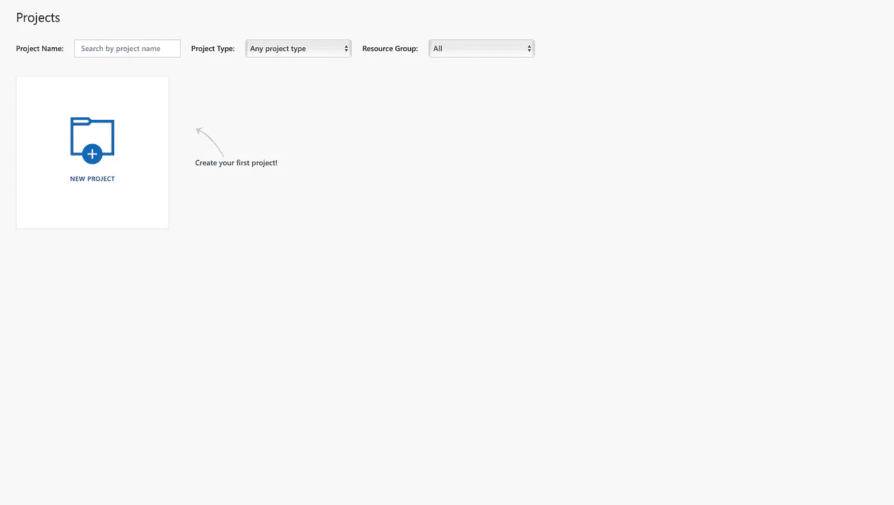
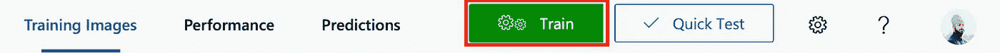
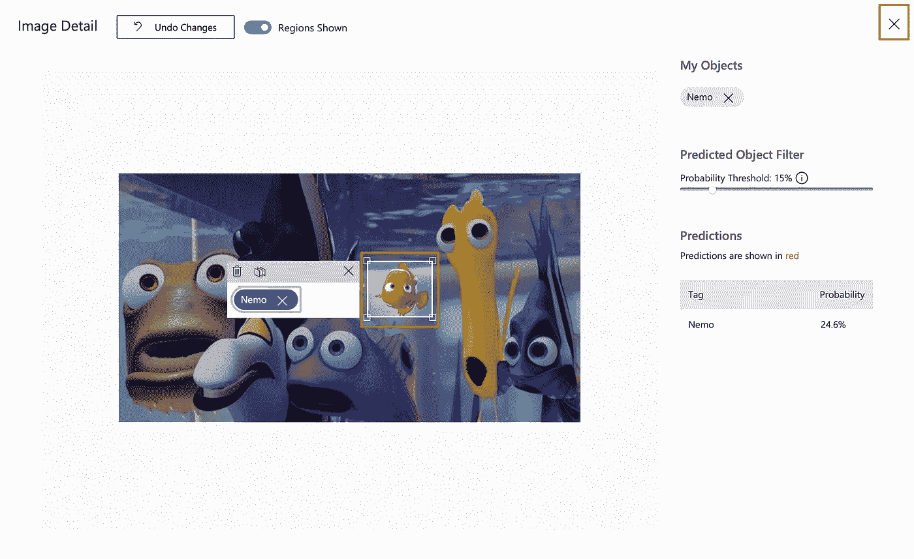

# 天蓝色的海底总动员

> 原文：<https://towardsdatascience.com/finding-nemo-with-azure-476ed516090?source=collection_archive---------19----------------------->

## 使用 Azure 自定义视觉服务探索对象识别

Marlin and Dory are on a search for Nemo — Marlin’s only son, who was taken by a fishing trawler. I just figured out a way to utilize the power of Azure cloud to help them find Nemo in the vast sea.

我正在浏览我童年时收藏的珍贵电影，这时我发现了《海底总动员》。小时候，我一直想帮助尼莫回到他爸爸身边。我只是不知道怎么做。

现在我在技术的陪伴下成长，我想我终于找到了出路。

我们可以用 Azure 帮助马林找到尼莫。这是我们需要的:

1.  Azure 订阅—查看如何为学生激活[Azure](https://medium.com/@sukhmanjawa/100-credits-with-azure-for-students-without-credit-card-94a09986e0b4?source=friends_link&sk=0371582c7928635714fb10d0561d1432)
2.  Azure 自定义视觉帐户
3.  [尼莫的照片](https://stdntpartners-my.sharepoint.com/:f:/g/personal/sukhmanpreetsingh_jawa_studentpartner_com/Eji3j8POR6BOiHOeZReas5MBIrOp2mKm9HvBkUm3r_PkrQ?e=YyakFL)

# 什么是 Azure 自定义视觉？

Azure Custom Vision 是一项认知服务，让我们可以构建、部署和改进我们自己的图像分类器和对象检测器。图像分类器是一种人工智能服务，它根据图像的视觉特征将标签应用于图像，而对象检测器是一种人工智能服务，它在图像中找到特定的对象，在我们的情况下，就是 Nemo。

自定义视觉服务使用机器学习算法将标签应用于图像。图像在提交时会被贴上标签。然后，该算法根据这些数据进行训练，并通过在这些相同的图像上测试自己来计算自己的准确性。一旦算法经过训练，我们就可以测试、重新训练，并最终根据我们应用程序的需求使用它来对新图像进行分类。

## 创建 Azure 自定义 Vision 帐户

要开始构建我们的人工智能解决方案，首先我们需要获得一个 Azure 自定义视觉帐户。让我们开始吧:

1.  打开 [customvision.ai](https://www.customvision.ai)

Azure Custom Vision Portal

2.登录与 Azure 订阅关联的 Microsoft 帐户，并接受服务条款

Terms of Service

# 建立一个识别尼莫的模型

现在，我们都准备建立一个机器学习模型，它将能够识别尼莫，并告诉他在哪里。要使用自定义视觉服务，我们需要在 Azure 门户网站[中创建自定义视觉训练和预测资源。这将创建训练和预测资源。](https://portal.azure.com/?microsoft_azure_marketplace_ItemHideKey=microsoft_azure_cognitiveservices_customvision#create/Microsoft.CognitiveServicesCustomVision)

## 创建新项目

1.  要创建您的第一个项目，选择**新建项目**。将出现**创建新项目**对话框。

Azure Custom Vision projects

2.输入项目的名称和描述。然后选择一个资源组。如果您的登录帐户与 Azure 帐户相关联，资源组下拉列表将显示您的所有 Azure 资源组，其中包括自定义 Vision 服务资源。

3.从项目类型中选择对象检测，并从域中选择常规(精简)。紧凑域针对移动设备上的实时对象检测的约束进行了优化。紧凑域生成的模型可以导出到本地运行。

**分类和对象检测:**自定义视觉功能可分为两个特征。图像分类将一个或多个标签应用于图像。对象检测与此类似，但它也返回图像中可以找到应用标签的坐标。从而使我们能够在图像中找到物体的位置。

4.最后，选择**创建项目**。

## 选择训练图像

作为最低要求，Azure Custom Vision service 要求每个标签至少有 15 张图像，以便在初始训练集中进行对象识别。我们还需要一些额外的图像来测试模型一旦训练。

为了有效地训练模型，我们将使用具有视觉多样性的图像，即尼莫的不同图像。

此外，所有训练图像必须满足以下标准:

*   。jpg，。png，或者。bmp 格式
*   大小不超过 6MB(预测图像为 4MB)
*   最短边不少于 256 像素；任何短于此长度的图像将被自定义视觉服务自动放大

## 上传和标记图像

在本节中，我们将上传并手动标记图像，以帮助训练对象检测器。

1.  要添加图像，请单击添加图像按钮，然后选择浏览本地文件。选择打开以上传图像。

2.与分类器不同，在使用 Nemo 选择图像区域后，必须手动标记单个图像。单击上传的图像以打开标记窗口。

## 训练模型

一旦所有的图像都被标记，我们需要训练模型使用它。开始训练

1.  选择训练按钮。对象识别服务使用所有当前图像来创建识别 Nemo 的视觉质量的模型。

Training the model

2.选择 1 小时培训预算的高级培训，点击**培训**。

Selecting Training Type

训练过程应该只需要几分钟。在此期间，有关培训过程的信息显示在 Performance 选项卡中。

## 评估模型

训练完成后，评估并显示模型的性能。定制视觉服务使用我们提交的用于训练的图像来计算精确度和召回率，使用一种称为 [k-fold 交叉验证](https://en.wikipedia.org/wiki/Cross-validation_(statistics))的过程。精确度和召回率是模型有效性的两种不同的度量:

*   精度表示正确的已识别图像的比例。例如，如果模型将 100 幅图像识别为 Nemo，并且其中 99 幅图像实际上是 Nemo，那么精度将是 99%。
*   回忆表示被正确识别的实际图像的比例。例如，如果实际上有 100 个尼莫的图像，并且模型识别出 80 个是尼莫，则召回率将是 80%。

**平均精度(mAP):** mAP 告知海底总动员处物体探测器的整体精度。

***注*** :紧凑域比一般域精度低，无法构建可在计算资源有限的智能手机上本地运行的模型。

Evaluating the model

## 概率阈值

这是在计算精度和召回率时被认为是正确的预测概率的阈值。

用高概率阈值解释预测调用倾向于以回忆为代价返回高精度的结果，这意味着发现的检测是正确的，但是许多甚至没有被模型发现；低概率阈值则相反，即模型检测到大多数实例，但在该集合中存在假阳性。考虑到这一点，我们应该设置概率阈值，这样才能找到尼莫。

## 测试我们的模型

1.  选择顶部菜单栏右侧的快速测试。此操作会打开一个标记为快速测试的窗口。

2.在**快速测试**窗口中，我们点击**提交图像**字段，并输入要测试的图像的 URL。要使用本地存储的图像，我们点击**浏览本地文件**按钮并选择一个本地图像文件。

Quick Test window

所选图像出现在页面中间。然后结果以两列表格的形式出现在图像下方，分别标记为**标签**和**置信度**。查看结果后，我们可以关闭**快速测试**窗口。

Results in a Quick Test window

## 使用预测图像进行训练

我们可以使用之前提交的图像进行培训，具体步骤如下:

1.  打开[自定义视觉网页](https://customvision.ai/)并选择预测选项卡查看提交给物体检测器的图像。

2.将鼠标悬停在图像上以查看模型预测的标签。要将图像添加到训练数据，选择图像，选择图像中正确的标记区域，然后选择窗口右上角的 **X** 按钮。图像从**预测**中移除并添加到训练图像中。可以通过选择**训练图像**选项卡进行查看。

我们现在可以用更新的训练数据重新训练模型，它将被保存为一个新的迭代。

最后，我们已经使用 Azure 自定义视觉服务构建、训练和测试了一个对象检测模型，现在可以帮助 Marlin 寻找 Nemo。

# 下一步是什么？

我们将导出训练好的模型，使用 CoreML 在 iPhone 上的应用程序上本地运行

感谢阅读。如果你喜欢它，有什么要分享的或者有什么问题，请在评论中告诉我。