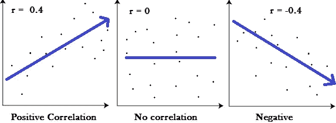

# 在 R 中寻找 R

> 原文：<https://towardsdatascience.com/finding-r-in-r-455fb7de5d80?source=collection_archive---------16----------------------->



相关系数(R)、回归的相关系数(R)和编程语言 R 都是数据科学的三个标志性 R。相关系数(r)是一个非常著名的统计测试，在机器学习模型中非常常用。回归的相关系数可以确定斜率与相关值的一致程度，是回归目标预测的重要指标。r 是一种函数式语言，它植根于语言 S，是数据科学家非常流行的选择。

> 是的，我们在 R 中找到 R，因为我觉得这很有趣。

[这里有*笔记本。*](https://github.com/emmettgb/Emmetts-DS-NoteBooks/blob/master/R/r%20in%20R.ipynb)


r 是一种函数式语言，其历史和计算一样悠久。虽然这有时是一种优势，但 R 也一直是一种较小的语言。重要的是要记住，尽管 R 对于数据科学家来说的确是一件大事，并且是一门伟大的语言；r 将不会像 Python 或 C 语言那样拥有广泛的支持。当然，Python 和 C 也有其局限性，Julia 和 Scala 也是如此。总的来说，虽然我发现自己使用 R 的次数比 Python、Julia 甚至 Scala 少得多，但我仍然认为 R 是一个很棒的工具，我甚至比现在更想使用它。

# 为什么？

我喜欢低级的数据科学，也喜欢高级的。令人惊讶的是，经常会遇到那些对相关系数、模型等非常熟悉的人。在更大的范围内。但是了解一个模型的内部运作，或者至少了解一个模型如何与统计数据一起工作来证明一个更准确的结果是有价值的信息。

在不使用库的情况下设计自己的算法肯定会让你在面试中成为众矢之的，并让你在你的领域中与众不同。这是因为为了开发复杂的算法，可能需要大量的计算机科学技能。我不想详细说明，但是 CS 技能经常会成为工作中非常重要的一部分。

> 除了正当理由，它的乐趣！

# 函数公式


formula for the correlation coefficient

在首先，这个计算似乎相当全面和困难。当游戏中的每个部分都被分解成小块时，这个公式就变得简单多了。

*   n —样本量。
*   σxy——x 和 y 的点积之和。
*   σx——x 的总和。
*   σy——y 的总和。
*   σx——x 的点平方之和。
*   (σx)—x 的二次幂之和。
*   σy——y 的点平方之和。
*   (σy)—y 的二次幂之和。

分解方程后，显然我们需要计算每个单独的部分。幸运的是，R 是在考虑线性代数的情况下构建的。R 中几乎所有的操作数都可以用于线性代数。

*   n —我们可以使用 R 的基函数“length”来计算 n
*   xy——我们首先需要 x 和 y 的乘积，幸运的是，我们可以使用*操作数来乘以数组。
*   σ()基本适马可以使用 sum()函数来计算。

```
 n = length(x)
    xy = x * y
    Σx = sum(x)
    Σy = sum(y)
    Σxy = sum(xy)
```

> 很简单，对吧？

现在我们只缺少 x 和 y 的点指数的和，以及 x 的平方的和。

> x 的和与 x 的和…..

```
 x2 = x ^ 2
    y2 = y ^ 2
    sx2 = sum(x2)
    sy2 = sum(y2)
```

注意σx 和(σx)之间的区别，它们可能读起来一样，但是*它们不是同一个*。

# 编写我们的函数

结合上面所有的数学，我们可以得到我们的值，然后把它们代入 R 函数的公式中，就像这样:

```
correlationcoeff <- function(x,y){
    n = length(x)
    yl = length(y)
    xy = x * y
    sx = sum(x)
    sy = sum(y)
    sxy = sum(xy)
    x2 = x ^ 2
    y2 = y ^ 2
    sx2 = sum(x2)
    sy2 = sum(y2)
    r = ((n*sxy) - (sx * sy)) / (sqrt((((n*sx2)-(sx^2)) * ((n*sy2)-(sy^2)))))
    return(r)
}
```

不用说，**挺酷的**！但是让我们更进一步，多做一点，只是说我们做到了。

# 相关系数…的平方

回归的相关系数(相关系数的平方)也是一个非常酷的概念，您应该非常熟悉。r 分数因其用作连续模型回归度量而众所周知。r 通常以百分比形式计算，表示回归相似性或差异(对于机器学习来说，与训练集相似是件好事。)


好消息是，我们可以循环使用之前的函数，以获得与平方(r)的相关系数

```
r2 <- function(x,y){
    r = correlationcoeff(x,y)
    r2 = r ^ 2
    return(r2)
}
```

> 简单，简单，柠檬榨汁机

# 创建回归模型

使用我们用于特征选择的相关系数(r ),以及我们的相关决定系数(r ),我们现在可以着手编写一些重要的加权推理模型。让我们使用线性最小二乘回归方程！如果再正式一点的话，我们会创建一个可以放入预测函数的构造函数，这通常是处理模型时的一个好习惯，因为它们被视为对象类型，而不是一个单一的数学函数(可能是因为拟合变换)。)幸运的是，这个函数不是我的作品集，也不是任何形式的专利，所以我们只是将 x 和 y 放入参数中！

```
pred_linearleastsquare **<-** **function**(x,y,xt){*# Summatation of x*y*xy **=** x ***** ysxy **=** sum(xy)*# N*n **=** length(x)*# Summatation of x^2*x2 **=** x **^** 2sx2 **=** sum(x2)*# Summatation of x and y*sx **=** sum(x)sy **=** sum(y)*# Calculate the slope:*slope **=** ((n*****sxy) **-** (sx ***** sy)) **/** ((n ***** sx2) **-** (sx)**^**2)*# Calculate the y intercept*b **=** (sy **-** (slope*****sx)) **/** n*# Empty prediction list:*y_pred **=** c()**for** (i **in** xt){pred **=** (slope*****i)**+**by_pred **=** append(y_pred,pred)}return(y_pred)}
```

> 让我们做一些数据


显然，随机数据并不代表真实世界的情况，但是不必篡改数据清理来测试功能无疑是避免使用真实世界数据的一个可行的借口。

# 使用我们的功能

首先，让我们从预测线性最小二乘函数开始:

```
y_pred = pred_linearleastsquare(trainX,trainy,testX)
```

然后我们可以使用 r2 来验证我们的模型做得有多好。


# 但是 r 呢？

相关系数可以非常有效地提供两个不同特征之间的相关性信息，或者更好地提供特征和目标之间的相关性信息。我确实在条件模型中看到了很多 r 的使用，尤其是那些关于连续目标的模型。

所以，不用说，R，R 和 R 都是统计学和数据科学中非常酷和重要的概念。期待看到未来几年 R 的位置，以及其他语言的位置。