# 用 Q-学习算法寻找最短路径

> 原文：<https://towardsdatascience.com/finding-shortest-path-using-q-learning-algorithm-1c1f39e89505?source=collection_archive---------7----------------------->

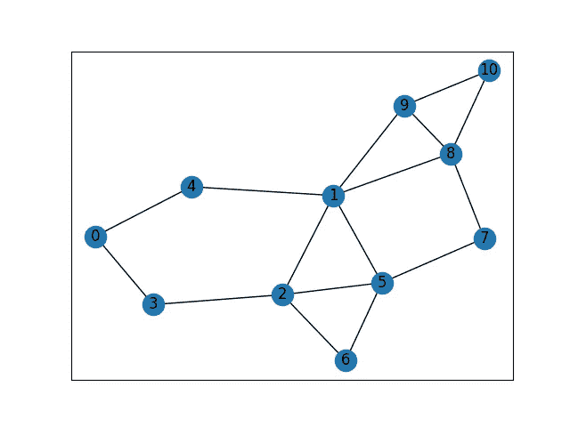

无向图中的最短路径。你也可以在这里阅读**。**

***图**是用于模拟对象之间成对关系的数学结构。图是由边连接的顶点组成的。在无向图中，我会找到两个顶点之间的最短路径。*

***Q-learning** 是一种无模型*强化学习*算法。Q-learning 的目标是学习一个策略，它告诉代理在什么情况下采取什么行动。它不需要一个环境模型，它可以处理随机转移和奖励的问题，而不需要适应。*

*首先，我导入必要的模块。我将使用 *networkx* 库来定义一个图形*

*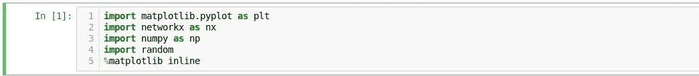*

*让我们定义并形象化这个图表*

*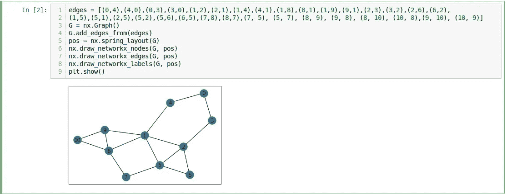*

*Q-learning 算法包括一个代理、一组状态和每个状态的一组动作。它在某种程度上使用 Q 值和随机性来决定采取何种行动。q 值根据所采取行动的回报和可能的未来回报进行初始化和更新。*

*数学上，*

*q 值可通过下式计算:*

*我想找到从 0 到 10 的最短路径。我需要吸引走到涉及 10 的边，因此我给这些行动很高的奖励。在 networkx 库中，G[node]给出了与该节点形成一条边的所有节点。*

*   *这里我初始化奖励和 Q 矩阵:*
*   *除了到达节点 10 的动作，我把所有的奖励都设为 0。这些动作是从 8 到 10 或者从 9 到 10。像奖励一样，Q 值在矩阵中初始化。为了消除不可能的动作，他们的 Q 值被设置为-100。例如，在图中，不可能直接从 2 到 10，因此其 Q 值设置为-100。可能的操作被初始化为 0。让我们来看看 R 和 Q 矩阵:*
*   *现在我将定义一个函数，它接受一个起始节点并返回下一个节点。它也接受随机探索的探索率。否则，它根据可能动作的最高 Q 值来选择动作。*
*   *之后，我们需要一个函数来更新所采取行动的 Q 值*
*   *现在是时候提高 Q 值了，从随机节点开始，走 50000 步*

*让我们检查一下最终的 Q 值*

*现在，我们可以通过在决定行动时从 Q 矩阵中选择最高 Q 值，找到 0 到 10 之间的最短路径:*

*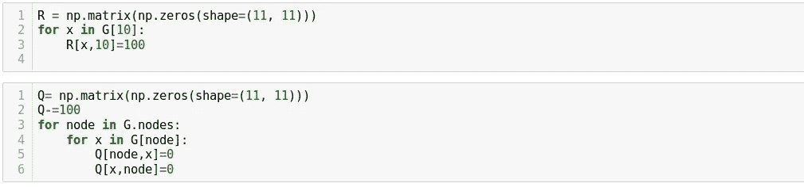*

*参考*

*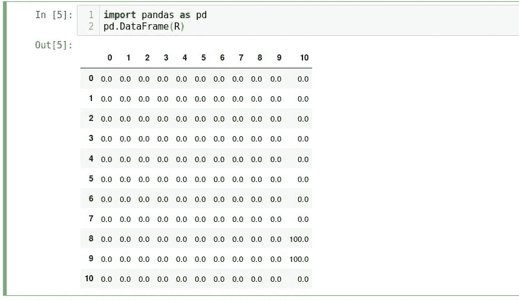**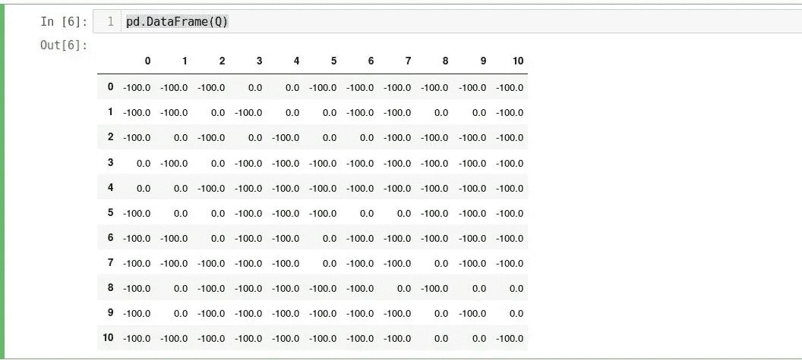*

*[https://en.wikipedia.org/wiki/Graph_theory](https://en.wikipedia.org/wiki/Graph_theory)
[https://everything.explained.today/Q-learning/](https://everything.explained.today/Q-learning/)
[http://first time programmer . blogspot . com/2016/09/getting-ai-smarter-with-q-learning . htm](http://firsttimeprogrammer.blogspot.com/2016/09/getting-ai-smarter-with-q-learning.html)[l](https://www.poilabs.com/)*

*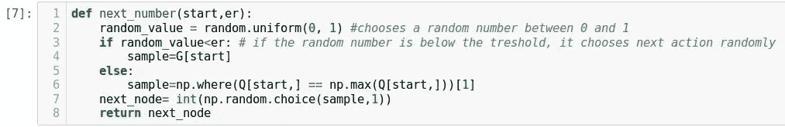*

*After, we need a function for updating Q-value of the action taken*

*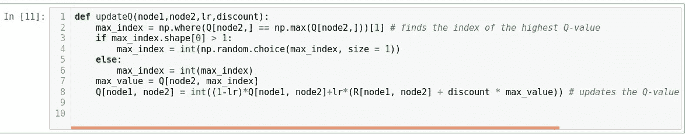*

*Now it is time to improve Q-values by starting at random nodes and making 50000 walk*

*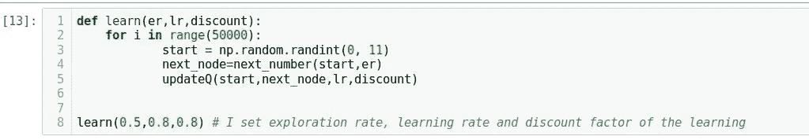*

*Let’s check the final Q-values*

*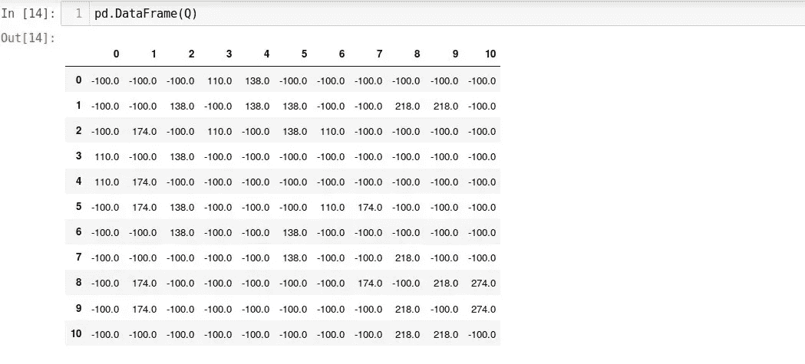*

*Now we can find shortest path between 0 and 10, by choosing highest Q-value from Q matrix when deciding an action:*

*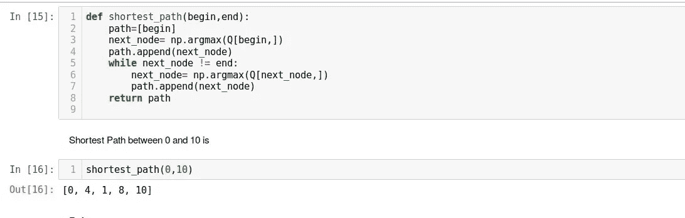*

*References*

*[https://en.wikipedia.org/wiki/Graph_theory](https://en.wikipedia.org/wiki/Graph_theory)
[https://everything.explained.today/Q-learning/](https://everything.explained.today/Q-learning/)
[http://firsttimeprogrammer.blogspot.com/2016/09/getting-ai-smarter-with-q-learning.htm](http://firsttimeprogrammer.blogspot.com/2016/09/getting-ai-smarter-with-q-learning.html)[l](https://www.poilabs.com/)*