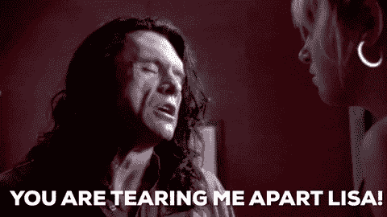
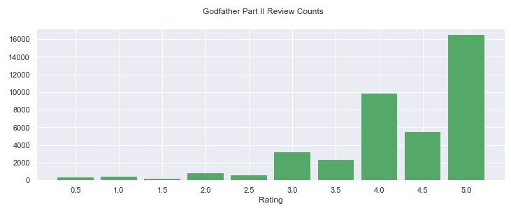
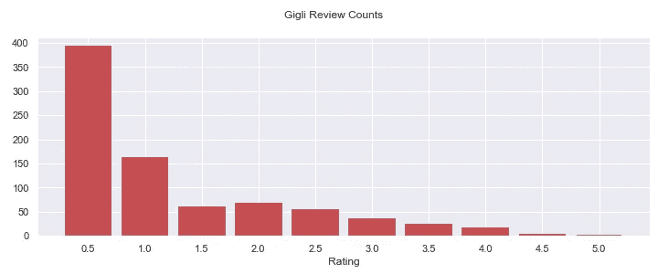
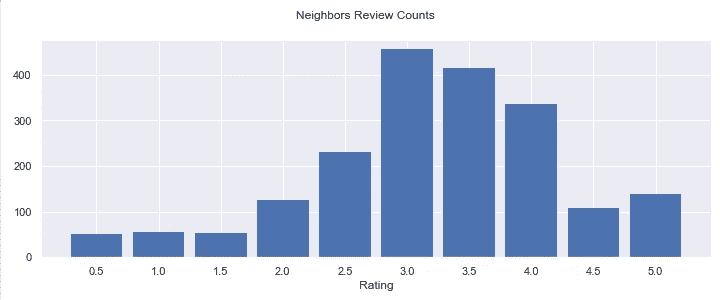
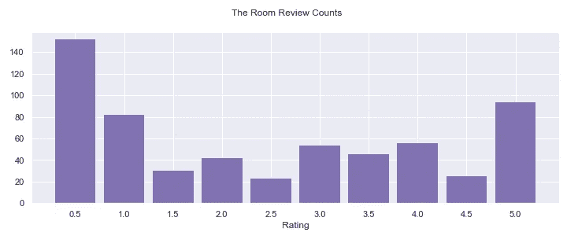
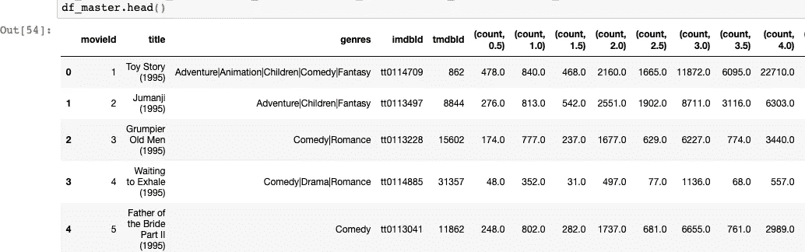
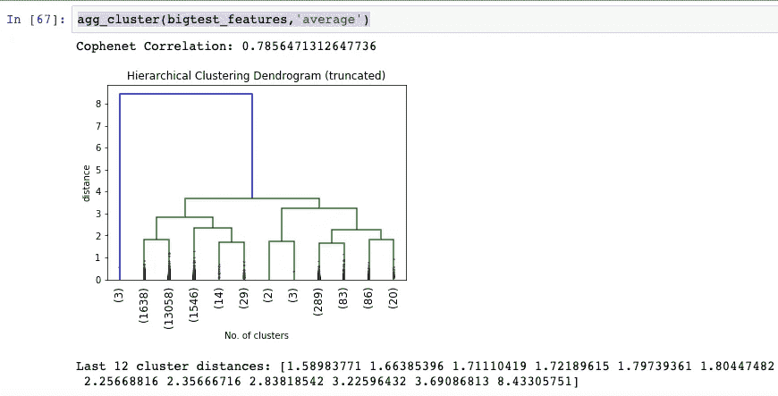
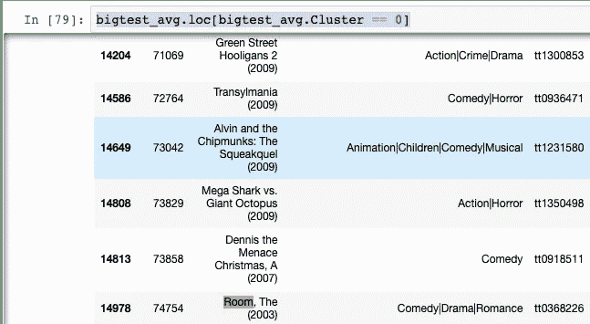

# 用凝聚聚类法寻找“最佳”最差电影

> 原文：<https://towardsdatascience.com/finding-the-best-worst-movies-with-agglomerative-clustering-430d80d756e9?source=collection_archive---------34----------------------->



This is a man entirely composed of veins. From The Room (2003).

首先，一点背景。

当我的父母终于有了有线电视，这对我来说是一件大事。一个我从来不知道存在的奇怪表演的整个世界展开了。我最喜欢的节目(除了《辛普森一家》之外)是一部低成本的连续剧，讲述了一个男人和两个机器人被困在太空，被迫观看可怕的电影。它被称为*神秘科学剧场 3000* 。因为《T4 》,我这个年纪的一代孩子突然发现了故意看那些糟糕透顶的电影的价值。二十年过去了，我仍然热爱它(鉴于 MST3K 的重启——我并不孤单)。

不过，一些糟糕的电影，就其糟糕程度而言，更纯粹一点。他们的坏是如此纯粹，以至于他们自己变得令人愉快。尽管 Ringer 在几年前提出了相当好的标准，但识别“好”的坏电影与仅仅是坏电影的区别仍然是一个短暂的过程:

> 1.电影的乐趣必须来自于它的糟糕。它的坏需要是创造一种迷惑的享受感的东西。
> 
> 2.肯定有一种普遍的感觉，那就是那些制作这部电影的人认为他们所做的很棒，或者至少是好的。好的坏的电影都有最低限度的自我意识。这里有两个例子可以帮助解释这种情绪:(1) *马克格鲁伯*不是一部好的坏电影，它是对好的坏电影的致敬；(2)*快速五部*不是一部好的坏电影，它是一部故意陷入荒谬的电影(然后制造一种类似于好的坏电影自然引发的反应)。
> 
> 3.这部电影发行时一定是一个严重的失败。评论家们，上帝保佑他们，将电影作为一种艺术形式保持高标准，通常不会因为电影质量差而奖励它。这样，他们是一个有用的，尽可能客观的资源来决定哪些电影是坏的，因此有资格成为好的坏的。

就像我说的，很好，但更多的是直觉。我想知道是否有一种方法可以定量识别这些电影。我觉得有！看看下面的用户评分分布。

一、好电影，*《教父》第二部(1974)* :



评论分布非常左倾。大部分评分在 4 到 5 之间。

现在*吉利(2003)* ，一部没有人真正喜欢的电影:



非常右偏，大多是 0.5 和 1.0 的评分。

下面是*邻居* *(2014)* :



一个相当正常的分布。对大多数人来说，这似乎是一部相当不错的电影。

但是现在，*《房间》(2003)，*成了衡量其他“好”坏电影的基准:



嗯，有些事。最高收视率在 0.5 桶，第二收视率在 5.0 桶。所以也许我们要找的分布是重尾分布。然而，从上述分布来看，0.5 和 1.0 的评级仍然比 4.5 和 5.0 的评级多得多。因此，我们可能要寻找的是一个高收视率到低收视率的比例高于一般烂片的分布。让我们做一些特征，看看我们是否能抓住它。

首先，让我们看看我们是否能测量一部给定电影向高或低评级倾斜的程度。使用 MovieLens 大型[数据集](https://grouplens.org/datasets/movielens/latest/)，我创建了一个新的数据帧:



现在，首先我需要创建一个特征来测量高评分或低评分分布的偏斜程度。首先，我们将找到 0.5/1 或 4.5/5 的评论百分比。

```
df_master[‘percent_0.5to1’] = (df_master.iloc[:,[5,6]].sum(axis=1)) / df_master[‘total_count’]
df_master[‘percent_4.5to5’] = (df_master.iloc[:,[13,14]].sum(axis=1)) / df_master[‘total_count’]
```

那我们就简单的取高低评级百分比的差。这将告诉我们分布是更倾向于低评级还是更高评级:

```
df_master['percent_polarity'] = df_master['percent_0.5to1'] - df_master['percent_4.5to5']
```

为了确保我们选择了那些尾部很重的电影，我们将增加一个功能:

```
df_master[‘total_tails’] = df_master[‘percent_0.5to1’] + df_master[‘percent_4.5to5’]
```

现在我们需要考虑样本大小。就目前情况来看，一部有 1000 条评论的电影和一部有两条评论的电影一样有可能出现在我们的最终名单上。我们需要建立一个最低数量的审查。但是我们如何得到这个数字呢？

我决定找出一些评论数量较高的电影的平均值，并计算在达到平均值之前需要多少评论。下面是一些简单的代码:

```
import statistics as st
from statistics import mean
def rolling_mean(column):
    mean = round(column.mean(),2)
    roll = []
    for i in column:
        roll.append(i)
        new_mean = round(st.mean(roll),2)
        if mean == new_mean:
            return mean, len(roll)
        else:
            continue
```

最后，我将对这些值进行平均，以确定我的临界值。最后，我的最低评论数是 25 条。我们准备聚类吧！：

```
df_trim = df_master.loc[df_master.total_count >= 25]
cols = ['percent_polarity','total_tails']
lg_test = df_trim[cols]scaler = StandardScaler()
bigtest_scaled = scaler.fit_transform(lg_test)
bigtest_features = pd.DataFrame(bigtest_scaled, columns=lg_test.columns)
```

好吧！现在是有趣的部分——凝聚聚类(不，我是认真的)！聚集聚类的神奇之处在于它考虑了数据点之间的个体关系。我已经编写了几个函数来完成这项工作。

首先，我们需要计算出正确的链接和距离参数，看看我们应该创建多少个集群:

```
def agg_cluster(df,linkage=’ward’,distance=’euclidean’): 
    # Takes in a dataframe, cluster linkage and distance
    # produces a dendogram + cophenet score
    Z = shc.linkage(df,linkage,distance)
    # Check cophenet correlation score.
    c, coph_dists = cophenet(Z, pdist(df))
    print(‘Cophenet Correlation:’,c)

    plt.title(‘Hierarchical Clustering Dendrogram (truncated)’)
    plt.xlabel(‘No. of clusters’)
    plt.ylabel(‘distance’)
    dendrogram(
        Z,
        truncate_mode=’lastp’, # show only the last p merged clusters
        p=12, # show only the last p merged clusters
        leaf_rotation=90.,
        leaf_font_size=12.,
        show_contracted=True, # to get a distribution impression in  truncated branches
    )
    plt.show()

    #Shows the distance of the 12 final splits.
    print(‘Last 12 cluster distances:’,Z[-12:,2])
```

然后，我们将实际执行群集本身，看看我们会得到什么:

```
def agg_clust(df,n,affinity,linkage):
    agg_clust =    AgglomerativeClustering(n_clusters=n,affinity=affinity,linkage=linkage)
    assigned_clust = agg_clust.fit_predict(df)
    return agg_clust,assigned_clust
```

我最好的选择是平均连锁和欧几里德距离。这是树突图:



注意最后一次合并的距离有很大的跳跃。这表明这些集群并不特别相似。看起来我们最终应该有三个集群。让我们运行它，并将我们分配的群集添加到数据框中:

```
bigtest_agg,as_bigtest = tqdm(agg_clust(bigtest_features,n=3,affinity=’euclidean’,linkage=’average’))
bigtest_avg = df_trim.copy()
bigtest_avg[‘Cluster’] = as_bigtest
```

现在，让我们来看看我们的好/坏集群。我们有*房间*吗？我们有。：



我们还有*有肌肉的圣诞老人*，*歌舞女郎*，*巨魔 2* ，*麦克和我*，*来自外太空的计划 9*，*妖精 4:在太空*等等。看起来相当不错！