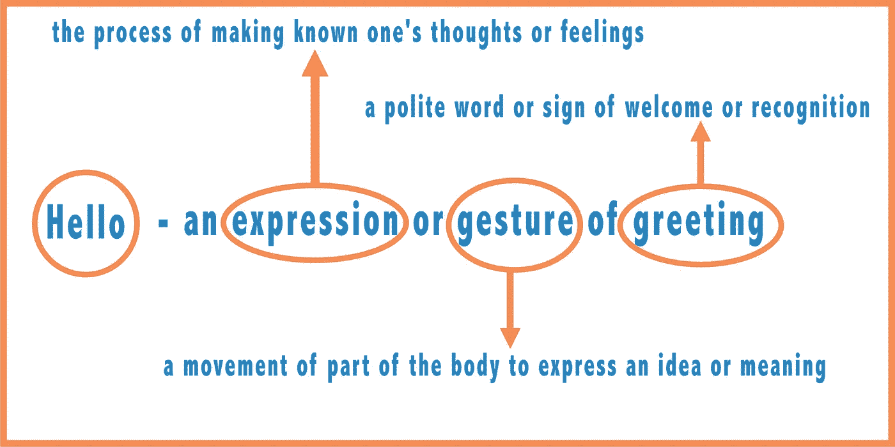
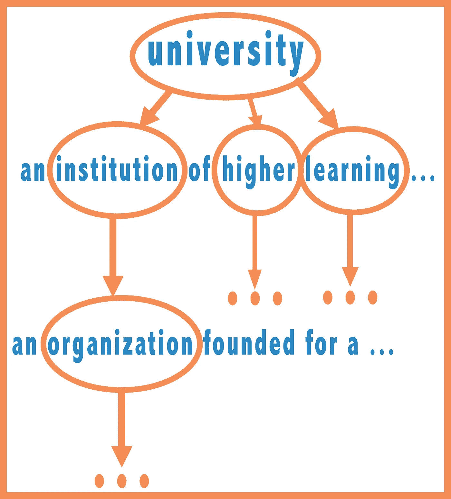
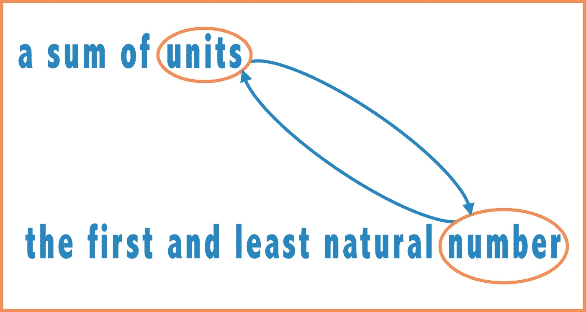
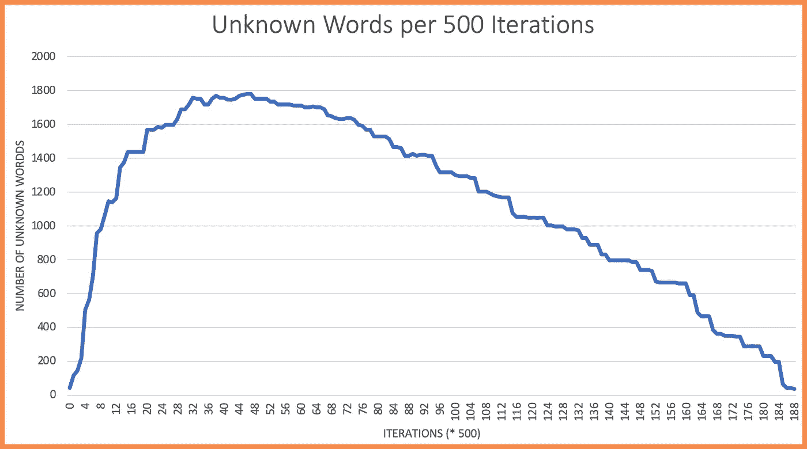

# 发现单词的复杂性

> 原文：<https://towardsdatascience.com/finding-the-complexity-of-words-6c487cea562?source=collection_archive---------30----------------------->

## 认识一个单词需要多少个单词？



假设我们想玩一个拼字游戏的升级版，我们仍然根据单词的复杂程度得分，但使用不同的度量标准。我们将根据单词理解的难易程度来评分，而不是使用字母。

这是我们衡量难度的方法。我们会拿一本梅里亚姆-韦伯斯特词典来查这个单词。为了学习一个英语单词，我读了它的定义。至此，我已经明白了原词的意思。然而，要完全理解一个词，我需要知道每个词在其定义中的含义。我需要对每个定义都这样做。考虑下面的例子。

假设我用单词**大学**开始玩拼字游戏。Meriam-Webster 将**大学**定义为(这听起来开始像是告别演说……)*提供教学和研究设施并被授权授予学位的高等教育机构。对于这个游戏，假设我们已经学会了英语中所有的停用词。这些词像 an、of、for、your、only、to 等。至此，我知道了**大学**这个词的定义。但我仍然需要了解以下单词的含义:机构、高等、学习、提供、设施、教学、研究、授权、授予、学术和学位。所以，我们看着一个机构的定义，我们学习这个定义中的所有词汇，我们继续前进。*



这个游戏有点难以捉摸。不知道院校是什么意思，怎么学大学这个词？没有太大意义。但是我们需要这个警告来防止无限循环。

举个例子，假设我想学习单词**数字**。它的定义是*单位之和*。过一会儿，我需要看一下一个**单位**的定义，它是*第一个也是最少的自然数*。同样，过一会儿，我需要学习数字的含义。数字是单位的总和。一个单位是最小的自然数。一个数是一个单位。一个单位就是一个数字。我们创造了一个无限循环，所以我们什么也学不到！



我也认识到这是一种简化的方法。例如，假设我想从事计算机科学，所以我想查找单词 Python。我们只考虑第一个定义，即*各种大型蛇类*中的任何一种。下面的代码是用 Python 写的，但不是用大蟒蛇写的。然而，我们利用这种情况来减少计算的复杂性。

# 该算法

Meriam Webster 有一个 API——一个应用程序编程接口。把它想象成一个在线词典。我可以告诉我的电脑向梅里亚姆和韦伯斯特询问定义，他们会把它送回来。我们将不得不清理和格式化它一点，但之后，我们将在我们的道路上。

我们需要记录三套。第一个是一组停用词(像 a、and、for、that 等词。从上面)。第二个是已知单词集——这些单词的定义我们已经查过了。我们最后一组是一组不认识的单词。当我们得到一个定义，我们可以看看每个单词。如果是停用词，我们已经知道了。如果是我们之前查过的词，太好了！我们知道定义，可以继续前进。然而，如果我们遇到一个不认识的单词，我们就必须把它添加到不认识的单词集中，以后再看(也许现在，也许以后)。

对于任何有兴趣看代码的人来说，在这里查看一下[。](https://github.com/andrewjoliver/dictionary-search/blob/master/dict-search.py)

# 结果呢

我试用的第一个词是 python。**为了理解单词 python 的定义，我们需要学习 11227 个其他单词！下面是我们代码的一些输出。**

```
------------------
Definition of python: any of various large constricting snakes
Learnign the word: large
------------------
Definition of large: exceeding most other things of like kind especially in quantity or size 
Learnign the word: like
------------------
Definition of like: to feel attraction toward or take pleasure in 
Learnign the word: kind
------------------
Definition of kind: a group united by common traits or interests 
Learnign the word: group
------------------
Definition of group: two or more figures forming a complete unit in a composition 
Learnign the word: two
------------------
Definition of two: being one more than one in number
Learnign the word: feel
```

下图显示了每 500 次迭代中未知单词的数量。在未知单词数量的图表中，我们看到开始时有一个尖峰。经过大约 25，000 次迭代，对于任何一个任意的定义，我们知道的定义中的单词比不知道的要多。这种模式继续下去，我们慢慢地缩小未知单词的范围。



我们需要学习 11227 个其他单词来理解 **python** 。但是，要理解**傻**的定义，只需要 4999 个字。**博士**取 11221 字。而**电脑**取 11202。我相对随意地选择了这些单词，所以其中三个需要大约 11，210 个单词似乎有点可疑。尤其是因为梅里亚姆·韦伯斯特在他们的字典中列出了超过 171，476 个单词。

如果您想进一步研究这个问题，或者您想研究一下代码，请在这里查看[资源库](https://github.com/andrewjoliver/dictionary-search/blob/master/dict-search.py)。你需要一个来自 Meriam-Webster 的 API 密匙，但是你可以在这里很容易地得到一个。寻找快乐！

# 感谢您的阅读！

*疑问？评论？发邮件给我*[*andrew.oliver.medium@gmail.com*](mailto:andrew.oliver.medium@gmail.com?source=post_page---------------------------)。我很想收到你的来信！