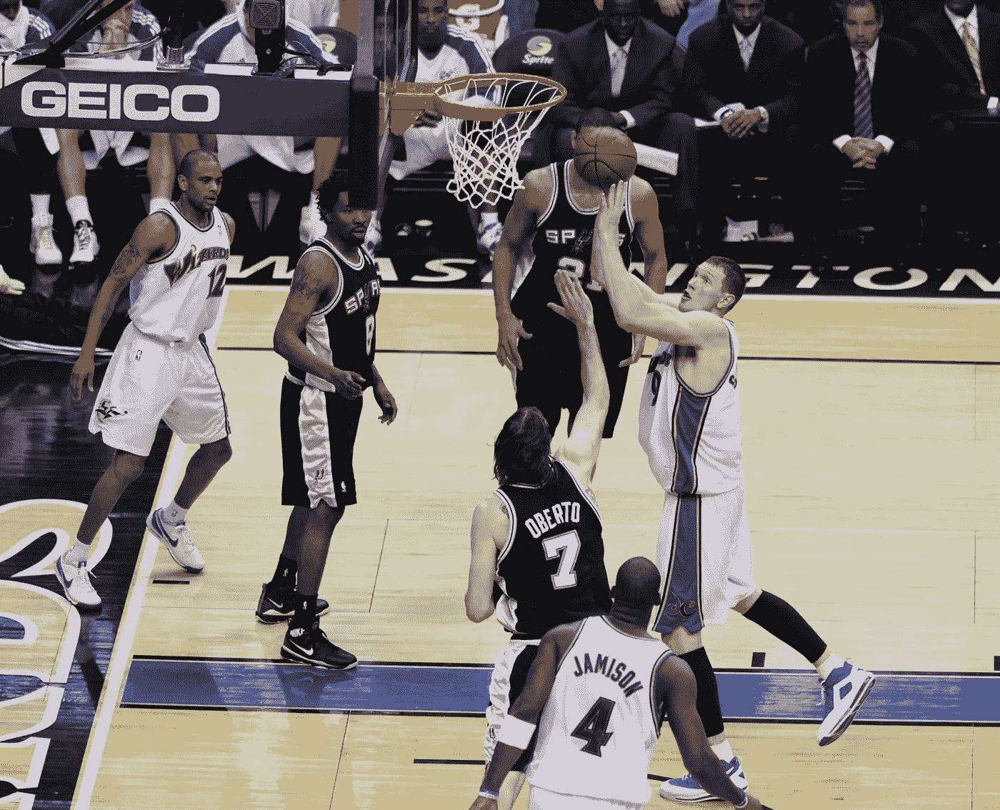
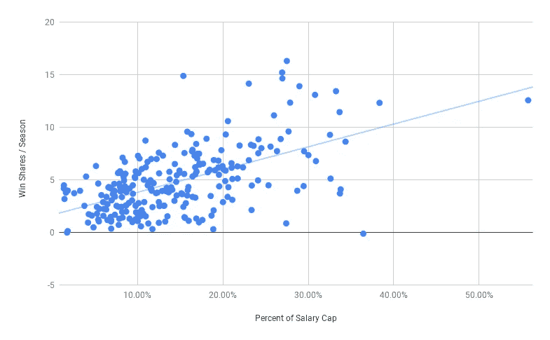
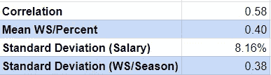
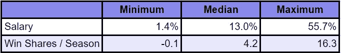
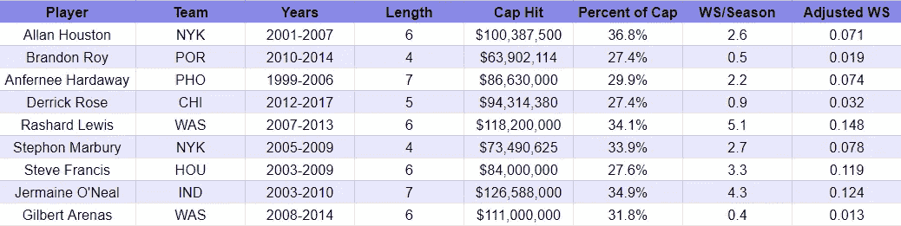
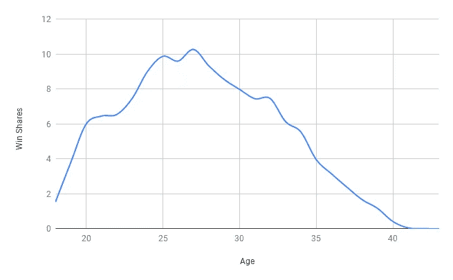
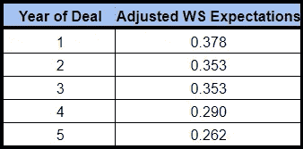
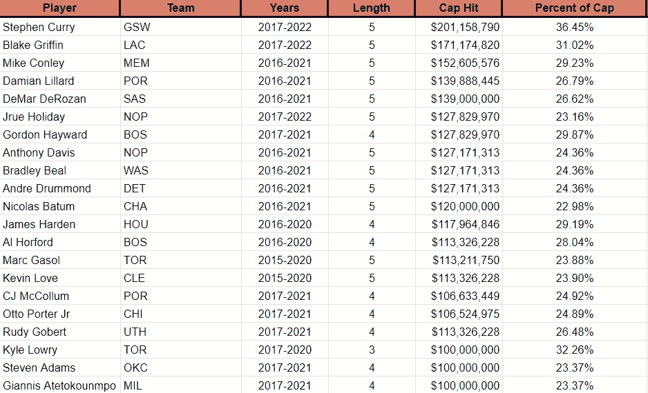
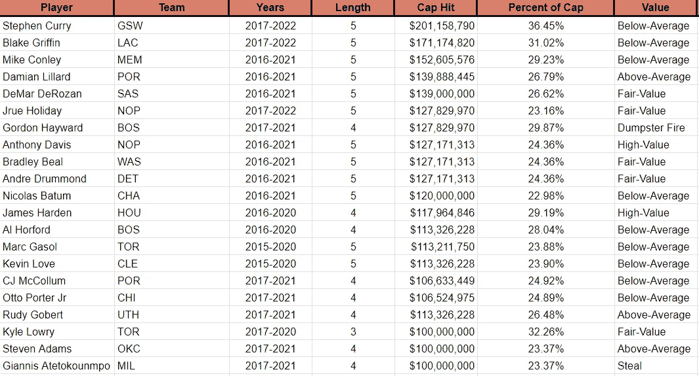

# 寻找 NBA 最好(和最差)的合同

> 原文：<https://towardsdatascience.com/finding-the-nbas-best-and-worst-contracts-58dca8323952?source=collection_archive---------24----------------------->

Image by Keith Allison on [Wikimedia Commons](https://commons.wikimedia.org/wiki/File:Darius_Songaila_NBA_12.jpg)

多年来，NBA 有一些臭名昭著的糟糕合同(也有一些抢断)。像任何理性的人一样，我想做的只是对这些合同进行统计分析。所以在这篇文章中，我有几个目标:

*   确定好合同和坏合同的分界线(并根据球员的工资找到合理的期望值)
*   分析历史上一些最臭名昭著的合同，并确定哪个合同表现最差
*   分析一些当今 NBA 最大的合同，看看谁表现不佳，谁表现过度

如果你想看到的只是结果，那么直接跳到靠近底部的“结论”部分。

# 方法学

## 韵律学

方法非常简单。我需要一种精确的方法来测量:

*   工资水平(根据不同年份进行调整)
*   玩家的净贡献

我决定衡量合同的大小，用它在合同期限内占工资帽的百分比来衡量。这似乎是最明显的选择，因为球队主要受到工资帽的限制，因此这反映了球员所占用的相对资源。

第二个指标更复杂。没有一个数字可以完美地概括一个球员在球场上的贡献，但我必须选择一个尽可能好的数字。最终，出于几个不同的原因，我选择了 Win Shares。赢股衡量进攻和防守，它说明了玩家的总影响。例如，如果一名球员错过了时间(由于受伤、停赛或教练的选择)，统计数据应该反映他们的整体影响已经减弱。

## 样品

接下来，我必须确定我要分析的样本。我首先提出了一些选择样本的客观标准:

*   只有完成的合同才应该被衡量，因为合同的签署是基于球员在整个交易期间的预期价值。例如，一个 30 岁的人签了一份 5 年的合同，平均来说，他的收入会逐年下降。因此，这份合同在头一两年可能看起来很划算，但那只是因为预计他们在接下来的时间里表现会差得多。
*   没有入门级的合同将被分析，因为他们设定的工资往往是一个重大的讨价还价。我们将能够得出的一个有趣的结论是，在给定的工资水平下，球员的合理期望——但入门级别的交易可以解释这一点。
*   不会对一年期交易进行分析。这有两个原因。首先，一年期合约是为了低风险而设计的。一份“糟糕”的一年期合同其实并没有那么糟糕。其次，样本量太不稳定了。因伤错过几场比赛很容易让交易看起来很糟糕，一场强有力的比赛会让合同看起来像是一生的交易。

考虑到这些标准，是时候找到并过滤我的样本了。尽管添加每份合同很诱人，但数据的性质意味着需要大量的手动电子表格工作。因此，我不得不挑选一个更小的样本来代表整体。为此，我使用了 [Spotrac](https://www.spotrac.com) 并按照 2014 年的工资进行了排序(因为这些合同现在应该已经完成了)。我进入了每个球员(按降序排列)，并添加了他们职业生涯中符合上述标准的所有合同。我总共手工记录了不到 150 个不同玩家的 250 份合同。此时，我认为我的样本已经足够大了。

# 回归

从这里开始，这是一个简单的问题，根据球员的表现回归合同的大小。

**图一。赢股与使用的薪金上限百分比的回归**

薪资与绩效关系的 R 为 0.324。因此，签署好的合同对通用汽车来说有点冒险。

**表 1。数据集统计学。**

我们还可以看到，两个数据集的范围相当大。

**表二。数据集的取值范围。**

在样本中，从技术上讲，最有价值的合同来自布兰登·巴斯。巴斯从 2007 年到 2009 年以不到 160 万美元的价格与达拉斯小牛队签订了一份为期 2 年的合同，并在此期间贡献了大约 840 万股 Win 股票。大多数最划算的合同都是类似的低薪交易。如果我们排除这些低薪合同(低于工资帽的 5%)，最有价值的合同是斯蒂芬·库里 2013-2017 年 4400 万美元的合同。在合同期内，他贡献了约 59.6 Win 股份，并获得了 2 次 MVP。按照工资帽的百分比，库里每个赛季贡献 0.97 份 Win 股份(这一指标将被称为“**调整后的 Win 股份**”或“**调整后的 WS** ”)。

样本中价值最差的合同是科比的最后一份合同。布莱恩特签署了一份 2014-2016 年的两年合同，他获得了 4850 万美元的薪酬，同时贡献了约 0.2 Win 的股份。科比每个赛季贡献大约-0.003 的调整后赢球份额。

# 将这种方法应用到 NBA 历史上最糟糕的合同中

现在，当我们用同样的方法量化 NBA 历史上一些最糟糕的合同时。

**表 3。选择历史合同的估价。**

使用这种方法在一些选择的最高(或接近最高)合同中，吉尔伯特·阿里纳斯 6 年 1.11 亿美元的合同看起来可能是 NBA 有史以来最糟糕的合同。然而，布兰顿·罗伊的交易并不遥远。

# 将该方法应用于当前玩家

为了应用当前的方法，有几个重要的考虑因素。首先，我们需要考虑基于玩家年龄的性能期望的重要性。

## 按年龄预测绩效趋势

为了预测这一点，我需要确定当以 Win 份额衡量时，典型的职业轨迹是什么样的。为了衡量这一点，我从 1990 年以来入选 NBA 最佳阵容，但现在已经退役的球员中抽取了一小部分样本(n=50)。我使用了全明星球员，因为我们将分析的大多数现役球员都是全明星球员。

**图二。50 名 NBA 全明星球员按年龄划分的平均胜率。**

这些数据几乎完全符合你的预期；球员稳步提高，直到 27 岁达到顶峰，从那时起开始永久下降。职业生涯确实有一些不寻常的起伏，这可能是由于样本有限，但由于时间限制，我决定不进一步扩大我的样本。

使用这个指数，我可以确定对球员表现的期望，同时考虑到在合同的剩余时间里他们的表现是否会下降或提高。

为了说明这一点，我将以拉塞尔·维斯特布鲁克为例。威斯布鲁克是他合同的第一年，目前已经 30 岁了，所以他的表现应该会在合同的剩余时间里下降。因此，如果威斯布鲁克要达成“中值交易”(MVD)，他将不得不在交易的前几年超额完成交易，以弥补后几年的表现不佳。

从我们之前的数据集，我们知道调整后的年度 WS 0.327 构成了 MVD(在这种情况下使用中值来排除低价值交易中的高价值异常值)。因此，威斯布鲁克实现 MVD 的期望如下:

**表 4。调整后的 WS 对拉塞尔·维斯特布鲁克的期望示例。**

利用这些值，我们可以将他目前的实际表现与预期表现进行比较。今年，威斯布鲁克有望以约 0.175 的调整后 WS 结束——显著低于 MVD。

## 样品

为了确定应该分析什么样的合同，我们只需按降序使用最大的活跃合同。

**表 4。所有现役 NBA 合同达到或超过 1 亿美元。**

样本中不包括合同直到 2019 年才生效的球员，以及处于交易第一年的球员，因为这些球员太不稳定(勒布朗·詹姆斯的交易到目前为止看起来很糟糕，因为他因伤错过了很多时间)。

## 创建价值类别

**图三。调整后 WS 的 250 个合约的直方图。**

接下来，为了便于阅读，我想创建一些任意的类别，用于放置球员合同的价值。这些类别如下(根据 MVD 的期望值衡量):

**垃圾箱火灾** : -0.24 以下

**低值**:-0.16–0.24

**低于平均水平**:-0.08–0.16

**公允价值** : +/- 0.08

**高于平均水平**:+0.08–0.16

**高值**:+0.16–0.24

**偷** : +0.24 以上

## 评估合同

对这些合同进行评估和分类后，结果如下:

**表 5。符合选择标准的价值超过 1 亿美元的有效 NBA 合同的估计值。**

请记住，这些代表了团队到目前为止从合同中获得的“价值”——它们并没有预测未来的价值。同样，这里也有一些有趣的结果。按照这个标准，斯蒂芬·库里显然没有履行他的合同。这可能反映了 Win Shares 的缺陷，以及一些伤病的结果。

# 结果

所以，总结一下这个分析的结果:

*   历史上最差的合同可能是吉尔伯特·阿里纳斯，他签了一份 6 年 1.11 亿美元的合同，但总共只贡献了 2.4 胜股份
*   我能找到的价值最差的合同是科比·布莱恩特的最后一份合同，他在两个赛季中被支付了 4850 万美元，贡献了-0.2 胜股份
*   我发现的最好的合同，排除低价值交易(
*   在价值超过 1 亿美元的有效合同中(不包括第一年的球员)，詹尼斯·阿特托孔波提供了最佳价值，而戈登·海沃德提供了最差价值