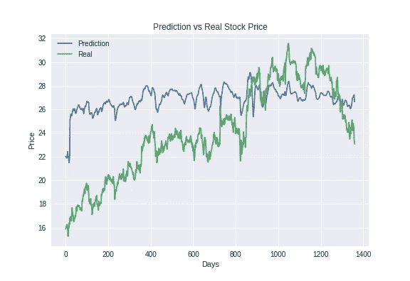
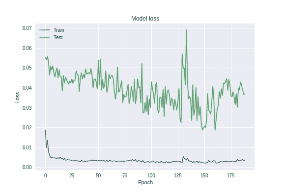
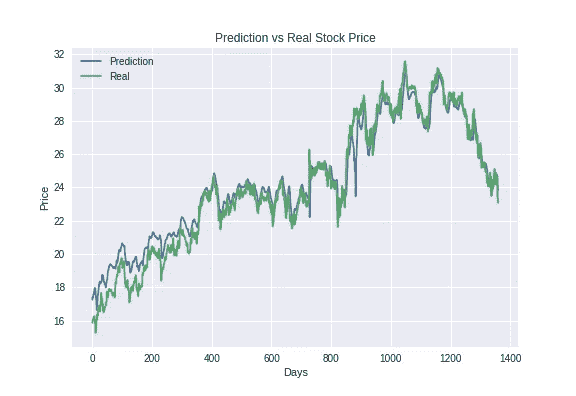

# 如何为神经网络找到正确的架构并微调超参数

> 原文：<https://towardsdatascience.com/finding-the-right-architecture-for-neural-network-b0439efa4587?source=collection_archive---------11----------------------->


Image by [Gordon Johnson](https://pixabay.com/users/GDJ-1086657/?utm_source=link-attribution&utm_medium=referral&utm_campaign=image&utm_content=3322580) from [Pixabay](https://pixabay.com/?utm_source=link-attribution&utm_medium=referral&utm_campaign=image&utm_content=3322580)

这篇博文是我上一篇博文的续篇，讲述了如何使用 LSTMs 来预测一只股票的股价，给出它的历史数据。我们已经看到了如何编译一个 Keras LSTM 模型。在这里，我们将看到找到正确架构和超参数的一些方法。

以下是我们的一些选择:

1.  **手动调谐或手动搜索** —这是找到正确配置的最痛苦的方法，其中你逐个尝试每个参数的具体值。但是有了一些经验，对最初结果的仔细分析和直觉，它可能真的会有帮助。
2.  **网格搜索**——这确实是唯一能从所有选项中给出最佳参数集的方法。您为想要优化的每个参数传递一系列值，然后训练并查找每个组合的验证损失。可以想象，这是最耗时的方法，而且通常不可行。
3.  **随机搜索** —这是网格搜索的子集，随机选择所有可能组合的子集。
4.  **贝叶斯优化/其他概率优化** —这种(贝叶斯优化)方法确实涉及数学，老实说，我还没有探索过其中的数学。我将给出它真正做什么的概述，即使你不知道它的内部工作原理，你仍然可以在程序中应用它，就像我们将在后面看到的。贝叶斯优化使用称为高斯过程的东西来猜测或建模目标函数(我们希望通过找到正确的超参数集来最小化的函数)。在这种方法中，对我们想要评估目标函数的次数设置了限制，因为它被认为是非常昂贵的。首先，在参数范围内确定一组随机点，以观察函数值。然后使用高斯过程来猜测目标函数。使用“采集函数”来决定下一个采样点。并且这个过程重复上面设置的“极限”次数。深入了解可以参考[本](https://arxiv.org/pdf/1807.02811.pdf)和[本](https://www.quora.com/How-does-Bayesian-optimization-work)。还有其他技术，如使用 Hyperopt 实现的 **TPE** (代码如下)。可以查看这篇[论文](https://papers.nips.cc/paper/4443-algorithms-for-hyper-parameter-optimization.pdf)了解 TPE。

## 网格搜索实现

如果你正在使用 SK-Learn 模型，那么你可以直接使用它们的 [GridSearchCV](https://scikit-learn.org/0.16/modules/generated/sklearn.grid_search.GridSearchCV.html) 。使用起来相当简单。您可以访问上面的文档链接。一个优点是它也可以选择并行运行作业。如果你正在使用 Keras 模型，那么你将不得不使用 Keras 模型的包装器，如这里的[所解释的](https://machinelearningmastery.com/grid-search-hyperparameters-deep-learning-models-python-keras/)。

但是如果它不起作用或者你不想学习新包的语法，你可以像这样实现一个简单的最小网格搜索:

**其他更智能的搜索实现**

有几个开源软件包可以使用其他“更智能”的搜索算法来最小化目标函数。我将展示远视和距骨的例子。下面是如何使用 [**Hyperopt**](https://github.com/hyperopt/hyperopt/wiki/FMin) 实现超参数调整，Hyperopt 使用 TPE 算法最小化函数。

Sample code for Hyperopt

在上面的代码片段中，变量“search_space”保存您想要搜索的参数及其值。最后的“fmin”函数是进行最小化的实际函数。这个程序本身非常简单，我已经给它添加了注释，所以理解起来应该不成问题。但是我想更深入地挖掘搜索空间字典的形成，因为这有点尴尬。让我们把它放在显微镜下:

主字典保存了我们想要优化的参数的所有键。我们将主要处理两个函数(或者他们称之为随机表达式)，即选择和一致。" **hp.choice** "接受一个值列表，从中进行尝试。这个函数然后返回其中一个选项，应该是一个列表或元组。我们传递给 hp.choice 和 hp.uniform 的字符串(第一个参数)主要供 Hyperopt 内部使用。" **hp.uniform** "统一返回第二个和第三个参数之间的值(低和高)。棘手的地方在于，当你有“lstm_layers”这样的参数时，它定义了网络中 lstm 层的数量。对于这样的参数，我们有两组新的参数要测试:第一组是当网络中的 LSTM 层数为 1 时，第二组是当使用两个 LSTMs 层时。在这种情况下，您可以看到我使用 hp.choice 告诉系统我对该参数(lstm_layers)的选择，该参数的值由键“layers”给出。当 Hyperopt 使用两个 lstm 层测试模型时，它将考虑另外两个参数进行测试，即第二个 LSTM 层中的节点数(lstm2_nodes)和用于第二个 LSTM 层的漏失(lst m2 _ 漏失)。我保留了第一个 lstm 层空白，但你也可以包括其他参数来测试。

我希望我清楚如何为实际目的构建样本空间。现在让我们看看另一个声称使用概率方法(结合网格或随机)来减少评估数量的库— [**Talos**](https://autonomio.github.io/docs_talos) 。

Code snippet for Talos

Talos 的用法类似于以前的工具；你必须创建一个函数来建立模型，训练它，根据验证数据对它进行评估。唯一的区别是模型函数返回 Keras 历史对象和模型，而不是字典。这里要注意的另一件事是，我们在 Scan 函数中传递 X 和 Y，但它们从未被使用过，因为我们想要在当前迭代中基于所选的“batch_size”和“time_steps”构建数据。但是对于更简单的问题，它会更容易。

你也可以使用[**Hyperas**](https://github.com/maxpumperla/hyperas)(hyperpt+Keras)，它是 hyperpt 的一个包装器。主要的优点是你不需要学习任何新的语法/功能。你所要做的就是像前面一样定义一个搜索空间字典，然后像下面这样建立你的模型。您所要做的就是将您想要测试的参数值放在双花括号中(例如{{ [1，2，3] }})。

但是 Hyperas 在这种情况下不起作用，因为我是从' model '函数调用' data '函数，使用双花括号的语法导致了一些问题。我没有深究这个问题，因为我已经有了其他工具。尽管如此，我认为这里值得一提，因为这要容易得多。

这很好，但是如何知道这些工具返回的结果是最好的呢？如果你问我，我们不会知道。您必须权衡利弊——您必须在微调上花费多少时间，以及有多少验证损失对您来说是足够好的。在我看来，如果你试着花一些时间对上述工具的结果进行手动调整，那将是最好的。

例如，当我处理股票数据集时，我首先编写了自己的网格搜索实现，并在云上运行。然后，我尝试了上面的这些工具进行智能调优，但不幸的是，云虚拟机非常慢(比我的笔记本电脑还慢！)那天，我已经没有耐心了。幸运的是，当我读到这些工具，实现并开始在云上运行它们时，我的网格搜索已经完成了。我对这些值进行了网格搜索:

```
search_params = {
    "batch_size": [20, 30, 40],
    "time_steps": [30, 60, 90],
    "lr": [0.01, 0.001, 0.0001],
    "epochs": [30, 50, 70]
}
```

这个只有 4 个参数(81 个组合)的搜索运行了 24 个小时！由于兴奋中忘记实现登录(**错误 1** )，所以没有结果在此分享。通过使用网格搜索的结果，我得到了令人失望的预测:



Initial Result

但是我还没有优化其他的东西，比如层数等等(我从一个有 2 个 LSTM 层和 1 个密集层的神经网络开始— **错误 2。**总是从更简单的模式开始，先试水，然后逐步发展。反正我决定进一步手动优化。我采用了网格搜索的最佳结果，并尝试了其他参数。无论我如何努力，我都不能改善损失。我知道这是过度拟合，所以我试图增加辍学，但无济于事。然后我顿悟了，可能是我太努力了，1 个 LSTM 层就够了(是的，我知道我很蠢— **错误 3** 低估了神经网络的力量)。但是你怎么知道模型是否过度拟合呢？其实挺简单的。在我的例子中，训练错误与验证错误看起来像这样:



**首先**，当你看到训练数据和验证数据之间的巨大差距时，这是过度拟合。这背后的逻辑是，您的模型从您的训练数据中学习得很好，但它无法将其推广到验证数据(新数据)。**第二件**事情是验证错误情节的诡异形状。到处都是。这意味着模型只是预测新数据的随机值，这就是为什么跨时代的验证损失之间几乎没有关系。另一件要找的事情是纪元日志。如果你看到训练损失持续减少，但验证损失波动或一段时间后保持不变，这可能是过度拟合。

因此，我删除了 LSTM 的第二层，并添加了下降层，其值高于我一直使用的值(0.2 到 0.5)。瞧啊。



final plot


final train vs validation loss. Notice how the gap is gradually reducing

巨大的进步对吗？我很确定，如果我们付出更多的努力，我们会做得更好。

我没有分享训练模型的代码片段，因为它与上面的代码片段相同；只有正确的参数。你可以在我的 Github 简介[这里](https://github.com/paranoiac-coder/Stock-Price-Prediction)找到所有完整的程序。

在[的下一篇](https://medium.com/@asutoshnayak/tools-tips-critical-to-any-machine-learning-project-f01b59ad01e6)文章中，我将分享一些重要的工具/技巧，它们在这个项目中对我帮助很大，但通常没有给予足够的关注。