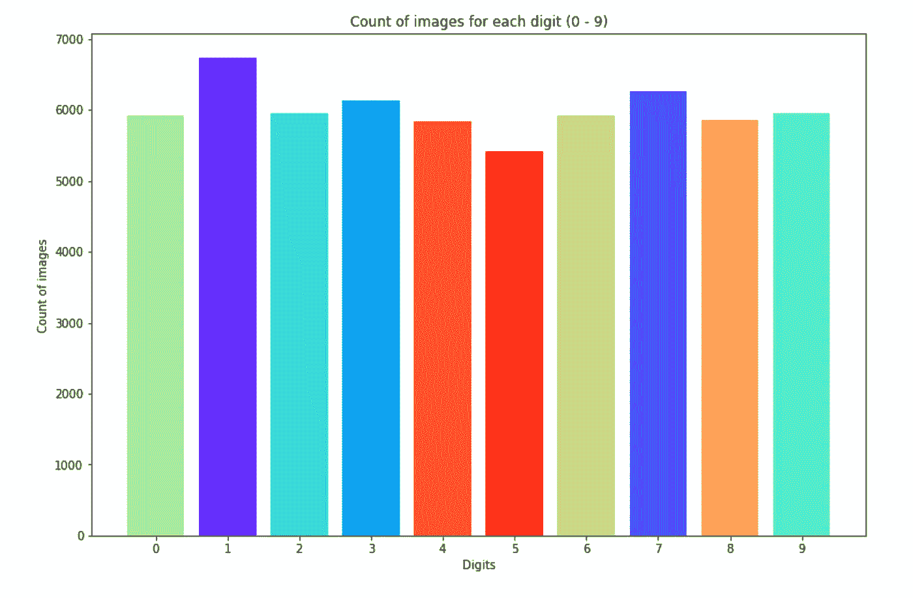
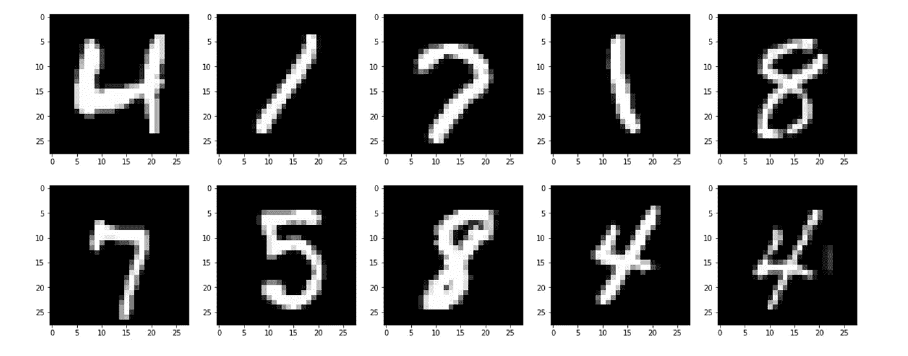

# 寻找正确的模型参数

> 原文：<https://towardsdatascience.com/finding-the-right-model-parameters-3670a1c086b3?source=collection_archive---------15----------------------->

Photo by [Jason Wong](https://unsplash.com/@jason365?utm_source=medium&utm_medium=referral) on [Unsplash](https://unsplash.com?utm_source=medium&utm_medium=referral)

如果您一直在阅读有关数据科学和/或机器学习的书籍，那么您一定会接触到与 MNIST 数据集相关的文章和项目。该数据集包括一组 70，000 张图像，其中每张图像都是从 0 到 9 的手写数字。我还决定使用相同的数据集来了解微调机器学习模型参数如何产生差异。

这篇文章解释了我如何使用`GridSearchCV`来寻找这个数据集的最佳拟合参数，并使用它们来提高精确度和改善混淆矩阵。您可以在下面的 GitHub 资源库中找到代码:

 [## kb22/带参数调谐的数字识别

### 该项目包括使用 GridSearchCV 来确定估计器参数的最佳组合。…

github.com](https://github.com/kb22/Digit-Recognition-with-Parameter-Tuning) 

# 导入库和数据集

我首先导入必要的库。我用训练和测试数据作为`.csv`从[到这里](https://www.kaggle.com/oddrationale/mnist-in-csv)。数据集中的每一行都由一个标签和 784 个像素值组成，以表示 28x28 的图像。

训练数据包括 60，000 幅图像，而测试数据集包括 10，000 幅图像。

一旦我有了数据，我就从中获取特征和标签，并将其存储在`train_X`、`train_y`、`test_X`和`test_y`中。

# 探索数据集

## 分析阶级分布

正如我在以前的文章中所讨论的，每个类的数据应该大致相同，以确保正确的模型训练没有偏见。

Count of images for each digit (0–9)

如果我们看这个图，每个数字的计数都有一些差异。然而，差别不是太大，模型仍然能够很好地根据数据进行训练。因此，我们可以更进一步。

## 查看训练图像

让我们看看真实的图像。我从训练数据中随机选择 10 张图像，并用`plt.imshow()`显示出来。

10 Randomly selected images from the dataset

在这 10 张随机图像中，我们立即看到的是任何一种类型的数字之间的差异。看看上面 10 张图中的所有`4`。第一个是粗直的，第二个是粗斜的，第三个是细斜的。如果模型可以从数据中学习，并实际检测出`4`的所有不同风格，那将是非常令人惊讶的。

# 应用机器学习

我决定使用随机森林分类器对训练数据进行训练，并对测试数据进行预测。我使用了所有参数的默认值。

接下来，利用预测，我计算了准确度和混淆矩阵。

该模型达到了 94.4%的准确率。混淆矩阵表明，该模型能够正确预测大量图像。接下来，我决定调整模型参数，尝试改善结果。

# 参数调谐

为了确定模型参数值的最佳组合，我使用了`GridSearchCV`。这是由`sklearn`库提供的一种方法，它允许我们定义一组我们希望为给定模型尝试的可能值，它根据数据进行训练，并从参数值的组合中识别最佳估计值。

在这个特例中，我决定为几个参数选择一个值范围。估计器的数量可以是 100 或 200，最大深度可以是 10、50 或 100，最小样本分裂为 2 或 4，最大特征可以基于`sqrt`或`log2`。

`GridSearchCV`期望估计量，在我们的例子中是`random_forest_classifier`。我们将可能的参数值作为`param_grid`传递，并将交叉验证设置为 5。将`verbose`设置为 5 会向控制台输出一个日志，而`njobs`设置为-1 会使模型使用机器上的所有内核。然后，我拟合这个网格，用它来寻找最佳估计量。

最后，我使用这个最佳模型来预测测试数据。

看看上面的精度，我们看到，仅仅通过改变模型的参数，精度就从 **94.42%** 提高到了 **97.08%** 。混淆矩阵还显示更多的图像被正确分类。

机器学习不仅仅是读取数据和应用多种算法，直到我们得到一个好的模型，但它也包括微调模型，使它们最适合手头的数据。

> 确定正确的参数是决定使用哪种算法并根据数据充分利用算法的关键步骤之一。

# 结论

在本文中，我讨论了一个项目，其中我通过使用`GridSearchCV`选择参数值的最佳组合来提高随机森林分类器的准确性。我使用 MNIST 数据集，将准确率从 94.42%提高到 97.08%。

阅读更多文章:

 [## 让我们使用 LDA 构建一个文章推荐器

### 基于搜索查询推荐文章

towardsdatascience.com](/lets-build-an-article-recommender-using-lda-f22d71b7143e)  [## 使用 Flask、Flask RESTPlus 和 Swagger UI 处理 API

### Flask 和 Flask-RESTPlus 简介

towardsdatascience.com](/working-with-apis-using-flask-flask-restplus-and-swagger-ui-7cf447deda7f)  [## 使用机器学习预测心脏病的存在

### 机器学习在医疗保健中的应用

towardsdatascience.com](/predicting-presence-of-heart-diseases-using-machine-learning-36f00f3edb2c)  [## matplotlib——让数据可视化变得有趣

### 使用 Matplotlib 创建世界各地人口密度的美丽可视化。

towardsdatascience.com](/matplotlib-making-data-visualization-interesting-8bac1eb3d25c) 

请随意分享你的想法和想法。也可以通过 [LinkedIn](https://www.linkedin.com/in/bhanotkaran22/) 联系我。