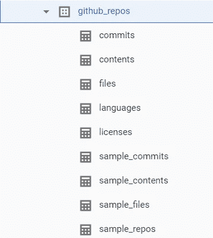
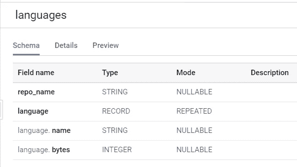
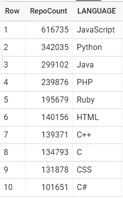

# 用 BigQuery 寻找顶级编程语言

> 原文：<https://towardsdatascience.com/finding-top-programming-language-with-bigquery-dbe96d463d99?source=collection_archive---------19----------------------->


如果你一直关注谷歌的云平台，你对 BigQuery 并不陌生。在我看来，BigQuery 是谷歌武库中最具差异化的工具。凭借 Pb 级的仓储能力、数百个开源数据集和熟悉的 SQL 接口，开发人员的准入门槛非常低。

上周，我在浏览 BigQuery 中的公开数据集时，碰巧发现了 Github 的数据集。它有提交数据、编程语言数据、存储库内容数据和许多其他酷表。

在浏览了整个数据集之后，我可以想到很多分析查询，我可以在数据集上运行这些查询来获得一些天才的见解。例如，我可以使用存储库内容数据集来找出最流行的 Java 包，使用提交数据集我可以找出哪个作者提交了最多的提交，或者我可以使用语言数据集来根据存储库计数找出顶级编程语言(这恰好是本文的主题)。

在回答这个有名无实的问题时，我们将学习 BigQuery 中的三个概念。

1.  UNNEST()和重复数据类型
2.  窗口和 Rank()函数
3.  命名子查询

# 设置

首先让我们将数据集添加到我们的 BigQuery 控制台。在 GCP web 控制台中导航到 BigQuery。

在左侧面板上点击*添加数据>锁定项目。*

输入项目名称 **bigquery-public-data** 。点击 *pin* ，你应该会看到项目被固定在窗格中。

您也可以转到数据集页面[这里](https://console.cloud.google.com/marketplace/details/github/github-repos?filter=solution-type:dataset&q=github&id=46ee22ab-2ca4-4750-81a7-3ee0f0150dcb)并点击查看数据集，这也应该会将项目添加到您的 BigQuery 仪表板。

该项目包含 BigQuery 托管的所有公共数据集，您需要导航到 ***github_repos*** 数据集。在里面你会看到 9 张桌子。



Public Github data set in BigQUery

出于本帖的目的，我们将使用 ***语言*** 表，该表具有以下模式。



Schema for languages table

让我们通过查询记录来了解数据。

```
SELECT * FROM `bigquery-public-data.github_repos.languages` LIMIT 1000
```

您会注意到表中的 **language** 字段是记录类型(也称为 STRUCT)的嵌套重复列，这是正确的，因为一个存储库可以有用多种语言编写的代码。你可以在这里读到更多关于他们的信息。

这使我们想到了使用重复(数组)类型的第一个概念。

# UNNEST()和重复数据类型

为了使用 **language** 字段，我们首先需要展平该列，这样我们可以在单独的行中获得每个值，而不是在一行中获得该字段的所有值。我们将使用 UNNEST()函数，正如它的名字一样，它将嵌套的记录解嵌套到单独的行中。

```
SELECT
  repo_name,
  arr.name AS LANGUAGE,
  arr.bytes AS language_bytes
FROM
  `bigquery-public-data.github_repos.languages`,
  UNNEST(LANGUAGE) arr
LIMIT
  10
```

每种语言记录都有语言名称和语言字节，其中存储了库中有多少字节的代码是用任何特定的语言编写的。在这篇文章中，我们将用代码中最大字节数的语言标记一个存储库，这将我们带到窗口和排名的下一个概念。

# 窗口和 Rank()函数

对于每个存储库，我们想找出哪种语言拥有最大的字节数，我们将通过对每个存储库中的语言进行排序来实现这一点。我们将使用前面的查询作为子查询来构建我们的查询。

```
SELECT
  repo_name,
  LANGUAGE,
  RANK() OVER (PARTITION BY t1.repo_name ORDER BY t1.language_bytes DESC) AS rank
FROM (
  SELECT
    repo_name,
    arr.name AS LANGUAGE,
    arr.bytes AS language_bytes
  FROM
    `bigquery-public-data.github_repos.languages`,
    UNNEST(LANGUAGE) arr ) AS t1
LIMIT
  10
```

这将向我们的结果添加一个**等级**列，我们需要选择**等级=1** 的行，因为这些行代表每个存储库的顶级语言。

```
SELECT
  t2.repo_name,
  t2.LANGUAGE
FROM (
  SELECT
    repo_name,
    LANGUAGE,
    RANK() OVER (PARTITION BY t1.repo_name ORDER BY t1.language_bytes DESC) AS rank
  FROM (
    SELECT
      repo_name,
      arr.name AS LANGUAGE,
      arr.bytes AS language_bytes
    FROM
      `bigquery-public-data.github_repos.languages`,
      UNNEST(LANGUAGE) arr ) AS t1 ) AS t2
WHERE
  rank = 1
LIMIT
  10
```

现在我们的数据集已经准备好了，可以根据存储库的数量找到最常用的语言。我们将创建一个命名查询，它可以在后续查询和子查询中使用，以获得更好的可读性。

# 命名子查询

BigQuery 支持 WITH 关键字来创建命名查询，这有助于您从中进行选择。命名查询没有具体化，每次引用时都会计算整个查询。你可以在官方文档[这里](https://cloud.google.com/bigquery/docs/reference/standard-sql/query-syntax#with-clause)阅读更多关于 WITH keyword 的内容。

```
WITH
  repositories AS (
  SELECT
    t2.repo_name,
    t2.LANGUAGE
  FROM (
    SELECT
      repo_name,
      LANGUAGE,
      RANK() OVER (PARTITION BY t1.repo_name ORDER BY t1.language_bytes DESC) AS rank
    FROM (
      SELECT
        repo_name,
        arr.name AS LANGUAGE,
        arr.bytes AS language_bytes
      FROM
        `bigquery-public-data.github_repos.languages`,
        UNNEST(LANGUAGE) arr ) AS t1 ) AS t2
  WHERE
    rank = 1)
```

如果您复制粘贴这个查询，您将得到一个**语法错误，**，因为如果不在任何后续的 SELECT 语句或表达式中使用它，您就不能拥有一个命名的子查询。

该查询将返回两列存储库名称(repo_name)及其语言。

从这里开始，通过计数找到顶级存储库应该是小菜一碟。

该查询应该产生以下结果集。



Top 10 programming languages by repository counts on Github

这个查询的结果并不令人震惊，随着 web 应用程序和 SPAs 的出现，JavaScript 在图表中名列前茅。

现在你知道了。按存储库数量排名的前 10 种编程语言。

如果你在代码中发现任何错误或者有任何问题，请在下面留下你的评论。

直到那时快乐编码。