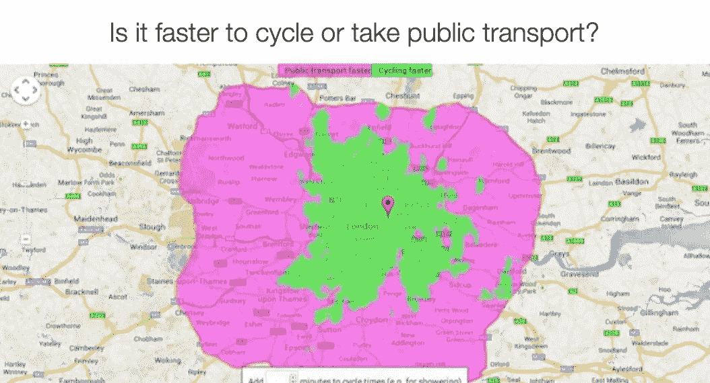
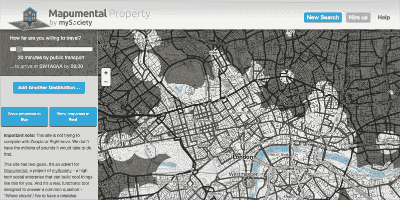
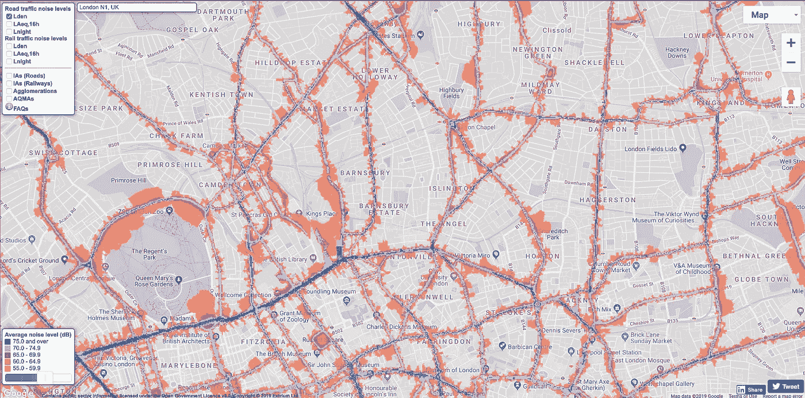
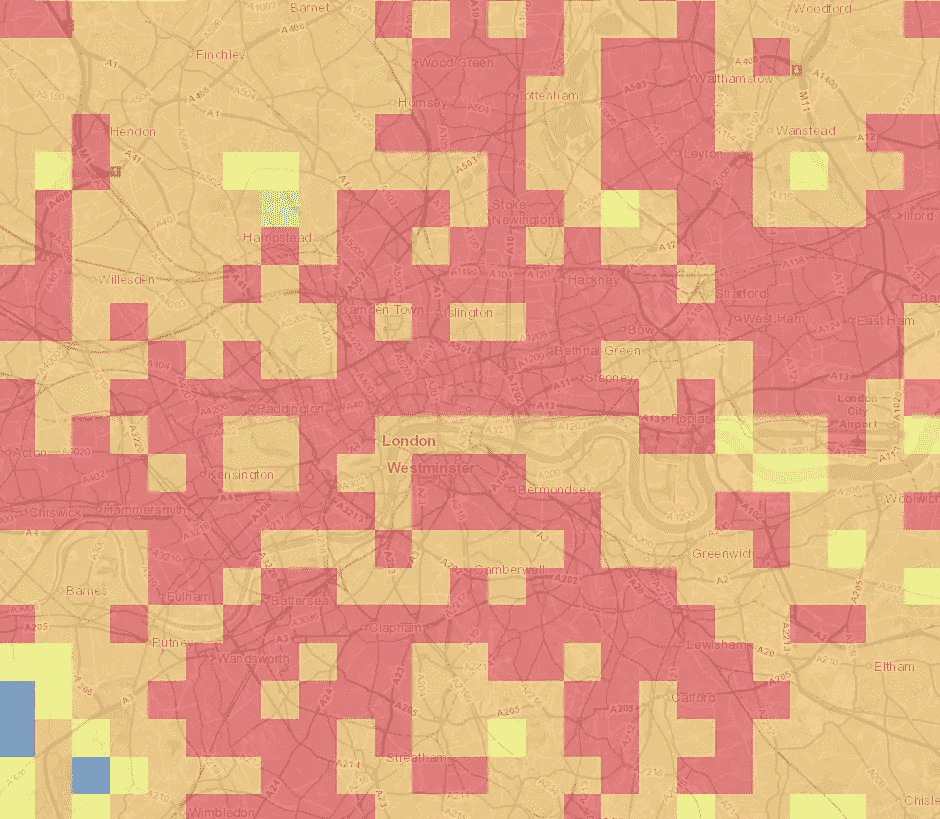
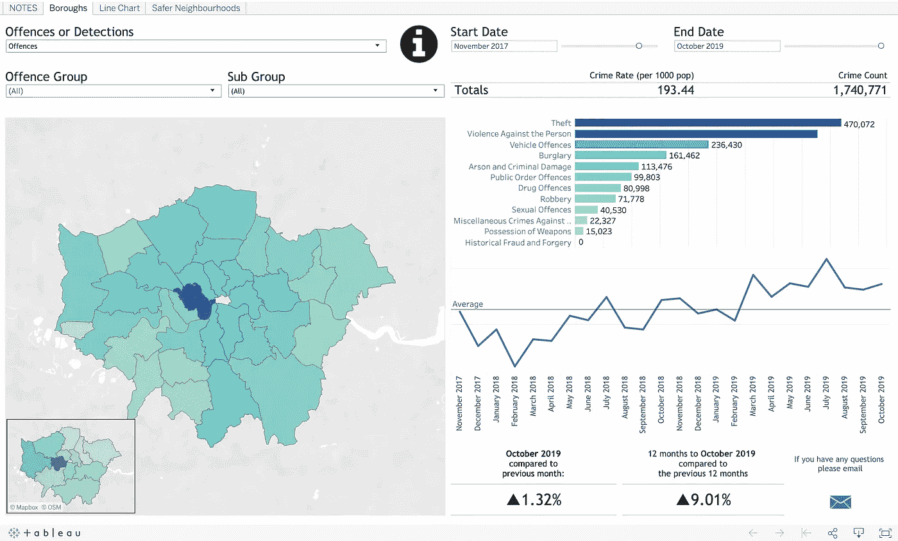
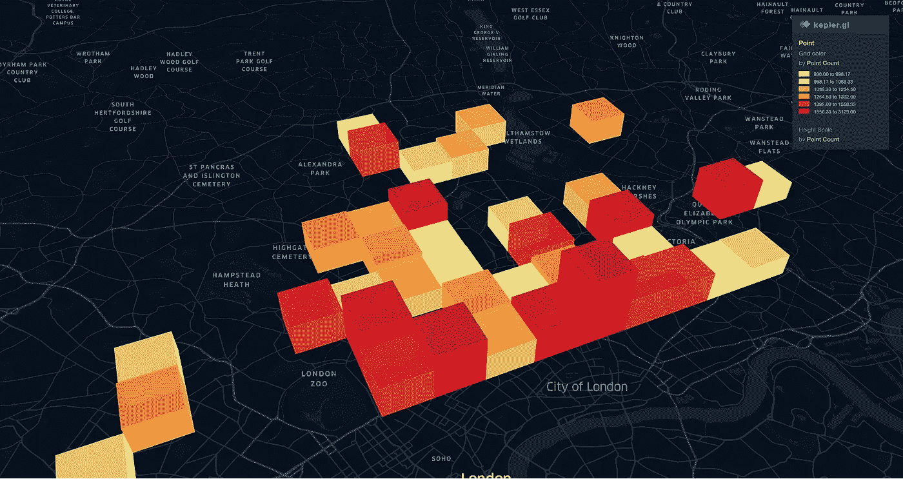

# 数小时内找到梦想中的家——数据驱动的方式

> 原文：<https://towardsdatascience.com/finding-your-dream-home-within-hours-the-data-driven-way-f51a67b7b6a9?source=collection_archive---------34----------------------->

## 使用数据和经过测试的流程寻找梦想家园，减少时间和困惑。不需要编码。

# 时间太少，选择太多，而且没有明显的好选择

找到你梦想中的家是生活中更令人兴奋的追求之一。但这也是一项极其艰巨的任务。我们许多人花费大量的时间、思想、精力，当然还有金钱，去寻找一个我们称之为家的地方。我知道这一点，因为这是我在街上和地铁里听到的所有人谈论的话题。这是一个全面的项目，几乎不可能与生活、家庭和工作的其余部分一起管理。许多人开玩笑说，他们最好辞掉工作，以便最终能够给找房子以适当的关注。他们说，太糟糕了，如果他们这样做了，也无法获得抵押贷款。

真的，谁能责怪他们呢？使用一些基本参数，在您选择的酒店门户上启动搜索。如果你住在一个城市，你可能会看到大量的结果，每个结果的缺点和好处，你必须以侦探的方式去发现。一个。由。一个。

几个月前，当我开始梦想在伦敦有一个新家时，我就在那里(尽管，就本文而言，它也可能在纽约、新加坡或旧金山)。幸运的是，我在一家分析公司工作，因此有一种即时的冲动，认为一定有更好的方法——即使你自己不是数据科学家。确实有。对我来说，答案在于数据驱动的方法。

接下来仍然是大量的工作——不要误会我的意思。像以往一样，找到正确的数据，然后找到处理它的方法仍然很棘手，所以我在下面总结了我的过程，希望对你有所帮助。您的位置和要求会有所不同，但我相信这个过程会与您的搜索和个人限制相类似。

# 位置，位置，还有…什么？

## 列出你的优先事项

在选择房产时，有许多方面很重要。找房子总是要妥协的。有些事情你可能不太愿意向前看。重要的是你设定自己的极限，并坚持下去。一旦你开始改变你的想法太多，你基本上回到考虑所有的选择。然而，这是一个毫不妥协的排斥游戏，只有当你清楚什么对你来说是重要的，你才能成功地做到这一点。我还将这个列表保留为主要的环境因素，因为我们将在缩小地理区域后看看你喜欢什么类型的房产。

我的一些优先事项是:

*   我的预算+/- 20%
*   最少一间卧室(无工作室)
*   步行 15 分钟内有一大片绿地
*   不到 45 分钟的通勤时间(对我和我妻子来说)
*   入室盗窃和暴力犯罪率低
*   高空气质量

# 获取数据，并绘制地图

既然我们有了优先事项，我们需要做一些研究。正如我在数据咨询公司 QuantumBlack 的工作一样，找到并探索正确的数据是最关键的一步。我是一个视觉型的人，所以我总是寻找已经以地图的形式出现的数据，或者可以使用免费的在线工具放入其中的数据。

## 预算

One of the many considerations FindProperly can help you with.

对于我的首要任务来说，一个惊人的资源是[find proper](https://www.findproperly.co.uk/promo.php#.Xgs7rtaeTRY)。该网站提供了一系列惊人的工具来帮助你找到你实际上能负担得起的住处，等等。

## 您的“位置”

Which places do you visit often?

为了找出你实际上应该住在哪里，[制作一张你最重要地点的地图](https://support.google.com/maps/answer/3184808?co=GENIE.Platform%3DAndroid&hl=en)。通过[创建一个你的位置历史热图](https://www.thomasessl.com/blog/2017/3/22/create-a-heat-map-from-your-google-location-history-in-3-easy-steps)，它也可以帮助你标出你过去去过的很多地方。

思考一下:

*   工作场所
*   学校
*   最好的朋友
*   机场
*   公园
*   主要交通枢纽
*   运动设施
*   等等。

一旦你规划好了关键地点，你就可以使用 [Mapumental](http://property.mapumental.com/) 这样的工具来设定出行时间的限制。

## 噪音

I like my peace and quiet.

噪音水平会对你新家的生活质量产生重大影响。你可能想留意汽车交通、铁路线和飞行路线。伦敦的前两个可以在这里找到。

## 空气污染

This air pollution map really made me want to live in N6

空气污染地图可能很难找到，但是对于伦敦来说，这张[应该可以帮你开始。就污染物而言，你可能要注意这四种:](http://www.londonair.org.uk/LondonAir/Default.aspx)

*   二氧化氮
*   臭氧
*   PM10
*   PM2.5

## 犯罪

Explore the Metropolitan Police’s crime dashboard

不是所有的罪行都是平等的。区分哪种犯罪对你作为居民的影响最大是值得的。就我个人而言，我优先考虑盗窃和暴力犯罪。前往[遇见警察](https://www.met.police.uk/sd/stats-and-data/met/crime-data-dashboard/)浏览他们的地图。

# 为你的房产寻找优先区域

## 组合您的数据

现在你已经有了对你来说很重要的所有东西的地图，你需要把它们结合起来找到你要寻找的区域。简单的方法是并排看地图，或者抓图，然后用 photoshop 等图片编辑工具叠加。

如果你想更进一步，你可以从上面的网站下载数据(大多数网站都有下载选项)，并将其加载到地图网站，如 [kepler.gl](https://kepler.gl/) 。

Crime data from the Metropolitan Police loaded into Kepler.gl

## 探索入围区域

厌倦了坐在电脑前？很好，因为下一步你必须站起来出去。理想情况下，你会把搜索范围缩小到两三个区。现在，你需要去拜访他们。去逛逛，感受一下这个地方，看看是不是“你”。你能想象自己在街角的咖啡馆里度过一个上午吗？你喜欢那边的古董市场吗？这些学校看起来像什么？离开大街。你能想象自己住在什么安静的树叶茂密的街道上吗？

心选择一个地方就像选择一个家一样。访问你的入围地区应该有助于你进一步缩小搜索范围。

# 找到你的新家

## 决定代理机构

现在，也只有现在，打开一个房产搜索网站。定义您在地图要素上选择的区域，并浏览结果列表。这还是研究。你实际上还没在找唯一的房产。即使你*正在*寻找一个家，在许多市场，当一个地方出现在比如说 Zoopla 上时，你已经太晚了。这是因为房产中介公司会给邮件列表上的客户第一次浏览的机会，所以一旦你在网上看到一个广告，成百上千的其他人可能在一周前就已经收到了。

相反，你要找的是哪些代理机构代表了吸引你的房产类型。在网上列出你喜欢的地方，然后检查它们是由哪个代理机构代理的。你可能会发现有几个是由同一家公司代理的。当我完成这一步时，我喜欢每个区域的 10 个地方。四个坐在代理处 A，三个坐在代理处 B，三个坐在代理处 c。挑选合适的房产数量最多的代理处，走进去，和他们握手，然后进入他们的电子邮件列表。

## 等待

从现在开始，这是一个等待的游戏。我的最后一条建议是，如果可以的话，耐心点。如果你遵循了所有这些步骤，你很快就会在你的收件箱里找到你梦想中的家，并且可以安排看房——而不用几个月来每天晚上都去搜索房产网站。

# 回家

我们的结果？整个任务总共花了我几个小时(我希望你现在能少花点时间)。我们最后看了四处房产。我们选择了我们看到的第三个。当然，这是谈判和合同真正疯狂的时候，但那是另一回事了。为此，我只能祝你好运。

如果你用数据找到了梦想中的家，请在评论中分享你的经历。我很想听听。

*最初发表于*【https://www.thomasessl.com】