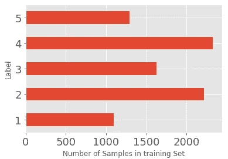
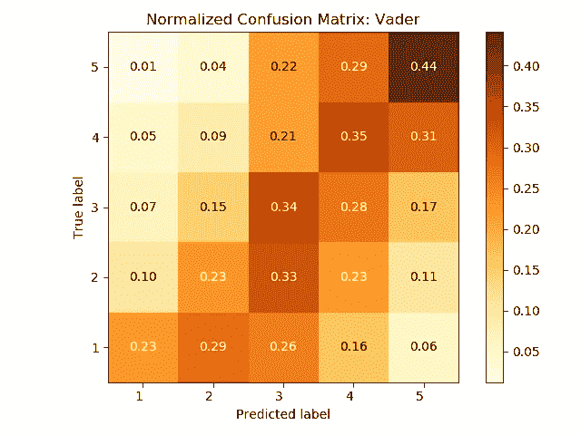

# Python 中的细粒度情感分析(第 1 部分)

> 原文：<https://towardsdatascience.com/fine-grained-sentiment-analysis-in-python-part-1-2697bb111ed4?source=collection_archive---------0----------------------->

## 在这篇文章中，我们将评估和比较 5 类斯坦福情感树库(SST-5)数据集的几个文本分类结果。


Source: [Pixabay](https://pixabay.com/photos/smiley-emoticon-anger-angry-2979107/)

> “学会选择很难。学会做好选择更难。在一个充满无限可能的世界里，学会做出正确的选择更难，或许太难了。”—巴里·施瓦茨

当开始一个新的 NLP 情感分析项目时，为一个给定的应用缩小选择方法的范围可能是一个相当艰巨的任务。我们是使用基于规则的模型，还是根据自己的数据训练模型？我们应该训练一个神经网络，还是一个简单的线性模型就能满足我们的要求？我们是否应该花时间和精力来实现我们自己的文本分类框架，或者我们是否可以使用一个现成的框架？解释结果和理解*为什么*做出某些预测有多难？

本系列旨在回答上述一些问题，重点是细粒度的情感分析。在余下的章节中，我们将使用 Python 中几个著名的 NLP 库来比较和讨论分类结果。下述方法分为三大类:

**基于规则的**方法:

*   TextBlob :用于情感分析的简单的基于规则的 API
*   [VADER](https://github.com/cjhutto/vaderSentiment) :基于简约规则的社交媒体文本情感分析模型。

**基于特征的**方法:

*   [逻辑回归](https://scikit-learn.org/stable/modules/generated/sklearn.linear_model.LogisticRegression.html):sci kit-learn 中的广义线性模型。
*   [支持向量机(SVM)](https://scikit-learn.org/stable/modules/generated/sklearn.linear_model.SGDClassifier.html#sklearn.linear_model.SGDClassifier):sci kit 中的线性模型——用随机梯度下降(SGD)优化器学习梯度损失。

**嵌入-** 基础方法:

*   [FastText](https://fasttext.cc/docs/en/supervised-tutorial.html) :一个 NLP 库，使用高效的基于 CPU 的单词嵌入表示来完成分类任务。
*   Flair :一个基于 PyTorch 的框架，用于序列标记和分类等 NLP 任务。

在 Python 中，每种方法都是以一种面向对象的 方式实现的，以确保我们可以轻松地替换实验模型，并在未来用更好、更强大的分类器扩展框架。

# 为什么要细粒度的情感？

在今天的大多数情况下，情感分类器被用于二元分类(仅仅是正面或负面的情感)，并且有充分的理由:细粒度的情感分类是一个 ***显著的*** ***更具挑战性的*** 任务！细粒度情感的典型分解使用*五个*离散类，如下所示。正如人们可能想象的那样，由于人类语言的微妙之处，模型很容易在情绪强度的强弱方面出错。


Typical class labels (or intensities) for fine-grained sentiment classification

二元类别标签可能足以研究文本数据(如推文、产品评论或客户反馈)中的大规模积极/消极情绪趋势，但它们确实有其局限性。当使用比较表达式执行信息提取时，例如:“*这款* *一加 X 型比三星 X 型好得多。”——*精细分析可以为优先解决客户投诉的自动化系统提供更精确的结果。此外，像“*这样的双重性句子的位置实在令人厌恶...但是那里的人民是光荣的。*“会混淆二元情感分类器，导致不正确的分类预测。

以上几点为解决这个问题提供了足够的动力！

## 斯坦福情感树库

[斯坦福情感树库](https://nlp.stanford.edu/sentiment/) (SST-5，或 SST-fine-grained)数据集是测试我们应用程序的合适基准，因为它旨在帮助评估模型理解*句子结构*的表达的能力，而不仅仅是孤立地查看单个单词。SST-5 由从带有细粒度情感标签的电影评论中提取的 11，855 个句子组成[1-5]，以及组成数据集中每个句子的 215，154 个短语。

带有基于短语的细粒度情感标签的原始数据采用树结构的形式，旨在帮助从他们 2015 年的论文中训练一个 [*递归神经张量网络*](https://nlp.stanford.edu/~socherr/EMNLP2013_RNTN.pdf) (RNTN)。组成短语是通过使用斯坦福解析器解析每个句子([论文](https://nlp.stanford.edu/~socherr/EMNLP2013_RNTN.pdf)的第 3 节)并创建如下图所示的递归树结构来构建的。然后，在每个句子的树形结构上训练深度神经网络，以对每个短语的情感进行分类，从而获得整个句子的累积情感。


Example of Recursive Neural Tensor Network classifying fine-grained sentiment (Source: [Original paper](https://nlp.stanford.edu/~socherr/EMNLP2013_RNTN.pdf))

## 最先进的是什么？

最初在[斯坦福论文](https://nlp.stanford.edu/~socherr/EMNLP2013_RNTN.pdf)【Socher et al .】中实现的 RNTN，在整句情感分类上获得了 **45.7%** 的准确率。最近，一个增强了 [ELMo 嵌入](https://arxiv.org/pdf/1802.05365v2.pdf)的双注意分类网络(BCN)已经被用于[在 SST-5 数据集上实现了 **54.7%** 的显著更高精度](https://github.com/sebastianruder/NLP-progress/blob/master/english/sentiment_analysis.md#sst)。SST-5 数据集上当前(截至 2019 年)最先进的准确度是 **64.4%** ，通过[一种使用句子级嵌入的方法](https://arxiv.org/pdf/1806.00807.pdf)最初设计用于解决转述任务——它最终在细粒度情感分析上也表现得令人惊讶。

尽管神经语言模型自 2018 年以来变得越来越强大，但可能需要更大的深度学习模型(具有更多参数)和基于知识的方法(如图表)来实现足够的语义上下文，以在细粒度情感分析中达到 70-80%的准确率。

## 将数据集转换为表格形式

为了评估我们的 NLP 方法以及它们之间的区别，我们将只使用训练数据集中的 ***完整样本*** (忽略组成短语，因为我们没有使用像斯坦福论文那样的递归的基于树的分类器)。使用 [*pytreebank*](https://pypi.org/project/pytreebank/) 库将短语的树形结构转换为原始文本及其相关的类标签。这个树到表格转换的代码在这个项目的 GitHub repo 中提供。

Convert SST-5 tree data to tabular form that we can more easily work with

完整的句子文本及其类别标签(对于`train`、`dev`和`test`集合)被写入单独的文本文件，在句子和类别标签之间使用制表符分隔符。

## 探索性数据分析

然后，我们可以使用 Pandas 更详细地研究表格数据集。首先，以数据帧的形式读入训练集，同时指定制表符分隔符以区分类标签和文本。注意“`truth`”列中的类标签被转换为 Pandas 中的数据类型`category`，而不是将其保留为字符串。

```
import pandas as pd# Read train data
df = pd.read_csv('../data/sst/sst_train.txt', sep='\t', header=None, names=['truth', 'text'])df['truth'] = df['truth'].str.replace('__label__', '')
df['truth'] = df['truth'].astype(int).astype('category')
df.head()
```


Sample of SST-5 training data

使用命令`df.shape[0]`告诉我们我们有 8544 个训练样本。

## 数据集平衡吗？

在分析情感分类数据集之前，需要注意的一个重要方面是训练数据中的类别分布。

```
import matplotlib.pyplot as pltax = df[‘truth’].value_counts(sort=False).plot(kind=’barh’)
ax.set_xlabel(“Number of Samples in training Set”)
ax.set_ylabel(“Label”)
```



很明显，大多数训练样本属于类别 2 和类别 4(弱负/正类别)。相当数量的样本属于中性类。只有 12%的样本来自强负 1 类，这是我们评估分类器准确性时要记住的一点。

测试集呢？快速浏览一下，我们有 2，210 个测试样本，其分布与训练数据非常相似，同样，与其他类别相比，属于强阴性/阳性类别(1 或 5)的样本要少得多。这是可取的，因为我们的分类器进行预测的测试集分布与训练集的分布没有太大的不同。


[原论文](https://nlp.stanford.edu/~socherr/EMNLP2013_RNTN.pdf)中提到的一个有趣的点是，很多真正的短文本例子都属于中性类(即 3 类)。这在熊猫身上很容易想象。我们可以创建一个新列来存储每个文本样本的字符串长度，然后按照文本长度的升序对 DataFrame 行进行排序。

```
df['len'] = df['text'].str.len()  # Store string length of each sampledf = df.sort_values(['len'], ascending=True)
df.head(20)
```


Class labels for the really short examples in the test set

具有明显极性单词的样本，例如“good”和“loved”，将为情感分类器提供更大的上下文，然而，对于中性发音的单词(例如“Hopkins”或“Brimful”)，分类器将不得不不仅与极小的上下文，即单个单词样本一起工作，而且还能够处理未出现在训练词汇中的模糊或看不见的单词。

## 数据标签并不完美！

正如论文中提到的，SST 数据集是由人类注释者通过 Amazon Mechanical Turk 标记的。注释者被展示随机选择的短语，他们从一个连续的滑动条中选择标签。基于多个标注者选择的标签的平均值，重构属于五个类别之一的*离散*情感标签。在标注过程中使用了随机抽样，以确保标注不受前面短语的影响。


Labelling interface for SST dataset (source: [Original Paper](https://nlp.stanford.edu/~socherr/EMNLP2013_RNTN.pdf))

上面的例子清楚地说明了为什么这是一个如此具有挑战性的数据集来进行情感预测。例如，注释者倾向于将短语“*书呆子*”归类为有点负面的，因为“书呆子”这个词在我们社会当前对书呆子的看法中有一些负面的含义。然而，从纯语言学的角度来看，这个样本也可以被归类为中性的。

因此，记住**文本分类标签总是受人类感知和偏见的影响是很重要的。**在现实世界的应用中，在主观的基础上看待某些边缘情况绝对有意义。没有一个基准数据集——推而广之，分类模型——是完美的。

记住这几点，我们可以继续设计我们的情感分类框架！

# 方法学

模型训练和评估的一般工作流程如下所示。


Sentiment classification: Training & Evaluation pipeline

**模型训练:**每个分类器(除了基于规则的分类器)使用监督学习算法在来自 SST-5 训练集的 8，544 个样本上进行训练。项目的 GitHub repo 中提供了单独的培训脚本[。](https://github.com/prrao87/fine-grained-sentiment/tree/master/training)

**预测:**按照我们面向对象的设计理念，我们避免在不同的分类方法中重复执行相同任务的代码块。Python 中定义了一个`Base`类，包含常用的方法:一个用于将 SST-5 数据读入 Pandas DataFrame ( `read_data`)，另一个用于计算模型的分类精度和 F1 值(`accuracy`)。以这种方式将数据集存储在 Pandas DataFrame 中，可以非常方便地应用自定义转换和用户定义的函数，同时避免过度使用 for 循环。

Base utilities class for all classifiers

接下来，添加到我们框架中的每个单独的分类器必须继承上面定义的`Base`类。为了使框架一致，每个新的情感分类器都包含了一个`score`方法和一个`predict`方法，如下所示。`score`方法为文本样本输出一个唯一的情感类，而`predict`方法将 score 方法应用于测试数据集中的每个样本，以在测试数据帧中输出一个新列`'pred'`。然后通过使用在`Base`类中定义的`accuracy`方法来计算模型的准确性和 F1 分数是很简单的。

Example sentiment predictor class

**评估:**为了评估模型的准确性，使用 scikit-learn 和 matplotlib(GitHub 上的 [*plotter.py*](https://github.com/prrao87/fine-grained-sentiment/blob/master/plotter.py) )绘制模型的 [**混淆矩阵**](https://scikit-learn.org/stable/modules/generated/sklearn.metrics.confusion_matrix.html) 。混淆矩阵将每个类别的正确预测数与错误预测数进行列表，这样就可以更容易地看出对于给定的分类器，哪些类别的预测最不准确。请注意，我们的 5 类情况的混淆矩阵是一个标准化的[反对角线矩阵](https://en.wikipedia.org/wiki/Anti-diagonal_matrix)——理想情况下，分类器的预测几乎 100%正确，因此反对角线之外的所有元素尽可能接近零。


Idealized confusion matrix (normalized) — termed an “[anti-diagonal matrix](https://en.wikipedia.org/wiki/Anti-diagonal_matrix)”

# 培训和模型评估

在这一部分，我们将讨论每种方法的培训、情感评分和模型评估的一些要点。

## 1 —文本块

[TextBlob](https://textblob.readthedocs.io/en/dev/) 是一个用于处理文本数据的流行 Python 库。它构建在 NLTK [、](http://www.nltk.org)之上，后者是 Python 的另一个流行的自然语言处理工具箱。TextBlob 使用情感词典(由预定义的单词组成)来为每个单词分配分数，然后使用加权平均值进行平均，以给出句子的总体情感分数。对每个单词计算“极性”、“主观性”和“强度”三个分值。

```
# A sentiment lexicon can be used to discern objective facts from subjective opinions in text. 
# Each word in the lexicon has scores for: 
# 1) polarity: negative vs. positive (-1.0 => +1.0) 
# 2) subjectivity: objective vs. subjective (+0.0 => +1.0) 
# 3) intensity: modifies next word? (x0.5 => x2.0)
```

一些直观的规则被硬编码在 TextBlob 中，以检测增加或减少句子整体极性得分的修饰语(如英语中的副词:“ *very good* ”)。在这篇博文中有关于这些规则的更详细的描述[。](https://planspace.org/20150607-textblob_sentiment/)

**情感评分:**要将 TextBlob(一个范围[-1，1]内的连续值浮点数)返回的极性评分转换为细粒度的类标签(一个整数)，我们可以利用*宁滨*。在 Pandas 中使用`pd.cut`函数很容易做到这一点——它允许我们通过在结果中所有 TextBlob 分数的浮动区间中使用相同大小的 bin，从连续变量变为分类变量。

**评估:**由于我们在训练和测试期间都在处理不平衡的类，所以我们关注*宏* F1 分数(它是宏平均精度和召回率的调和平均值)以及分类准确度。可以看出，TextBlob 分类方法的准确度非常低，F1 分数也是如此。


混淆矩阵图显示了分类器预测最不正确的类别的更多详细信息。


Each cell in the confusion matrix shows the **percentage** of predictions made for the corresponding true label.

要阅读上述混淆矩阵图，请查看沿[反对角线](https://en.wikipedia.org/wiki/Anti-diagonal_matrix)的单元。单元格[1，1]显示分类器正确预测的属于类别 1 的样本的百分比，单元格[2，2]显示正确的类别 2 预测的百分比，依此类推。远离反对角线的单元格显示了对每个相应类别做出的错误预测的百分比-例如，查看单元格[4，5]，我们可以看到实际属于类别 5 的所有样本中有 47%被 TextBlob(不正确地)预测为类别 4。

很明显，我们的 TextBlob 分类器预测大多数样本为中性或轻度阳性，即类别 3 或 4，这解释了为什么模型精度如此低。很少有预测是强烈负面或正面的——这是有意义的，因为 TextBlob 对每个样本中的所有单词使用加权平均情感得分。这可以很容易地分散出单词之间极性差异很大的句子的效果，例如“*这部电影是关于撒谎、欺骗，但爱你背叛的朋友*

## 2 — VADER

“**V**alence**A**ware**D**ictionary and s**E**entiment**R**easoner”是另一个流行的基于规则的情感分析库。像 TextBlob 一样，它使用一个情感词典，其中包含基于人工标注标签的每个单词的强度测量。然而，一个关键的区别是，VADER **的设计侧重于社交媒体文本**。这意味着它非常重视捕捉社交媒体上常见文本本质的规则——例如，带有表情符号的短句、重复的词汇和大量使用标点符号(如感叹号)。以下是 VADER 输出的情感强度分数的一些例子。


在上面的文本示例中，对同一个句子做了微小的改动。请注意，VADER 将情绪强度分数分解为积极、消极和中性成分，然后将其标准化并压缩到[-1，1]范围内作为“复合”分数。随着我们添加更多的感叹号、大写字母和表情符号，强度变得越来越极端(朝着+/- 1)。

**情感评分:**为了返回 SST-5 数据集上的离散类值，我们应用了与 TextBlob 类似的技术——通过 pandas `pd.cut`函数使用宁滨将连续的“复合”极性得分(float)转换为离散值。这将为每个测试样本返回五个类中的一个，作为新列存储在结果数据帧中。

**评估:**上面使用的宁滨方法是将来自 VADER 的连续(浮点)值平均分成我们需要的五个离散类之一的一种相当粗糙的方法。然而，与 TextBlob 相比，我们确实看到了总体分类准确性和宏 F1 分数的提高。


VADER 的混淆矩阵显示了更多正确预测的类(沿着反对角线)-然而，关于对角线的不正确预测的传播也更大，给了我们一个更加“混乱”的模型。



Each cell in the confusion matrix shows the **percentage** of predictions made for the corresponding true label.

VADER 的更大传播(在反对角线之外)可以归因于这样一个事实，即它只给具有大写、****lot***的文本分配非常低或非常高的复合分数。由于 SST-5 实际上没有这样的注释文本(它与社交媒体文本有很大不同)，因此该数据集的大多数 VADER 预测都在-0.5 到+0.5 的范围内(原始分数)。当转换为离散类标注时，这将导致更窄的分布，因此，许多预测可能会在真实标注的任一侧出错。*

*虽然 VADER 的结果准确度仍然很低，但很明显，与 TextBlob 相比，它基于规则的方法确实捕捉到了情绪的大量精细分级——很少真正负面的情况被归类为正面，反之亦然。*

## *3 — **逻辑回归***

*从基于规则的方法向前移动，下一个尝试的方法是逻辑回归，这是最常用的分类监督学习算法之一。逻辑回归是一种基于标记数据的线性模型——术语线性很重要，因为它意味着算法仅使用输入和参数的线性组合(即和而非积)来产生类别预测。*

*Sebastian Raschka [在他的博客文章中对逻辑回归如何等同于一个非常简单的单层神经网络给出了一个非常简洁的解释](https://sebastianraschka.com/faq/docs/logisticregr-neuralnet.html)。输入特征及其权重被输入到激活函数(用于二分类的 sigmoid，或用于多分类的 softmax)。分类器的输出只是 sigmoid/softmax 向量的索引，其中最高值作为类标签。*

**

*Source: [Sebastian Raschka’s blog](https://sebastianraschka.com/faq/docs/logisticregr-neuralnet.html)*

*对于多类逻辑回归，通常使用[一对其余](https://en.wikipedia.org/wiki/Multiclass_classification#One-vs.-rest)方法——在该方法中，我们训练 *C* 单独的二元分类模型，其中 *C* 是类的数量。每个分类器 *f_c* ，for *c* ∈ {1，…， *C* }被训练来预测样本是否属于类别 *c* 。*

***将单词转换为特征:**要将文本转换为特征，第一步是使用 scikit-learn 的`[CountVectorizer](https://scikit-learn.org/stable/modules/generated/sklearn.feature_extraction.text.CountVectorizer.html).`这将我们训练数据的整个语料库(即所有句子)转换为令牌计数矩阵。令牌(单词、标点符号等。)是使用 NLTK 的标记器创建的，常用的停用词如“a”、“an”、“the”被删除，因为它们不会给情感评分增加太多价值。接下来，计数矩阵被转换成 TF-IDF(术语频率逆文档频率)表示。来自 [scikit-learn 文档](https://scikit-learn.org/stable/modules/generated/sklearn.feature_extraction.text.TfidfTransformer.html):*

> *Tf 表示术语频率，而 tf-idf 表示术语频率乘以逆文档频率。这是信息检索中常见的术语加权方案，在文档分类中也有很好的用途。使用 tf-idf 而不是给定文档中记号出现的原始频率的目的是按比例缩小记号的影响，这些记号在给定语料库中非常频繁地出现，因此在经验上比在一小部分训练语料库中出现的特征信息少。*

***情感评分:**一旦我们获得了训练语料库的 TF-IDF 表示，就通过使其适合现有特征来训练分类器。“`newton-cg`”解算器用于优化逻辑回归中的损失，默认情况下使用 [L2 正则化](https://scikit-learn.org/stable/modules/generated/sklearn.linear_model.LogisticRegression.html)。为每个测试样本返回一个情感标签(使用 scikit-learn 的`learner.predict`方法),作为 softmax 输出向量中最大类别概率的索引。*

***评估:**从基于规则的方法切换到基于特征的方法，总体分类精度和 F1 值都有显著提高，如下图所示。*

**

*然而，混淆矩阵显示了为什么在多类问题中查看整体准确性度量不是很有用。*

**

*Each cell in the confusion matrix shows the **percentage** of predictions made for the corresponding true label.*

*逻辑回归模型将大部分真实标签 1 和 5(强阴性/阳性)归类为属于它们的*邻居*类(2 和 4)。此外，几乎没有任何例子被正确归类为中性(第 3 类)。因为大多数训练样本属于类别 2 和 4，看起来逻辑分类器*主要学习了* *在这些主要类别*中出现的特征。*

## *4 —支持向量机*

*支持向量机(SVM)在如何优化损失函数以生成数据点之间的决策边界方面非常类似于逻辑回归。然而，主要的区别是“核函数”的使用，即，将复杂的非线性决策空间转换为具有更高维度的决策空间的函数，以便可以找到分离数据点的适当超平面。SVM 分类器使用将每个距离表征为向量的“支持向量”,来最大化每个数据点与该超平面的距离。*

*支持向量机的一个关键特征是它使用了一个*铰链*损失，而不是逻辑损失。[这使得它对数据中的异常值更加稳健](/support-vector-machine-vs-logistic-regression-94cc2975433f)，因为铰链损失不会像逻辑损失那样迅速发散。*

***训练和情感评分:**sci kit-learn 中的线性 SVM 是使用与前面描述的逻辑回归类似的管道建立的。一旦我们获得了训练语料库的 TF-IDF 表示，我们就通过使其适合训练数据特征来训练 SVM 模型。使用具有随机梯度下降(SGD)优化器的铰链损失函数，并且在训练期间应用 [L2 正则化](https://scikit-learn.org/stable/modules/generated/sklearn.linear_model.SGDClassifier.html)。情感标签作为 softmax 输出向量中最大类别概率的索引返回(使用 scikit-learn 的`learner.predict`方法)。*

***评估:**由于相当多的要素可能是现实数据集中的异常值，因此 SVM 在实践中产生的结果应该略好于逻辑回归。看看准确性和 F1 分数的提高，这似乎是真的。*

**

*与逻辑回归相比，优化器的选择与 SVM 模拟更复杂超平面的能力相结合，将样本分成各自的类别，从而略微改善了混淆矩阵。*

**

*Each cell in the confusion matrix shows the **percentage** of predictions made for the corresponding true label.*

**

*Side by side: Logistic Regression vs. SVM*

*SVM 模型预测强负/正类(1 和 5)比逻辑回归更准确。然而，它仍然不能预测足够多的样本属于类别 3——大部分 SVM 预测再次偏向主要的类别 2 和 4。这告诉我们，特性定义的方式还有改进的余地。与 TF-IDF 转换相结合的计数矢量器实际上并不了解任何关于*单词如何相互关联的信息* —它们只是查看每个样本中单词共现的数量来做出结论。*输入单词嵌入*。*

## *5 —快速文本*

*FastText 是一个高效、可扩展、基于 CPU 的文本表示和分类库，由脸书人工智能研究(FAIR)团队于 2016 年发布。FastText 的一个关键特征是其底层神经网络学习表示，或*嵌入*，即*考虑单词之间的相似性*。虽然 [Word2Vec](https://en.wikipedia.org/wiki/Word2vec) (一种更早于 2013 年发布的单词嵌入技术)做了类似的事情，但 FastText 有一些突出的关键点。*

*   *FastText 使用 n-gram 的集合来考虑子词:例如，“train”被分解为“tra”、“rai”和“ain”。以这种方式，单词的表示更能抵抗拼写错误和微小的拼写变化。*
*   *FastText 可以更好地处理未知单词，因为它能够将长单词分解成子单词，这些子单词也可能出现在其他长单词中，从而提供更好的上下文。*

***Python 模块:**虽然 FastText 的源代码是 C++，但是 2019 年 6 月 FAIR 还是发布了一个官方的 Python 模块([在社区内混乱了几个月后](https://fasttext.cc/blog/2016/08/18/blog-post.html))。这使得完全在 Python 中训练和测试我们的模型非常方便，不需要使用任何外部二进制文件。但是，为了找到最佳的超参数，建议使用 FastText 的命令行界面。*

***训练 FastText 模型:**要训练 FastText 模型，请使用`[fasttext](https://fasttext.cc/docs/en/support.html#building-fasttext-as-a-command-line-tool)` [命令行界面](https://fasttext.cc/docs/en/support.html#building-fasttext-as-a-command-line-tool)(仅限 Unix 这包含一个非常有用的超参数自动调整实用程序。根据[文档](https://fasttext.cc/docs/en/autotune.html)，该实用程序针对最大 F1 分数优化所有超参数，因此我们不需要手动搜索特定数据集的最佳超参数。这是在终端上使用以下命令运行的，在 CPU 上大约需要 5 分钟。*

*Command to find optimum hyperparameters for FastText using the command line interface*

*上面的命令告诉 FastText 在训练集上训练模型，并在开发集上验证，同时优化超参数以实现最大 F1 分数。标志`-autotune-modelsize 10M`告诉 FastText 优化模型的*量化*参数(如下所述),使得最终训练的模型大小小于 10 MB，并且启用`-verbose`选项，以查看哪个超参数组合给出最佳结果。*

*💡**提示:量化 FastText 模型:** [量化](https://nervanasystems.github.io/distiller/quantization.html)通过使用 16 位或 8 位整数，而不是标准的 32 位浮点，减少了存储模型权重所需的位数。这样做极大地减小了模型的大小(几个数量级)。 [FastText 使量化变得非常方便](https://fasttext.cc/docs/en/cheatsheet.html#quantization)在其最新发布的命令行接口或其 Python 模块如下(量化模型的扩展是`**.ftz**`，不是`.bin`作为父模型)。根据超参数优化期间获得的值设置截止选项，这确保了最终模型大小保持在 10 MB 以下。*

```
*# Quantize model to reduce space usage                           model.quantize(input=train, qnorm=True, retrain=True, cutoff=110539)                           model.save_model(os.path.join(model_path, "sst5.ftz"))*
```

*下面的代码片段显示了如何使用最佳超参数在 Python 中训练模型(这一步是可选的，如果愿意，只能使用命令行训练工具)。*

*关于每个超级参数的含义以及 FastText 如何在幕后工作的更多细节，[这篇文章给出了一个很好的描述](/fasttext-under-the-hood-11efc57b2b3)。*

***情感评分:**通过加载经过训练、量化的(`.ftz` ) FastText 模型来进行情感预测。该模型有一个`predict`方法，根据从 softmax 输出层提取的概率输出最可能的标注。为了进行分类预测，我们简单地从这个概率列表中选择最可能的分类标签，直接将其提取为整数。*

***评估:**可以看出，对于该数据集，FastText 模型的准确性和 F1 分数在 SVM 上没有显著提高。*

**

*然而，FastText 的 F1 分数略高于 SVM。*

**

*Each cell in the confusion matrix shows the **percentage** of predictions made for the corresponding true label.*

*两个模型并列的混淆矩阵更详细地强调了这一点。*

**

*Side by side: SVM vs. FastText*

*快速文本和 SVM 结果之间的关键区别是中性类的正确预测百分比，3。在大多数类别(2 和 4)中，SVM 比 FastText 正确地预测了更多的项目，这突出了基于特征的方法在不平衡类别的文本分类问题中的弱点。FastText 使用的单词嵌入和子单词表示法固有地给了它额外的上下文。在对未登录词进行分类时尤其如此，这在中性类中相当常见(尤其是只有一两个词的非常短的样本，大多是看不见的)。*

*然而，我们的 FastText 模型是使用单词三元模型训练的，因此对于中途改变极性的较长句子，该模型必然会“忘记”之前几个单词的上下文。RNN 或 LSTM 等序列模型将能够更好地捕捉更长期的背景，并对这种过渡情绪进行建模。*

## *6 —天赋*

*2018 年， [Zalando Research 发表了一个最先进的深度学习序列标记 NLP 库](https://github.com/zalandoresearch/flair)，名为 **Flair** 。这也很快成为分类任务的流行框架，因为它允许*将不同种类的单词嵌入*在一起，从而为模型提供更好的上下文感知。*

*Flair 的核心是一个名为*字符串嵌入的上下文化表示。*为了获得它们，来自大型语料库的句子被分解成字符序列，以预训练双向语言模型，该模型在字符级“学习”嵌入。通过这种方式，该模型可以学习区分大小写的字符(例如，发音相似的普通名词中的专有名词)和自然语言中的其他句法模式，这使得它对于命名实体识别和词性标注等任务非常强大。*

**

*Illustration of a BiLSTM sequence labeller with contextual character embeddings ([Source](https://research.zalando.com/welcome/mission/research-projects/flair-nlp/))*

***训练用于分类的 Flair 模型:**使 Flair 极其方便而强大的是它能够用“Flair”(即字符串)嵌入来“堆叠”单词嵌入(如 ELMo 或 BERT)。以下示例显示了如何使用 Flair 嵌入实例化 BERT(基本，有大小写)或 ELMo(原始)嵌入的堆栈嵌入。堆叠表示被转换成嵌入的*文档，即对整个文本样本进行单次嵌入(不管有多少个句子)。这允许我们将复杂的任意长度表示压缩为固定大小的张量表示，我们可以在 GPU 内存中进行训练。**

*以这种方式堆叠嵌入(BERT 或 ELMo)的能力来自于这样一个事实，即[字符级字符串嵌入捕获潜在的语法语义信息](https://github.com/zalandoresearch/flair/blob/master/resources/docs/TUTORIAL_3_WORD_EMBEDDING.md#flair-embeddings) *，而不使用单词的概念*(它们明确地专注于子单词表示)，而来自外部预训练神经网络模型的堆叠单词嵌入给出了附加的单词级上下文。这增强了模型在给定文本中识别各种句法特征的能力，使其能够超越经典单词嵌入模型的性能。*

***关于训练的注意事项:**Flair 模型需要一个 GPU 来进行训练，并且由于其 LSTM 架构与 transformer 架构相比不能高效地并行化，因此即使在这个相对较小的 SST-5 数据集上的训练时间也在**几个小时的数量级**。对于这个项目，运行了 25 个时期的训练，当训练停止时，验证损失仍在减少，这意味着模型相当不适合。因此，在现实世界的大型数据集上使用 Flair 进行分类任务可能会带来巨大的成本损失。*

***情感评分:**和以前一样，评分技术是在 Pandas 现有的框架下实现的。首先加载训练好的模型，然后将文本转换成一个`Sentence`对象(这是样本中每个句子的标记化表示)。调用 Flair 模型的`predict`方法，使用 softmax 输出图层中的最大索引来预测类别标注，然后将最大索引提取为整数并按样本存储在 Pandas 数据帧中。因为即使在 GPU 上，模型推断也需要相当长的时间，所以实现了一个`[tqdm](https://github.com/tqdm/tqdm/blob/master/examples/pandas_progress_apply.py)` [进度条](https://github.com/tqdm/tqdm/blob/master/examples/pandas_progress_apply.py)来显示模型完成了多少测试样本的预测。*

***评估:**使用两个独立的堆叠表示来训练两个独立的模型——一个使用 BERT(基本、有壳),另一个使用 ELMo(原始)。使用每个模型进行推理，得出以下结果。*

**

*与快速文本和 SVM 模型相比，在准确性和 F1 分数方面都有相当大的提高！查看每种情况下的混淆矩阵，可以洞察哪些类别比其他类别预测得更好。*

****

*上面的图强调了为什么使用 BERT 嵌入的堆叠比使用 ELMo 嵌入的堆叠得分低得多。BERT 案例几乎没有对第 1 类做出正确的预测——但是它对第 4 类做出了更多正确的预测。ELMo 模型似乎与 Flair 嵌入堆叠得更好，并且为少数类(1 和 5)生成更大部分的正确预测。*

*Flair + BERT 模式在训练中哪里出了问题？可能是重新投影和减少隐藏维度的数量(在堆叠期间)导致预训练 BERT 模型的知识丢失，这解释了为什么该模型在强负样本上学习得不够好。与使用 BERT 进行堆叠相比，堆叠 ELMo 嵌入为什么会导致更好的学习，这一点并不十分清楚。然而，在这两种情况下，Flair 模型花费了大量时间(几个小时)来训练，这在现实世界中可能是一个巨大的瓶颈——然而，它们确实突出了使用上下文嵌入而不是经典单词嵌入来进行细粒度分类的能力。*

# *结论*

*在这篇文章中，Python 中的六个不同的 NLP 分类器被用来在 SST-5 细粒度情感数据集上进行分类预测。通过逐步使用越来越复杂的模型，我们能够将 F1 的准确度和宏观平均分数提高到 48%左右，这还不算太差！在未来的帖子中，我们将看到如何使用迁移学习驱动的 transformer 模型来进一步提高这些分数。*

**

*Comparison of results: Fine-grained sentiment classification on SST-5*

## *我们还能学到什么？*

*绘制归一化混淆矩阵给出了一些有用的见解，即为什么基于嵌入的方法的精度高于更简单的基于特征的方法，如逻辑回归和 SVM。很明显，在类不平衡的多类问题中，整体准确性是一个非常差的指标，比如这个问题，这就是为什么需要宏观 F1 分数来真正衡量哪些分类器性能更好。*

*机器学习模型(尤其是深度学习模型)的一个关键方面是，众所周知，它们很难解释。为了解决这个问题，我们将看一下 ***解释*** 我们的结果并回答这个问题:“*为什么 X 分类器预测这个特定样本的这个特定类别？*”。LIME Python 库用于这个任务，这将在下一篇文章中描述。*

*如果你一直读到这篇文章的结尾，感谢你的阅读！*

*   *这是 Python 中细粒度情感分析系列的第 1 部分。*
*   *[**第 2 部分**](https://medium.com/@tech_optimist/fine-grained-sentiment-analysis-in-python-part-2-2a92fdc0160d) 讲述了如何使用 LIME 构建一个解释器模块，并解释两个代表性测试样本上的类预测。*
*   *[**第三部分**](https://medium.com/@tech_optimist/fine-grained-sentiment-analysis-part-3-fine-tuning-transformers-1ae6574f25a6) 讲述了如何通过建立我们自己的 transformer 模型，使用迁移学习，进一步提高准确率和 F1 分数。*

***注意:**此分析的所有培训和评估代码都可以在项目的 Github repo 中获得[，所以请随意复制结果并做出您自己的发现！](https://github.com/prrao87/fine-grained-sentiment)*