# Python 中的细粒度情感分析(第 2 部分)

> 原文：<https://towardsdatascience.com/fine-grained-sentiment-analysis-in-python-part-2-2a92fdc0160d?source=collection_archive---------10----------------------->

## 在本帖中，我们将*使用 LIME 为*各种细粒度情感分类结果生成解释

Source: [Pixabay](https://pixabay.com/illustrations/question-mark-important-sign-1872665/)

> “我为什么要相信你？”— [里贝罗等人](https://arxiv.org/abs/1602.04938)

这是 Python 中细粒度情感分析系列的第 2 部分。[第 1 部分](https://medium.com/@tech_optimist/fine-grained-sentiment-analysis-in-python-part-1-2697bb111ed4)讲述了*如何用 Python 训练和评估各种细粒度的情感分类器。在这篇文章中，我们将讨论*为什么*一个分类器做出了一个特定的类别预测——也就是说，如何**使用一种叫做 LIME 的流行方法来解释**一个情感分类器的结果。*

概括地说，以下六个模型用于在斯坦福情感树库(SST-5)数据集上进行细粒度情感类别预测。

*   基于规则的模型:**文本块**和 **VADER**
*   基于特征的模型:**逻辑回归**和**支持向量机**
*   基于嵌入的模型: **FastText** 和 **Flair**

使用线性过程来分析和解释使用每种方法的情感分类结果。

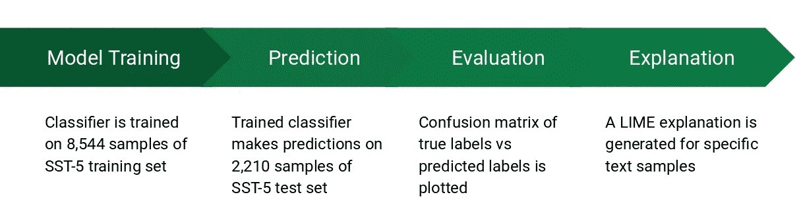

Sentiment classification: Training & Evaluation pipeline

以下部分解释了该过程的最后一步——为每种方法的预测生成**解释**。

# 局部可解释的模型不可知的解释

或者简单的说，**石灰**、**、**是*以可解读的方式解释*一个*、*分类器的预测的一种技术[原文](https://arxiv.org/pdf/1602.04938.pdf)。这里的术语“解释”是指生成文本或视觉辅助工具，如突出显示的图和图表，它们提供了对模型特征及其预测之间关系的定性理解。[根据论文](https://arxiv.org/pdf/1602.04938.pdf)，以下要点使得 LIME 在解释复杂模型的分类结果时非常有效:

> 它是**模型不可知的**——它将原始模型视为黑盒，因此它可以应用于几乎任何分类器
> 
> 它是**局部忠实的** — 它对应于模型在被预测的实例附近的行为。因此，对于测试样本中给定的一组特征，解释对于这些特征所占据的决策空间是有意义的，这可能适用，也可能不适用于全局。

## 模型解释过程

为了给任何分类器提供解释，LIME 使用了一种非常聪明的方法-它从更大的黑盒分类器中唯一需要的是它对每个类的预测概率(在应用 softmax 函数后从模型的输出层)。下面的步骤简单地解释了这个过程。

*   生成文本样本的数千种变体，其中随机单词被删除，如下所示:

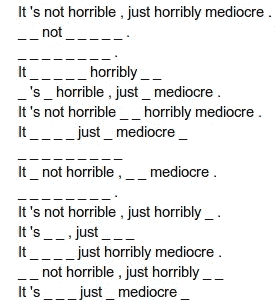

*   使用原始的、复杂的黑盒模型来为每个单独的变异生成类别概率和标签(其单词被部分删除)。例如，案例“*It _ not terrible _ _ _ _*”将具有类别概率`[0, 0, 0.6, 0.3, 0.1]`(即，它将属于类别 3)，而“*It _ terrible _ _ _ _*”将具有概率`[0.9, 0.1, 0, 0, 0]`并属于类别 1。
*   针对每个变化，在由黑盒模型预测的标签上训练更小、更简单的线性模型。
*   观察简单线性模型中最重要的特征(这更容易解释)
*   最后，基于特征重要性生成单词的每个单词(或标记)的可视化

## 解释如何作用于多个类？

对于多类文本分类，如 SST-5 数据集，LIME 使用预测概率，通过 [one-vs-rest 方法](https://en.wikipedia.org/wiki/Multiclass_classification#One-vs.-rest)突出每个特征(即标记)对预测类的影响。来自 LIME 的多类解释示例如下所示。模型预测这个句子的类别为 2。正在解释的文本中突出显示的颜色是随机生成的，颜色越深表示该标记对于预测类别的特征重要性越大(在下面的示例中为“沉闷”)。

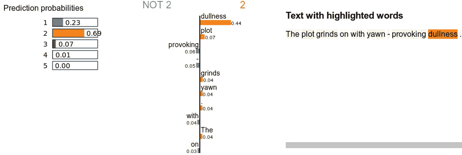

Prediction class probabilities and feature importance plots generated by LIME

## 解释器类

正如上一篇文章一样，面向对象的方法被应用于尽可能重用代码。这个[项目的 GitHub repo [explainer.py](https://github.com/prrao87/fine-grained-sentiment/blob/master/explainer.py) ]中提供了解释器的所有代码。定义了一个 Python 类，该类接受由 LIME 生成的变量列表(标记空白的随机文本样本)，并将每个样本的类概率输出为一个 *numpy* 数组。

一旦每个变化的类概率被返回，这可以被馈送到`LimeTextExplainer`类。启用词包(`bow`)意味着 LIME 在生成变体时不考虑词序。然而，FastText 和 Flair 模型分别考虑 n 元语法和上下文排序进行训练，因此为了模型之间的公平比较，SST-5 上的所有解释都禁用了`bow`标志选项。

LIME explainer 返回的`exp`对象是一个内部方法，将局部线性模型的预测(以数值形式)转换为人类可以理解的可视化形式，输出为 HTML 文件。

## 破解基于规则的方法

由于基于规则的方法(文本块和 VADER)不输出类别概率(它们只输出单个情感分数)，为了使用 LIME 解释它们的结果，我们必须为这些方法人工生成类别概率。虽然这不是一个正式的过程，但使用连续值情感分数(在范围`[-1, +1]`内)模拟类概率的一个简单的变通方法是将浮动分数归一化到范围`[0, 1]`内，然后通过将其大小缩放 5 倍将其转换为离散整数类。对文本块和 VADER 的操作如下。

此外，基于规则的模型输出一个且仅一个预测，因此为了避免输出其他类的零概率，由 5 个点组成的*正态分布(其平均值作为预测的整数类)用于将小的非零概率分配给剩余的类。下图显示了这是如何做到的。这个模拟概率数组现在可以被 LIME 用来生成基于规则的模型的解释。*

*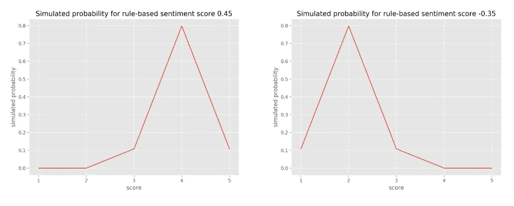*

*Example of simulated probabilities for rule-based classifier scores*

# *每个分类器关注什么？*

*为了理解预测，为六个训练好的分类器中的每一个运行文件[explainer . py](https://github.com/prrao87/fine-grained-sentiment/blob/master/explainer.py)——这输出了一个带有可视内容的 HTML 文件，帮助我们解释模型的特征理解。*

*从上一篇文章中完成的 [EDA，我们知道类 **1 和 3 是 SST-5 数据集中的少数类**，所以从这两个类中选择两个样本。](https://medium.com/@tech_optimist/fine-grained-sentiment-analysis-in-python-part-1-2697bb111ed4)*

> *不可怕，只是平庸得可怕。 ***(真实标签*** ***)****
> 
> *全体演员都很优秀……但这部电影本身只是稍微有点魅力。 ***(真题 3)****

*这些样本中的每一个都包含修饰语、相互冲突的词汇和句子中快速变化的极性，所以原则上，它们应该有助于揭示每个分类器关注的是什么。*

## ***文本块***

***例一:***不是恐怖，只是平庸得可怕。**

*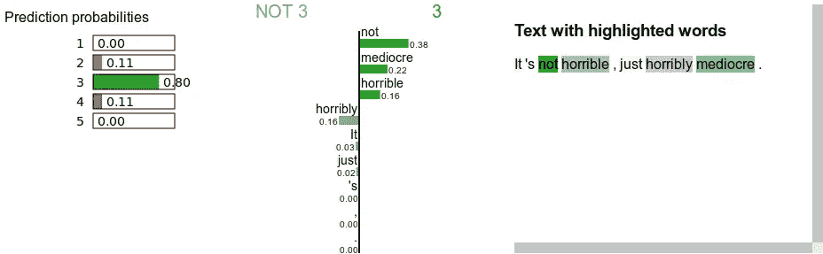*

***True: 1 — Predicted: 3***

*对于句子“*不可怕，只是平庸得可怕*”，在单词“*可怕*”之前使用否定项使 TextBlob 相信该项目并不可怕——然而，句子“*只是平庸得可怕*”的第二分句重申了该项目确实非常平庸的事实。这个句子作为一个整体仍然是压倒性的负面，使真正的标签为 1，但 TextBlob 重点关注否定术语，以推动情绪评级上升到 3。*

*例 2:演员阵容都很出色……但这部电影本身只是有点迷人。”*

*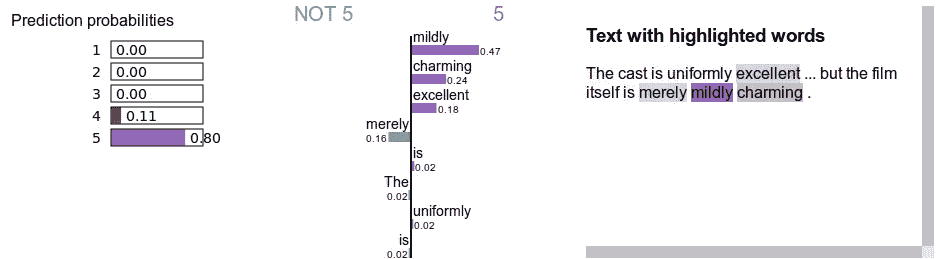*

***True: 3 — Predicted: 5***

*上面这句话真的很有挑战性，因为前半句是压倒性的正面，后半句是相当负面的——使得整个句子在情绪上是中性的。单词“*轻度*”、“*迷人的*”和“*优秀的*”在很大程度上导致 TextBlob 错误地将此句子分类为强阳性(标签 5)。一般来说，强阳性词的多次出现倾向于推动 TextBlob 中基于规则的算法将句子整体分类为阳性。*

## *VADER*

*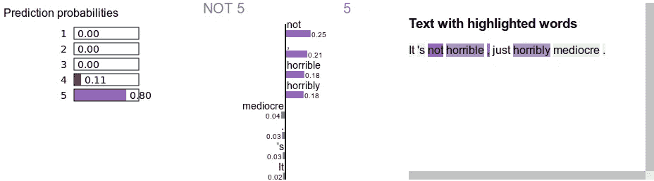*

***True: 1 — Predicted: 5***

*在上面的例子中，VADER 预测的情绪等级与预期完全相反。VADER 倾向于重罚负极性词汇(如“*可怕的*”)，但也重奖负极性词汇之前的否定术语(“ *而非* *可怕的*”)。在句子的后半部分出现“*极其平庸的*”没有任何影响，因为前半部分强有力的积极得分超过了后面的一切——在这个例子中，VADER 基于规则的方法被证明有点太聪明了。*

*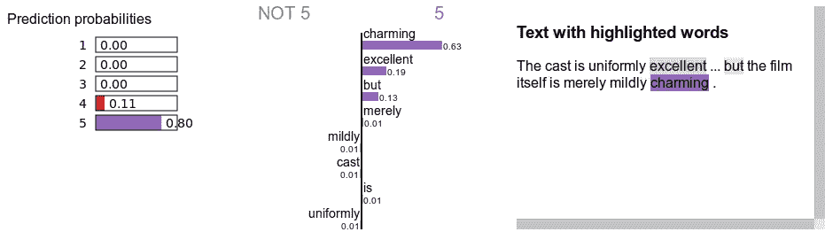*

***True: 3 — Predicted: 5***

*再一次，VADER 基于规则的方法很重视像“*优秀的*”和“*迷人的*”这样听起来积极的词，从而错误地给这个句子贴上了标签 5。单词“*仅仅是*”和“*轻度*”应该会降低句子的整体得分，却被 VADER 忽略了——这很可能是因为这些单词没有出现在 VADER 的情感词典或基于规则的修饰语中。*

## *逻辑回归*

*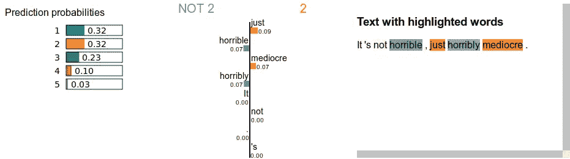*

***True: 1 — Predicted: 2***

*逻辑回归似乎确实学习了修改句子整体情感评级的个体特征(标记)——正如上面可以看到的，单词“*只是*”和“*一般*”对标签 2 的贡献更大，而“*可怕的*”和“*可怕的*”对“不是 2”(大概是标签 1)的贡献更大。标签 1 和 2 的预测概率几乎相等，因此在这种情况下，基于特征的方法对标签 2 的误差非常小。*

*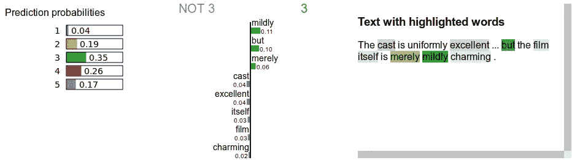*

***True: 3 — Predicted: 3***

*在第二个例子中，很明显，单词“*但是“*”、“*轻微的*”和“*仅仅是*”被逻辑回归模型正确地识别为将整个句子情感摆动到中性状态。*

## *支持向量机*

*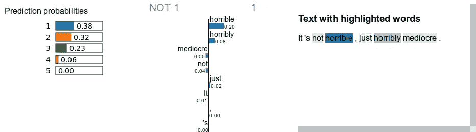*

***True: 1 — Predicted: 1***

*与逻辑回归不同，SVM 更侧重于强烈的负面词汇“*可怕的*”和“*可怕的*”来给这个词贴上 1 的标签。否定词“ *not* ”和单词“*平庸*”被正确地识别为将评级推离 1——但它们的效果很低，总体情绪标签仍然是 1。*

*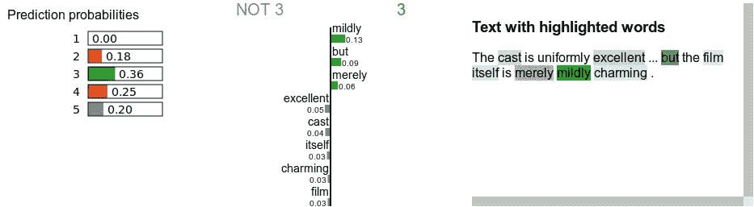*

***True: 3 — Predicted: 3***

*在第二个例子中，很明显，SVM 学会了使整个句子中性的正确特征。单词“*仅仅是*”、“*轻度*”和“*但是*”降低了句子被分配标签 2、4 和 5 的概率，使得标签 3 最有可能。*

## *快速文本*

*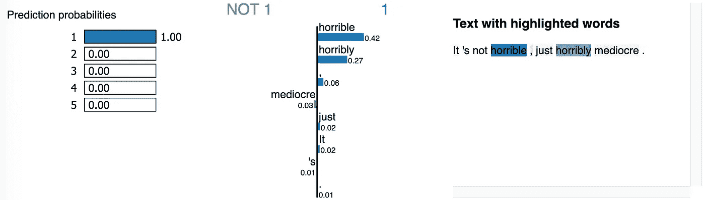*

***True: 1 — Predicted: 1***

*FastText 主要关注示例 1 中的强否定词，其他类别标签的概率为零。它确实得到了正确的整体预测，但这可能只是因为 FastText 了解到“*可怕的*”是一个经常出现在强烈否定句中的单词。*

*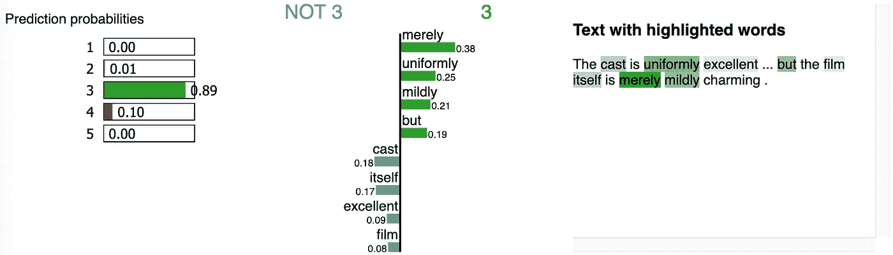*

***True: 3 — Predicted: 3***

*在示例 2 中，FastText 模型正确预测中性标签的原因更加清楚。由于该模型是使用单词三元模型和 5 的上下文窗口训练的(关于训练参数，请参见上一篇文章)，该模型在进行预测时会查看标记的**序列**。例如，单词“*一致优秀的*”紧接着是“*但是*”，单词“*仅仅是温和的*”紧接在“*迷人的*”之前，因此查看可视化中突出显示的单词，模型知道使该句子中性的单词共现(而不是单个单词)的序列。*

## *Flair + ELMo*

*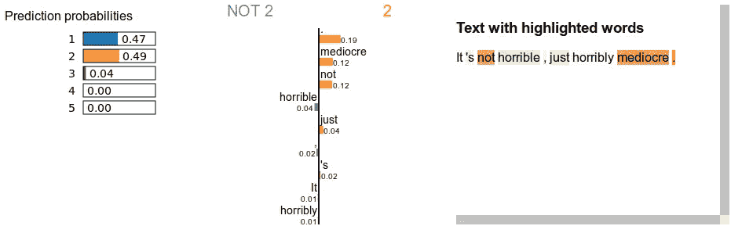*

***True: 1 — Predicted: 2***

*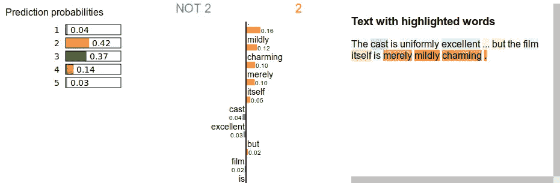*

***True: 3 — Predicted: 2***

*Flair + ELMo 嵌入模型对两个例子的预测都有很大的误差。在上述两种可视化中，模型似乎对周期给予了很高的权重。)标记——其他分类器则不是这样。在任何一种情况下，预测标签的概率都非常接近正确标签，因此该模型在如何从数据中学习方面似乎是正确的。*

*需要注意的重要一点:**在训练阶段，Flair + ELMo 模型不适合**，即验证损失甚至在 25 个时期的训练后仍在减少(参见本系列的第 1 部分)——这意味着进一步的训练可以将分类器推向这些和其他示例的正确概率输出。*

# *分析*

*通过研究各种方法的解释结果，我们可以观察到一些优点和缺点，以及关键变量对每种方法性能的影响。*

## *强极性词的效应*

*TextBlob 和 VADER 倾向于对极性强的单词进行加权，即使有其他极性较弱的单词(或否定项)会改变整个句子的情绪。硬编码的规则在许多情况下工作得很好，但是现实世界中的自然语言有太多的可变性，这些规则在实践中很难工作得很好，至少对于细粒度的情感分析来说是这样。*

*基于嵌入的方法对涉及强极性单词的情况有最好的处理。FastText 模型是用三元模型训练的，所以它学会了拾取强极性单词之前或之后的单词序列，所以它不容易被愚弄，与基于规则和基于特征的方法相比，它可以在中性类上做出更好的预测。Flair 模型，由于其上下文嵌入和强大的底层语言模型，能够更准确地识别涉及强极性单词序列的模式。*

## *句子长度的影响*

*当使用基于规则的方法时，长样本，尤其是多句子样本可能会带来麻烦，这种方法倾向于应用某种加权平均来捕捉整个句子的极性。因此，句子越长，就越有可能分散长样本中单个子句的实际情感。*

*非常短的(单个或两个单词)样本对模型提出了不同的挑战——它们要么包含看不见的单词，要么提供的上下文太少，如标点符号或模型可以用来对单词进行分类的类似子词。一般来说，基于规则的模型在这些情况下会很糟糕，因为缺少修饰语(“ *very* ”或“ *too* ”)不能在我们的细粒度分类场景中提供足够的情感强度概念。*

## *看不见的词的效果*

*在有大量未见过的单词的样本中，或者在非常短的样本中，一个单词在训练中未见过的可能性非常高，缺乏顺序(n-gram)或上下文表示(嵌入)的模型往往难以做出可靠的细粒度情感预测。scikit-learn 中基于特征的模型非常清楚地展示了这个问题。由于它们依赖于训练过程中的单词共现计数，如果一个看不见的单词出现在测试集中，该单词将被基于特征的分类器忽略。这错过了可能赋予模型更多上下文的特性。*

*FastText 由于其字符 n-gram 子词表示而更好地处理未见过的词，但它没有 Flair 模型那样深入的预训练表示，以正确处理未见过的词。Flair + ELMo 嵌入模型使用来自预训练词汇表的上下文表示([10 亿字的新闻抓取数据](https://ai.google/research/pubs/pub41880))。这使它比较浅的模型具有显著的优势——上下文化的嵌入携带有用的信息，可以识别意思相似的单词及其子单词表示。*

## *模型成本(训练和/或推理)*

*所有基于规则的方法都涉及零训练时间，并且在预测阶段非常快，但是这是以不可见的真实世界数据的结果缺乏稳定性为代价的。由于 scikit-learn 中高效的矢量化表示，基于特征的方法也可以非常快速地进行训练和推断。然而，这些模型也有局限性，不能捕捉单词之间的关系，并且对看不见的单词处理不好。*

*FastText 是计算成本(由于其底层 C++和 Cython 绑定，它非常快)和分类准确性之间的一个很好的折衷。对于细粒度的情感分析，必须使用三元模型表示来训练模型，以便捕捉长句中出现的单词序列中涉及的更精细的层次。*

*Flair 是所有选项中最昂贵的选项，主要是因为它是一个大型深度学习模型，使用来自字符串和单词嵌入组合的预训练表示。训练该模型可能需要几个小时(或几天，取决于数据集的大小)。Flair + ELMo 模型在训练和推理过程中速度较慢的部分原因是在运行时间期间查找 [ELMo 嵌入的方式——这可以使用小批量来加速——然而，现实情况是，Flair 这样的模型在真实世界的数据集上很可能被证明过于昂贵，无法进行快速有效的推理。](https://github.com/zalandoresearch/flair/issues/915#issuecomment-513152226)*

# *用于模型测试的交互式仪表板*

*为了更容易地看到对许多不同示例的模型范围的解释，使用 Flask 微框架创建了一个仪表板。使用 Heroku ( [以类似于本例](https://medium.com/the-andela-way/deploying-a-python-flask-app-to-heroku-41250bda27d0)的方式部署仪表板。为了交互式地测试仪表板，输入一个文本样本并选择我们想要解释其分类预测的分类器，如下所示。*

*[试试这里的仪表盘](https://sst5-explainer.herokuapp.com)，做出你自己的解释！*

*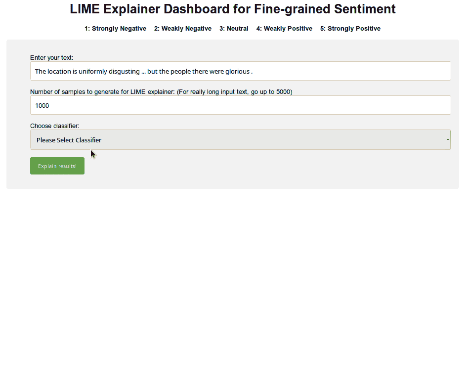*

*Try out the dashboard! [https://sst5-explainer.herokuapp.com](https://sst5-explainer.herokuapp.com)*

# *结论*

*在这篇文章中，我们讨论了如何使用 Python 中的六个不同的分类器来生成和解释细粒度情感的石灰解释。每个模型所关注的特征的差异是显而易见的，这使得为手头的任务选择正确的分类器变得更加简单。词汇的底层表示越复杂(尤其是上下文嵌入)，SST-5 数据集的五个情感类别的模型预测就越可靠。*

*到目前为止，SST-5 数据集的准确度/F1 分数如下:*

**

*虽然基于 Flair + ELMo 嵌入的模型确实达到了 48.9%的相当不错的准确度，但这仍然离最先进的水平(64.4%)非常远。此外，训练和预测 Flair 模型的成本非常昂贵，因此需要一个计算效率更高，但又能感知上下文的模型。*

*在本系列的 [**第 3 部分**](https://medium.com/@tech_optimist/fine-grained-sentiment-analysis-part-3-fine-tuning-transformers-1ae6574f25a6) 中，我们将看到如何使用带有迁移学习的 transformer 模型来进一步改进这些结果。感谢阅读！*

## *承认*

*   *生成 LIME 解释的代码借用了 Adam Geitgey 的这篇精彩文章。如果你想深入了解石灰的工作原理，请读一读吧！*
*   *Python/Flask dashboard 是一个快速而肮脏的实现，它的代码受到了[这个优秀的 Flask 教程](https://blog.miguelgrinberg.com/post/the-flask-mega-tutorial-part-ii-templates)的启发。*

## *密码*

*   *所有进行情绪预测和生成石灰解释的代码都在[这个项目的 GitHub repo](https://github.com/prrao87/fine-grained-sentiment) 中。*
*   *烧瓶前端应用程序的所有代码都可以在[这个单独的 repo](https://github.com/prrao87/fine-grained-sentiment-app) 中获得。*